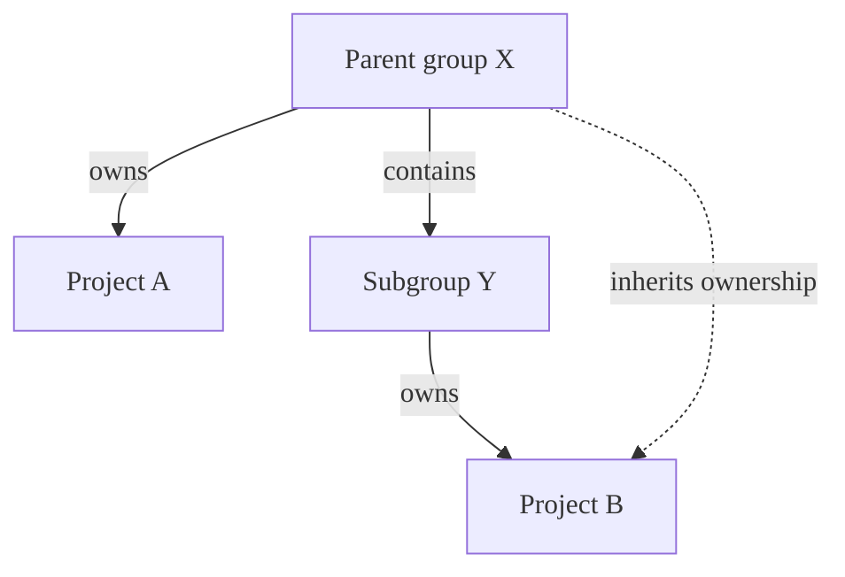
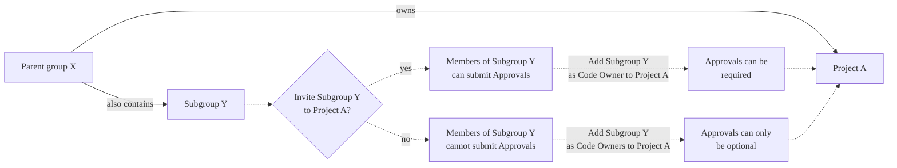

`CODEOWNERS`ファイルは、特定のファイルとディレクトリの担当者を定義するのに役立ちます。正規表現、セクション、および継承ルールを使用して、レビュアーをマージリクエストに割り当て、マージ前に承認を要求できます。

## パターン {#pattern-matching}

GitLabでは、パターンマッチングに`File::fnmatch`と`File::FNM_DOTMATCH`および`File::FNM_PATHNAME`フラグを設定して使用します:

- リポジトリの構造は、分離されたファイルシステムのように扱われます。
- パターンは、シェルのファイル名グロブ規則のサブセットに従い、正規表現ではありません。
- `File::FNM_DOTMATCH`フラグを使用すると、`*`が`.gitignore`のようなドットファイルに一致します。
- `File::FNM_PATHNAME`フラグは、`*`が`/`パスセパレーターに一致しないようにします。
- `**`は、ディレクトリを再帰的に照合します。たとえば、`**/*.rb`は`config/database.rb`および`app/controllers/users/stars_controller.rb`に一致します。

## デフォルトのコードオーナーとオプションのセクション {#default-code-owners-and-optional-sections}

既定のオーナーの構文を[オプションのセクション](reference.md#optional-sections)および必須の承認と組み合わせるには、最後に既定のオーナーを配置します:

```plaintext
[Documentation][2] @docs-team
docs/
README.md

^[Database] @database-team
model/db/
config/db/database-setup.md @docs-team
```

## 通常エントリとセクション {#regular-entries-and-sections}

セクション外のパスにデフォルトのコードオーナーを設定すると、常に承認が必要になります。このようなエントリは、セクションによってオーバーライドされません。セクションのないエントリは、別の名前のないセクションであるかのように扱われます:

```plaintext
# Required for all files
* @general-approvers

[Documentation] @docs-team
docs/
README.md
*.txt

[Database] @database-team
model/db/
config/db/database-setup.md @docs-team
```

この例では: 

- `@general-approvers`は、オーバーライドなしですべての場所のすべてのアイテムを所有します。
- `@docs-team`は、`Documentation`セクション内のすべての項目を所有します。
- `@database-team`は`@docs-team`を除く`Database`セクションのすべての項目を所有しており、`config/db/database-setup.md`にはに割り当てるオーバーライドがあります。
- `model/db/CHANGELOG.txt`を変更するマージリクエストでは、`@general-approvers`、`@docs-team`、および`@database-team`グループからそれぞれ1つずつ、3つの承認が必要になります。

この動作は、セクションの特定のエントリがセクションのデフォルトをオーバーライドする場合に、セクションの[既定のオーナー](reference.md#set-default-code-owner-for-a-section)のみを使用する場合と比較してください。

## 名前が重複しているセクション {#sections-with-duplicate-names}

複数のセクションに同じ名前が付けられている場合は、それらが結合されます。また、セクションヘッダーでは大文字と小文字が区別されません。例: 

```plaintext
[Documentation]
ee/docs/    @docs
docs/       @docs

[Database]
README.md  @database
model/db/   @database

[DOCUMENTATION]
README.md  @docs
```

このコードの結果、`Documentation`セクションヘッダーの下に3つのエントリ、`Database`の下に2つのエントリが作成されます。`Documentation`および`DOCUMENTATION`セクションで定義されたエントリは、最初のセクションのケースを使用して結合されます。

## 特定のファイルとディレクトリのコードオーナーを定義する。 {#define-code-owners-for-specific-files-or-directories}

ファイルまたはディレクトリが`CODEOWNERS`ファイル内の複数のエントリと一致する場合、ファイルまたはディレクトリに最後に一致したパターンからのユーザーが使用されます。これにより、エントリを適切な方法で順序すると、より具体的に定義されたファイルまたはディレクトリに対して、より具体的なオーナーを定義できます。

たとえば、次の`CODEOWNERS`ファイルで説明します:

```plaintext
# This line would match the file terms.md
*.md @doc-team

# This line would also match the file terms.md
terms.md @legal-team
```

`terms.md`のコードオーナーは`@legal-team`になります。

## コードオーナーからの複数の承認を必須にする。 {#require-multiple-approvals-from-code-owners}

マージリクエストの[承認]領域にあるコードオーナーセクションに対して、複数の承認を要求できます。セクション名に括弧で囲まれた数値`n`（`[2]`や`[3]`など）を追加します。これにより、このセクションのコードオーナーからの`n`承認が必要になります。`n`の有効なエントリは整数`≥ 1`です。`[1]`はデフォルトであるためオプションです。`n`の無効な値は`1`として扱われます。



[イシュー384881](https://gitlab.com/gitlab-org/gitlab/-/issues/385881)では、この設定の動作の変更が提案されています。無効な値を意図的に設定しないでください。将来有効になり、予期しない動作が発生する可能性があります。



コードオーナーからの複数の承認を必須にする:

1. 左側のサイドバーで、**検索または移動先**を選択して、プロジェクトを見つけます。
1. **設定** > **リポジトリ**を選択します。
1. **ブランチルール**を展開する。
1. デフォルトのブランチの横にある**詳細を表示**を選択します。
1. **コードオーナーの承認**の下のトグルをオンにします。
1. `CODEOWNERS`ファイルを編集して、複数承認のルールを追加する。

たとえば、`[Documentation]`セクションに2つの承認が必要な場合は、次のようにします:

```plaintext
[Documentation][2]
*.md @tech-writer-team

[Ruby]
*.rb @dev-team
```

[承認]領域の`Documentation`コードオーナーセクションには、2つの承認が必要であることが表示されます:


## グループの継承および資格 {#group-inheritance-and-eligibility}



この例では: 

- 親グループX（`group-x`）はプロジェクトAを所有しています。
- 親グループXには、サブグループ、サブグループY（`group-x/subgroup-y`）も含まれています。
- サブグループYは、プロジェクトBを所有します。

対象となるコードオーナーは次のとおりです:

- プロジェクトA: プロジェクトAはサブグループYに属していないため、グループXのメンバーのみ。
- プロジェクトB: グループXとサブグループYの両方のメンバー。

### 親グループにサブグループを招待 {#invite-subgroups-to-parent-groups}

プロジェクトAの親グループにサブグループYを招待することは[サポートされていません](https://gitlab.com/gitlab-org/gitlab/-/issues/288851)。サブグループYをコードオーナーとして設定するには、[このグループをプロジェクトに直接招待](#invite-subgroups-to-projects-in-parent-groups)します。



承認を必須にするには、コードオーナーとしてのグループは、プロジェクトで直接メンバーシップ（継承されたメンバーシップではない）を持っている必要があります。承認は、メンバーシップを継承するグループに対してのみオプションになります。コードオーナーグループのメンバーも、親グループからメンバーシップを継承するのではなく、直接メンバーである必要があります。



### 親グループのプロジェクトにサブグループを招待 {#invite-subgroups-to-projects-in-parent-groups}

メンバーも対象となるコードオーナーになるように、サブグループYをプロジェクトAに[招待](../members/sharing_projects_groups.md)できます。



サブグループYをプロジェクトAに招待せずに、コードオーナーにすると、マージリクエストの承認はオプションになります。

## エラー処理 {#error-handling}



- エラー検証がGitLab 16.3で[導入](https://gitlab.com/gitlab-org/gitlab/-/issues/216066)されました。



### スペースを含むエントリ {#entries-with-spaces}

バックスラッシュを使用して、パス内の空白をエスケープします:

```plaintext
path\ with\ spaces/*.md @owner
```

エスケープしないと、GitLabは`folder with spaces/*.md @group`を`path: "folder", owners: " with spaces/*.md @group"`として解析します。

### 解析できないセクション {#unparsable-sections}

セクションヘッダーを解析できない場合、セクションは次のようになります:

1. エントリとして解析されます。
1. 前のセクションに追加されます。
1. 前のセクションが存在しない場合、セクションはデフォルトセクションに追加されます。

#### デフォルトセクションの後 {#after-the-default-section}

```plaintext
* @group

[Section name
docs/ @docs_group
```

GitLabは、ヘッダー`[Section name`をエントリとして認識します。デフォルトセクションには、次の3つのルールが含まれています:

- デフォルトセクション
  - `*`オーナーは`@group`
  - `[Section`オーナーは`name`
  - `docs/`オーナーは`@docs_group`

#### 名前付きセクションの後 {#after-a-named-section}

```plaintext
[Docs]
docs/**/* @group

[Section name
docs/ @docs_group
```

GitLabは、ヘッダー`[Section name`をエントリとして認識します。`[Docs]`セクションには、次の3つのルールが含まれています:

- `docs/**/*`オーナーは`@group`
- `[Section`オーナーは`name`
- `docs/`オーナーは`@docs_group`

### 不正な形式のオーナー {#malformed-owners}

各エントリには、1人以上のオーナーが含まれている必要があります。不正な形式のオーナーは無効になり、無視されます:

```plaintext
/path/* @group user_without_at_symbol @user_with_at_symbol
```

このエントリのオーナーは、`@group`と`@user_with_at_symbol`です。

### アクセスできない、または不適切なオーナー {#inaccessible-or-incorrect-owners}

GitLabは、アクセスできないオーナーまたは不適切なオーナーを無視します。例: 

```plaintext
* @group @grou @username @i_left @i_dont_exist example@gitlab.com invalid@gitlab.com
```

`@group`、`@username`、および`example@gitlab.com`のみがアクセスできる場合、GitLabはその他を無視します。

### ゼロオーナー {#zero-owners}

エントリにオーナーが含まれていない場合、または[アクセス可能なオーナー](#inaccessible-or-incorrect-owners)が存在しない場合、エントリは無効です。このルールは満たされることがないため、GitLabはマージリクエストで自動的に承認します。



保護ブランチで`Require code owner approval`が有効になっている場合、オーナーがゼロのルールは引き続き有効です。



### 最小承認 {#minimum-approvals}

セクションの[承認回数を定義する](advanced.md#require-multiple-approvals-from-code-owners)場合、最小承認回数は`1`です。承認の数を`0`に設定すると、GitLabは1つの承認を要求します。
