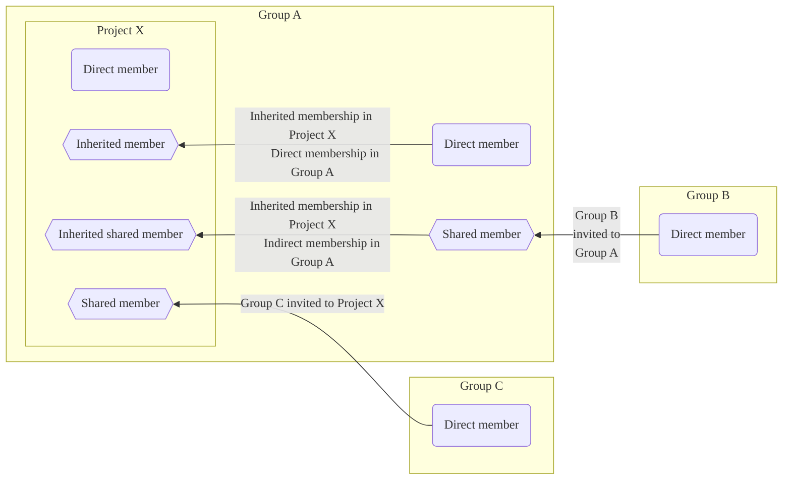
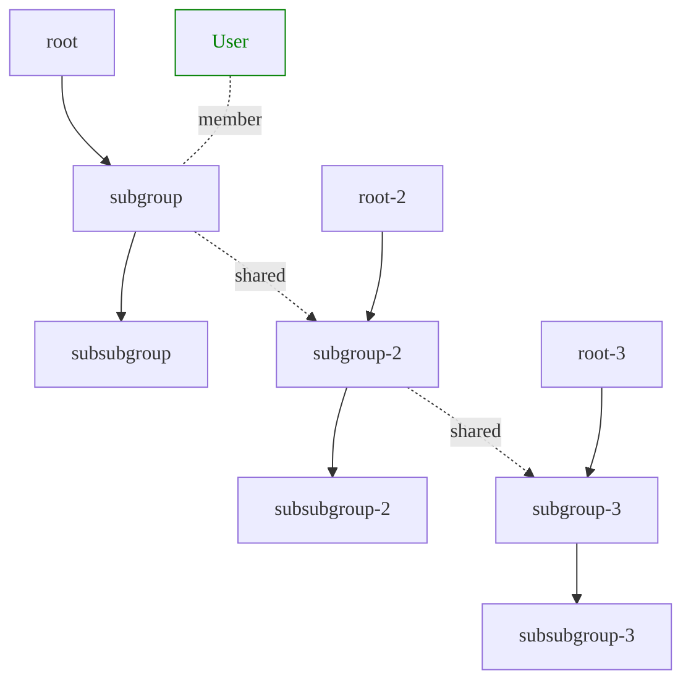



- プラン: Free、Premium、Ultimate
- 提供形態: GitLab.com、GitLab Self-Managed、GitLab Dedicated



メンバーとは、プロジェクトへのアクセス権を持つユーザーとグループのことです。メンバーは、プロジェクトに直接追加することも、グループを通じてアクセス権を継承することもできます。

各メンバーは、プロジェクトで何ができるかを決定するロールを持っています。適切なロールを持つプロジェクトメンバーは、プロジェクトにユーザーを追加したり、プロジェクトからユーザーを削除したり、アクセスリクエストを管理してプロジェクトリソースへのアクセスを制御したりできます。

## メンバーシップの種類 {#membership-types}



- GitLab 16.10で、`webui_members_inherited_users`[フラグ](../../../administration/feature_flags/_index.md)とともに、招待されたグループメンバーをメンバーページのメンバータブに表示するように[変更](https://gitlab.com/gitlab-org/gitlab/-/issues/219230)されました。デフォルトでは無効になっています。
- GitLab 17.0の[GitLab.comとGitLab Self-Managed](https://gitlab.com/gitlab-org/gitlab/-/issues/219230)で`webui_members_inherited_users`機能フラグが有効になりました。
- 機能フラグ`webui_members_inherited_users`は、GitLab 17.4で[削除](https://gitlab.com/gitlab-org/gitlab/-/merge_requests/163627)されました。招待グループのメンバーは、デフォルトで表示されます。



ユーザーは、グループまたはプロジェクトのメンバーに直接的または間接的になることができます。間接的なメンバーシップは、継承、共有、または継承共有される可能性があります。

| メンバーシップの種類                               | メンバーシップのプロセス |
| --------------------------------------------- | ------------------ |
| 直接 | ユーザーは、現在のグループまたはプロジェクトに直接追加されます。 |
| 継承 | ユーザーは、現在のグループまたはプロジェクトを含む親グループのメンバーです。 |
| [共有](sharing_projects_groups.md) | ユーザーは、現在のグループまたはプロジェクトに招待されたグループのメンバーです。 |
| [継承共有](sharing_projects_groups.md#invite-a-group-to-a-group) | ユーザーは、現在のグループまたはプロジェクトの祖先に招待されたグループのメンバーです。 |
| 間接 | 継承メンバー、共有メンバー、または継承共有メンバーを指す包括的な用語です。 |

前の例では:

- **管理者**は、**demo**グループからの継承メンバーです。
- **ユーザー0**は、**demo**グループからの継承メンバーです。
- **ユーザー1**は、このプロジェクトに招待された**Acme**グループからの共有メンバーです。
- **ユーザー2**は、**demo**グループに招待された**Toolbox**グループからの継承共有メンバーです。
- **ユーザー3**は、このプロジェクトに追加された直接メンバーです。

## セキュリティに関する考慮事項 {#security-considerations}

Gitは、分散型バージョン管理システム（DVCS）です。ソースコードを操作するすべてのユーザーは、リポジトリ全体のローカルコピーを保持しています。

GitLabでは、レポーター以上のロールを持つすべてのプロジェクトメンバーは、ローカルコピーを作成するためにリポジトリをクローンできます。ユーザーは、ローカルコピーを取得した後、次の場所を含め、どこにでもリポジトリ全体をアップロードできます:

- 自分の管理下にある別のプロジェクト。
- 別のサーバー。
- 外部ホスティングサービス。

アクセス制御では、既にリポジトリへのアクセス制御を持つユーザーによるソースコードの意図的な共有を防ぐことはできません。すべてのGit管理プラットフォームは、分散型バージョン管理システムのこの固有の特性を備えています。

権限のあるユーザーによる意図的な共有を防ぐことはできませんが、意図しない共有や情報の破壊を防ぐために、次の手順を実行できます:

- 誰がプロジェクトに[ユーザーを追加](#add-users-to-a-project)できるかを制御します。
- 承認されていない強制プッシュを防ぐには、[保護されたブランチ](../repository/branches/protected.md)を使用します。
- プロジェクトのメンバーシップを定期的にレビューし、アクセス制御を必要としなくなったユーザーを削除します。

## プロジェクトにユーザーを追加する {#add-users-to-a-project}



- 有効期限切れが近づいているアクセス権に関するメール通知は、GitLab 16.2で[導入](https://gitlab.com/gitlab-org/gitlab/-/issues/12704)されました。
- GitLab 17.4で、サブグループおよびプロジェクトの直接メンバーのアクセス権の有効期限が[削除](https://gitlab.com/gitlab-org/gitlab/-/issues/471051)されました。



ユーザーをプロジェクトに追加して直接メンバーにし、アクションを実行する権限を与えます。

前提要件:

- オーナーまたはメンテナーのロールを持っている必要があります。
- [グループメンバーシップのロック](../../group/access_and_permissions.md#prevent-members-from-being-added-to-projects-in-a-group)を無効にする必要があります。
- GitLab Self-Managedインスタンスの場合:
  - [新規サインアップが無効になっている](../../../administration/settings/sign_up_restrictions.md#disable-new-sign-ups)場合、管理者がユーザーを追加する必要があります。
  - [ユーザー招待が許可されていない](../../../administration/settings/visibility_and_access_controls.md#prevent-invitations-to-groups-and-projects)場合、管理者がユーザーを追加する必要があります。
  - [管理者による承認が有効になっている](../../../administration/settings/sign_up_restrictions.md#turn-on-administrator-approval-for-role-promotions)場合、管理者が招待を承認する必要があります。

プロジェクトにユーザーを追加するには:

1. 左側のサイドバーで、**検索または移動先**を選択して、プロジェクトを見つけます。
1. **管理** > **メンバー**を選択します。
1. **メンバーを招待**を選択します。
1. ユーザーは次の操作を行います:

   - GitLabアカウントを持っている場合は、ユーザー名を入力します。
   - GitLabアカウントを持っていない場合は、メールアドレスを入力します。

1. [デフォルトロール](../../permissions.md)または[カスタムロール](../../custom_roles/_index.md)を選択します。
1. オプション。**アクセス有効期限**を選択します。その日付以降、ユーザーはプロジェクトにアクセスできなくなります。

   アクセス権の有効期限を選択した場合、プロジェクトメンバーには、アクセス権の有効期限が切れる7日前にメール通知が送信されます。

   

   メンテナーは、自分のアクセス権の有効期限を延長する機能を含め、ロールの有効期限が切れるまで完全な権限を持ちます。

   

1. **招待**を選択します。次のようになります:

   - GitLabユーザー名を使用した場合は、メンバーリストに追加されます。
   - メールアドレスを使用した場合は、招待状がメールアドレスに送信され、アカウントを作成するように求められます。招待が承認されない場合、GitLabは2日後、5日後、および10日後にリマインダーメールを送信します。未承認の招待は、90日後に自動的に削除されます。

### 割り当てることができるロール {#which-roles-you-can-assign}

割り当てることができる最大のロールは、グループのオーナーロールまたはメンテナーロールを持っているかどうかによって異なります。たとえば、設定できる最大のロールは次のとおりです:

- プロジェクトのオーナーロールを持っている場合は、オーナー（`50`）。
- プロジェクトのメンテナーロールを持っている場合は、メンテナー（`40`）。

オーナー[ロール](../../permissions.md#project-members-permissions)は、グループにのみ追加できます。

### 昇格保留中のユーザーを表示する {#view-users-pending-promotion}

[ロールの昇格に対する管理者の承認](../../../administration/settings/sign_up_restrictions.md#turn-on-administrator-approval-for-role-promotions)が有効になっている場合は、既存のユーザーを請求対象のロールに昇格するメンバーシップリクエストには、管理者による承認が必要です。

昇格保留中のユーザーを表示するには:

1. 左側のサイドバーで、**検索または移動先**を選択して、プロジェクトを見つけます。
1. **管理** > **メンバー**を選択します。
1. **ロールの昇格**タブを選択します。

**ロールの昇格**タブが表示されない場合、プロジェクトに保留中の昇格はありません。

## 有効期限とロールを更新する {#updating-expiration-and-role}

ユーザーが次の場合:

- プロジェクトの直接メンバーである場合、**有効期限**フィールドと**ロール**フィールドはプロジェクトで直接更新できます。
- 継承メンバー、共有メンバー、または継承共有メンバーである場合、**有効期限**フィールドと**ロール**フィールドは、メンバーの元のグループで更新する必要があります。

## プロジェクトをグループと共有する {#share-a-project-with-a-group}

ユーザーを1人ずつ追加する代わりに、[プロジェクトをグループ全体と共有](sharing_projects_groups.md)できます。

## 別のプロジェクトからメンバーをインポートする {#import-members-from-another-project}

別のプロジェクトの直接メンバーを自分のプロジェクトにインポートできます。インポートされたプロジェクトメンバーは、インポート元のプロジェクトと同じ権限を保持します。



プロジェクトの直接メンバーのみがインポートされます。プロジェクトの継承メンバーまたは共有メンバーはインポートされません。



前提要件:

- メンテナー以上のロールを持っている必要があります。

ターゲットプロジェクトに対するインポートメンバーのロールによって、次のようになります:

- メンテナーの場合、ソースプロジェクトのオーナーロールを持つメンバーは、メンテナーロールでインポートされます。
- オーナーの場合、ソースプロジェクトのオーナーロールを持つメンバーは、オーナーロールでインポートされます。

プロジェクトのメンバーをインポートするには:

1. 左側のサイドバーで、**検索または移動先**を選択して、プロジェクトを見つけます。
1. **管理** > **メンバー**を選択します。
1. **プロジェクトからインポート**を選択します。
1. プロジェクトを選択します。自分がメンテナーであるプロジェクトのみ表示できます。
1. **プロジェクトメンバーのインポート**を選択します。

インポートが成功すると、成功メッセージが表示されます。**メンバー**タブにインポートされたメンバーを表示するには、ページを更新します。

## プロジェクトからメンバーを削除する {#remove-a-member-from-a-project}

ユーザーが次の場合:

- プロジェクトの直接メンバーである場合は、プロジェクトから直接削除できます。
- 親グループからの継承メンバーである場合は、親グループ自体からのみ削除できます。

前提要件:

- 以下のロールを持つ直接メンバーを削除するには:
  - メンテナー、デベロッパー、レポーター、プランナー、またはゲストロールの場合は、メンテナーロールを持っている必要があります。
  - オーナーロールの場合は、オーナーロールを持っている必要があります。
- オプション。割り当てられているすべてのイシューとマージリクエストからメンバーの割り当てを解除していること。

プロジェクトからメンバーを削除するには:

1. 左側のサイドバーで、**検索または移動先**を選択して、プロジェクトを見つけます。
1. **管理** > **メンバー**を選択します。
1. 削除するプロジェクトメンバーの横にある**メンバーを削除**を選択します。
1. オプション。確認ダイアログで、**また、関連するイシューとマージリクエストからこのユーザーのアサインを解除します**チェックボックスをオンにします。
1. プライベートプロジェクトからの機密情報の漏えいを防ぐために、メンバーがプライベートリポジトリをフォークしたり、Webhookを作成したりしていないことを確認してください。既存のフォークはアップストリームプロジェクトからの変更を引き続き受信し、Webhookは更新を引き続き受信します。グループ内のプロジェクトが[グループ外にフォークされない](../../group/access_and_permissions.md#prevent-project-forking-outside-group)ようにプロジェクトを設定することもできます。
1. **メンバーを削除**を選択します。

## 削除されたユーザーが自分自身を再度招待できないようにする {#ensure-removed-users-cannot-invite-themselves-back}

メンテナーまたはオーナーロールを持つユーザーは、管理者が削除した後、グループまたはプロジェクトに再参加できる競合条件を悪用する可能性があります。

この問題を回避するために、GitLab管理者は以下を実行できます:

- [GitLab Railsコンソール](../../../administration/operations/rails_console.md)から悪意のあるユーザーセッションを削除します。
- 悪意のあるユーザーになりすまして、以下を行います:
  - プロジェクトからユーザーを削除します。
  - GitLabからユーザーをログアウトします。
- 悪意のあるユーザーアカウントをブロックします。
- 悪意のあるユーザーアカウントを削除します。
- 悪意のあるユーザーアカウントのパスワードを変更します。

## プロジェクトメンバーをフィルタリングおよび並べ替える {#filter-and-sort-project-members}

プロジェクト内のメンバーのフィルタリングおよび並べ替えを行うことができます。

### 直接メンバーを表示する {#display-direct-members}

1. 左側のサイドバーで、**検索または移動先**を選択して、プロジェクトを見つけます。
1. **管理** > **メンバー**を選択します。
1. **メンバーをフィルターする**ボックスで、`Membership` `=` `Direct`を選択します。
1. <kbd>Enter</kbd>キーを押します。

### 間接メンバーを表示する {#display-indirect-members}

1. 左側のサイドバーで、**検索または移動先**を選択して、プロジェクトを見つけます。
1. **管理** > **メンバー**を選択します。
1. **メンバーをフィルターする**ボックスで、`Membership` `=` `Indirect`を選択します。
1. <kbd>Enter</kbd>キーを押します。

### プロジェクト内のメンバーを検索する {#search-for-members-in-a-project}

プロジェクトメンバーを検索するには:

1. 左側のサイドバーで、**検索または移動先**を選択して、プロジェクトを見つけます。
1. **管理** > **メンバー**を選択します。
1. 検索ボックスに、メンバーの名前、ユーザー名、またはメールアドレスを入力します。
1. <kbd>Enter</kbd>キーを押します。

### プロジェクト内のメンバーを並べ替える {#sort-members-in-a-project}

メンバーは、次の順序で昇順または降順に並べ替えることができます:

- **アカウント**名
- **アクセス付与日**日
- メンバーがプロジェクトで持つ**ロール**
- **作成されたユーザー**日
- **最後のアクティビティー**日
- **最終ログイン**日

メンバーを並べ替えるには:

1. 左側のサイドバーで、**検索または移動先**を選択して、プロジェクトを見つけます。
1. **管理** > **メンバー**を選択します。
1. メンバーリストの上部にあるドロップダウンリストから、並べ替えの基準にする項目を選択します。

## プロジェクトへのアクセスをリクエストする {#request-access-to-a-project}

GitLabユーザーは、プロジェクトのメンバーになることをリクエストできます。

1. 左側のサイドバーで、**検索または移動先**を選択して、メンバーになるプロジェクトを見つけます。
1. 右上隅で、縦方向の省略記号（）を選択し、**アクセスをリクエスト**を選択します。

最近アクティブなプロジェクトのメンテナーまたはオーナーにメールが送信されます。最大10人のプロジェクトメンテナーまたはオーナーに通知されます。プロジェクトのオーナーまたはメンテナーは、リクエストを承認または拒否できます。プロジェクトメンテナーは、オーナーロールのアクセスリクエストを承認できません。

プロジェクトに直接のオーナーまたはメンテナーがいない場合、プロジェクトの親グループの最近アクティブなオーナーが通知を受け取ります。

### プロジェクトへのアクセスリクエストを取り下げる {#withdraw-an-access-request-to-a-project}

リクエストが承認される前に、プロジェクトへのアクセスリクエストを取り下げることができます。アクセスリクエストを取り下げるには:

1. 左側のサイドバーで、**検索または移動先**を選択して、アクセスをリクエストしたプロジェクトを見つけます。
1. プロジェクト名の横にある**アクセスリクエストを取り消す**を選択します。

## ユーザーがプロジェクトへのアクセスをリクエストできないようにする {#prevent-users-from-requesting-access-to-a-project}

ユーザーがプロジェクトへのアクセスをリクエストできないようにすることができます。

前提要件:

- プロジェクトのオーナーロールを持っている必要があります。
- プロジェクトはパブリックである必要があります。

1. 左側のサイドバーで、**検索または移動先**を選択して、プロジェクトを見つけます。
1. **設定** > **一般**を選択します。
1. **可視性、プロジェクトの機能、権限**を展開します。
1. **プロジェクトの表示レベル**で、**ユーザーがアクセスをリクエストできます**チェックボックスがオンになっていないことを確認します。
1. **変更を保存**を選択します。

## メンバーシップと表示レベルの権利 {#membership-and-visibility-rights}

グループまたはプロジェクトのメンバーには、メンバーシップの種類に応じて、グループまたはプロジェクトに対するさまざまな[表示レベル](../../public_access.md)と権利が付与されます。

次の表に、プロジェクトメンバーのメンバーシップと表示レベルの権利を示します。

| アクション | 直接プロジェクトメンバー | 継承プロジェクトメンバー | 直接共有プロジェクトメンバー | 継承共有プロジェクトメンバー |
| --- | ------------------- | ---------------------- | -------------------------- | ----------------------------- |
| ボードを生成する | 可 | 可 | 可 | 可 |
| 親グループのイシューを表示する1 | 可 | 可 | 可 | 可 |
| 親グループのラベルを表示する | 可 | 可 | 可 | 可 |
| 親グループのマイルストーンを表示する | 可 | 可 | 可 | 可 |
| 他のグループに共有される | 可 | 不可 | 不可 |  不可 |
| 他のプロジェクトにインポートされる | 可 | 不可 | 不可 | 不可 |
| プロジェクトを他のメンバーと共有する | 可 | 可 | 可 | 可 |

**Footnotes**（補足説明）:

1. ユーザーは、アクセス権を持つプロジェクトのイシューのみ表示できます。

次のテーブルに、グループメンバーのメンバーシップと表示レベルの権利を示します。

| アクション | 直接グループメンバー | 継承グループメンバー | 直接共有グループメンバー | 継承共有グループメンバー |
| --- | ------------------- | ---------------------- | -------------------------- | ----------------------------- |
| ボードを生成する | 可 | 可 | 可 | 可 |
| 親グループのイシューを表示する | 可 | 可 | 可 | 可 |
| 親グループのラベルを表示する | 可 | 可 | 可 | 可 |
| 親グループのマイルストーンを表示する | 可 | 可 | 可 | 可 |

次の例では、`User`は以下のとおりです:

- `subgroup`の直接メンバー。
- `subsubgroup`の継承メンバー。
- `subgroup-2`と`subgroup-3`の間接メンバー。
- `subsubgroup-2`と`subsubgroup-3`の間接継承メンバー。

