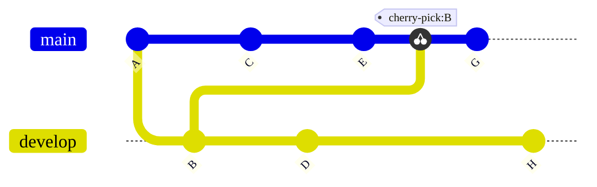



- プラン: Free、Premium、Ultimate
- 提供形態: GitLab.com、GitLab Self-Managed、GitLab Dedicated



Gitでは、*cherry-pick*とは、あるブランチから単一のコミットを取得し、別のブランチに最新のコミットとして追加することです。ソースブランチの残りのコミットは、ターゲットには追加されません。ブランチ全体の内容ではなく、単一のコミットの内容が必要な場合に、コミットをcherry-pickします。たとえば、次のような場合です:

- デフォルトブランチから以前のリリースブランチにバグ修正をバックポートする。
- フォークからアップストリームリポジトリに変更をコピーする。

GitLab UIを使用して、プロジェクトまたはプロジェクトフォークから、単一のコミットまたはマージリクエストのすべての内容をcherry-pickします。

この例では、Gitリポジトリに`develop`と`main`の2つのブランチがあります。コミット`B`は、`main`ブランチのコミット`E`の後に、`develop`ブランチからcherry-pickされます。cherry-pickの後、コミット`G`が追加されます:

## マージリクエストからすべての変更をcherry-pickする {#cherry-pick-all-changes-from-a-merge-request}

マージリクエストがマージされた後、マージリクエストによって導入されたすべての変更をcherry-pickできます。マージリクエストは、アップストリームプロジェクトまたはダウンストリームフォークに存在します。

前提要件:

- マージリクエストの編集、リポジトリへのコードの追加を許可するプロジェクトのロールが必要です。
- プロジェクトでは、プロジェクトの**設定** > **マージリクエスト**で設定されている、[マージ方法](methods/_index.md#fast-forward-merge)である**Merge Commit**（マージコミット）を使用する必要があります。

  [GitLab 16.9以降](https://gitlab.com/gitlab-org/gitlab/-/issues/142152)では、早送りマージされたコミットは、スカッシュされている場合、またはマージリクエストに単一のコミットが含まれている場合にのみ、GitLab UIからcherry-pickできます。いつでも[個々のコミットをcherry-pick](#cherry-pick-a-single-commit)できます。

これを行うには、次の手順に従います:

1. 左側のサイドバーで、**検索または移動先**を選択して、プロジェクトを見つけます。
1. **コード** > **マージリクエスト**を選択して、マージリクエストを見つけます。
1. マージリクエストレポートセクションまでスクロールし、**マージしたユーザー**レポートを見つけます。
1. レポートの右上隅で、**cherry-pick**を選択します:

   
1. ダイアログで、cherry-pick先のプロジェクトとブランチを選択します。
1. オプション。**Start a new merge request with these changes**（これらの変更で新しいマージリクエストを開始）を選択します。
1. **cherry-pick**を選択します。

## 単一のコミットをcherry-pickする {#cherry-pick-a-single-commit}

GitLabプロジェクトの複数の場所から単一のコミットをcherry-pickできます。

### プロジェクトのコミットリストから {#from-a-projects-commit-list}

プロジェクトのすべてのコミットのリストからコミットをcherry-pickするには、次の手順に従います:

1. 左側のサイドバーで、**検索または移動先**を選択して、プロジェクトを見つけます。
1. **コード** > **コミット**を選択します。
1. cherry-pickするコミットの[タイトル](https://git-scm.com/docs/git-commit#_discussion)を選択します。
1. 右上隅で、**オプション** > **cherry-pick**を選択します。
1. cherry-pickダイアログで、cherry-pick先のプロジェクトとブランチを選択します。
1. オプション。**Start a new merge request with these changes**（これらの変更で新しいマージリクエストを開始）を選択します。
1. **cherry-pick**を選択します。

### リポジトリのファイルビューから {#from-the-file-view-of-a-repository}

プロジェクトのGitリポジトリでファイルを表示すると、個々のファイルに影響を与える以前のコミットのリストからcherry-pickできます:

1. 左側のサイドバーで、**検索または移動先**を選択して、プロジェクトを見つけます。
1. **コード** > **リポジトリ**を選択します。
1. コミットによって変更されたファイルに移動します。最後のコミットブロックで、**履歴**を選択します。
1. cherry-pickするコミットの[タイトル](https://git-scm.com/docs/git-commit#_discussion)を選択します。
1. 右上隅で、**オプション** > **cherry-pick**を選択します。
1. cherry-pickダイアログで、cherry-pick先のプロジェクトとブランチを選択します。
1. オプション。**Start a new merge request with these changes**（これらの変更で新しいマージリクエストを開始）を選択します。
1. **cherry-pick**を選択します。

## cherry-pickされたコミットのシステムノートを表示する {#view-system-notes-for-cherry-picked-commits}

GitLab UIまたはAPIでマージコミットをcherry-pickすると、GitLabは関連するマージリクエストスレッドに[システムノート](../system_notes.md)を追加します。形式は `[USER]` **picked the changes into the branch**（picked the changes into the branch） `[BRANCHNAME]` with commit `[SHA]``[DATE]`のようになります:

システムノートは、新しいコミットと既存のマージリクエストを相互リンクします。各デプロイメントの[関連付けられたマージリクエストのリスト](../../../api/deployments.md#list-of-merge-requests-associated-with-a-deployment)には、cherry-pickされたマージコミットが含まれています。

GitLab UIまたはAPIの外部でcherry-pickされたコミットは、システムノートを追加しません。

## 別の親コミットを選択する {#select-a-different-parent-commit}

GitLab UIでマージコミットをcherry-pickすると、メインラインは常に最初の親になります。コマンドラインを使用して、別のメインラインでcherry-pickします。詳細については、[Gitを使用したマージコミットのcherry-pick](../../../topics/git/cherry_pick.md#cherry-pick-a-merge-commit)を参照してください。

## 関連トピック {#related-topics}

- [コミットAPI](../../../api/commits.md#cherry-pick-a-commit)
- [Gitでチェリーピックの変更](../../../topics/git/cherry_pick.md)
