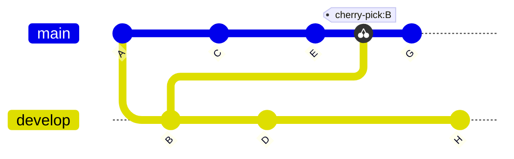



- プラン:Free、Premium、Ultimate
- 提供形態:GitLab.com、GitLab Self-Managed、GitLab Dedicated



Git では、*cherry-pick* とは、あるブランチから単一のコミットを取得し、別のブランチに最新のコミットとして追加することです。ソースブランチの残りのコミットは、ターゲットには追加されません。ブランチ全体の内容ではなく、単一のコミットの内容が必要な場合に、コミットを cherry-pick します。たとえば、次のような場合です。

- デフォルトブランチから以前のリリースブランチにバグ修正をバックポートする。
- フォークからアップストリームリポジトリに変更をコピーする。

GitLab UI を使用して、プロジェクトまたはプロジェクトフォークから、単一のコミットまたはマージリクエストのすべての内容を cherry-pick します。

この例では、Gitリポジトリに `develop` と `main` の 2 つのブランチがあります。コミット`B`は、`main`ブランチのコミット`E`の後に、`develop`ブランチからcherry-pickされます。cherry-pick の後、コミット`G`が追加されます。

## マージリクエストからすべての変更を cherry-pickする

マージリクエストがマージされた後、マージリクエストによって導入されたすべての変更を cherry-pick できます。マージリクエストは、アップストリームプロジェクトまたはダウンストリームフォークに存在します。

前提要件：

- マージリクエストの編集、リポジトリへのコードの追加を許可するプロジェクトのロールが必要です。
- プロジェクトは、プロジェクトの**\[設定] > \[マージリクエスト]**で設定されている、[\[マージ方法]](methods/_index.md#fast-forward-merge) **\[マージコミット]**を使用する必要があります。

  [GitLab 16.9 以降](https://gitlab.com/gitlab-org/gitlab/-/issues/142152)では、早送りマージされたコミットは、スカッシュされている場合、またはマージリクエストに単一のコミットが含まれている場合にのみ、GitLab UI から cherry-pick できます。いつでも[個々のコミットをcherry-pick](#cherry-pick-a-single-commit)できます。

これを行うには、次の手順に従います:

1. 左側のサイドバーで**\[検索または移動]**を選択して、プロジェクトを見つけます。
1. **\[コード] > \[マージリクエスト]**を選択し、目的のマージリクエストを見つけます。
1. マージリクエストレポートセクションまでスクロールし、**\[マージ者]**レポートを見つけます。
1. レポートの右上隅で、**\[Cherry-pick]**を選択します:

   
1. ダイアログで、cherry-pick 先のプロジェクトとブランチを選択します。
1. 任意。**\[これらの変更で新しいマージリクエストを開始]**を選択します。
1. **\[Cherry-pick]**を選択します。

## 単一のコミットを cherry-pick する

GitLabプロジェクトの複数の場所から単一のコミットを cherry-pick できます。

### プロジェクトのコミットリストから

プロジェクトのすべてのコミットのリストからコミットを cherry-pick するには、次の手順に従います:

1. 左側のサイドバーで**\[検索または移動]**を選択して、プロジェクトを見つけます。
1. **\[コード] > \[コミット]**を選択します。
1. cherry-pick するコミットの[\[タイトル]](https://git-scm.com/docs/git-commit#_discussion)を選択します。
1. 右上隅で、**\[オプション] > \[Cherry-pick]**を選択します。
1. cherry-pick ダイアログで、cherry-pick 先のプロジェクトとブランチを選択します。
1. 任意。**\[これらの変更で新しいマージリクエストを開始]**を選択します。
1. **\[Cherry-pick]**を選択します。

### リポジトリのファイルビューから

プロジェクトの Gitリポジトリでファイルを表示すると、個々のファイルに影響を与える以前のコミットのリストから cherry-pick できます。

1. 左側のサイドバーで**\[検索または移動]**を選択して、プロジェクトを見つけます。
1. **\[コード] > \[リポジトリ]**を選択します。
1. コミットによって変更されたファイルに移動します。右上隅で、**\[履歴]**を選択します。
1. cherry-pick するコミットの[\[タイトル]](https://git-scm.com/docs/git-commit#_discussion)を選択します。
1. 右上隅で、**\[オプション] > \[Cherry-pick]**を選択します。
1. cherry-pick ダイアログで、cherry-pick 先のプロジェクトとブランチを選択します。
1. 任意。**\[これらの変更で新しいマージリクエストを開始]**を選択します。
1. **\[Cherry-pick]**を選択します。

## cherry-pick されたコミットのシステムノートを表示

GitLab UI または API でマージコミットを cherry-pick すると、GitLab は関連するマージリクエストスレッドに[\[システムノート]](../system_notes.md)を追加します。形式は  `[USER]` **ブランチに変更を** `[BRANCHNAME]` コミット付き\** でピックアップしました。`[SHA]` `[DATE]`:

システムノートは、新しいコミットと既存のマージリクエストを相互リンクします。各デプロイメントの[\[関連付けられたマージリクエストのリスト]](../../../api/deployments.md#list-of-merge-requests-associated-with-a-deployment)には、cherry-pick されたマージコミットが含まれています。

GitLab UI または API の外部で cherry-pick されたコミットは、システムノートを追加しません。

## 別の親コミットを選択する

GitLab UI でマージコミットを cherry-pick すると、メインラインは常に最初の親になります。コマンドラインを使用して、別のメインラインで cherry-pick します。詳細については、[Git を使用したマージコミットの cherry-pick](../../../topics/git/cherry_pick.md#cherry-pick-a-merge-commit)を参照してください。

## 関連トピック

- [コミット API](../../../api/commits.md#cherry-pick-a-commit)
- [Git での変更の Cherry-pick](../../../topics/git/cherry_pick.md)
