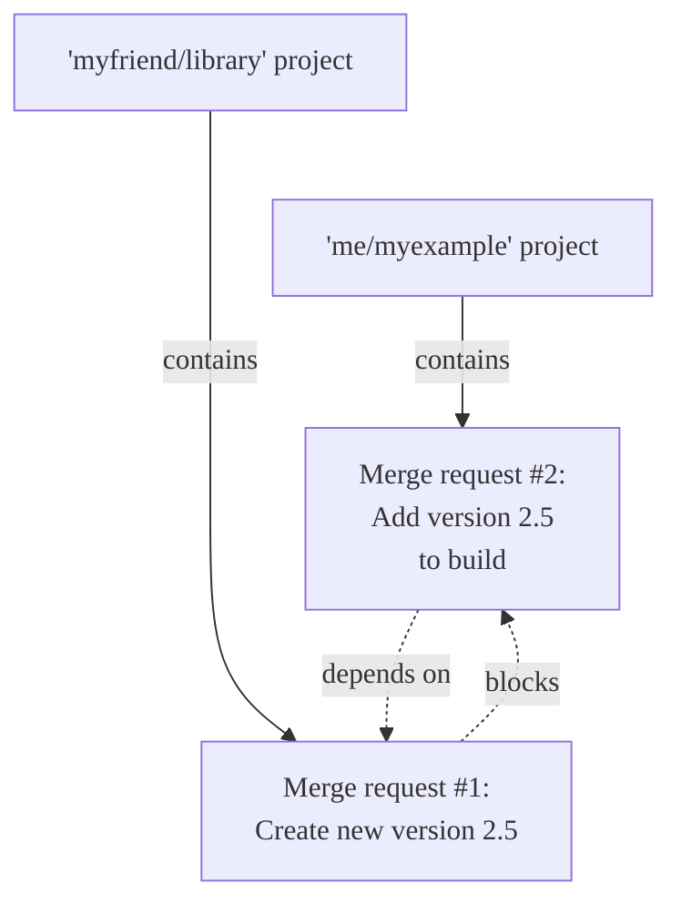
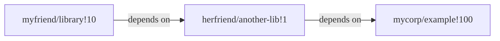



- プラン: Premium、Ultimate
- 提供形態: GitLab.com、GitLab Self-Managed、GitLab Dedicated





- 複雑なマージリクエストの依存関係のサポートは、GitLab 16.6で[導入](https://gitlab.com/gitlab-org/gitlab/-/issues/11393)されました。`remove_mr_blocking_constraints`という名前の[フラグ付き](../../../administration/feature_flags/_index.md)。デフォルトでは無効になっています。
- 複雑なマージリクエストの依存関係のサポートは、GitLab 16.7で[一般提供](https://gitlab.com/gitlab-org/gitlab/-/merge_requests/136775)されました。機能フラグ`remove_mr_blocking_constraints`は削除されました。



1つの機能が複数のマージリクエストにまたがり、複数のプロジェクトに分散している場合があり、作業をマージする順序が重要になる場合があります。マージリクエストの依存関係を設定すると、**Merge request dependencies must be merged**（マージリクエストの依存関係がマージされている必要があります）というマージチェックが満たされるまで、依存するマージリクエストをマージできません。

マージリクエストの依存関係は、次のことに役立ちます:

- 必要なライブラリへの変更が、ライブラリをインポートするプロジェクトへの変更より先にマージされるようにします。
- ドキュメントのみのマージリクエストが、機能の作業自体がマージされる前にマージされるのを防ぎます。
- アクセス許可マトリックスを更新するマージリクエストをマージする前に、まだ正しいアクセス許可を持っていない人からの作業をマージすることを要求します。

プロジェクト`me/myexample`が`myfriend/library`からライブラリをインポートする場合、`myfriend/library`が新しい機能をリリースするときにプロジェクトを更新する必要があります。`me/myexample`への変更を`myfriend/library`が新しい機能を追加する前にマージすると、プロジェクトのデフォルトブランチが壊れてしまいます。マージリクエストの依存関係により、作業が早すぎるマージを防ぐことができます:

`me/myexample`マージリクエストを[ドラフト](drafts.md)としてマークし、コメントで理由を説明することができます。このアプローチは手動であり、特にマージリクエストが異なるプロジェクトの他の複数のプロジェクトに依存している場合は、スケールしません。代わりに、次のことを行う必要があります:

- **ドラフト**または**準備完了**ステータスで、個々のマージリクエストの準備状況を追跡します。
- マージリクエストの依存関係を使用して、マージリクエストをマージする順序を強制します。

マージリクエストの依存関係はGitLab Premiumの機能ですが、GitLabはこの制限を依存するマージリクエストに対してのみ適用します:

- GitLab Premiumプロジェクトのマージリクエストは、GitLab Freeプロジェクトであっても、他のマージリクエストに依存できます。
- GitLab Freeプロジェクトのマージリクエストは、他のマージリクエストに依存できません。

## ネストされた依存関係 {#nested-dependencies}

GitLabバージョン16.7以降では、間接的なネストされた依存関係がサポートされています。1つのマージリクエストは最大10個のブロッカーを持つことができ、順番に最大10個の他のマージリクエストをブロックできます。この例では、`myfriend/library!10`は`herfriend/another-lib!1`に依存しており、次に`mycorp/example!100`に依存しています:

ネストされた依存関係はGitLabのUIに表示されませんが、UIのサポートは[エピック5308](https://gitlab.com/groups/gitlab-org/-/epics/5308)で提案されています。



マージリクエスト自体に依存することはできません（自己参照）が、循環依存関係を作成することは可能です。



## マージリクエストの依存関係を表示 {#view-dependencies-for-a-merge-request}

マージリクエストが別のマージリクエストに依存している場合、マージリクエストレポートセクションには、依存関係に関する情報が表示されます:

マージリクエストの依存関係に関する情報を表示するには、次のようにします:

1. 左側のサイドバーで、**検索または移動先**を選択して、プロジェクトを見つけます。
1. **コード** > **マージリクエスト**を選択し、マージリクエストを特定します。
1. マージリクエストレポートの領域までスクロールします。依存するマージリクエストには、設定された依存関係の合計数に関する情報（**Depends on 1 merge request being merged**（1つのマージリクエストがマージされるのを依存する）など）が表示されます。
1. **全て展開**を選択して、各依存関係のタイトル、マイルストーン、担当者、およびパイプラインステータスを表示します。

マージリクエストの依存関係がすべてマージされるまで、マージリクエストをマージできません。メッセージ**Merge blocked: you can only merge after the above items are resolved**（マージがブロックされました: 上記の項目が解決された後にのみ、マージできます）が表示されます。

### クローズされたマージリクエスト {#closed-merge-requests}

クローズされたマージリクエストは、計画された作業をマージせずにマージリクエストをクローズできるため、依存するマージリクエストがマージされないようにします。マージリクエストがクローズされ、依存関係が不要になった場合は、依存関係として削除して、依存するマージリクエストのブロックを解除します。

## 新しい依存するマージリクエストを作成 {#create-a-new-dependent-merge-request}

新しいマージリクエストを作成するときに、他の特定の作業がマージされた後にマージされないようにすることができます。この依存関係は、マージリクエストが別のプロジェクトにある場合でも機能します。

前提要件:

- デベロッパー以上のロールを持っているか、プロジェクトでマージリクエストを作成する権限が必要です。
- 依存するマージリクエストは、PremiumまたはUltimateプランのプロジェクトにある必要があります。

新しいマージリクエストを作成し、それを別のマージリクエストに依存するものとしてマークするには:

1. [新しいマージリクエストを作成](creating_merge_requests.md)します。
1. **マージリクエストの依存関係**で、この作業がマージされる前にマージする必要があるマージリクエストへの参照または完全なURLを貼り付けます。参照は、`path/to/project!merge_request_id`の形式です。
1. **マージリクエストを作成**を選択します。

## マージリクエストを編集して依存関係を追加 {#edit-a-merge-request-to-add-a-dependency}

既存のマージリクエストを編集して、別のマージリクエストに依存するものとしてマークできます。

前提要件:

- 少なくともデベロッパーロールを持っているか、プロジェクトでマージリクエストを編集する権限を持っている必要があります。

これを行うには、次の手順を実行します:

1. 左側のサイドバーで、**検索または移動先**を選択して、プロジェクトを見つけます。
1. **コード** > **マージリクエスト**を選択し、マージリクエストを特定します。
1. **編集**を選択します。
1. **マージリクエストの依存関係**で、この作業がマージされる前にマージする必要があるマージリクエストへの参照または完全なURLを貼り付けます。参照は、`path/to/project!merge_request_id`の形式です。

## マージリクエストから依存関係を削除 {#remove-a-dependency-from-a-merge-request}

依存するマージリクエストを編集し、依存関係を削除できます。

前提要件:

- マージリクエストを編集できるプロジェクトのロールを持っている必要があります。

1. 左側のサイドバーで、**検索または移動先**を選択して、プロジェクトを見つけます。
1. **コード** > **マージリクエスト**を選択し、マージリクエストを特定します。
1. **編集**を選択します。
1. **マージリクエストの依存関係**までスクロールし、削除する各依存関係の参照の横にある**削除**を選択します。

   

   表示する権限のないマージリクエストの依存関係は、**1 inaccessible merge request**（1つのアクセスできないマージリクエスト）として表示されます。引き続き依存関係を削除できます。

   

1. **変更を保存**を選択します。

## トラブルシューティング {#troubleshooting}

### プロジェクトのインポートまたはエクスポート時に依存関係を保持 {#preserve-dependencies-on-project-import-or-export}

プロジェクトをインポートまたはエクスポートすると、依存関係は保持されません。詳細については、[イシュー #12549](https://gitlab.com/gitlab-org/gitlab/-/issues/12549)を参照してください。
