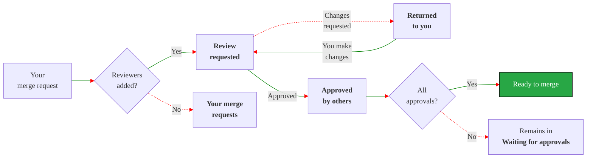



- プラン: Free、Premium、Ultimate
- 提供形態: GitLab.com、GitLab Self-Managed、GitLab Dedicated



自分が作成者、担当者、またはレビュアーであるマージリクエストは、マージリクエストのホームページに表示されます。このページでは、マージリクエストが**ワークフロー**または**ロール**でソートされます。**ワークフロー**ビューには、自分の作業か他の人の作業かにかかわらず、注意が必要なマージリクエストが最初に表示されます。ワークフロービューでは、このレビュープロセスの段階ごとにマージリクエストがグループ化されます:

このレビューフローは、レビュアーが**レビューを開始**と**レビューを送信**機能を使用することを前提としています。

**ロール**ビューでは、マージリクエスト内のロールごとにマージリクエストがソートされます。

## マージリクエストのホームページを表示する {#see-your-merge-request-homepage}



- マージリクエストのホームページは、GitLab 17.9で`merge_request_dashboard`という名前の[フラグ付きで](../../../administration/feature_flags/_index.md) [導入されました](https://gitlab.com/groups/gitlab-org/-/epics/13448)。デフォルトでは無効になっています。
- 機能フラグ`merge_request_dashboard`がGitLab 17.9のGitLab.comで[有効](https://gitlab.com/gitlab-org/gitlab/-/issues/480854)になりました。
- 機能フラグ`mr_dashboard_list_type_toggle`がGitLab 18.1のGitLab.comで[有効](https://gitlab.com/gitlab-org/gitlab/-/issues/535244)になりました。
- 機能フラグ`merge_request_dashboard`は、GitLab 18.2で[デフォルトで有効](https://gitlab.com/gitlab-org/gitlab/-/merge_requests/194999)になりました。





この機能の利用可否は、機能フラグによって制御されます。詳細については、履歴を参照してください。



GitLabのすべてのページの左側のサイドバーに、合計**有効**なマージリクエストが表示されます:

このユーザーには以下があります:

- 9件のオープンイシュー（）
- 1件のアクティブなマージリクエスト（）
- 1件のTo-Do項目（）

マージリクエストのホームページには、これらのマージリクエストに関する詳細情報が表示されます。これを確認するには、次のいずれかの方法を使用します:

- <kbd>Shift</kbd>+<kbd>m</kbd> [キーボードショートカット](../../shortcuts.md)を使用します。
- 左側のサイドバーで、**マージリクエスト**（）を選択します。
- 左側のサイドバーで**検索または移動先**を選択し、ドロップダウンリストから**マージリクエスト**を選択します。

お客様の注意を引く必要のあるものに集中できるように、GitLabでは、マージリクエストのホームページを3つのタブに整理します:

- **有効**: これらのマージリクエストは、自分またはチームメンバーからの注意が必要です。
- **マージ済み**: これらのマージリクエストは、過去14日間にマージされました。これらは自分の作業であるか、自分からのレビューが含まれています。
- **検索**: すべてのマージリクエストを検索し、必要に応じてフィルターします。

- **ステータス**: マージリクエストの現在のステータス。
- **タイトル**: イシューに関する重要なメタデータ。以下を含みます:
  - マージリクエストのタイトル。
  - 担当者のアバター。
  - 追加および削除されたファイルと行の数（`+` / `-`）。
  - マイルストーン。
- **作成者**: 作成者のアバター。
- **レビュアー**: レビュアーのアバター。緑色のチェックマークが付いているレビュアーは、マージリクエストを承認しています。
- **チェック**: マージ可能性のコンパクトな評価。
  - マージコンフリクトが存在する場合の警告（）。
  - `0 of 3`のような未解決スレッドの数。
  - 現在の必須[承認ステータス](approvals/_index.md#in-the-list-of-merge-requests)。
  - 最新のパイプラインステータス。
  - 最終更新日。

### 表示設定を行う {#set-your-display-preferences}

マージリクエストのホームページの右上にある**Display preferences**（表示設定）（）を選択します:

- **ラベルを表示**を切り替えて、各マージリクエストのラベルを表示または非表示にします。
- 並べ替えの設定: **ワークフロー**または**ロール**。
  - **ワークフロー**は、ステータスごとにマージリクエストをグループ化します。GitLabは、作成者かレビュアーかに関係なく、注意が必要なマージリクエストを最初に表示します。
  - **ロール**は、レビュアーであるか作成者であるかによって、マージリクエストをグループ化します。

アクティブなマージリクエストは、左側のサイドバーに表示される合計にカウントされます。GitLabでは、**無効**なマージリクエストをレビュー数から除外します。

### ワークフロービュー: アクティブなステータス {#workflow-view-active-statuses}

これらのマージリクエストは注意が必要です。これらは、左側のサイドバーに表示される合計にカウントされます:

- **マージリクエスト**: 自分がマージリクエストの作成者または担当者です。レビュープロセスを開始するには、レビュアーを割り当てます。ステータス:
  - **ドラフト**: マージリクエストはドラフトです。
  - **Reviewers needed**（レビュアーが必要です）: マージリクエストはドラフトではありませんが、レビュアーがいません。
- **リクエストしたレビュー**: 自分がレビュアーです。マージリクエストをレビューします。フィードバックを提供します。オプションで、承認または変更をリクエストします。ステータス:
  - **変更リクエスト済み**: レビュアーが変更をリクエストしました。変更リクエストはマージリクエストをブロックしますが、[回避する](reviews/_index.md#bypass-a-request-for-changes)ことができます。
  - **レビュアーがコメント**: レビュアーがコメントを残しましたが、変更はリクエストしていません。
- **返却されました**: レビュアーがフィードバックを提供したか、変更をリクエストしました。レビュアーのコメントに対処し、提案された変更を適用します。ステータス:
  - **変更リクエスト済み**: レビュアーが変更をリクエストしました。
  - **レビュアーがコメント**: レビュアーがコメントを残しましたが、変更はリクエストしていません。

### ワークフロービュー: 非アクティブなステータス {#workflow-view-inactive-statuses}

GitLabでは、これらのマージリクエストはアクティブ数から除外されます。これは、現時点では何も操作を行う必要がないためです:

- **Waiting for assignee**（担当者待ち）: 作成者の場合、マージリクエストはレビュー待ちです。レビュアーの場合、変更をリクエストしました。ステータス:
  - **変更をリクエストしました**: レビューを完了し、変更をリクエストしました。
  - **コメント済み**: コメントしましたが、レビューを完了していません。
- **承認待ち**: 承認を待機している、割り当てられたマージリクエスト、および変更をリクエストしたレビュー。ステータス:
  - **承認が必要**: 残りの必要な承認の数。
  - **承認済み**: 自分が承認したか、必要な承認がすべて満たされています。
  - **承認待ち**。
- **あなたにより承認済み**: レビューして承認したマージリクエスト。ステータス:
  - **承認済み**: 自分が承認し、必要な承認がすべて満たされています。
  - **承認が必要**: 承認しましたが、必要な承認がすべて満たされているわけではありません。
- **他の人により承認済み**: 他のチームメンバーから承認を受けたマージリクエスト。すべての要件が満たされている場合、マージする準備ができている可能性があります。ステータス:
  - **承認済み**: マージリクエストは必要な承認を受けました。

### ロールビュー {#role-view}

**ロール**ビューは、自分が担当者またはレビュアーであるマージリクエストをグループ化します:

- **Reviewer（Active）**（レビュアー（有効））: 自分からのレビュー待ち。
- **Reviewer（Inactive）**（レビュアー（無効））: 自分がすでにレビューしました。
- **Your merge requests（Active）**（自分のマージリクエスト（有効））
- **Your merge requests（Inactive）**（自分のマージリクエスト（無効））

**有効**リストのマージリクエストは、左側のサイドバーに表示される合計にカウントされます。

## 関連トピック {#related-topics}

- [マージリクエストのレビュー](reviews/_index.md)
