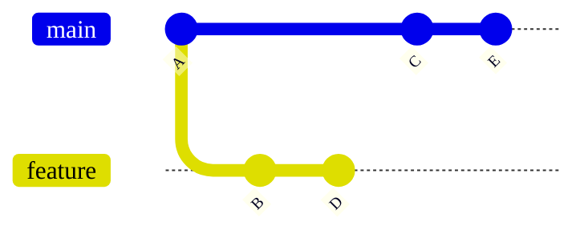
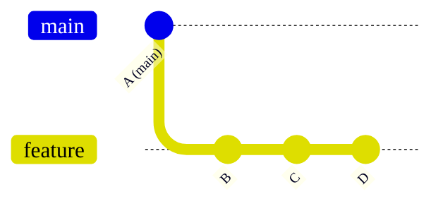
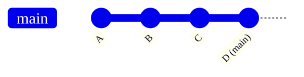
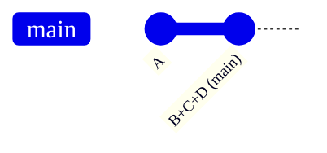



- プラン: Free、Premium、Ultimate
- 提供形態: GitLab.com、GitLab Self-Managed、GitLab Dedicated



プロジェクトに選択するマージ方法は、マージリクエストの変更を既存のブランチにマージする方法を決定します。

このページの例では、コミットA、C、Eを含む`main`ブランチと、コミットB、Dを含む`feature`ブランチを想定しています:



## プロジェクトのマージ方法を設定する {#configure-a-projects-merge-method}

1. 左側のサイドバーで、**検索または移動先**を選択して、プロジェクトを見つけます。
1. **設定** > **マージリクエスト**を選択します。
1. これらのオプションから、目的の**マージ方法**を選択します:
   - マージコミット
   - 半線形履歴によるマージコミット
   - 早送りマージ
1. **マージ時にコミットをスカッシュする**で、コミットを処理するデフォルトの動作を選択します:
   - **許可しない**: スカッシュは実行されず、ユーザーは動作を変更できません。
   - **許可**: スカッシュはデフォルトでオフになっていますが、ユーザーは動作を変更できます。
   - **推奨**: スカッシュはデフォルトでオンになっていますが、ユーザーは動作を変更できます。
   - **必須**: スカッシュは常に実行され、ユーザーは動作を変更できません。
1. **変更を保存**を選択します。

## マージコミット {#merge-commit}

デフォルトでは、ブランチが`main`にマージされると、GitLabはマージコミットを作成します。コミットが[マージ時にスカッシュ](../squash_and_merge.md)されるかどうかに関係なく、個別のマージコミットが常に作成されます。この方法では、スカッシュコミットとマージコミットの両方が`main`ブランチに追加される可能性があります。

**マージコミット**戦略を使用する場合、これらの図は、`feature`ブランチが`main`にどのようにマージされるかを示しています。これらはコマンド`git merge --no-ff <feature>`と同等であり、GitLab UIで`Merge commit`を**マージ方法**として選択します:

- フィーチャーブランチが**マージコミット**メソッドでマージされた後、`main`ブランチは次のようになります:

  ```mermaid
  %%{init: { 'gitGraph': {'logLevel': 'debug', 'showBranches': true, 'showCommitLabel':true,'mainBranchName': 'main', 'fontFamily': 'GitLab Sans'}} }%%
  gitGraph
     accTitle: Diagram of a merge commit
     accDescr: A Git graph showing how merge commits are created in GitLab when a feature branch is merged.
     commit id: "A"
     branch feature
     commit id: "B"
     commit id: "D"
     checkout main
     commit id: "C"
     commit id: "E"
     merge feature
  ```

- 比較すると、スカッシュマージは、`feature`ブランチからのすべてのコミットの仮想コピーであるスカッシュコミットを作成します。元のコミット（BおよびD）は`feature`ブランチで変更されずに残り、次にスカッシュされたブランチにマージするために`main`ブランチでマージコミットが作成されます:

  ```mermaid
  %%{init: { 'gitGraph': {'showBranches': true, 'showCommitLabel':true,'mainBranchName': 'main', 'fontFamily': 'GitLab Sans'}} }%%
  gitGraph
     accTitle: Diagram of of a squash merge
     accDescr: A Git graph showing repository and branch structure after a squash commit is added to the main branch.
     commit id:"A"
     branch feature
     checkout main
     commit id:"C"
     checkout feature
     commit id:"B"
     commit id:"D"
     checkout main
     commit id:"E"
     branch "B+D"
     commit id: "B+D"
     checkout main
     merge "B+D"
  ```

スカッシュマージグラフは、GitLab UIのこれらの設定と同等です:

- **マージ方法**: マージコミット。
- **マージ時にコミットをスカッシュする**は、次のいずれかに設定する必要があります:
  - 必須。
  - 許可または推奨のいずれかで、スカッシュはマージリクエストで選択する必要があります。

スカッシュマージグラフは、これらのコマンドとも同等です:

  ```shell
  git checkout `git merge-base feature main`
  git merge --squash feature
  git commit --no-edit
  SOURCE_SHA=`git rev-parse HEAD`
  git checkout main
  git merge --no-ff $SOURCE_SHA
  ```

## 半線形履歴によるマージコミット {#merge-commit-with-semi-linear-history}

マージごとにマージコミットが作成されますが、ブランチは早送りマージが可能な場合にのみマージされます。これにより、マージリクエストビルドが成功した場合、マージ後もターゲットブランチビルドが成功することが保証されます。このマージ方法を使用して生成されたコミットグラフの例:


`Merge commit with semi-linear history`メソッドを選択してマージリクエストページにアクセスすると、早送りマージが可能な場合にのみ受け入れることができます。早送りマージが不可能な場合、ユーザーにはリベースのオプションが与えられます。[（半）線形マージ法でのリベース](#rebasing-in-semi-linear-merge-methods)を参照してください。

この方法は、**マージコミット**メソッドと同じGitコマンドと同等です。ただし、ソースブランチがターゲットブランチの最新ではないバージョン（`main`など）に基づいている場合は、ソースブランチをリベースする必要があります。このマージ方法では、すべてのブランチがどこから始まり、マージされたかを確認できるようにしながら、よりクリーンな履歴を作成できます。

## 早送りマージ {#fast-forward-merge}

場合によっては、ワークフローポリシーで、マージコミットのないクリーンなコミット履歴が義務付けられることがあります。このような場合、早送りマージが適切です。早送りマージリクエストを使用すると、マージコミットを作成せずに、リニアなGit履歴を保持できます。

早送りマージは、ターゲットブランチ（`main`など）がソースブランチのベースコミットから分岐していない場合にのみ可能です。ターゲットブランチにソースブランチにない新しいコミットがある場合は、最初にソースブランチをリベースする必要があります。

早送りマージ（[`--ff-only`](https://git-scm.com/docs/git-merge#git-merge---ff-only)）設定が有効になっている場合、ブランチを早送りできる場合にのみ、マージが許可されます。早送りマージが不可能な場合は、リベースするオプションが提供されます。詳細については、[（準）リニアマージ手法でのリベース](#rebasing-in-semi-linear-merge-methods)を参照してください。

### スカッシュなし {#without-squashing}

スカッシュが無効になっている場合、ソースブランチからのすべてのコミットは、個々のコミット履歴を維持したまま、ターゲットブランチに直接追加されます。

マージ前、`main`がコミットAにあり、`feature`にコミットB、C、Dが含まれている場合:



早送りマージ後、`main`はフィーチャーブランチからのすべてのコミットを含む、コミットDを指すようになりました:



このマージ方法は、`git merge --ff-only <source-branch>`と同等です。

### スカッシュあり {#with-squashing}

スカッシュが有効になっている場合、ソースブランチからのすべてのコミットが最初に単一のコミットに結合され、ターゲットブランチに早送りされます。

マージ前、`main`がコミットAにあり、`feature`にコミットB、C、Dが含まれている場合:


スカッシュを使用した早送りマージ後、`main`には、B、C、Dからのすべての変更を含む単一のコミットが含まれるようになりました:



このメソッドは、`git merge --squash <source-branch>`に続いて`git commit`と同等です。

## （半）線形マージ法でのリベース {#rebasing-in-semi-linear-merge-methods}

これらのマージ方法では、ソースブランチがターゲットブランチで最新の状態になっている場合にのみマージできます:

- 半線形履歴によるマージコミット。
- 早送りマージ。

早送りマージは不可能だが、コンフリクトのないリベースが可能な場合、GitLabは以下を提供します:

- [`/rebase`クイックアクション](../conflicts.md#rebase)。
- UIで**リベース**を選択するオプション。

両方の条件が当てはまる場合は、早送りマージの前にローカルでソースブランチをリベースする必要があります:

- ターゲットブランチがソースブランチよりも先行しています。
- コンフリクトのないリベースは不可能です。

スカッシュ自体がリベースと同等と見なされる場合でも、スカッシュの前にリベースが必要になる場合があります。

### CI/CDパイプラインなしでリベース {#rebase-without-cicd-pipeline}

CI/CDパイプラインをトリガーせずにマージリクエストのブランチをリベースするには、マージリクエストレポートセクションから**パイプラインなしのrebase**を選択します。

このオプションは:

- 早送りマージは不可能だが、コンフリクトのないリベースが可能な場合に使用できます。
- **パイプラインが完了している**オプションが有効になっている場合は使用できません。

CI/CDパイプラインなしでリベースすると、頻繁なリベースが必要な半線形ワークフローのプロジェクトでリソースを節約できます。

## 関連トピック {#related-topics}

- [スカッシュとマージ](../squash_and_merge.md)
