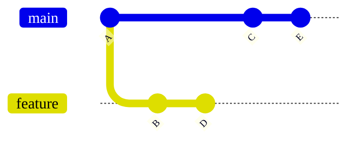
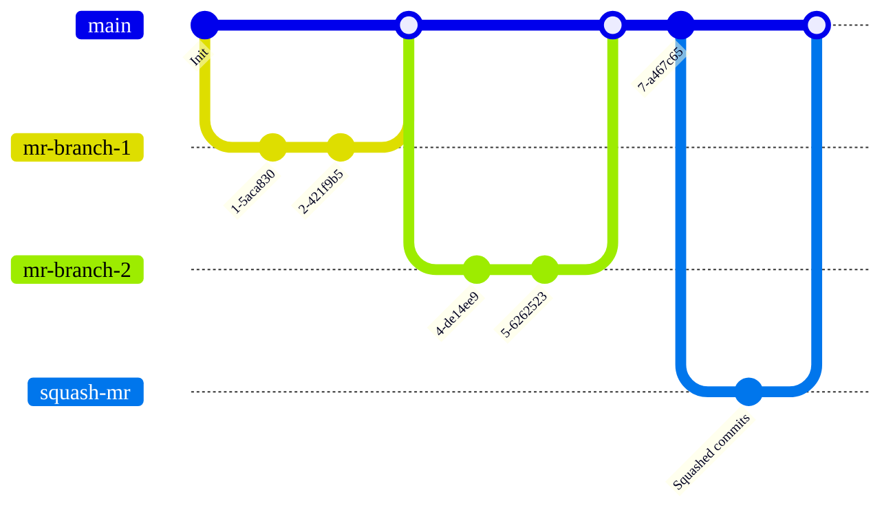
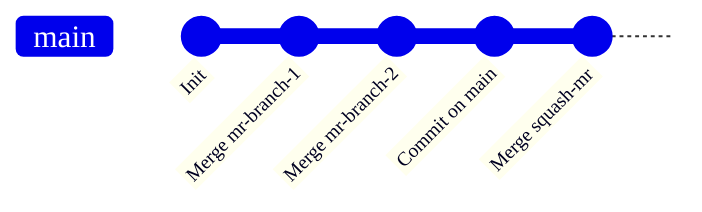



- プラン:Free、Premium、Ultimate
- 提供:GitLab.com、GitLab Self-Managed、GitLab Dedicated



プロジェクトに選択するマージ方法は、マージリクエストの変更を既存のブランチにマージする方法を決定します。

このページの例では、コミット A、C、E を含む `main` ブランチと、コミット B、D を含む `feature` ブランチを想定しています。



## プロジェクトのマージ方法をConfigureする

1. 左側のサイドバーで、**検索または移動**を選択して、プロジェクトを見つけます。
1. **設定 > マージリクエスト**を選択します。
1. これらのオプションから、目的の**マージ方法**を選択します。
   - マージコミット
   - 半線型履歴によるマージコミット
   - 早送りマージ
1. **マージ時にコミットをスカッシュする**で、コミットを処理するデフォルトの動作を選択します。
   - **許可しない**:スカッシュは実行されず、ユーザーは動作を変更できません。
   - **許可**:スカッシュはデフォルトでオフになっていますが、ユーザーは動作を変更できます。
   - **推奨**:スカッシュはデフォルトでオンになっていますが、ユーザーは動作を変更できます。
   - **必須**:スカッシュは常に実行され、ユーザーは動作を変更できません。
1. **変更を保存**を選択します。

## マージコミット

デフォルトでは、ブランチが `main` にマージされると、GitLab はマージコミットを作成します。コミットが[マージ時にスカッシュ](../squash_and_merge.md)されるかどうかに関係なく、個別のマージコミットが常に作成されます。この方法では、スカッシュコミットとマージコミットの両方が`main`ブランチに追加される可能性があります。

**マージコミット**戦略を使用する場合、これらの図は、`feature` ブランチが `main` にどのようにマージされるかを示しています。これらはコマンド `git merge --no-ff <feature>` と同等であり、GitLab UI で `Merge commit` を**マージ方法**として選択します:

- フィーチャーブランチが**マージコミット**メソッドでマージされた後、`main` ブランチは次のようになります。

  ```mermaid
  %%{init: { 'gitGraph': {'logLevel': 'debug', 'showBranches': true, 'showCommitLabel':true,'mainBranchName': 'main', 'fontFamily': 'GitLab Sans'}} }%%
  gitGraph
     accTitle: Diagram of a merge commit
     accDescr: A Git graph showing how merge commits are created in GitLab when a feature branch is merged.
     commit id: "A"
     branch feature
     commit id: "B"
     commit id: "D"
     checkout main
     commit id: "C"
     commit id: "E"
     merge feature
  ```

- 比較すると、**スカッシュマージ**は、`feature` ブランチからのすべてのコミットの仮想コピーであるスカッシュコミットを作成します。元のコミット (B および D) は `feature` ブランチで変更されずに残り、次にスカッシュされたブランチにマージするために `main` ブランチでマージコミットが作成されます。

  ```mermaid
  %%{init: { 'gitGraph': {'showBranches': true, 'showCommitLabel':true,'mainBranchName': 'main', 'fontFamily': 'GitLab Sans'}} }%%
  gitGraph
     accTitle: Diagram of of a squash merge
     accDescr: A Git graph showing repository and branch structure after a squash commit is added to the main branch.
     commit id:"A"
     branch feature
     checkout main
     commit id:"C"
     checkout feature
     commit id:"B"
     commit id:"D"
     checkout main
     commit id:"E"
     branch "B+D"
     commit id: "B+D"
     checkout main
     merge "B+D"
  ```

スカッシュマージグラフは、GitLab UI のこれらの設定と同等です。

- **マージ方法**:マージコミット。
- **マージ時にコミットをスカッシュ**は、次のいずれかに設定する必要があります:
  - 必須。
  - 許可または推奨のいずれかで、スカッシュはマージリクエストで選択する必要があります。

スカッシュマージグラフは、これらのコマンドとも同等です。

  ```shell
  git checkout `git merge-base feature main`
  git merge --squash feature
  git commit --no-edit
  SOURCE_SHA=`git rev-parse HEAD`
  git checkout main
  git merge --no-ff $SOURCE_SHA
  ```

## 半線型履歴によるマージコミット

マージごとにマージコミットが作成されますが、ブランチは早送りマージが可能な場合にのみマージされます。これにより、マージリクエストビルドが成功した場合、マージ後もターゲットブランチビルドが成功することが保証されます。このマージ方法を使用して生成されたコミットグラフの例:



`Merge commit with semi-linear history` メソッドを選択してマージリクエストページにアクセスすると、**早送りマージが可能な場合にのみ**受け入れることができます。早送りマージが不可能な場合、ユーザーにはリベースのオプションが与えられます。 [（半）線型マージ法でのリベース](#rebasing-in-semi-linear-merge-methods)を参照してください。

この方法は、**マージコミット**メソッドと同じ Git コマンドと同等です。ただし、ソースブランチがターゲットブランチの最新ではないバージョン（`main` など）に基づいている場合は、ソースブランチをリベースする必要があります。このマージ方法では、すべてのブランチがどこから始まり、マージされたかを確認できるようにしながら、よりクリーンな履歴を作成できます。

## 早送りマージ

場合によっては、ワークフローポリシーで、マージコミットのないクリーンなコミット履歴が義務付けられることがあります。このような場合、早送りマージが適切です。早送りマージリクエストを使用すると、線型の Git 履歴を保持し、マージコミットを作成せずにマージリクエストを受け入れることができます。このマージ方法を使用して生成されたコミットグラフの例:



この方法は以下と同等です。

- 通常のマージの場合は、`git merge --ff <source-branch>`。
- スカッシュマージの場合は、`git merge --squash <source-branch>` の後に `git commit` を実行します。

早送りマージ（[`--ff-only`](https://git-scm.com/docs/git-merge#git-merge---ff-only)）設定が有効になっている場合、マージコミットは作成されず、すべてのマージが早送りされます。ブランチを早送りできる場合にのみ、マージが許可されます。早送りマージが不可能な場合、ユーザーにはリベースのオプションが与えられます。 [（半）線型マージ法でのリベース](#rebasing-in-semi-linear-merge-methods)を参照してください。

`Fast-forward merge` メソッドを選択してマージリクエストページにアクセスすると、**早送りマージが可能な場合にのみ**受け入れることができます。

## （半）線型マージ法でのリベース

これらのマージ方法では、ソースブランチがターゲットブランチで最新の状態になっている場合にのみマージできます。

- 半線型履歴によるマージコミット。
- 早送りマージ。

早送りマージは不可能だが、コンフリクトのないリベースが可能な場合、GitLab は以下を提供します。

- [`/rebase`クイック アクション](../conflicts.md#rebase)。
- ユーザーインターフェイスで**リベース**を選択するオプション。

両方の条件が当てはまる場合は、早送りマージの前にローカルでソースブランチをリベースする必要があります。

- ターゲットブランチがソースブランチよりも先行しています。
- コンフリクトのないリベースは不可能です。

スカッシュ自体がリベースと同等と見なされる場合でも、スカッシュの前にリベースが必要になる場合があります。

### CI/CD パイプラインなしでリベース



- GitLab 15.3 で[一般提供](https://gitlab.com/gitlab-org/gitlab/-/issues/350262)に変更されました。機能フラグ`rebase_without_ci_ui`を削除しました。



CI/CD パイプラインをトリガーせずにマージリクエストのブランチをリベースするには、マージリクエストレポートセクションから**パイプラインなしでリベース**を選択します。

このオプションは:

- 早送りマージは不可能だが、コンフリクトのないリベースが可能な場合に使用できます。
- **パイプラインが成功する必要がある**オプションが有効になっている場合は使用できません。

CI/CD パイプラインなしでリベースすると、頻繁なリベースが必要な半線型ワークフローのプロジェクトでリソースを節約できます。

## 関連トピック

- [スカッシュとマージ](../squash_and_merge.md)
