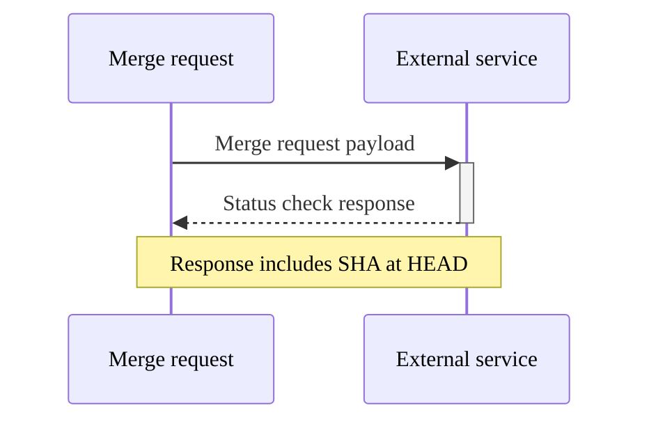



- プラン: Ultimate
- 提供形態: GitLab.com、GitLab Self-Managed、GitLab Dedicated





- `pending`のステータスがGitLab 16.5で[導入](https://gitlab.com/gitlab-org/gitlab/-/issues/413723)されました。
- `pending`ステータスチェックのタイムアウト間隔（2分）がGitLab 16.6で[導入されました](https://gitlab.com/gitlab-org/gitlab/-/issues/388725)。



ステータスチェックは、外部要件のステータスをリクエストする外部システムへのAPIコールです。

マージリクエストデータをサードパーティツールに送信するステータスチェックを作成できます。ユーザーがマージリクエストを作成、変更、またはクローズすると、GitLabは通知を送信します。ユーザーまたは自動ワークフローは、GitLabの外部からマージリクエストのステータスを更新できます。

このインテグレーションにより、ServiceNowなどのサードパーティワークフローツール、または任意のカスタムツールとインテグレーションできます。サードパーティツールは、関連するステータスで応答します。このステータスは、マージリクエスト内のブロックしないウィジェットとして表示され、マージリクエストレベル自体で、このステータスをマージリクエストの作成者またはレビュアーに表面化します。

マージリクエストのステータスチェックを個々のプロジェクトごとに設定できます。これらはプロジェクト間で共有されません。

ステータスチェックは、保留中の状態で2分以上経過すると失敗します。

## アクセス許可 {#access-permissions}

外部ステータスチェックの応答は、以下によって表示できます:

- プロジェクトで少なくともレポーターのロールを持つユーザー
- プロジェクトの表示レベルが内部のときにマージリクエストを表示できる認証済みユーザー

つまり、内部プロジェクトがある場合、マージリクエストにアクセスできるログイン済みのユーザーは、外部ステータスチェックの応答を表示できます。

ユースケース、機能の検出、および開発タイムラインの詳細については、[epic 3869](https://gitlab.com/groups/gitlab-org/-/epics/3869)を参照してください。

## すべてのステータスチェックが完了した場合を除き、マージリクエストのマージをブロックします {#block-merges-of-merge-requests-unless-all-status-checks-have-passed}



- GitLab 15.5で`only_allow_merge_if_all_status_checks_passed`[フラグ](../../../administration/feature_flags/_index.md)とともに[導入](https://gitlab.com/gitlab-org/gitlab/-/issues/369859)されました。デフォルトでは無効になっています。
- GitLab 15.8の[GitLab.comで有効になりました](https://gitlab.com/gitlab-org/gitlab/-/issues/372340)。
- GitLab Self-Managedで有効になり、[機能フラグ](https://gitlab.com/gitlab-org/gitlab/-/merge_requests/111492)がGitLab 15.9で削除されました。



デフォルトでは、プロジェクトのマージリクエストは、外部ステータスチェックが失敗した場合でもマージできます。外部チェックが失敗した場合にマージリクエストのマージをブロックするには、次のようにします:

1. 左側のサイドバーで、**検索または移動先**を選択して、プロジェクトを見つけます。
1. **設定** > **マージリクエスト**を選択します。
1. **ステータスチェックが完了する必要があります**チェックボックスを選択します。
1. **変更を保存**を選択します。

## ライフサイクル {#lifecycle}

外部ステータスチェックには、**asynchronous**（非同期）のワークフローがあります。マージリクエストは、次の場合に、マージリクエストWebhookペイロードを外部サービスに送信します:

- マージリクエストが更新、クローズ、再オープン、承認、未承認、またはマージされた場合。
- コードがマージリクエストのソースブランチにプッシュされた場合。



ペイロードを受信すると、外部サービスは、[REST APIを使用して](../../../api/status_checks.md#set-status-of-an-external-status-check)、応答をマージリクエストにプッシュする前に、必要なプロセスを実行できます。

マージリクエストは、ソースブランチの現在の`HEAD`を参照していない応答に対して、`409 Conflict`エラーを返します。その結果、外部サービスが最新ではないコミットを処理して応答しても安全です。

外部ステータスチェックには、次の状態があります:

- `pending` - デフォルトの状態。外部サービスからマージリクエストへの応答が受信されていません。
- `passed` - 外部サービスからの応答が受信され、承認されました。
- `failed` - 外部サービスからの応答が受信され、拒否されました。

GitLabの外部で何かが変更された場合は、APIを使用して[外部ステータスチェックのステータスを設定](../../../api/status_checks.md#set-status-of-an-external-status-check)できます。マージリクエストWebhookペイロードが最初に送信されるのを待つ必要はありません。

## ステータスチェックサービスを表示する {#view-status-check-services}

マージリクエストの設定からプロジェクトに追加されたステータスチェックサービスのリストを表示するには、次のようにします:

1. 左側のサイドバーで、**検索または移動先**を選択して、プロジェクトを見つけます。
1. **設定** > **マージリクエスト**を選択します。
1. 下にスクロールして、**ステータスチェック**を表示します。このリストには、サービス名、API URL、対象ブランチ、およびHMAC認証ステータスが表示されます。


[ブランチルール](../repository/branches/branch_rules.md#add-a-status-check-service)の設定から、ステータスチェックサービスのリストを表示することもできます。

## ステータスチェックサービスを追加または更新する {#add-or-update-a-status-check-service}

### ステータスチェックサービスを追加する {#add-a-status-check-service}

**ステータスチェック**サブセクション]で、**ステータスチェックの追加**ボタンを選択します。次に、**ステータスチェックの追加**フォームが表示されます。


フォームに入力された状態で**ステータスチェックの追加**ボタンを選択すると、新しいステータスチェックが作成されます。

ステータスチェックは、すべての新しいマージリクエストに適用されますが、既存のマージリクエストには遡って適用されません。

### ステータスチェックサービスを更新する {#update-a-status-check-service}

**ステータスチェック**サブセクション]で、編集するステータスチェックの横にある**編集**（）を選択します。次に、**ステータスチェックを更新**フォームが表示されます。




HMAC共有シークレットの値は表示または変更できません。共有シークレットを変更するには、共有シークレットの新しい値を使用して、外部ステータスチェックを削除して再作成します。



ステータスチェックを更新するには、フォームの値を変更し、**ステータスチェックを更新**を選択します。

ステータスチェックの更新は、すべての新しいマージリクエストに適用されますが、既存のマージリクエストには遡って適用されません。

### フォームの値 {#form-values}

一般的なフォームエラーについては、以下の[トラブルシューティング](#troubleshooting)セクションを参照してください。

#### サービス名 {#service-name}

この名前には任意の英数字を使用でき、**必ず**設定する必要があります。名前はプロジェクトで**必ず**一意でなければなりません。名前はプロジェクトで**必ず**一意でなければなりません。

#### チェックするAPI {#api-to-check}

このフィールドにはURLが必要であり、HTTPまたはHTTPSプロトコルのいずれかを**必ず**使用する必要があります。マージリクエストデータを転送時に保護するために、HTTPSを使用することを**おすすめします**。URLは**必ず**設定してください。また、プロジェクトで**必ず**一意でなければなりません。

#### ターゲットブランチ {#target-branch}

ステータスチェックを単一のブランチに制限する場合は、このフィールドを使用してこの制限を設定できます。


ブランチのリストは、プロジェクトの[保護ブランチ](../repository/branches/protected.md)から入力されたものです。

ブランチのリストをスクロールするか、ブランチが多数あり、探しているブランチがすぐに表示されない場合は、検索ボックスを使用できます。検索を開始するには、検索ボックスに**3つ**の英数字を入力する必要があります。

ステータスチェックを**すべて**のマージリクエストに適用する場合は、**すべてのブランチ**オプションを選択します。

#### HMAC共有シークレット {#hmac-shared-secret}

HMAC認証は、リクエストの改ざんを防ぎ、正当なソースからのものであることを保証します。

## ステータスチェックサービスを削除する {#delete-a-status-check-service}

**ステータスチェック**サブセクション]で、削除するステータスチェックの横にある**削除**（）を選択します。次に、**Remove status check?**（ステータスチェックを削除しますか?）モーダルが表示されます。


ステータスチェックの削除を完了するには、**Remove status check**（ステータスチェックの削除）ボタンを選択する必要があります。これにより、ステータスチェックが**完全に**削除され、回復**できません**。

## ステータスチェックウィジェット {#status-checks-widget}



- UIがGitLab 15.2で[更新](https://gitlab.com/gitlab-org/gitlab/-/merge_requests/91504)されました。
- 失敗した外部ステータスチェックを再試行する機能がGitLab 15.8で[追加されました](https://gitlab.com/gitlab-org/gitlab/-/issues/383200)。
- GitLab 15.11で保留中のステータスチェックがある場合に更新をポーリングするようにウィジェットが[更新されました](https://gitlab.com/gitlab-org/gitlab/-/merge_requests/111763)。



ステータスチェックウィジェットは、マージリクエストに表示され、次のステータスを表示します:

- **保留中**（）、GitLabが外部ステータスチェックからの応答を待機している間。
- GitLabが外部ステータスチェックから応答を受信すると、**成功**（）または**失敗**（）

保留中のステータスチェックがある場合、ウィジェットは**成功**または**失敗**の応答を受信するまで数秒ごとに更新をポーリングします。

失敗したステータスチェックを再試行するには、次のようにします:

1. 左側のサイドバーで、**検索または移動先**を選択して、プロジェクトを見つけます。
1. **コード** > **マージリクエスト**を選択して、マージリクエストを見つけます。
1. マージリクエストレポートセクションまでスクロールし、ドロップダウンリストを展開して、外部ステータスチェックのリストを表示します。
1. 失敗した外部ステータスチェック行で、**再試行**（）を選択します。ステータスチェックが保留中の状態に戻されます。

組織には、外部ステータスチェックが合格しない場合にマージリクエストのマージを許可しないポリシーがある場合があります。ただし、ウィジェットの詳細は、情報提供のみを目的としています。



GitLabは、関連する外部サービスによって外部ステータスチェックが適切に処理されることを保証できません。



## トラブルシューティング {#troubleshooting}

### 値の重複エラー {#duplicate-value-errors}

```plaintext
Name is already taken
---
External API is already in use by another status check
```

プロジェクトごとに、ステータスチェックは名前またはAPI URLを1回のみ使用できます。これらのエラーは、ステータスチェックの名前またはAPI URLが、このプロジェクトのステータスチェックですでに使用されていることを意味します。

現在のステータスチェックで別の値を選択するか、既存のステータスチェックの値を更新する必要があります。

### 無効なURLエラー {#invalid-url-error}

```plaintext
Please provide a valid URL
```

チェックするAPIフィールドでは、HTTPまたはHTTPsプロトコルのいずれかを使用するために指定されたURLが必要です。この要件を満たすようにフィールドの値を更新する必要があります。

### 取得または検索中のブランチリストエラー {#branch-list-error-during-retrieval-or-search}

```plaintext
Unable to fetch branches list, please close the form and try again
```

ブランチ取得APIから予期しない応答を受信しました。推奨どおり、フォームを閉じて再度開くか、ページを更新する必要があります。このエラーは一時的なものですが、解決しない場合は、[GitLabステータスページ](https://status.gitlab.com/)を確認して、より広範な停止が発生していないか確認してください。

### ステータスチェックの読み込むに失敗しました {#failed-to-load-status-checks}

```plaintext
Failed to load status checks
```

外部ステータスチェックAPIから予期しない応答を受信しました。以下を行う必要があります:

- このエラーが一時的なものである場合に備えて、ページを更新します。
- 問題が解決しない場合は、[GitLabステータスページ](https://status.gitlab.com/)を確認して、より広範な停止が発生していないか確認してください。

## 関連トピック {#related-topics}

- [外部ステータスチェックAPI](../../../api/status_checks.md)
