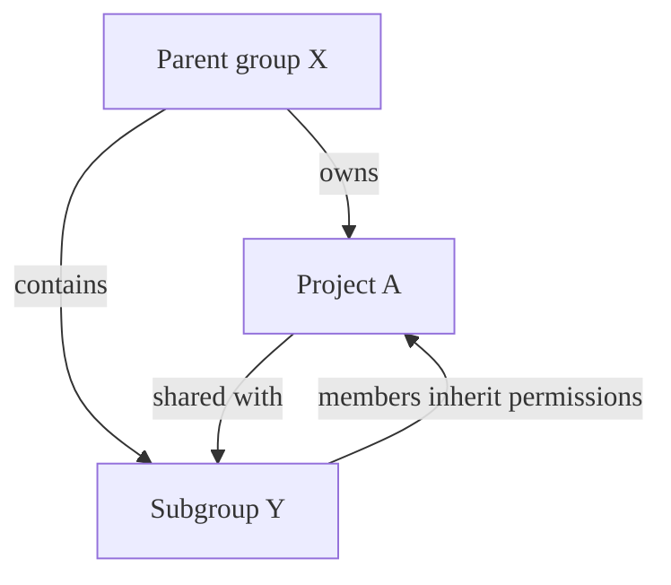
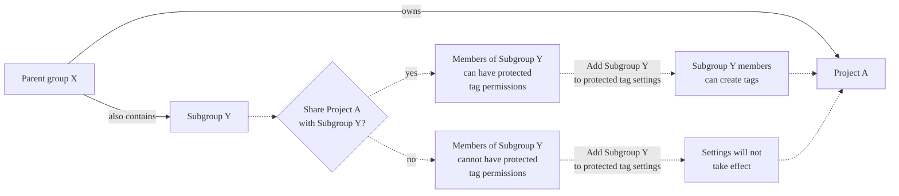



- プラン: Free、Premium、Ultimate
- 提供形態: GitLab.com、GitLab Self-Managed、GitLab Dedicated



保護[タグ](repository/tags/_index.md):

- タグを作成する権限を持つユーザーを制御できます。
- 作成後の誤った更新や削除を防ぎます。

各ルールでは、次のいずれかを照合できます:

- 個々のタグ名。
- ワイルドカードを使用して、複数のタグを一度に制御します。

この機能は、[保護ブランチ](repository/branches/protected.md)から発展したものです。



保護タグを作成または削除するには、その保護タグの**Allowed to create or delete**（作成が許可されています）リストに登録されている必要があります。



## 保護タグの設定 {#configuring-protected-tags}

前提要件: 

- プロジェクトのメンテナーロール以上が必要です。

1. 左側のサイドバーで、**検索または移動先**を選択して、プロジェクトを見つけます。
1. **設定** > **リポジトリ**を選択します。
1. **保護タグ**を展開します。
1. **新規を追加**を選択します。
1. 単一のタグを保護するには、**タグ**を選択し、ドロップダウンリストからタグを選択します。
1. 名前が文字列に一致するすべてのタグを保護するには、以下を実行します:
   1. **タグ**を選択します。
   1. タグのマッチングに使用する文字列を入力します。ワイルドカード（`*`）がサポートされています。
   1. **ワイルドカードの作成**を選択します。
1. **作成が許可されています**で、保護タグを作成できるロールを選択します。

   

   GitLabプレミアムおよびUltimateでは、グループまたは個々のユーザーを**作成が許可されています**に追加することもできます。

   

1. **保護**を選択します。

保護されたタグ（またはワイルドカード）が**保護タグ**リストに表示されます。

### 保護タグへのグループの追加 {#add-a-group-to-protected-tags}

グループまたはサブグループのメンバーを保護タグの作成を許可するように設定するには、次の手順を実行します:

1. 左側のサイドバーで、**Search or go**（検索または移動先）を選択して、プロジェクトを見つけます。
1. **設定** > **リポジトリ**を選択します。
1. **保護タグ**を展開します。
1. 次のフィールドにグループを追加します:

   ```plaintext
   # Allow group members to create protected tags
   Allowed to create: @group-x
   ```

#### グループの継承および資格 {#group-inheritance-and-eligibility}



この例では: 

- 親グループX（`group-x`）はプロジェクトAを所有しています。
- 親グループXには、サブグループ、サブグループY（`group-x/subgroup-y`）も含まれています。
- プロジェクトAはサブグループYと共有されています。

保護タグ権限の対象となるグループは、次のとおりです:

- プロジェクトA: グループXとサブグループYの両方（プロジェクトAがサブグループYと共有されているため）。

#### 保護タグ権限についてグループとプロジェクトを共有する {#share-projects-with-groups-for-protected-tag-permissions}

プロジェクトをグループまたはサブグループと共有して、そのメンバーを保護タグ権限の対象にできます。



プロジェクトAのサブグループYメンバーにアクセス権を付与するには、プロジェクトをサブグループと共有する必要があります。サブグループを保護タグの設定に直接追加しても効果はなく、サブグループメンバーには適用されません。



グループに保護タグ権限を持たせるには、プロジェクトをグループと直接共有する必要があります。親グループから継承されたプロジェクトメンバーシップは、保護タグ権限に対しては不十分です。



## ワイルドカード保護タグ {#wildcard-protected-tags}

ワイルドカードに一致するすべてのタグを保護するワイルドカード保護タグを指定できます。次に例を示します:

| ワイルドカード保護タグ | 一致するタグ                 |
|------------------------|-------------------------------|
| `v*`                   | `v1.0.0`、`version-9.1`       |
| `*-deploy`             | `march-deploy`、`1.0-deploy`  |
| `*gitlab*`             | `gitlab`、`gitlab/v1`         |
| `*`                    | `v1.0.1rc2`、`accidental-tag` |

2つの異なるワイルドカードが、同じタグに一致する可能性があります。たとえば、`*-stable`と`production-*`はどちらも`production-stable`タグに一致します。その場合、これらの保護タグの_いずれか_に**作成が許可されています**のような設定がある場合、`production-stable`もこの設定を継承します。

保護タグの名前を選択すると、GitLabは一致するすべてのタグのリストを表示します。

## ブランチと同じ名前でのタグの作成を防止 {#prevent-tag-creation-with-the-same-name-as-branches}

同じ名前のタグとブランチに、異なるコミットが含まれている場合があります。タグとブランチが同じ名前を使用している場合、`git checkout`コマンドを実行しているユーザーは、代わりに_ブランチ_ `qa`をチェックアウトするつもりだった場合に、_タグ_ `qa`をチェックアウトする可能性があります。セキュリティ対策を追加するには、ブランチと同じ名前のタグを作成しないでください。これら2つを混同すると、セキュリティまたは運用上の問題が発生する可能性があります。

この問題を回避するには:

1. タグとして使用したくないブランチ名を特定します。
1. [保護タグ](#configuring-protected-tags)の設定の説明に従って、保護タグを作成します:

   - **名前**には、`stable`などの名前を入力します。`stable-*`のようなワイルドカードを作成して、`stable-v1`や`stable-v2`のように複数の名前を照合することもできます。
   - **Allowed to Create**（作成が許可されています）では、**なし**を選択します。
   - **保護**を選択します。

ユーザーはブランチを作成できますが、保護された名前でタグを作成することはできません。

## デプロイキーに保護タグの作成を許可する {#allow-deploy-keys-to-create-protected-tags}

[デプロイキー](deploy_keys/_index.md)に保護タグの作成を許可できます。

前提要件: 

- デプロイキーがプロジェクトに対して有効である必要があります。プロジェクトのデプロイキーは、作成時にデフォルトで有効になっています。ただし、パブリックデプロイキーにプロジェクトへのアクセス権が[付与](deploy_keys/_index.md#grant-project-access-to-a-public-deploy-key)されている必要があります。
- デプロイキーには、プロジェクトリポジトリへの[書き込みアクセス](deploy_keys/_index.md#permissions)権が必要です。
- デプロイキーのオーナーは、プロジェクトへの読み取りアクセス権以上を持っている必要があります。
- デプロイキーのオーナーはプロジェクトのメンバーでもある必要があります。

デプロイキーに保護タグの作成を許可するには:

1. 左側のサイドバーで、**検索または移動先**を選択して、プロジェクトを見つけます。
1. **設定** > **リポジトリ**を選択します。
1. **保護タグ**を展開します。
1. **タグ**ドロップダウンリストから、保護するタグを選択します。
1. **作成が許可されています**リストから、デプロイキーを選択します。
1. **保護**を選択します。

## 保護タグでパイプラインを実行する {#run-pipelines-on-protected-tags}

保護タグを作成する権限は、ユーザーが以下を実行できるかどうかを定義します:

- CI/CDパイプラインを開始して実行します。
- これらのタグに関連付けられたジョブでアクションを実行します。

これらの権限により、承認されたユーザーのみが保護タグのCI/CDプロセスをトリガーして管理できるようになります。

## 保護タグの削除 {#delete-a-protected-tag}

GitLab APIまたはGitLabユーザーインターフェースを使用して、保護タグを手動で削除できます。

前提要件: 

- **Allowed to create or delete**（作成または削除が許可されている）リストに登録されている必要があります。

これを行うには、次の手順を実行します:

1. 左側のサイドバーで、**検索または移動先**を選択して、プロジェクトを見つけます。
1. **コード** > **タグ**を選択します。
1. 削除するタグの横にある**削除**（）を選択します。
1. 確認ダイアログでタグ名を入力し、**はい、保護されたタグを削除します**を選択します。

保護タグは、UIまたはAPIのいずれかからGitLabを使用することによってのみ削除できます。これらの保護により、ローカルのGitコマンドまたはサードパーティのGitクライアントを介してタグを誤って削除することが防止されます。

## 関連トピック {#related-topics}

- [保護タグAPI](../../api/protected_tags.md)
- [タグAPI](../../api/tags.md)
