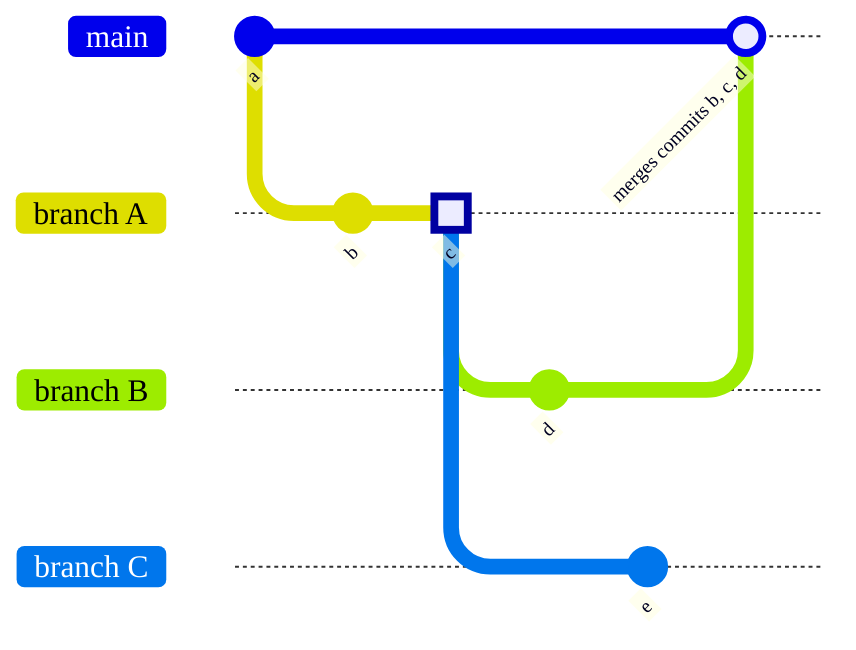



- プラン: Free、Premium、Ultimate
- 提供形態: GitLab.com、GitLab Self-Managed、GitLab Dedicated



ブランチは、チームの開発作業を整理し、分離します。複数のメンバーが異なる機能に同時に取り組む際に、ブランチによって変更が相互に競合するのを防ぎます。それぞれのブランチは、新しい機能を実装したり、バグを修正したり、アイデアを試したりできる、独立したワークスペースとして機能します。

ブランチを使用すると、チームは次のことができるようになります:

- メインコードベースを中断することなく、個別の機能に取り組む。
- プロジェクトの他の部分に影響を与える前に、提案された変更をレビューする。
- 他の作業に影響を与えることなく、問題のある変更をロールバックする。
- 制御された予測可能な方法で、本番環境に変更をデプロイする。

ブランチの開発ワークフローは次のとおりです:

1. [ブランチを作成](#create-a-branch)し、コミットを追加します。このプロセスを効率化するには、[ブランチの命名パターン](#prefix-branch-names-with-a-number)に従う必要があります。
1. 作業のレビューを行う準備ができたら、ブランチの変更のマージを提案する[マージリクエスト](../../merge_requests/_index.md)を作成します。
1. [レビューアプリ](../../../../ci/review_apps/_index.md)で変更をプレビューします。
1. [レビューをリクエスト](../../merge_requests/reviews/_index.md#request-a-review)します。
1. マージリクエストが承認されたら、ブランチをoriginブランチにマージします。[マージ方法](../../merge_requests/methods/_index.md)は、プロジェクトでのマージリクエストの処理方法を決定します。
1. ブランチの内容がマージされたら、[マージ済みブランチを削除](#delete-merged-branches)します。

## すべてのブランチを表示する {#view-all-branches}

GitLab UIでブランチを表示および管理するには、以下を実行します:

1. 左側のサイドバーで、**検索または移動先**を選択して、プロジェクトを見つけます。
1. 左側のサイドバーで、**コード** > **ブランチ**を選択します。

このページでは、以下のことができます:

- すべてのブランチを表示する、または、フィルタリングしてアクティブなブランチや古いブランチのみを表示する。

  過去3か月以内にコミットが行われた場合、ブランチはアクティブであると見なされます。それ以外の場合は、古いブランチと見なされます。

- [新しいブランチを作成](#create-a-branch)する。
- [マージ済みブランチを削除](#delete-merged-branches)する。
- デフォルトブランチを指すマージリクエストのリンクを表示する。

  デフォルトブランチを指していないマージリクエストを含むブランチには、**新しい**マージリクエストボタンが表示されます。

- [ブランチルールを表示](branch_rules.md#view-branch-rules)する。
- ブランチの最新のパイプラインの状態を表示する。

## ブランチを作成する {#create-a-branch}

前提要件:

- プロジェクトのデベロッパーロール以上が必要です。

GitLab UIから新しいブランチを作成するには、以下を実行します:

1. 左側のサイドバーで、**検索または移動先**を選択して、プロジェクトを見つけます。
1. **コード** > **ブランチ**を選択します。
1. 右上隅で、**新しいブランチ**を選択します。
1. **ブランチ名**を入力します。
1. **作成元**で、ブランチのベースを選択します。
1. **ブランチを作成**を選択します。

### 空のプロジェクトで作成する {#in-a-blank-project}

[空のプロジェクト](../../_index.md#create-a-blank-project)にはブランチが含まれていませんが、追加することができます。

前提要件:

- プロジェクトのデベロッパーロール以上が必要です。
- メンテナーまたはオーナーのロールを持っていない場合、コミットをデフォルトブランチにプッシュするには、[デフォルトブランチの保護](../../../group/manage.md#change-the-default-branch-protection-of-a-group)を`Partially protected`または`Not protected`に設定する必要があります。

[デフォルトブランチ](default.md)を空のプロジェクトに追加するには、以下を実行します:

1. 左側のサイドバーで、**検索または移動先**を選択して、プロジェクトを見つけます。
1. **このプロジェクトのリポジトリは空です**までスクロールして、追加するファイルのタイプを選択します。
1. Web IDEで、このファイルに必要な変更を加えたら、**コミットを作成**を選択します。
1. コミットメッセージを入力し、**コミット**を選択します。

GitLabはデフォルトブランチを作成し、そこにファイルを追加します。

### イシューから作成する {#from-an-issue}

イシューを表示すると、そのページから直接、関連付けられたブランチを作成できます。この方法で作成されたブランチは、変数を含む[イシューからのブランチ名のデフォルトパターン](#configure-default-pattern-for-branch-names-from-issues)を使用します。

前提要件:

- プロジェクトのデベロッパーロール以上が必要です。

イシューからブランチを作成するには、以下を実行します:

1. 左側のサイドバーで、**検索または移動先**を選択して、プロジェクトを見つけます。
1. **Plan** > **イシュー**を選択して、イシューを見つけます。
1. イシューの説明の下で、**マージリクエストを作成**を選択して、ドロップダウンリストを表示します。
1. **ブランチを作成**を選択します。
1. ダイアログで、**ソース (ブランチまたはタグ)**ドロップダウンリストから、ソースブランチまたはタグを選択します。
1. 提案されたブランチ名をレビューします。これはプロジェクトの[ブランチ名のデフォルトパターン](#configure-default-pattern-for-branch-names-from-issues)に基づいています。
1. オプション。別のブランチ名を使用する必要がある場合は、**ブランチ名**テキストボックスに入力します。
1. **ブランチを作成**を選択します。

空のリポジトリでブランチを作成する方法については、[空のリポジトリの動作](#empty-repository-behavior)を参照してください。

作成済みのブランチの名前の[プレフィックスがイシュー番号である](#prefix-branch-names-with-a-number)場合、GitLabはイシューに関連するマージリクエストをクロスリンクします。

### タスクから作成する {#from-a-task}

前提要件:

- プロジェクトのデベロッパーロール以上が必要です。

タスクから直接ブランチを作成するには、以下を実行します:

1. 左側のサイドバーで、**検索または移動先**を選択して、プロジェクトを見つけます。
1. **Plan** > **イシュー**を選択します。
1. イシューリストで、タスクを見つけます。
1. タスクの説明の下で、**マージリクエストを作成**を選択し、ドロップダウンリストを表示します。
1. **ブランチを作成**を選択します。
1. ダイアログで、**Source branch or tag**（ソース（ブランチまたはタグ））ドロップダウンリストから、ソースブランチまたはタグを選択します。
1. 提案されたブランチ名をレビューします。これはプロジェクトの[ブランチ名のデフォルトパターン](#configure-default-pattern-for-branch-names-from-issues)に基づいています。
1. オプション。別のブランチ名を使用する必要がある場合は、**ブランチ名**テキストボックスに入力します。
1. **ブランチを作成**を選択します。

空のリポジトリでブランチを作成する方法については、[空のリポジトリの動作](#empty-repository-behavior)を参照してください。

作成済みのブランチの名前の[プレフィックスがタスク番号である](#prefix-branch-names-with-a-number)場合、GitLabはイシューと関連するマージリクエストをクロスリンクします。

### 空のリポジトリの動作 {#empty-repository-behavior}

Gitリポジトリが空の場合、GitLabは以下を実行します:

- デフォルトブランチを作成します。
- 空白の`README.md`ファイルをコミットします。
- イシューのタイトルに基づいて新規のブランチを作成し、リダイレクトします。
- プロジェクトがKubernetesなどの[デプロイサービスで設定されている](../../integrations/_index.md)場合、GitLabは`.gitlab-ci.yml`ファイル作成を支援し、[自動デプロイ](../../../../topics/autodevops/stages.md#auto-deploy)を設定するよう求めるプロンプトを表示します。

## ブランチに名前を付ける {#name-your-branch}

Gitは[ブランチ名のルール](https://git-scm.com/docs/git-check-ref-format)を適用して、ブランチ名が他のツールとの互換性を維持できるようにします。GitLabはブランチ名に追加の要件を設定し、構造化されたブランチ名に対してメリットを提供します。

GitLabでは、すべてのブランチに以下の追加ルールを適用します:

- ブランチ名にはスペースを使用できません。
- 40桁の16進数のブランチ名は、Gitのコミットハッシュと似ているため禁止されています。
- ブランチ名では、大文字と小文字が区別されます。

Dockerなどの一般的なソフトウェアパッケージでは、[追加のブランチ命名制限](../../../../administration/packages/container_registry_troubleshooting.md#docker-connection-error)を適用できます。

他のソフトウェアパッケージとの最適な互換性を得るため、以下のみを使用してください:

- 数字
- ハイフン（`-`）
- アンダースコア（`_`）
- ASCII標準コード表の小文字

ブランチ名にはスラッシュ（`/`）と絵文字を使用できますが、他のソフトウェアパッケージとの互換性は保証されません。

特定のフォーマットのブランチ名を使用すると、次のような追加の利点を得られます:

- [ブランチ名のプレフィックスをイシュー番号にする](#prefix-branch-names-with-a-number)ことで、マージリクエストワークフローを効率化できます。
- ブランチ名に基づいて[ブランチ保護](protected.md)を自動化します。
- ブランチがGitLabにプッシュされる前に、[プッシュルール](../push_rules.md)でブランチ名をテストします。
- マージリクエストで実行する[CI/CDジョブ](../../../../ci/jobs/_index.md)を定義します。

### イシューからのブランチ名のデフォルトパターンを設定する {#configure-default-pattern-for-branch-names-from-issues}

デフォルトでは、GitLabはイシューからブランチを作成する場合に`%{id}-%{title}`というパターンを使用しますが、このパターンは変更できます。

前提要件:

- プロジェクトのメンテナーロール以上が必要です。

イシューから作成されたブランチのデフォルトパターンを変更するには、以下を実行します:

1. 左側のサイドバーで、**検索または移動先**を選択して、プロジェクトを見つけます。
1. **設定** > **リポジトリ**を選択します。
1. **ブランチのデフォルト**を展開します。
1. **ブランチ名のテンプレート**までスクロールし、値を入力します。このフィールドは次の変数をサポートしています:
   - `%{id}`: イシューの数値ID。
   - `%{title}`: Gitブランチ名で許容される文字のみを使用するように変更されたイシューのタイトル。
1. **変更を保存**を選択します。

### ブランチ名に番号のプレフィックスを付ける {#prefix-branch-names-with-a-number}

マージリクエストの作成を効率化するには、Gitブランチ名をイシュー番号またはタスク番号で始め、その後にハイフンを付けます。たとえば、ブランチをイシュー`#123`にリンクするには、ブランチ名を`123-`で始めます。

ブランチは、イシューまたはタスクと同じプロジェクト内に存在する必要があります。

GitLabはこの番号を使用して、マージリクエストにデータをインポートします:

- アイテムはマージリクエストに関連付けられているものとしてマークされ、相互へのリンクが表示されます。
- ブランチはイシューまたはタスクに接続されています。
- プロジェクトに[デフォルトのクローズパターン](../../issues/managing_issues.md#default-closing-pattern)が設定されている場合、マージリクエストをマージすると、関連するイシューも[クローズ](../../issues/managing_issues.md#closing-issues-automatically)されます。
- マージリクエストが同じプロジェクト内にあり、フォークしていない場合、イシューのマイルストーンとラベルがマージリクエストにコピーされます。

## ブランチを管理および保護する {#manage-and-protect-branches}

GitLabは、個々のブランチを保護するための複数の方法を提供しています。これらの方法により、ブランチを作成してから削除するまで、監視と品質チェックを受けることができます。ブランチ保護を表示および編集するには、[ブランチルール](branch_rules.md)を参照してください。

### ブランチの比較をダウンロード {#download-branch-comparisons}



- GitLab 18.3で[導入](https://gitlab.com/gitlab-org/gitlab/-/issues/217206)されました。



GitLabの外部で使用するために、ブランチ間の比較をdiffまたはパッチファイルとしてダウンロードできます。

#### 差分として {#as-a-diff}

ブランチの比較をdiffとしてダウンロードするには、比較URLに`format=diff`を追加します:

- URLにクエリパラメータがない場合は、`?format=diff`を追加します:

  ```plaintext
  https://gitlab.example.com/my-group/my-project/-/compare/main...feature-branch?format=diff
  ```

- URLにクエリパラメータが既にある場合は、`&format=diff`を追加します:

  ```plaintext
  https://gitlab.example.com/my-group/my-project/-/compare/main...feature-branch?from_project_id=2&format=diff
  ```

diffをダウンロードして適用するには、次の手順に従います:

```shell
curl "https://gitlab.example.com/my-group/my-project/-/compare/main...feature-branch?format=diff" | git apply
```

#### パッチファイルとして {#as-a-patch-file}

ブランチの比較をパッチファイルとしてダウンロードするには、比較URLに`format=patch`を追加します:

- URLにクエリパラメータがない場合は、`?format=patch`を追加します:

  ```plaintext
  https://gitlab.example.com/my-group/my-project/-/compare/main...feature-branch?format=patch
  ```

- URLにクエリパラメータが既にある場合は、`&format=patch`を追加します:

  ```plaintext
  https://gitlab.example.com/my-group/my-project/-/compare/main...feature-branch?from_project_id=2&format=patch
  ```

[`git am`](https://git-scm.com/docs/git-am)を使用してパッチをダウンロードして適用するには、次の手順に従います:

```shell
# Download and preview the patch
curl "https://gitlab.example.com/my-group/my-project/-/compare/main...feature-branch?format=patch" > changes.patch
git apply --check changes.patch

# Apply the patch
git am changes.patch
```

単一のコマンドでパッチをダウンロードして適用することもできます:

```shell
curl "https://gitlab.example.com/my-group/my-project/-/compare/main...feature-branch?format=patch" | git am
```

## マージ済みブランチを削除する {#delete-merged-branches}

マージされたブランチは、次のすべての要件を満たす場合に一括で削除できます:

- [保護ブランチ](protected.md)ではない。
- プロジェクトのデフォルトブランチにマージされている。

前提要件:

- プロジェクトのデベロッパーロール以上を持っている必要があります。

これを行うには、次の手順を実行します:

1. 左側のサイドバーで、**検索または移動先**を選択して、プロジェクトを見つけます。
1. **コード** > **ブランチ**を選択します。
1. ページの右上隅で、**More**（詳細）を選択します。
1. **マージされたブランチを削除**を選択します。
1. ダイアログで、`delete`と入力して確認し、**マージされたブランチを削除**を選択します。



ブランチを削除しても、関連するすべてのデータが完全に消去されるわけではありません。プロジェクトの履歴を維持し、リカバリープロセスをサポートするために、一部の情報が保持されます。詳細については、[機密情報を処理する](../../../../topics/git/undo.md#handle-sensitive-information)を参照してください。



## ターゲットブランチのワークフローを設定する {#configure-workflows-for-target-branches}



- プラン: Premium、Ultimate
- 提供形態: GitLab.com、GitLab Self-Managed、GitLab Dedicated





- GitLab 16.4で`target_branch_rules_flag`[フラグ](../../../../administration/feature_flags/_index.md)とともに[導入](https://gitlab.com/gitlab-org/gitlab/-/merge_requests/127115)されました。デフォルトでは有効になっています。
- GitLab 16.7で[機能フラグは削除](https://gitlab.com/gitlab-org/gitlab/-/merge_requests/136431)されました。



一部のプロジェクトでは、`develop`や`qa`など、複数の長期ブランチを開発に使用します。これらのプロジェクトでは、`main`をデフォルトのブランチとして保持し、代わりにマージリクエストのターゲットを`develop`または`qa`にすることがあります。ターゲットブランチのワークフローは、マージリクエストがプロジェクトに適した開発ブランチをターゲットとする際に役立ちます。

マージリクエストを作成すると、ワークフローはブランチの名前をチェックします。ブランチ名がワークフローと一致する場合、マージリクエストは指定されたブランチをターゲットとします。ブランチ名が一致しない場合、マージリクエストはプロジェクトのデフォルトブランチをターゲットとします。

ルールは「最初の一致」の基準で処理されます。2つのルールが同じブランチ名に一致する場合、最上位のルールが適用されます。

前提要件:

- メンテナーロール以上が必要です。

ターゲットブランチワークフローを作成するには、以下を実行します:

1. 左側のサイドバーで、**検索または移動先**を選択して、プロジェクトを見つけます。
1. **設定** > **マージリクエスト**を選択します。
1. **マージリクエストブランチのワークフロー**までスクロールします。
1. **ブランチターゲットを追加**を選択します。
1. **ブランチ名のパターン**に、ブランチ名と照合する文字列またはワイルドカードを指定します。
1. ブランチ名が**ブランチ名のパターン**と一致した場合に使用する**ターゲットブランチ**を選択します。
1. **保存**を選択します。

### ターゲットブランチワークフローの例 {#target-branch-workflow-example}

プロジェクトで、次のターゲットブランチワークフローを設定できます:

| ブランチ名のパターン   | ターゲットブランチ |
|-------------|---------------|
| `feature/*` | `develop`     |
| `bug/*`     | `develop`     |
| `release/*` | `main`        |

これらのターゲットブランチにより、次のようなプロジェクトのマージリクエストの作成プロセスを簡素化できます:

- `main`を使用して、アプリケーションのデプロイ済みの状態を表す。
- `develop`など、別の長期運用ブランチで、現在未リリースの開発作業を追跡する。

ワークフローで、新しい機能を最初に`main`ではなく`develop`に配置する場合、これらのターゲットブランチにより、`feature/*`または`bug/*`に一致するすべてのブランチが誤って`main`をターゲットにするのを防ぐことができます。

`main`にリリースする準備ができたら、`release/*`という名前のブランチを作成し、このブランチが`main`をターゲットにしていることを確認します。

### ターゲットブランチワークフローを削除する {#delete-a-target-branch-workflow}

ターゲットブランチワークフローを削除しても、既存のマージリクエストは変更されません。

前提要件:

- メンテナーロール以上が必要です。

これを行うには、以下を実行します:

1. 左側のサイドバーで、**検索または移動先**を選択して、プロジェクトを見つけます。
1. **設定** > **マージリクエスト**を選択します。
1. 削除するブランチターゲットで、**削除**を選択します。

## 関連トピック {#related-topics}

- [保護ブランチ](protected.md)
- [ブランチルール](branch_rules.md)
- [リビジョンを比較する](../compare_revisions.md)
- [マージリクエスト](../../merge_requests/changes.md)の変更
- [マージリクエストの変更をダウンロード](../../merge_requests/changes.md#download-merge-request-changes)
- [ブランチAPI](../../../../api/branches.md)
- [保護ブランチAPI](../../../../api/protected_branches.md)
- [Git入門](../../../../topics/git/_index.md)
- [ブランチの概要](https://git-scm.com/book/en/v2/Git-Branching-Branches-in-a-Nutshell)

## トラブルシューティング {#troubleshooting}

### 同じコミットを含む複数のブランチ {#multiple-branches-containing-the-same-commit}

より深い技術レベルでは、Gitブランチは個別のエンティティではなく、コミットSHAのセットにアタッチされたラベルです。GitLabは、ブランチがマージされたかどうかを判断する際に、ターゲットブランチにこれらのコミットSHAがあるかどうかを確認します。この動作は、2つのマージリクエストに同じコミットが含まれている場合に、予期せぬ結果を招く可能性があります。この例では、ブランチ`B`と`C`はどちらも、ブランチ`A`の同じコミット（`3`）から始まります:



ブランチ`B`をマージすると、ブランチ`A`からのすべてのコミットがターゲットブランチ`main`に表示されるため、（何もアクションを起こさなくても）ブランチ`A`もマージされたように見えます。コミット`5`がブランチ`A`や`B`の一部ではなかったため、ブランチ`C`はマージされていないままです。

マージリクエスト`A`は、そのブランチに新しいコミットをプッシュしようとしても、マージされたままになります。マージリクエスト`A`の変更がマージされていない場合（マージリクエスト`A`の一部ではなかったため）、その変更のために新しいマージリクエストを開いてください。

### エラー: あいまいな`HEAD`ブランチが存在します {#error-ambiguous-head-branch-exists}

Git 2.16.0より以前のバージョンでは、`HEAD`というブランチを作成することができました。この`HEAD`というブランチは、Gitがアクティブな（チェックアウトされた）ブランチを表すために使用する内部参照（これも`HEAD`という名前です）と衝突します。この命名の衝突により、リポジトリのデフォルトブランチを更新できない可能性があります:

```plaintext
Error: Could not set the default branch. Do you have a branch named 'HEAD' in your repository?
```

この問題を修正するには、以下を実行します:

1. 左側のサイドバーで、**検索または移動先**を選択して、プロジェクトを見つけます。
1. **コード** > **ブランチ**を選択します。
1. `HEAD`という名前のブランチを検索します。
1. ブランチにコミットされていない変更がないことを確認します。
1. **ブランチを削除**を選択し、**はい、ブランチを削除します**を選択します。

Gitバージョン[2.16.0以降](https://github.com/git/git/commit/a625b092cc59940521789fe8a3ff69c8d6b14eb2)では、この名前でブランチを作成することはできません。

### 作成済みのすべてのブランチを見つける {#find-all-branches-youve-authored}

プロジェクトで自分が作成したすべてのブランチを見つけるには、Gitリポジトリで次のコマンドを実行します:

```shell
git for-each-ref --format='%(authoremail) %(refname:short)' | grep $(git config --get user.email)
```

プロジェクト内のすべてのブランチを作成者別に並べ替えて取得するには、Gitリポジトリで次のコマンドを実行します:

```shell
git for-each-ref --format='%(authoremail)'  | sort | uniq -c | sort -g
```

### エラー: `Failed to create branch 4:Deadline Exceeded` {#error-failed-to-create-branch-4deadline-exceeded}

このエラーは、Gitalyのタイムアウトが原因で発生します。これは、ブランチの作成にかかる時間が、設定されたタイムアウト期間よりも長くなった場合に発生します。

この問題を解決するには、次のいずれかの方法を選択します:

- 時間のかかる[サーバーフック](../../../../administration/server_hooks.md)を無効にします。
- [Gitalyのタイムアウト](../../../../administration/settings/gitaly_timeouts.md)設定を長くします。
