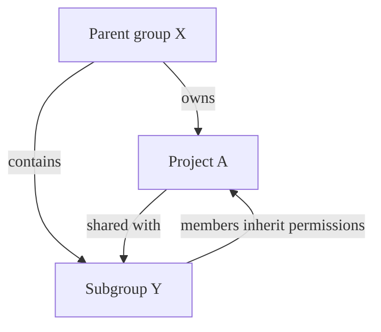
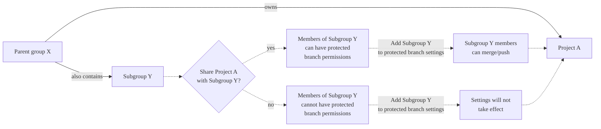



- プラン: Free、Premium、Ultimate
- 提供形態: GitLab.com、GitLab Self-Managed、GitLab Dedicated





プロジェクトの**保護ブランチ**の設定は削除されます。代わりに、**設定** > **リポジトリ** > **ブランチルール**から保護ブランチを設定します。



保護ブランチは、コードの安定性と品質を確保するために、GitLabのブランチに特定の権限を適用します。保護ブランチは次のことを行います:

- コードの変更をマージおよびプッシュできるユーザーを制御します。
- 重要なブランチが誤って削除されないようにします。
- コードレビューと承認プロセスを適用します。
- コードオーナーの承認要件を管理します。
- 強制プッシュ権限を規制して、コミット履歴を維持します。
- UIと保護ブランチAPIの両方からアクセスを制御します。



リポジトリのデフォルトブランチは、デフォルトで保護されています。デフォルトブランチの設定の詳細については、[デフォルトブランチ](default.md)を参照してください。



ブランチが複数のルールに一致する場合、または複雑な権限の要件がある場合の保護ルールの動作については、[Protection rules](protection_rules.md)を参照してください。

## ブランチを保護する {#protect-a-branch}

グループ内の個々のプロジェクトまたはすべてのプロジェクトに対して保護ブランチを設定します。

### プロジェクト内 {#in-a-project}

前提要件:

- メンテナー以上のロールを持っている必要があります。
- グループに、保護ブランチに対する**マージを許可**または**プッシュとマージを許可**権限を付与する際、プロジェクトはアクセス可能であり、グループと共有されている必要があります。詳細については、[共有プロジェクト](../../members/sharing_projects_groups.md)を参照してください。

ブランチを保護するには:

1. 左側のサイドバーで、**検索または移動先**を選択して、プロジェクトを見つけます。
1. **設定** > **リポジトリ**を選択します。
1. **ブランチルール**を展開します。
1. **ブランチルールの追加** > **ブランチ名またはパターン**を選択します。
1. ドロップダウンリストから、保護するブランチを検索して選択します。
1. **ブランチルールの作成**を選択します。**ブランチルールの詳細**ページに移動します。
1. **ブランチの保護**セクションから、次のいずれかのオプションを選択します:
   - **マージを許可**から、**編集**を選択します。
     1. このブランチにマージできるロールを選択します。
     1. **変更を保存**を選択します。
   - **プッシュとマージを許可**から、**編集**を選択します。
     1. このブランチにマージできるロールを選択します。
     1. 必要に応じて、**デプロイキー**を追加するために検索します。
     1. **変更を保存**を選択します。



GitLab PremiumおよびUltimateでは、グループまたは個々のユーザーを**マージを許可**および**プッシュとマージを許可**に追加することもできます。



### グループ内 {#in-a-group}



- プラン: Premium、Ultimate
- 提供形態: GitLab Self-Managed





- GitLab 17.6[で一般提供](https://gitlab.com/gitlab-org/gitlab/-/issues/500250)になりました。機能フラグ`group_protected_branches`は削除されました。



グループオーナーは、グループの保護ブランチを作成できます。これらの設定はグループ内のすべてのプロジェクトに継承され、プロジェクトの設定で上書きすることはできません。

前提要件:

- グループのオーナーロールを持っている必要があります。
- このグループはトップレベルグループである必要があります。サブグループはサポートされていません。

グループ内のすべてのプロジェクトに対してブランチを保護するには:

1. 左側のサイドバーで、**検索または移動先**を選択して、グループを見つけます。
1. **設定** > **リポジトリ**を選択します。
1. **保護ブランチ**を展開します。
1. **保護ブランチを追加する**を選択します。
1. **ブランチ**テキストボックスに、ブランチ名または[ワイルドカード](#use-wildcard-rules)（`*`）を入力します。ブランチ名とワイルドカードでは大文字と小文字が区別されます。
1. **マージを許可**リストから、このブランチにマージできるロールを選択します。
1. **プッシュとマージを許可**リストから、このブランチにプッシュできるロールを選択します。
1. **強制プッシュを許可**および**コードオーナーの承認が必要**の設定の優先順位を選択します。
1. **保護**を選択します。

## プッシュとマージの権限 {#push-and-merge-permissions}

**マージを許可**と**プッシュとマージを許可**の設定は、ブランチの保護のさまざまな側面を制御します:

| 設定                       | 目的                                                                                                        | デフォルトの動作(未設定) |
|-------------------------------|----------------------------------------------------------------------------------------------------------------|-----------------------------------|
| **マージを許可**          | マージリクエストを通じて変更をマージし、UIとAPIを通じて新しい保護ブランチを作成できるユーザーを制御します | **プッシュとマージを許可**を持っていない限り、誰もマージできません。 |
| **プッシュとマージを許可** | 既存の保護ブランチに直接プッシュし、マージリクエストを介してマージできるユーザーを制御します                 | 誰もプッシュできません。                  |



**プッシュとマージを許可**すると、プッシュ機能とマージ機能の両方が許可されます。この権限を持つユーザーは、**マージを許可**権限がなくても、マージリクエストを介してマージできます。



### ブランチの種類ごとの保護戦略 {#protection-strategies-by-branch-types}

ブランチの種類が異なると、その目的とセキュリティ要件に基づいて異なる保護レベルが必要になります。

本番環境にデプロイされたブランチの場合:

- **マージを許可**を**メンテナー**のみに設定します。
- **プッシュとマージを許可**を**なし**(空にしない)に設定します。
- **コードオーナーの承認が必要**を有効にします。
- 複数の承認を要求することを検討してください。

この設定では、すべての変更にメンテナーの承認を伴うマージリクエストが必要です。

アクティブな開発ブランチの場合:

- **マージを許可**を**デベロッパー + メンテナー**に設定します。
- **プッシュとマージを許可**を**なし**(空にしない)に設定します。

この設定では、デベロッパーはコードレビューを必要とするすべての変更を要求しながら、承認されたマージリクエストをマージできます。



**プッシュとマージを許可**が設定されていない場合、プッシュアクセスは制限されません。直接プッシュを禁止するには、**プッシュとマージを許可**を明示的に**なし**に設定する必要があります。



### デベロッパーロールの権限の組み合わせ {#permission-combinations-for-developer-role}

次の例は、デベロッパーロールを持つユーザーが、さまざまな保護設定で何ができるかを示しています:

| マージを許可する         | プッシュとマージを許可する | 直接プッシュ                                 | マージリクエストによるマージ |
|--------------------------|---------------------------|---------------------------------------------|------------------|
| なし                   | デベロッパー + メンテナー  | 対応 | 対応 |
| 未設定           | デベロッパー + メンテナー  | 対応 | 対応 |
| デベロッパー + メンテナー | 未設定            | 対象外          | 対応 |
| 未設定           | 未設定            | 対象外          | 対象外 |
| メンテナー:              | 未設定            | 対象外          | 対象外 |
| メンテナー:              | メンテナー:               | 対象外          | 対象外 |
| デベロッパー + メンテナー | メンテナー:               | 対象外          | 対応 |

## デフォルトのブランチ保護設定 {#default-branch-protection-settings}

管理者は、**管理者**エリアで[デフォルトのブランチ保護レベルを設定](default.md#for-all-projects-in-an-instance)できます。

## ワイルドカードルールを使用する {#use-wildcard-rules}

ワイルドカードを使用すると、複数のルールを1つのブランチに適用できます。複数のルールがブランチに適用される場合、最も寛容なルールがブランチの動作を制御します。適切にマージ制御を行うには、**マージを許可**よりも広範なユーザーセットに対して**プッシュとマージを許可**を設定します。

前提要件:

- メンテナー以上のロールを持っている必要があります。

複数のブランチを同時に保護するには:

1. 左側のサイドバーで、**検索または移動先**を選択して、プロジェクトを見つけます。
1. **設定** > **リポジトリ**を選択します。
1. **ブランチルール**を展開します。
1. **ブランチルールの追加** > **ブランチ名またはパターン**を選択します。
1. ブランチドロップダウンリストで、ブランチ名とワイルドカード (`*`) を入力します。ブランチ名とワイルドカードでは大文字と小文字が区別されます。例: 

   | ワイルドカード保護ブランチ | 一致するブランチ                                      |
   |---------------------------|--------------------------------------------------------|
   | `*-stable`                | `production-stable`、`staging-stable`                  |
   | `production/*`            | `production/app-server`、`production/load-balancer`    |
   | `*gitlab*`                | `gitlab`、`gitlab/staging`、`master/gitlab/production` |

1. **ワイルドカードの作成**を選択します。
1. **ブランチルールの作成**を選択します。**ブランチルールの詳細**ページに移動します。
1. **ブランチの保護**セクションから、次のいずれかのオプションを選択します:
   - **マージを許可**から、**編集**を選択します。
     1. このブランチにマージできるロールを選択します。
     1. **変更を保存**を選択します。
   - **プッシュとマージを許可**から、**編集**を選択します。
     1. このブランチにマージできるロールを選択します。
     1. 必要に応じて、**デプロイキー**を追加するために検索します。
     1. **変更を保存**を選択します。

## 保護オプションを設定する {#configure-protection-options}

さまざまな保護オプションを設定して、ブランチを保護することができます。

### マージリクエストを要求する {#require-merge-requests}

保護ブランチへの直接チェックインを許可するのではなく、すべてのユーザーにマージリクエストの送信を強制できます:

1. 左側のサイドバーで、**検索または移動先**を選択して、プロジェクトを見つけます。
1. **設定** > **リポジトリ**を選択します。
1. **ブランチルール**を展開します。
1. ブランチの横にある**詳細を表示**を選択します。
1. **マージを許可**セクションで、**編集**を選択します
1. **デベロッパー + メンテナー**を選択します。
1. **変更を保存**を選択します。
1. **プッシュとマージを許可**セクションで、**なし**を選択します。
1. **変更を保存**を選択します。

### 直接プッシュを許可する {#allow-direct-push}

書き込みアクセス権を持つ全員が保護ブランチに直接プッシュできるようにすることができます。

1. 左側のサイドバーで、**検索または移動先**を選択して、プロジェクトを見つけます。
1. **設定** > **リポジトリ**を選択します。
1. **ブランチルール**を展開します。
1. ブランチの横にある**詳細を表示**を選択します。
1. **プッシュとマージを許可**セクションで、**デベロッパー + メンテナー**を選択します。
1. **変更を保存**を選択します。

### グループ権限を使用する {#with-group-permissions}

保護ブランチに対してグループまたはサブグループのメンバーを**マージを許可**または**プッシュとマージを許可**として設定するには:

1. 左側のサイドバーで、**検索または移動先**を選択して、プロジェクトを見つけます。
1. **設定** > **リポジトリ**を選択します。
1. **ブランチルール**を展開します。
1. ブランチの横にある**詳細を表示**を選択します。
1. **マージを許可**または**プッシュとマージを許可**セクションで、**編集**を選択します。
1. **グループ**の下で、グループを追加するために検索します。例: 

   ```plaintext
   # Allow group members to merge into this branch
   Allowed to merge: @group-x

   # Allow group members to push and merge into this branch
   Allowed to push and merge: @group-x/subgroup-y
   ```

1. **変更を保存**を選択します。



グループを保護ブランチに割り当てる場合、そのグループの直接メンバーのみが含まれます。親グループのメンバーに保護ブランチへの権限が自動的に付与されることはありません。



#### グループの継承要件 {#group-inheritance-requirements}



この例では、次のようになります:

- 親グループX（`group-x`）はプロジェクトAを所有しています。
- 親グループXには、サブグループ、サブグループY（`group-x/subgroup-y`）も含まれています。
- プロジェクトAはサブグループYと共有されています。

保護ブランチ権限の対象となるグループは、次のようになります:

- プロジェクトA: グループXとサブグループYの両方（プロジェクトAがサブグループYと共有されているため）。

#### グループとプロジェクトを共有する {#share-projects-with-groups}

プロジェクトをグループまたはサブグループと共有して、そのメンバーを保護ブランチ権限の対象にできます。



プロジェクトAのサブグループYメンバーにアクセス権を付与するには、プロジェクトをサブグループと共有する必要があります。サブグループを保護ブランチ設定に直接追加しても効果はなく、サブグループメンバーには適用されません。



グループに保護ブランチ権限を持たせるには、プロジェクトをグループと直接共有する必要があります。親グループから継承されたプロジェクトメンバーシップは、保護ブランチ権限に対して不十分です。



### デプロイキーアクセスを有効にする {#enable-deploy-key-access}

[デプロイキー](../../deploy_keys/_index.md)を使用して保護ブランチにプッシュできます。

前提要件:

- デプロイキーがプロジェクトに対して有効である必要があります。プロジェクトのデプロイキーは、作成時にデフォルトで有効になっています。ただし、パブリックデプロイキーにプロジェクトへのアクセス権が付与されている必要があります。
- デプロイキーには、プロジェクトリポジトリへの書き込みアクセス権が必要です。
- デプロイキーのオーナーは、プロジェクトへの読み取りアクセス権以上を持っている必要があります。
- デプロイキーのオーナーはプロジェクトのメンバーでもある必要があります。

デプロイキーが保護ブランチにプッシュできるようにするには:

1. 左側のサイドバーで、**検索または移動先**を選択して、プロジェクトを見つけます。
1. **設定** > **リポジトリ**を選択します。
1. **ブランチルール**を展開します。
1. ブランチの横にある**詳細を表示**を選択します。
1. **編集**セクションで、**プッシュとマージを許可**を選択します。
1. **デプロイキー**で、デプロイキーを追加するために検索します。
1. **変更を保存**を選択します。

デプロイキーは、**マージを許可**ドロップダウンリストにありません。

### 強制プッシュを許可する {#allow-force-push}

保護ブランチへの[強制プッシュ](../../../../topics/git/git_rebase.md#force-push-to-a-remote-branch)を許可できます。

新しいブランチを保護して、強制プッシュを有効にするには:

1. 左側のサイドバーで、**検索または移動先**を選択して、プロジェクトを見つけます。
1. **設定** > **リポジトリ**を選択します。
1. **ブランチルール**を展開します。
1. **ブランチルールの追加** > **ブランチ名またはパターン**を選択します。
1. ドロップダウンリストから、保護して強制プッシュを有効にするブランチを検索して選択します。
1. **ブランチルールの作成**を選択します。**ブランチルールの詳細**ページに移動します。
1. **プッシュとマージを許可**セクションと**マージを許可**セクションで、必要な設定を選択します。
1. **変更を保存**を選択します。
1. プッシュアクセスを持つすべてのユーザーに強制プッシュを許可するには、**強制プッシュを許可**切替をオンにします。

すでに保護されているブランチで強制プッシュを有効にするには、次の手順に従います:

1. 左側のサイドバーで、**検索または移動先**を選択して、プロジェクトを見つけます。
1. **設定** > **リポジトリ**を選択します。
1. **ブランチルール**を展開します。
1. ブランチの横にある**詳細を表示**を選択します。
1. **強制プッシュを許可**の切替をオンにします。

### コードオーナー承認を要求する {#require-code-owner-approval}



- プラン: Premium、Ultimate
- 提供形態: GitLab.com、GitLab Self-Managed、GitLab Dedicated



保護ブランチの場合、[コードオーナー](../../codeowners/_index.md)による承認を少なくとも1つ要求できます。ブランチが複数のルールで保護されている場合、いずれかの該当するルールで**Required approval from code owners**（コードオーナー）の承認が必要になっていると、コードオーナーの承認が必要になります。

新しいブランチを保護して、コードオーナーの承認を有効にするには:

1. 左側のサイドバーで、**検索または移動先**を選択して、プロジェクトを見つけます。
1. **設定** > **リポジトリ**を選択します。
1. **ブランチルール**を展開します。
1. **ブランチルールの追加** > **ブランチ名またはパターン**を選択します。
1. ドロップダウンリストから、保護して強制プッシュを有効にするブランチを検索して選択します。
1. **ブランチルールの作成**を選択します。**ブランチルールの詳細**ページに移動します。
1. **プッシュとマージを許可**セクションと**マージを許可**セクションで、必要な設定を選択します。
1. **変更を保存**を選択します。
1. **コードオーナーの承認が必要**切替をオンにします。

すでに保護されているブランチでコードオーナーの承認を有効にするには:

1. 左側のサイドバーで、**検索または移動先**を選択して、プロジェクトを見つけます。
1. **設定** > **リポジトリ**を選択します。
1. **ブランチルール**を展開します。
1. ブランチの横にある**詳細を表示**を選択します。
1. **コードオーナーの承認**の切替をオンにします。

有効にすると、これらのブランチに対するすべてのマージリクエストで、マージされる前に、一致するルールごとにコードオーナーによる承認が必要になります。さらに、ルールが一致した場合、保護ブランチへの直接プッシュは拒否されます。

`CODEOWNERS`ファイルで指定されていないユーザーは、特に許可されていない限り、指定されたファイルまたはパスの変更をプッシュできません。デベロッパーが保護ブランチに直接プッシュすることを制限する必要はありません。代わりに、コードオーナーによるレビューが必要な特定のファイルへのプッシュは制限できます。

保護ブランチへのプッシュを許可されているユーザーとグループにフィーチャーブランチをマージするためのマージリクエストは不要です。したがって、マージリクエストの承認ルール（コードオーナーを含む）をスキップできます。

### ブランチの保護を解除できるユーザーの制御 {#control-who-can-unprotect-branches}



- プラン: Premium、Ultimate
- 提供形態: GitLab.com、GitLab Self-Managed、GitLab Dedicated



ブランチを保護するときに、後でその保護を解除できるユーザーも制御できます。デフォルトでは、少なくともメンテナーロールを持つユーザーは、保護ブランチの保護を解除できます。

規制またはコンプライアンス要件のある組織の場合は、これらの権限を特定のユーザー、グループ、またはアクセスレベルに制限できます。



ブランチの保護設定が永続的にロックされないようにするには、少なくとも1人のユーザーまたはグループが、常にブランチの保護解除権限を保持していることを確認してください。

ユーザーは、ブランチ自体の保護を解除できない限り、保護ブランチの設定を作成、変更、または削除できません。この安全メカニズムは、設定エラーを防ぐために導入されています。



これらの権限は、APIでのみ設定できます。この機能は、以下に使用します:

- 規制コンプライアンス: 許可された担当者のみがブランチ保護を変更できることを確認します。
- 大規模な組織: 複数のリポジトリにわたる保護の誤った削除を防ぎます。
- 自動ガバナンス: 開発チームがオーバーライドできない管理者専用の保護を作成するスクリプトを有効にします。

#### 保護解除権限 {#unprotect-permissions}

次の表は、設定に基づいて、誰がブランチの保護を解除できるかを示しています:

| 設定                     | 保護を解除できるユーザー |
|-----------------------------------|-------------------|
| デフォルトの動作                  | 少なくともメンテナーロールを持つユーザー |
| 特定のユーザーが設定されている         | 指定されたユーザーのみ |
| 特定のグループが設定されている        | 指定されたグループのメンバーのみ |
| 複数のアクセスレベルが設定されている | 設定されたアクセスレベルからの任意のユーザー、グループ、またはロール |

## 保護ブランチでのCI/CD {#cicd-on-protected-branches}

保護ブランチへのマージまたはプッシュの権限により、ユーザーがCI/CDパイプラインを実行し、ジョブでアクションを実行できるかどうかが定義されます。

マージリクエストパイプラインは、ソースブランチ、またはソースブランチに基づくマージリクエスト参照で実行されます。ユーザーがソースブランチにマージまたはプッシュする権限を持っていない場合、パイプラインは作成されません。

マージリクエストが保護ブランチ間にある場合、ユーザーがソースブランチとターゲットブランチの両方を更新する権限を持っている場合、保護された変数とRunnerはパイプラインで使用できます。詳細については、[保護された変数とRunnerへのアクセス制御](../../../../ci/pipelines/merge_request_pipelines.md#control-access-to-protected-variables-and-runners)を参照してください。

## 保護ブランチを作成する {#create-protected-branches}

前提要件:

- 少なくともデベロッパーロールが必要です。
- 保護ブランチを作成するには、[保護ブランチにマージリクエストを送信することを全員に要求する](#require-merge-requests)ようにブランチ保護を設定する必要があります。

保護付きの新しいブランチを作成するには、次の手順に従います:

1. 左側のサイドバーで、**検索または移動先**を選択して、プロジェクトを見つけます。
1. **コード** > **ブランチ**を選択します。
1. **新しいブランチ**を選択します。
1. ブランチ名を入力し、新しいブランチのベースにする既存のブランチ、タグ、またはコミットを選択します。保護ブランチに対して全員にマージリクエストの送信を要求する場合、既存の保護ブランチと、すでに保護ブランチにあるコミットのみが受け入れられます。

ブランチAPIを使用して、保護されたブランチを作成することもできます。

ブランチ保護が[全員が保護ブランチに直接プッシュできるように](#allow-direct-push)設定されている場合、コマンドラインまたはGitクライアントアプリケーションから保護されたブランチを作成することもできます。

## 保護ブランチを削除する {#delete-protected-branches}

メンテナー以上のロールを持つユーザーは、GitLabのWebインターフェースを使用して、保護ブランチを手動で削除できます:

1. 左側のサイドバーで、**検索または移動先**を選択して、プロジェクトを見つけます。
1. **コード** > **ブランチ**を選択します。
1. 削除するブランチの横にある**追加のアクション** () を選択します。
1. **保護ブランチを削除**を選択します。
1. 確認ダイアログでブランチ名を入力し、**はい、保護ブランチを削除します**を選択します。ブランチ名では、大文字と小文字が区別されます。

保護ブランチは、GitLab UIまたはAPIでのみ削除できます。ローカルのGitコマンドまたはサードパーティのGitクライアントで保護ブランチを削除することはできません。

## ポリシーの実施 {#policy-enforcement}

セキュリティとコンプライアンスのために、[マージリクエスト承認ポリシー](../../../application_security/policies/merge_request_approval_policies.md#approval_settings)を実装する場合があります。この場合、インスタンス、グループ、またはプロジェクトで別途定義されている設定に影響を与える可能性があります。ポリシーは、ユーザーがブランチの保護を解除したり、ブランチを削除したり、プッシュまたは強制プッシュを行ったりすることの可否に影響を与える場合があります。

## 関連トピック {#related-topics}

- [保護ルールと権限](protection_rules.md)
- [保護ブランチAPI](../../../../api/protected_branches.md)
- [ブランチ](_index.md)
- [ブランチAPI](../../../../api/branches.md)
- [コミットAPI](../../../../api/commits.md)
- [コードオーナー](../../codeowners/_index.md#code-owners-and-protected-branches)

## トラブルシューティング {#troubleshooting}

### ブランチ名では大文字と小文字が区別される {#branch-names-are-case-sensitive}

`git`のブランチ名では大文字と小文字が区別されます。保護ブランチまたは[ターゲットブランチのワークフロー](_index.md#configure-workflows-for-target-branches)を設定する場合、`dev`は`DEV`または`Dev`と同じではありません。
