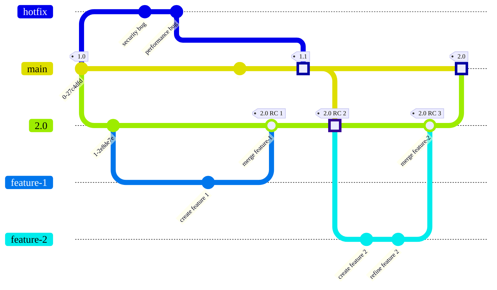

Gitブランチを整理してマージする方法は、ブランチ戦略と呼ばれます。多くのチームにとって、最もシンプルなアプローチが合理的かつ効果的です:

1. フィーチャーブランチで変更を加えます。
1. フィーチャーブランチを`main`に直接マージします。

ただし、チームに複雑なニーズ（テストやコンプライアンス要件など）がある場合は、別のブランチ戦略を検討することをお勧めします。

利用可能なより一般的な戦略をいくつか解明したいと思います。誰もがGit（またはバージョン管理された）の専門家を抱えているわけではありません。チームがGitのスキルセットの限界で作業していることがわかっている場合は、この情報が役に立ちます。

GitLabを使用して複数の異なるツールを置き換える場合、Gitのブランチ戦略について行う決定が重要になります。慎重に計画することで、次の間の明確なつながりを確立できます:

- 受け取る初期のバグレポート。
- チームがこれらのバグを修正するために行うコミット。
- これらの修正を他のバージョンまたは顧客にバックポートするプロセス。
- これらの修正をユーザーが利用できるようにするデプロイ。

慎重な選択は、GitLabの単一データストアを最大限に活用するのに役立ちます。

## より複雑なGitブランチ戦略が必要ですか？ {#do-i-need-a-more-complex-git-branching-strategy}

現在のGitブランチ戦略が時代遅れになっている可能性があります:

- 継続的デリバリーを使用している。
- 重要な自動テストがある。
- 他の顧客に影響を与えることなく、1人の顧客の重大なバグを修正する必要がある。
- 製品の複数の履歴バージョンを維持している。
- 製品が複数のオペレーティングシステムまたはプラットフォームをサポートしているため、単一の本番環境のブランチがない。
- 製品のバージョンごとに異なるデプロイまたは認定要件がある。

製品に必要なものよりも複雑な戦略を実装しないでください。

### プロジェクトを複数のリポジトリに分割するタイミング {#when-to-split-a-project-into-multiple-repositories}

複雑なブランチ構造を持つ1つのGitリポジトリを維持する必要がありますか、それともプロジェクトを複数のリポジトリに分割する必要がありますか？正解は1つではありません。サポートする人材と専門知識があるかどうかによって異なります。

GitLabは、リポジトリが単一の製品を対象としていることを前提とする自動化を提供しますが、その製品には複数のバージョンが含まれている場合があります。複数のリポジトリを持つ必要があるか、複雑なリポジトリを1つ持つ必要があるかを判断するには、次の質問をします:

- 同じ製品ですか？
- すべての要素が同じビルドプロセスを使用しますか？
- 基盤となるコードは類似していますか、それとも同じですか？

（複雑な単一のリポジトリ、またはより小さいリポジトリのセットのいずれか）を選択した内容に関係なく、メンテナンスにエンジニアリング時間を費やす必要があると考えてください。実行する準備ができているエンジニアリング作業のタイプを特定します:

- 単一のリポジトリで複数の製品のコードを維持する場合は、後でGitLabのすべての機能を使用するためのカスタマイズ作業を計画してください。
- 複数のリポジトリにわたる作業のマージは、同じリポジトリ内のブランチをマージするよりも複雑です。カスタムリリースプロセスをビルドし、リポジトリ全体のコードのフローを管理するためのエンジニアリング時間を計画します。

組織が大規模なモノレポまたはメガレポを使用している場合、GitLabの[プロフェッショナルサービス](https://about.gitlab.com/services/)チームが、ニーズに合ったカスタムブランチソリューションの構築を支援します。

## ブランチ戦略の主な種類 {#major-types-of-branching-strategies}

ブランチとコード管理戦略は、製品のニーズによって異なります。既存の戦略ですべてを網羅できるわけではありませんが、主要なカテゴリをいくつか特定しました:

- [Webサービス](#web-services)
- [長期リリースブランチ](#long-lived-release-branches)
- [環境ごとのブランチ](#branch-per-environment)

### Webサービス {#web-services}

この戦略は、標準のGitプラクティスに従います。`main`ブランチは本番環境のブランチであり、単一のWebサービスに最適です。標準的な本番環境バージョンが1つあり、以前のリビジョンはサポートされていません。

この設定では、[`git-flow`](https://nvie.com/posts/a-successful-git-branching-model/)がおそらく最適でしょう。標準化されており、何もメンテナンスする必要はありません。

この例では、`feature-1`は`main`から直接ブランチ化します。完了すると、`feature-1`が`main`に直接マージされます。このマージコミットは四角で強調表示されています。`feature-2`のようなより長期間存続するブランチは、開発の一環として、`main`からの最新の更新を定期的にマージする場合があります。完了すると、`feature-2`が`main`にマージされ、リリース`1.1`がカットされます:

### 長期リリースブランチ {#long-lived-release-branches}

このブランチ戦略は、製品に`main`から長期間分離しておく必要のあるブランチがある場合に適しています。いくつかの例を次に示します:

- 同じソフトウェアパッケージの複数の本番環境バージョン。たとえば、現在のバージョンとレガシーバージョン。現在のバージョンはフィーチャーアップデートとホットフィックスを受け取り、以前のバージョンはホットフィックスとセキュリティリリースのみを受け取ります。
- 現在の本番環境バージョンと長期ベータバージョン。主要なソフトウェア依存関係（ソフトウェア開発キット、またはSDKなど）が破壊的な変更を導入している場合は、このアプローチが必要になる場合があります。現在の本番環境バージョンは、フィーチャーアップデートとホットフィックスを受け取ります。ベータバージョンは、チームが今後のSDK変更のサポートをビルドしている間、これらのフィーチャーアップデートとホットフィックスを受け取ります。

長期ブランチをロックする場合は、ホットフィックスプロセスを定義し、それを強制することが重要です。定義されておらず、強制されていない場合、すべての変更がホットフィックスになります。

この例では、`2.0`ブランチは、`1.0`リリースの`main`のコミットから作成されます。フィーチャーは`2.0`ブランチからブランチ化し、`2.0`にマージバックします。同時に、ホットフィックスブランチは、`main`の最新リリース（`1.0`）に基づいており、リリース`1.1`として`main`にマージされます。次に、`2.0`ブランチは、リリース`1.1`からの変更をプルし、`2.0`の開発の一部としてそれらを組み込みます。別のフィーチャー（`feature-2`）を追加すると、`2.0`ブランチは本番環境の準備が整います。これは`main`にマージされ、リリース`2.0`がカットされます:

#### SVNブランチ戦略からの移行 {#migrate-from-svn-branching-strategies}

SVNからGitに移行するレガシープロジェクトは、ブランチアプローチを見直す必要があります。GitのSVN中心のブランチアプローチの中には、GitLabを最大限に活用できなくなるものがあります。再検討するいくつかのワークフロー:

- `main`から長期ブランチ（`1.0`など）を作成し、次に`1.0`ブランチをロックして、事前承認済みのホットフィックスではない変更をブロックします。
  - GitはSVNよりもマージコンフリクトを適切に処理します。
  - 契約上の義務で使用する必要がある場合を除き、長期ブランチの作成は避けてください。Gitはコンフリクトを適切に処理しますが、長期間存続するブランチでは、複数のブランチへの修正をマージする時間を費やす必要があります。
- 製品が機能フラグをサポートしていないため、ブランチを使用します。

### 環境ごとのブランチ {#branch-per-environment}

このブランチ戦略は、異なるチームによってビルドされた複数の相互依存サービスを持つ組織で一般的です。これは、ウォーターフォールまたはVモデル開発プロセスでよく使用されます。

この例では、`v1.1 RC1`とマークされたコミットが、バージョン`1.1`のリリース候補として識別されます。フィーチャーは`main`からブランチ化して戻り、リリース候補コミットは`test`環境と`UAT`環境でテストされます。このプロセスは、リリースと見なされる各コミットに対して繰り返されます:

## 関連トピック {#related-topics}

- [保護ブランチ](../protected.md)
- [マージリクエストの承認](../../../merge_requests/approvals/_index.md)
- [マージされた結果のテスト](../../../../../ci/pipelines/merged_results_pipelines.md)
