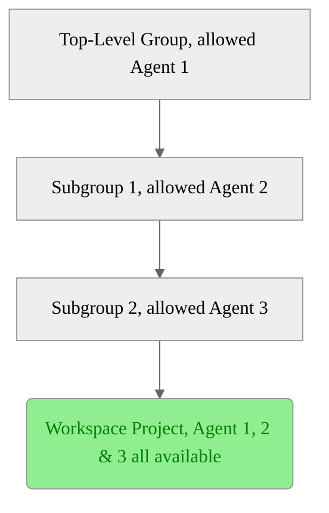



- プラン: Premium、Ultimate
- 提供形態: GitLab.com、GitLab Self-Managed、GitLab Dedicated





- 機能フラグ`remote_development_feature_flag`は、GitLab 16.0の[GitLab.comとGitLab Self-Managedで有効になりました](https://gitlab.com/gitlab-org/gitlab/-/issues/391543)。
- GitLab 16.7で[一般提供](https://gitlab.com/gitlab-org/gitlab/-/merge_requests/136744)になりました。機能フラグ`remote_development_feature_flag`は削除されました。



[ワークスペースインフラストラクチャをセットアップ](configuration.md#set-up-workspace-infrastructure)する際に、ワークスペースをサポートするようにKubernetes向けGitLabエージェントを設定する必要があります。このガイドでは、KubernetesクラスタにGitLabエージェントが既にインストールされていることを前提としています。

前提要件: 

- [チュートリアルで設定手順を完了する必要があります: Kubernetes向けGitLabエージェントをセットアップする](set_up_gitlab_agent_and_proxies.md)。
- エージェントの設定で`remote_development`モジュールが有効になっている必要があり、このモジュールの必要なフィールドが正しく設定されている必要があります。

  

  アクティブなワークスペースを持つエージェントで`remote_development`モジュールを無効にすると、それらのワークスペースは使用できなくなります。詳細については、[ワークスペースの設定](settings.md#enabled)を参照してください。

  
- ワークスペースを作成する目的で、エージェントがグループ内で許可されている必要があります。ワークスペースの作成中に、ユーザーはワークスペースプロジェクトの親グループに関連付けられている許可されたエージェントを選択できます。
- ワークスペースの作成者は、エージェントのプロジェクトに対するデベロッパーロールを持っている必要があります。

## ワークスペース作成のためのグループ内のエージェント認可 {#agent-authorization-in-a-group-for-creating-workspaces}



- 新しい認可戦略がGitLab 17.2で[導入](https://gitlab.com/groups/gitlab-org/-/epics/14025)されました。



新しい認可戦略は、[レガシー認可戦略](#legacy-agent-authorization-strategy)を置き換えます。グループのオーナーと管理者は、どのクラスタエージェントが自分のグループでワークスペースをホストするかを制御できます。

たとえば、ワークスペースプロジェクトへのパスが`top-level-group/subgroup-1/subgroup-2/workspace-project`の場合、`top-level-group`、`subgroup-1`、または`subgroup-2`グループのいずれかに設定されたエージェントを使用できます。

特定のグループ（たとえば、`subgroup-1`）に対してクラスタエージェントを許可すると、そのグループ内のすべてのプロジェクトでワークスペースを作成できるようになります。許可されたグループのスコープを慎重に検討してください。クラスタエージェントがワークスペースをホストできる場所が決定されるためです。

## グループ内のワークスペースに対するクラスタエージェントの許可 {#allow-a-cluster-agent-for-workspaces-in-a-group}

前提要件: 

- [ワークスペースのインフラストラクチャをセットアップ](configuration.md#set-up-workspace-infrastructure)する必要があります。
- インスタンスまたはグループのオーナーロールに対する管理者アクセス権が必要です。

グループ内のワークスペースに対してクラスタエージェントを許可するには:

1. 左側のサイドバーで、**検索または移動先**を選択して、グループを見つけます。
1. 左側のサイドバーで、**設定** > **ワークスペース**を選択します。
1. **グループエージェント**セクションで、**すべてのエージェント**タブを選択します。
1. 利用可能なエージェントのリストから、ステータスが**ブロック済み**のエージェントを見つけ、**許可**を選択します。
1. 確認ダイアログで、**エージェントを許可する**を選択します。

GitLabは、選択したエージェントのステータスを**許可**に更新し、**許可済みのエージェント**タブにエージェントを表示します。

## グループ内のワークスペースに対する許可されたクラスタエージェントを削除する {#remove-an-allowed-cluster-agent-for-workspaces-in-a-group}

前提要件: 

- [ワークスペースのインフラストラクチャをセットアップ](configuration.md#set-up-workspace-infrastructure)する必要があります。
- インスタンスまたはグループのオーナーロールに対する管理者アクセス権が必要です。

グループから許可されたクラスタエージェントを削除するには:

1. 左側のサイドバーで、**検索または移動先**を選択して、グループを見つけます。
1. 左側のサイドバーで、**設定** > **ワークスペース**を選択します。
1. **グループエージェント**セクションで、**許可済みのエージェント**タブを選択します。
1. 許可されたエージェントのリストから、削除するエージェントを見つけ、**ブロック**を選択します。
1. 確認ダイアログで、**エージェントをブロックする**を選択します。

GitLabは、選択したエージェントのステータスを**ブロック済み**に更新し、**許可済みのエージェント**タブからエージェントを削除します。



許可されたクラスタエージェントをグループから削除しても、エージェントを使用するワークスペースの実行はすぐに停止しません。ワークスペースの実行は、自動的に終了するか、手動で停止すると停止します。



## インスタンス上のワークスペースに対するクラスタエージェントの許可 {#allow-a-cluster-agent-for-workspaces-on-the-instance}



- GitLab 18.2で[導入](https://gitlab.com/gitlab-org/gitlab/-/issues/548951)されました。



前提要件:

- [ワークスペースのインフラストラクチャをセットアップ](configuration.md#set-up-workspace-infrastructure)する必要があります。
- [リモート開発が有効](settings.md#enabled)になっているエージェントが必要です。
- インスタンスへの管理者アクセス権が必要です。

インスタンス上のワークスペースに対するクラスタエージェントを許可するには:

1. 左側のサイドバーの下部で、**管理者**を選択します。
1. 左側のサイドバーで、**設定** > **一般**を選択します。
1. **ワークスペースの利用可能なエージェント**を展開する。
1. ワークスペースが有効になっているエージェントのリストから、許可するエージェントを見つけ、可用性の切替を選択します。

## インスタンス上のワークスペースに対する許可されたクラスタエージェントを削除する {#remove-an-allowed-cluster-agent-for-workspaces-on-the-instance}



- GitLab 18.2で[導入](https://gitlab.com/gitlab-org/gitlab/-/issues/548951)されました。



前提要件: 

- インスタンスへの管理者アクセス権が必要です。

インスタンスから許可されたクラスタエージェントを削除するには:

1. 左側のサイドバーの下部で、**管理者**を選択します。
1. 左側のサイドバーで、**設定** > **一般**を選択します。
1. **ワークスペースの利用可能なエージェント**を展開する。
1. 許可されたエージェントのリストから、削除するエージェントを見つけ、可用性の切替をクリアします。



インスタンスから許可されたクラスタエージェントを削除しても、エージェントを使用するワークスペースの実行はすぐに停止しません。ワークスペースの実行は、自動的に終了するか、手動で停止すると停止します。



## レガシーエージェント認可戦略 {#legacy-agent-authorization-strategy}

GitLab 17.1以前では、グループ内のエージェントの可用性は、ワークスペースを作成するための前提条件ではありませんでした。次の両方が当てはまる場合、ワークスペースプロジェクトのトップレベルグループ内のエージェントを使用してワークスペースを作成できます:

- リモート開発モジュールが有効になっています。
- トップレベルグループのデベロッパーロールが少なくとも必要です。

たとえば、ワークスペースプロジェクトへのパスが`top-level-group/subgroup-1/subgroup-2/workspace-project`の場合、`top-level-group`およびそのサブグループのいずれかで設定されたエージェントを使用できます。

## リモート開発でのユーザーアクセス設定 {#configuring-user-access-with-remote-development}

GitLabの認証情報を使用して接続されたKubernetesクラスタにアクセスするように、`user_access`モジュールを設定できます。このモジュールは、`remote_development`モジュールとは独立して設定および実行されます。

同じエージェントで`user_access`と`remote_development`の両方を設定する場合は注意してください。`remote_development`クラスタは、パーソナルアクセストークンなどのユーザー認証情報をKubernetes Secretsとして管理します。`user_access`の設定ミスにより、このプライベートデータがKubernetes API経由でアクセス可能になる可能性があります。

`user_access`の設定の詳細については、[Kubernetesアクセスを設定する](../clusters/agent/user_access.md#configure-kubernetes-access)を参照してください。

## 関連トピック {#related-topics}

- [チュートリアル: Kubernetes向けGitLabのセットアップ](set_up_gitlab_agent_and_proxies.md)
- [ワークスペースの設定](settings.md)
- [ワークスペース設定](configuration.md)
- [ワークスペースのトラブルシューティング](workspaces_troubleshooting.md)
