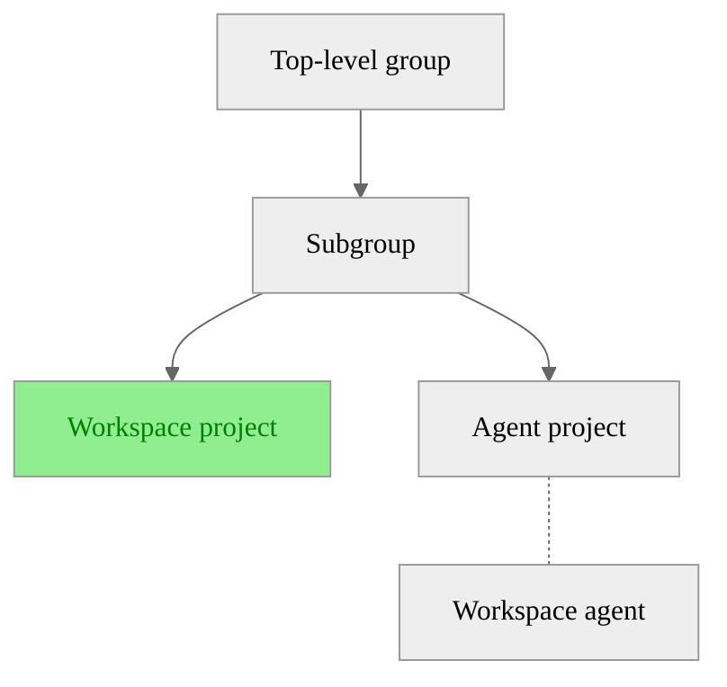

<!-- vale gitlab_base.FutureTense = NO -->

このチュートリアルでは、次の方法について説明します:

- [Kubernetes向けGitLabエージェント](../clusters/agent/_index.md)を設定して、ユーザーがプロジェクトでワークスペースを作成および管理できるようにします。
- 認証と認証を行うためにGitLabワークスペースプロキシを設定します。[ワークスペース](_index.md)をクラスターに作成します。



ワークスペースをサポートするためにKubernetes向けGitLabエージェントを設定する前に、このチュートリアルの設定手順を完了する必要があります。チュートリアルを完了したら、[Kubernetes configuration向けGitLabエージェント](gitlab_agent_configuration.md)を使用してエージェントを設定します。



## はじめる前 {#before-you-begin}

このチュートリアルを開始する前に、以下が必要です:

- GitLabインスタンスへの管理者アクセス権、またはグループのオーナーロール。
- 実行中のKubernetesクラスター。
- ローカルマシンの`helm` 3.11.0以降および`kubectl`。
- DNSプロバイダーでワイルドカードドメインを設定するアクセス権。たとえば、`*.workspaces.example.dev`はワークスペースアクセスに必要です。

このチュートリアルでは、次の階層が使用されます:



## Ingressコントローラーをインストールする {#install-an-ingress-controller}

外部トラフィックをワークスペースにルーティングするために、Kubernetesクラスターに任意の[Ingress controller](https://kubernetes.io/docs/concepts/services-networking/ingress-controllers/)をインストールします。Ingressコントローラーは、WebSocketsをサポートしている必要があります。次の例では、[Ingress NGINXコントローラー](https://github.com/kubernetes/ingress-nginx)を使用します。

1. Kubernetesクラスターに、Ingressコントローラーをインストールします。

   ```shell
   helm repo add ingress-nginx https://kubernetes.github.io/ingress-nginx
   helm repo update
   helm install ingress-nginx ingress-nginx/ingress-nginx \
     --namespace gitlab-ingress-controller \
     --create-namespace
   ```

1. ロードバランサーの外部IPアドレスを取得します。これは、[DNSレコード](#update-your-dns-records)を更新するときに必要になります。

   ```shell
   kubectl get svc -n gitlab-ingress-controller ingress-nginx-controller
   ```

## Kubernetes向けGitLab agentをインストールします {#install-the-gitlab-agent-for-kubernetes}

クラスターをGitLabに接続するために、Kubernetesクラスターに[Kubernetes向けGitLabエージェント](../clusters/agent/_index.md#kubernetes-integration-glossary)をインストールします:

1. [Kubernetes用エージェントのインストール](../clusters/agent/install/_index.md)で、いずれかのインストールオプションを完了します。
1. 設定した`agentName`をメモしておきます。これは、ワークスペースのエージェントを設定するときに必要になります。

## Kubernetes向けGitLabエージェントサーバー（KAS）をインストールする {#install-the-gitlab-agent-server-for-kubernetes}

Kubernetes（KAS）向けGitLabエージェントサーバーは、クラスター内のエージェントと通信するコンポーネントです。

- GitLab.comでは、エージェントサーバーは`wss://kas.gitlab.com`がデフォルトで利用できます。
- GitLabセルフマネージドでは、管理者が[Kubernetesエージェントサーバー（KAS）をセットアップ](../../administration/clusters/kas.md)する必要があります。その後、`wss://gitlab.example.com/-/kubernetes-agent/`で使用できるようになります。

## Kubernetes向けGitLab agentを設定します {#configure-the-gitlab-agent-for-kubernetes}

エージェントプロジェクトで`remote_development`モジュールを設定するには:

1. 左側のサイドバーで、**検索または移動先**を選択して、プロジェクトを見つけます。
1. プロジェクトで、`.gitlab/agents/<agentName>/config.yaml`ファイルを作成します。`agentName`は、ワークスペースインフラストラクチャをセットアップしたときに構成したエージェントの名前です。
1. `config.yaml`で、ワークスペース設定に次の設定を使用します:

   ```yaml
   remote_development:
     enabled: true
     dns_zone: "<workspaces.example.dev>" # DNS zone of the URL where workspaces are available
   ```

設定オプションの完全なリストについては、ワークスペースの[設定リファレンス](settings.md#configuration-reference)を参照してください。



Kubernetes向けGitLabエージェントは1つのプロジェクトで設定されていますが、他のプロジェクトワークスペースで使用できます。プロジェクトごとに個別のエージェントは必要ありません。

設定されたエージェントは、[グループでエージェントを許可する](#allow-the-gitlab-agent-for-kubernetes-in-your-group)まで表示されません。



## グループでKubernetes向けGitLabエージェントを許可する {#allow-the-gitlab-agent-for-kubernetes-in-your-group}

グループでエージェントを許可すると、グループ、そのサブグループ、およびそれらのグループ内のすべてのプロジェクトがそのエージェントを使用できるようになります。



必要なエージェントは1つだけです。同じエージェントを使用して、グループ内のすべてのプロジェクトからワークスペースを作成できます。



グループでKubernetes向けGitLabエージェントを許可し、そのグループ内のすべてのプロジェクトで使用できるようにするには:

1. 左側のサイドバーで、**検索または移動先**を選択して、グループを見つけます。
1. 左側のサイドバーで、**設定**> **ワークスペース**を選択します。
1. **グループエージェント**セクションで、**すべてのエージェント**タブを選択します。
1. Kubernetes向けGitLabエージェントの場合は、**許可**を選択します。
1. 確認ダイアログで、**エージェントを許可する**を選択します。

## ワークスペースの権限を付与する {#grant-workspace-permissions}

ワークスペースおよびエージェントプロジェクトの少なくともデベロッパーロールを持つユーザーに、ワークスペースを作成および管理するために必要な権限を付与します。次のことができます: 

- [プロジェクトにユーザーを追加する](../project/members/_index.md#add-users-to-a-project)
- [グループにユーザーを追加する](../group/_index.md#add-users-to-a-group)

## TLS認証局を生成する {#generate-tls-certificates}

各ワークスペースが独自のサブドメインを取得するため、ワークスペースアクセスにはワイルドカードドメインが必要です。次のTLS認証局を生成する必要があります:

- ドメイン`gitlab-workspaces-proxy`がリッスンする（`GITLAB_WORKSPACES_PROXY_DOMAIN`）。
- ワークスペースが利用可能なワイルドカードドメイン（`GITLAB_WORKSPACES_WILDCARD_DOMAIN`）。

たとえば、ベースドメインが`workspaces.example.dev`の場合:

- `GITLAB_WORKSPACES_PROXY_DOMAIN`は`workspaces.example.dev`です。
- `GITLAB_WORKSPACES_WILDCARD_DOMAIN`は`*.workspaces.example.dev`です。
- 個々のワークスペースは、`workspace-1.workspaces.example.dev`のようなURLで利用できます。

任意の認証局から認証局を生成できます。[`cert-manager`](https://cert-manager.io/docs/)がKubernetesクラスター用に設定されている場合は、それを使用してTLS認証局を自動的に作成および更新できます。

認証局を手動で生成するには:

1. HTTPSを有効にするには、[Certbot](https://certbot.eff.org/)をインストールします:

   ```shell
   brew install certbot
   ```

1. ACME DNSを使用してLet's Encrypt認証局を生成し、DNSプロバイダーに`TXT`レコードを作成します:

   ```shell
   export EMAIL="YOUR_EMAIL@example.dev"
   export GITLAB_WORKSPACES_PROXY_DOMAIN="workspaces.example.dev"
   export GITLAB_WORKSPACES_WILDCARD_DOMAIN="*.workspaces.example.dev"

   certbot -d "${GITLAB_WORKSPACES_PROXY_DOMAIN}" \
     -m "${EMAIL}" \
     --config-dir ~/.certbot/config \
     --logs-dir ~/.certbot/logs \
     --work-dir ~/.certbot/work \
     --manual \
     --preferred-challenges dns certonly

   certbot -d "${GITLAB_WORKSPACES_WILDCARD_DOMAIN}" \
     -m "${EMAIL}" \
     --config-dir ~/.certbot/config \
     --logs-dir ~/.certbot/logs \
     --work-dir ~/.certbot/work \
     --manual \
     --preferred-challenges dns certonly
   ```

1. 次の環境変数を、出力からの認証局ディレクトリとともに設定します:

   ```shell
   export WORKSPACES_DOMAIN_CERT="${HOME}/.certbot/config/live/${GITLAB_WORKSPACES_PROXY_DOMAIN}/fullchain.pem"
   export WORKSPACES_DOMAIN_KEY="${HOME}/.certbot/config/live/${GITLAB_WORKSPACES_PROXY_DOMAIN}/privkey.pem"
   export WILDCARD_DOMAIN_CERT="${HOME}/.certbot/config/live/${GITLAB_WORKSPACES_PROXY_DOMAIN}-0001/fullchain.pem"
   export WILDCARD_DOMAIN_KEY="${HOME}/.certbot/config/live/${GITLAB_WORKSPACES_PROXY_DOMAIN}-0001/privkey.pem"
   ```

   環境によっては、`certbot`コマンドが認証局とキーを別のパスに保存する場合があります。正確なパスを取得するには、次を実行します:

   ```shell
   certbot certificates \
     --config-dir ~/.certbot/config \
     --logs-dir ~/.certbot/logs \
     --work-dir ~/.certbot/work
   ```



認証局の有効期限が切れたら、更新する必要があります。たとえば、Let's Encrypt認証局は3か月後に有効期限が切れます。認証局を自動的に更新するには、[`cert-manager`](https://cert-manager.io/docs/)を参照してください。



## GitLab OAuthアプリケーションを登録する {#register-a-gitlab-oauth-application}

GitLabインスタンスにOAuthアプリケーションを登録するには:

1. GitLabで[OAuthアプリケーションを作成](../../integration/oauth_provider.md)します。以下を作成できます:
   - ユーザーが所有するアプリケーション
   - グループが所有するアプリケーション
   - 管理者エリアからのインスタンス全体のアプリケーション
1. リダイレクトURIを`https://${GITLAB_WORKSPACES_PROXY_DOMAIN}/auth/callback`に設定します。
1. **非公開**チェックボックスが選択されていることを確認してください。これは、デフォルトで選択されているはずです。
1. インスタンス全体のアプリケーションを作成する場合は、**信用済み**チェックボックスも選択してください。
1. スコープを`api`、`read_user`、`openid`、および`profile`に設定します。
1. 設定値をエクスポートします:

   ```shell
   export GITLAB_URL="https://gitlab.com"
   export CLIENT_ID="your_application_id"
   export CLIENT_SECRET="your_application_secret"
   export REDIRECT_URI="https://${GITLAB_WORKSPACES_PROXY_DOMAIN}/auth/callback"
   export SIGNING_KEY="make_up_a_random_key_consisting_of_letters_numbers_and_special_chars"
   ```

1. クライアントIDと生成されたシークレットを安全に保存します（たとえば、1Passwordなど）。

## SSHホストキーを生成する {#generate-an-ssh-host-key}

RSAキーを生成するには:

```shell
ssh-keygen -f ssh-host-key -N '' -t rsa
export SSH_HOST_KEY=$(pwd)/ssh-host-key
```

別の方法として、ECDSAキーを生成することもできます。

## Kubernetes Secretsを作成する {#create-kubernetes-secrets}

Kubernetes Secretsを作成するには:

```shell
kubectl create namespace gitlab-workspaces

kubectl create secret generic gitlab-workspaces-proxy-config \
  --namespace="gitlab-workspaces" \
  --from-literal="auth.client_id=${CLIENT_ID}" \
  --from-literal="auth.client_secret=${CLIENT_SECRET}" \
  --from-literal="auth.host=${GITLAB_URL}" \
  --from-literal="auth.redirect_uri=${REDIRECT_URI}" \
  --from-literal="auth.signing_key=${SIGNING_KEY}" \
  --from-literal="ssh.host_key=$(cat ${SSH_HOST_KEY})"

kubectl create secret tls gitlab-workspace-proxy-tls \
  --namespace="gitlab-workspaces" \
  --cert="${WORKSPACES_DOMAIN_CERT}" \
  --key="${WORKSPACES_DOMAIN_KEY}"

kubectl create secret tls gitlab-workspace-proxy-wildcard-tls \
  --namespace="gitlab-workspaces" \
  --cert="${WILDCARD_DOMAIN_CERT}" \
  --key="${WILDCARD_DOMAIN_KEY}"
```

## GitLabワークスペースプロキシHelmチャートをインストールする {#install-the-gitlab-workspaces-proxy-helm-chart}

GitLabワークスペースプロキシのHelmチャートをインストールするには:

1. `helm`リポジトリを追加します:

   ```shell
   helm repo add gitlab-workspaces-proxy \
     https://gitlab.com/api/v4/projects/gitlab-org%2fworkspaces%2fgitlab-workspaces-proxy/packages/helm/devel
   ```

   Helmチャート0.1.13以前の場合は、次のコマンドを使用します:

   ```shell
   helm repo add gitlab-workspaces-proxy \
     https://gitlab.com/api/v4/projects/gitlab-org%2fremote-development%2fgitlab-workspaces-proxy/packages/helm/devel
   ```

1. チャートをインストールしてアップグレードします:

   

   チャートのバージョン0.1.22以前には、コマンドライン引数を介して機密情報を公開するセキュリティ脆弱性が含まれています。詳細については、[脆弱性](https://gitlab.com/gitlab-org/gitlab/-/issues/567267)を参照してください。

   チャートのバージョン0.1.20以前には、ワイルドカードドメインにCookieを設定するセキュリティ脆弱性も含まれています。詳細については、[脆弱性の修正](https://gitlab.com/gitlab-org/workspaces/gitlab-workspaces-proxy/-/merge_requests/34)を参照してください。

   両方の脆弱性に対処するには、チャートのバージョン0.1.23以降にアップグレードする必要があります。

   

   

   チャートのバージョン0.1.16以前は、Helmチャートのインストールによってシークレットが自動的に作成されていました。バージョン0.1.16以前からアップグレードする場合は、アップグレードコマンドを実行する前に、[必要なKubernetes Secretsを作成](#create-kubernetes-secrets)します。

   

   ```shell
   helm repo update

   helm upgrade --install gitlab-workspaces-proxy \
     gitlab-workspaces-proxy/gitlab-workspaces-proxy \
     --version=0.1.23 \
     --namespace="gitlab-workspaces" \
     --set="ingress.enabled=true" \
     --set="ingress.hosts[0].host=${GITLAB_WORKSPACES_PROXY_DOMAIN}" \
     --set="ingress.hosts[0].paths[0].path=/" \
     --set="ingress.hosts[0].paths[0].pathType=ImplementationSpecific" \
     --set="ingress.hosts[1].host=${GITLAB_WORKSPACES_WILDCARD_DOMAIN}" \
     --set="ingress.hosts[1].paths[0].path=/" \
     --set="ingress.hosts[1].paths[0].pathType=ImplementationSpecific" \
     --set="ingress.tls[0].hosts[0]=${GITLAB_WORKSPACES_PROXY_DOMAIN}" \
     --set="ingress.tls[0].secretName=gitlab-workspace-proxy-tls" \
     --set="ingress.tls[1].hosts[0]=${GITLAB_WORKSPACES_WILDCARD_DOMAIN}" \
     --set="ingress.tls[1].secretName=gitlab-workspace-proxy-wildcard-tls" \
     --set="ingress.className=nginx"
   ```

   別のIngressクラスを使用している場合は、`ingress.className`パラメータを変更します。

## 設定を確認する {#verify-your-setup}

1. `gitlab-workspaces`ネームスペースのIngress設定を確認します:

   ```shell
   kubectl -n gitlab-workspaces get ingress
   ```

1. ポッドが実行されていることを確認します:

   ```shell
   kubectl -n gitlab-workspaces get pods
   ```

## DNSレコードを更新する {#update-your-dns-records}

DNSレコードを更新するには:

1. `${GITLAB_WORKSPACES_PROXY_DOMAIN}`と`${GITLAB_WORKSPACES_WILDCARD_DOMAIN}`を、[Ingressコントローラー](#install-an-ingress-controller)によって公開されているロードバランサーの外部IPアドレスにポイントします。
1. `gitlab-workspaces-proxy`にアクセスできるかどうかを確認します:

   ```shell
   curl --verbose --location ${GITLAB_WORKSPACES_PROXY_DOMAIN}
   ```

   このコマンドは、ワークスペースを作成するまで`400 Bad Request`エラーを返します。

1. 別のターミナルから、プロキシログを確認します:

   ```shell
   kubectl -n gitlab-workspaces logs -f -l app.kubernetes.io/name=gitlab-workspaces-proxy
   ```

   このコマンドは、ワークスペースを作成するまで`could not find upstream workspace upstream not found`エラーを返します。

## Kubernetes向けGitLabエージェントの設定を更新します {#update-the-gitlab-agent-for-kubernetes-configuration}

プロキシのHelmチャートを`gitlab-workspaces`以外のネームスペースにデプロイする場合は、[Kubernetes設定向けGitLabエージェント](gitlab_agent_configuration.md)を更新します:

```yaml
remote_development:
  gitlab_workspaces_proxy:
    namespace: "<custom-gitlab-workspaces-proxy-namespace>"
```

## 関連トピック {#related-topics}

- [ワークスペースを設定する](configuration.md)
- [GitLab Agent for Kubernetesの設定](gitlab_agent_configuration.md)
