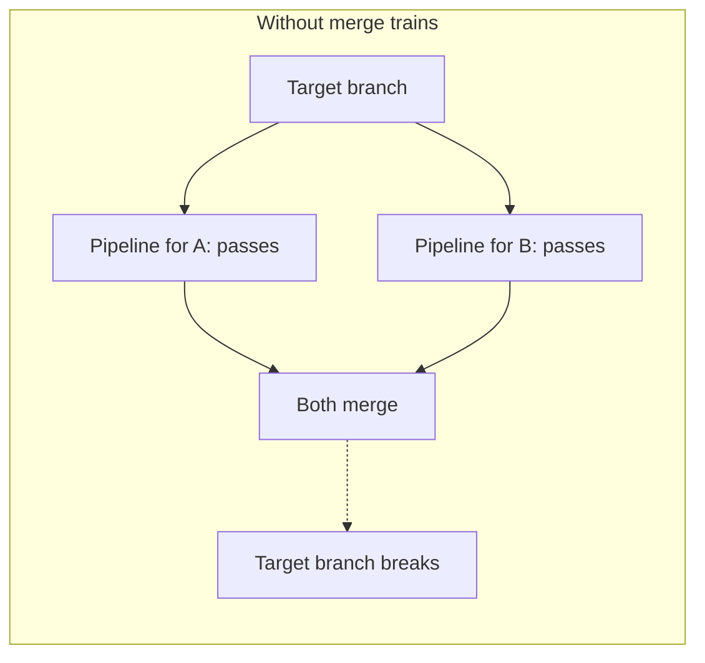
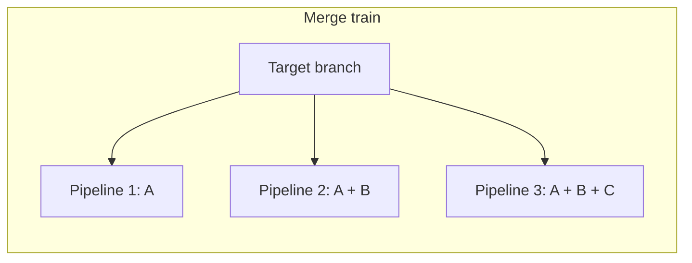



- 티어:  Premium, Ultimate
- 제공 서비스: GitLab.com, GitLab Self-Managed, GitLab Dedicated



기본 브랜치에 병합이 빈번한 프로젝트에서는 서로 다른 병합 요청의 변경 사항이 서로 충돌할 수 있습니다. 병합 트레인을 사용하여 병합 요청을 큐에 추가합니다. 각 병합 요청을 다른 이전의 병합 요청과 비교하여 모두 함께 작동하는지 확인합니다.

[병합된 결과 파이프라인](merged_results_pipelines.md)은 대상 브랜치와 결합된 하나의 병합 요청의 변경 사항을 테스트합니다. 병합된 결과 파이프라인은 같은 시간에 병합되는 다른 병합 요청을 고려하지 않습니다. 두 병합 요청이 각각의 파이프라인을 통과할 수 있지만, 결합된 변경 사항은 여전히 충돌할 수 있습니다. 모두가 모두 병합되면 모든 파이프라인이 성공했더라도 대상 브랜치가 손상될 수 있습니다.

병합 트레인은 각 병합 요청을 큐에서 앞에 있는 모든 병합 요청의 결합된 변경 사항과 비교하여 테스트하여 손상을 방지합니다. 충돌이 대상 브랜치에 도달하기 전에 탐지됩니다.

프로젝트에서 다음과 같은 경우 병합 트레인을 사용합니다.

- 기본 브랜치에 빈번한 병합
- 같은 시간대에 자주 병합할 준비가 된 여러 병합 요청
- 기본 브랜치에서 항상 파이프라인을 통과 상태로 유지해야 한다는 요구 사항

## 병합 트레인 워크플로우 {#merge-train-workflow}

병합을 대기 중인 병합 요청이 없고 [**병합** 또는 **자동 병합으로 설정**](#start-a-merge-train)을 선택하면 병합 트레인이 시작됩니다. GitLab은 변경 사항을 기본 브랜치에 병합할 수 있는지 확인하는 병합 트레인 파이프라인을 시작합니다. 이 첫 번째 파이프라인은 [병합된 결과 파이프라인](merged_results_pipelines.md)과 같으며, 소스 및 대상 브랜치의 변경 사항을 함께 결합하여 실행됩니다. 내부 병합된 결과 커밋의 작성자는 병합을 시작한 사용자입니다.

첫 번째 파이프라인이 완료된 후 즉시 병합되도록 두 번째 병합 요청을 큐에 추가하려면 [**병합** 또는 **자동 병합으로 설정**](#add-a-merge-request-to-a-merge-train)을 선택하여 트레인에 추가합니다. 이 두 번째 병합 트레인 파이프라인은 _둘 모두의_ 병합 요청의 변경 사항을 대상 브랜치와 결합하여 실행됩니다. 유사하게 세 번째 병합 요청을 추가하면 해당 파이프라인은 세 개의 병합 요청 모두의 변경 사항을 대상 브랜치와 병합하여 실행됩니다. 파이프라인은 모두 병렬로 실행됩니다.

각 병합 요청은 다음 조건을 충족한 후에만 대상 브랜치로 병합됩니다.

- 병합 요청의 파이프라인이 성공적으로 완료됩니다.
- 이전에 큐에 추가된 다른 모든 병합 요청이 병합됩니다.

병합 트레인 파이프라인이 실패하면 병합 요청은 병합되지 않습니다. GitLab은 병합 트레인에서 해당 병합 요청을 제거하고 이후에 큐에 추가된 모든 병합 요청에 대해 새로운 파이프라인을 시작합니다.

예를 들어:

세 개의 병합 요청(`A`, `B`, `C`)이 순서대로 병합 트레인에 추가되어 병렬로 실행되는 3개의 병합된 결과 파이프라인이 만들어집니다.

1. 첫 번째 파이프라인은 `A`의 변경 사항을 대상 브랜치와 함께 실행합니다.
1. 두 번째 파이프라인은 `A`과 `B`의 변경 사항을 대상 브랜치와 함께 실행합니다.
1. 세 번째 파이프라인은 `A`, `B`, `C`의 변경 사항을 대상 브랜치와 함께 실행합니다.

`B`의 파이프라인이 실패하면:

- 첫 번째 파이프라인(`A`)은 계속 실행됩니다.
- `B`은 트레인에서 제거됩니다.
- `C`의 파이프라인이 [취소되고](#automatic-pipeline-cancellation), `A`과 `C`의 변경 사항을 대상 브랜치와 함께 실행하는 새 파이프라인이 시작됩니다(`B` 변경 사항 제외).

`A`이(가) 성공적으로 완료되면 대상 브랜치로 병합되고, `C`은(는) 계속 실행됩니다. 트레인에 추가된 새로운 병합 요청은 이제 대상 브랜치에 있는 `A` 변경 사항과 병합 트레인에서 `C` 변경 사항을 포함합니다.

<i class="fa-youtube-play" aria-hidden="true"></i> [병합 트레인의 병렬 실행이 커밋으로 인해 기본 브랜치가 손상되는 것을 방지하는 방법](https://www.youtube.com/watch?v=D4qCqXgZkHQ)에 대한 데모를 보려면 이 동영상을 시청하세요.

### 자동 파이프라인 취소 {#automatic-pipeline-cancellation}

GitLab CI/CD에서는 중복된 파이프라인을 탐지하고 리소스를 절약하기 위해 취소합니다.

중복된 병합 트레인 파이프라인은 다음과 같은 경우 발생합니다.

- 병합 트레인의 병합 요청 중 하나에서 파이프라인이 실패합니다.
- 사용자가 [병합 트레인을 건너뛰고 즉시 병합](#skip-the-merge-train-and-merge-immediately)합니다.
- 사용자가 [병합 트레인에서 병합 요청을 제거](#remove-a-merge-request-from-a-merge-train)합니다.

이 경우 GitLab은 병합 트레인의 일부 또는 모든 병합 요청에 대해 새로운 병합 트레인 파이프라인을 만들어야 합니다. 이전 파이프라인은 병합 트레인의 이전에 결합된 변경 사항을 비교했으며 더 이상 유효하지 않으므로 이러한 이전 파이프라인은 취소됩니다.

## 병합 트레인 사용 {#enable-merge-trains}

사전 요구 사항:

- 유지 관리자 역할이 있어야 합니다.
- 리포지토리는 GitLab 리포지토리여야 하며 [외부 리포지토리](../ci_cd_for_external_repos/_index.md)가 아니어야 합니다.
- 파이프라인은 [병합 요청 파이프라인을 사용하도록 구성](merge_request_pipelines.md#prerequisites)되어야 합니다. 그렇지 않으면 병합 요청이 미해결 상태에서 멈추거나 파이프라인이 삭제될 수 있습니다.
- [병합된 결과 파이프라인이 사용으로 설정](merged_results_pipelines.md#enable-merged-results-pipelines)되어 있어야 합니다.

병합 트레인을 사용으로 설정하려면 다음을 수행합니다.

1. 상단 바에서 **검색 또는 이동**을 선택하고 프로젝트를 찾습니다.
1. 왼쪽 사이드바에서 **설정** > **병합 요청**을 선택합니다.
1. **병합 옵션** 섹션에서 **병합된 결과 파이프라인 사용**이 설정되어 있는지 확인하고 **병합 트레인 사용**을 선택합니다.
1. **변경사항 저장**을 선택합니다.

## 병합 트레인 시작 {#start-a-merge-train}

사전 요구 사항:

- 대상 브랜치에 병합하거나 푸시하는 [권한](../../user/permissions.md)이 있어야 합니다.

병합 트레인을 시작하려면 다음을 수행합니다.

1. 병합 요청으로 이동합니다.
1. 다음 중 하나를 선택합니다:
   - 파이프라인이 실행되지 않는 경우 **병합**을 선택합니다.
   - 파이프라인이 실행 중일 때 [**자동 병합으로 설정**](../../user/project/merge_requests/auto_merge.md)을 선택합니다.

병합 요청의 병합 트레인 상태는 파이프라인 위젯 아래에 `A new merge train has started and this merge request is the first of the queue. View merge train details.`과 같은 메시지로 표시됩니다. 링크를 선택하여 병합 트레인을 볼 수 있습니다.

이제 다른 병합 요청을 트레인에 추가할 수 있습니다.

## 병합 트레인 보기 {#view-a-merge-train}



- GitLab 17.3에서 병합 트레인 시각화가 [도입](https://gitlab.com/groups/gitlab-org/-/epics/13705)되었습니다.



병합 트레인을 보고 큐에 있는 병합 요청의 순서 및 상태에 대해 더 잘 이해할 수 있습니다. 병합 트레인 세부 정보 페이지는 큐에 활성 병합 요청과 트레인의 일부였던 병합된 병합 요청을 표시합니다.

병합 요청 목록에서 병합 트레인 세부 정보에 액세스하려면 다음을 수행합니다.

1. 상단 바에서 **검색 또는 이동**을 선택하고 프로젝트를 찾습니다.
1. 왼쪽 사이드바에서 **코드** > **병합 요청**을 선택합니다.
1. 병합 요청 목록 위에서 **병합 트레인**을 선택합니다.
1. 선택 사항입니다. 대상 브랜치별로 병합 트레인을 필터링합니다.

다음에서 **병합 트레인 세부 정보 보기**를 선택하여 이 보기에 액세스할 수도 있습니다.

- 병합 트레인에 추가된 병합 요청의 파이프라인 위젯 및 시스템 노트입니다.
- 병합 트레인 파이프라인의 파이프라인 세부 정보 페이지입니다.

병합 트레인 세부 정보 보기에서 병합 요청()을 제거할 수도 있습니다.

## 병합 트레인에 병합 요청 추가 {#add-a-merge-request-to-a-merge-train}



- 병합 트레인의 자동 병합은 `merge_when_checks_pass_merge_train`이라는 [기능 플래그](../../administration/feature_flags/_index.md)로 GitLab 17.2에서 [도입](https://gitlab.com/groups/gitlab-org/-/work_items/10874)되었습니다. 기본적으로 사용 중지되어 있습니다.
- 병합 트레인에 대한 자동 병합은 GitLab 17.2에서 GitLab.com에 [사용으로 설정](https://gitlab.com/gitlab-org/gitlab/-/issues/470667)되었습니다.
- 병합 트레인에 대한 자동 병합은 GitLab 17.4에서 기본적으로 [사용으로 설정](https://gitlab.com/gitlab-org/gitlab/-/issues/470667)되었습니다.
- 병합 트레인의 자동 병합은 GitLab 17.7에서 [일반 공개](https://gitlab.com/gitlab-org/gitlab/-/merge_requests/174357)되었습니다. `merge_when_checks_pass_merge_train` 기능 플래그가 제거되었습니다.



사전 요구 사항:

- 대상 브랜치에 병합하거나 푸시하는 [권한](../../user/permissions.md)이 있어야 합니다.

병합 요청을 병합 트레인에 추가하려면 다음을 수행합니다.

1. 병합 요청을 방문합니다.
1. 다음 중 하나를 선택합니다:
   - 파이프라인이 실행되지 않는 경우 **병합**을 선택합니다.
   - 파이프라인이 실행 중일 때 [**자동 병합으로 설정**](../../user/project/merge_requests/auto_merge.md)을 선택합니다.

병합 요청의 병합 트레인 상태는 파이프라인 위젯 아래에 `This merge request is 2 of 3 in queue.`과 유사한 메시지로 표시됩니다.

각 병합 트레인은 [병렬로 실행되는 파이프라인의 최대 수](#merge-train-parallel-pipeline-limit)를 실행할 수 있습니다. 기본 제한은 20입니다. 제한보다 많은 병합 요청을 병합 트레인에 추가하면 파이프라인이 완료될 때까지 추가 병합 요청이 큐열에 추가됩니다. 큐에 추가된 병합 요청의 수는 무제한입니다.

병합 요청이 병합 트레인에 합류한 후에는, [모든 스레드가 해결되어야 함](../../user/project/merge_requests/_index.md#prevent-merge-unless-all-threads-are-resolved)이 사용으로 설정된 경우에도 새로운 대화 스레드를 병합 트레인에서 제거하거나 병합을 방지하지 않습니다. 이 동작은 의도된 것입니다. 자세한 정보는 [이슈 220916](https://gitlab.com/gitlab-org/gitlab/-/issues/220916)을 참조하세요.

## 병합 트레인에서 병합 요청 제거 {#remove-a-merge-request-from-a-merge-train}

병합 트레인에서 병합 요청을 제거하는 경우 다음과 같이 됩니다.

- 제거된 병합 요청 이후 큐에 있던 모든 병합 요청의 파이프라인이 다시 시작됩니다.
- 중복된 파이프라인은 [취소](#automatic-pipeline-cancellation)됩니다.

나중에 병합 요청을 병합 트레인에 다시 추가할 수 있습니다.

병합 트레인에서 병합 요청을 제거하려면 다음을 수행합니다.

- 병합 요청에서 **자동 병합 취소**를 선택합니다.
- [병합 트레인 세부 정보](#view-a-merge-train)에서 병합 요청 옆의 를 선택합니다.

## 병합 트레인을 건너뛰고 즉시 병합 {#skip-the-merge-train-and-merge-immediately}

긴급하게 병합해야 하는 중요한 패치와 같이 우선 순위가 높은 병합 요청이 있는 경우 **즉시 병합**을 선택할 수 있습니다.

> [!warning]
> 즉시 병합하면 많은 CI/CD 리소스를 사용할 수 있습니다. 이 옵션은 중요한 상황에서만 사용합니다.

병합 요청을 즉시 병합하면 다음과 같이 됩니다.

- 병합 요청의 커밋이 병합 트레인의 상태를 무시하고 병합됩니다.
- 트레인의 다른 모든 병합 요청의 병합 트레인 파이프라인이 [취소](#automatic-pipeline-cancellation)됩니다.
- 새로운 병합 트레인이 시작되고 원래 병합 트레인의 모든 병합 요청이 이 새로운 병합 트레인에 추가되며 각각에 대해 새로운 병합 트레인 파이프라인이 생성됩니다. 이러한 새로운 병합 트레인 파이프라인은 이제 즉시 병합된 병합 요청이 추가한 커밋을 포함합니다.

> [!note]
> **즉시 병합** 옵션은 프로젝트가 [패스트포워드](../../user/project/merge_requests/methods/_index.md#fast-forward-merge)(fast-forward) 병합 방법을 사용하고 소스 브랜치가 대상 브랜치 뒤에 있는 경우 사용하지 못할 수 있습니다. 자세한 내용은 [이슈 434070](https://gitlab.com/gitlab-org/gitlab/-/issues/434070)을 참조합니다.

### 병합 트레인 파이프라인을 다시 시작하지 않고 즉시 병합 {#merge-immediately-without-restarting-merge-train-pipelines}



- 상태:  실험적 기능





- `merge_trains_skip_train`이라는 [기능 플래그](../../administration/feature_flags/_index.md)로 GitLab 16.5에서 [도입](https://gitlab.com/gitlab-org/gitlab/-/issues/414505)되었습니다. 기본적으로 사용 중지되어 있습니다.
- GitLab 16.10에서 [실험적 기능](../../policy/development_stages_support.md)으로 [사용으로 설정](https://gitlab.com/gitlab-org/gitlab/-/issues/422111)되었습니다.



> [!flag]
> GitLab Self-Managed에서는 기본적으로 이 기능을 사용할 수 있습니다. 기능을 숨기려면 관리자가 `merge_trains_skip_train`이라는 [기능 플래그를 사용 중지](../../administration/feature_flags/_index.md)할 수 있습니다. GitLab.com 및 GitLab Dedicated에서는 이 기능을 사용할 수 있습니다.

실행 중인 병합 트레인을 완전히 다시 시작하지 않고 병합 요청을 병합하도록 허용할 수 있습니다. 이 기능을 사용하면 파이프라인을 안전하게 건너뛸 수 있는 변경 사항(예: 사소한 설명서 업데이트)을 빠르게 병합할 수 있습니다.

패스트포워드(fast-forward) 또는 반선형(semi-linear) 병합 방법에 대한 병합 트레인을 건너뛸 수 없습니다. 자세한 내용은 [이슈 429009](https://gitlab.com/gitlab-org/gitlab/-/issues/429009)를 참조합니다.

병합 트레인 건너뛰기는 실험적 기능입니다. 향후 릴리스에서 변경되거나 완전히 제거될 수 있습니다.

> [!warning]
> 이 기능을 사용하여 보안 또는 버그 수정을 빠르게 병합할 수 있지만, 트레인을 건너뛴 병합 요청의 변경 사항은 트레인의 다른 병합 요청과 비교하여 확인되지 않습니다. 이러한 다른 병합 트레인 파이프라인이 성공적으로 완료되고 병합되면 결합된 변경 사항이 호환되지 않는 위험이 있습니다. 대상 브랜치는 새로운 장애를 해결하기 위해 추가 작업이 필요할 수 있습니다.

사전 요구 사항:

- 유지 관리자 역할이 있어야 합니다.
- [병합 트레인이 사용](#enable-merge-trains)을 설정되어 있어야 합니다.

파이프라인을 다시 시작하지 않고 트레인 건너뛰기를 사용으로 설정하려면 다음을 수행합니다.

1. 상단 바에서 **검색 또는 이동**을 선택하고 프로젝트를 찾습니다.
1. 왼쪽 사이드바에서 **설정** > **병합 요청**을 선택합니다.
1. **병합 옵션** 섹션에서 **병합된 결과 파이프라인 사용** 및 **병합 트레인 사용** 옵션이 사용으로 설정되어 있는지 확인합니다.
1. **병합 트레인을 다시 시작하지 않고 즉시 병합**을 선택합니다.
1. **변경 사항 저장**을 선택합니다.

병합 트레인을 건너뛰어 병합 요청을 병합하려면 [병합 요청 병합 API 엔드포인트](../../api/merge_requests.md#merge-a-merge-request)를 사용하여 `skip_merge_train` 특성을 `true`로 설정하여 병합합니다.

병합 요청이 병합되고 기존 병합 트레인 파이프라인이 취소되거나 다시 시작되지 않습니다.

### 병합 트레인 병렬 파이프라인 제한 {#merge-train-parallel-pipeline-limit}



- GitLab 19.0에서 [도입](https://gitlab.com/gitlab-org/gitlab/-/issues/374188)되었습니다.



기본적으로 각 병합 트레인은 최대 20개의 파이프라인을 병렬로 실행할 수 있습니다. 이 제한에 도달하면 파이프라인 슬롯을 사용할 수 있을 때까지 추가 병합 요청이 큐에 추가됩니다.

프로젝트의 이 제한을 수정하려면 다음을 수행합니다.

1. 상단 바에서 **검색 또는 이동**을 선택하고 프로젝트를 찾습니다.
1. 왼쪽 사이드바에서 **설정** > **병합 요청**을 선택합니다.
1. **병합 옵션** 섹션에서 **병합 트레인당 최대 병렬 파이프라인**에 값을 설정합니다. 최소값은 `1`입니다. `1`의 값은 병합 요청을 병렬 처리 없이 순차적으로 처리합니다.
1. **변경 사항 저장**을 선택합니다.

프로젝트 제한은 [인스턴스 제한](../../administration/cicd/limits.md#merge-train-parallel-pipeline-limit)을 초과할 수 없습니다.

[프로젝트 API](../../api/projects.md) 또는 [GraphQL API](../../api/graphql/reference/_index.md#projectcicdsetting)를 사용할 수도 있습니다.

## 병합 트레인 적용 {#enforce-merge-trains}



- GitLab 19.2에서 `merge_train_enforcement` [기능 플래그](../../administration/feature_flags/_index.md)로 [도입](https://gitlab.com/gitlab-org/gitlab/-/issues/597962)되었습니다. 기본적으로 사용 중지되어 있습니다.
- GitLab 19.3에서 [일반 공개](https://gitlab.com/gitlab-org/gitlab/-/merge_requests/245861)되었습니다. `merge_train_enforcement` 기능 플래그가 제거되었습니다.



기본적으로 병합 권한이 있으면 병합 트레인을 우회할 수 있습니다. 적용하려면 모든 병합 요청이 트레인을 통과해야 합니다.

적용을 사용으로 설정하면 다음과 같이 됩니다.

- GitLab은 **지금 병합하고 트레인을 다시 시작하지 않음**을 포함하여 **즉시 병합** 옵션을 숨깁니다.
- REST API와 GraphQL API는 직접 병합을 거부합니다.
- 자동 병합은 모든 병합을 병합 트레인으로 라우팅합니다.

병합 트레인 적용에는 세 가지 수준이 있습니다.

- **우회 허용** (기본값): 병합 권한이 있는 사용자는 UI 또는 API를 통해 병합 트레인을 우회할 수 있습니다.
- **모든 사용자에게 적용**: 모든 병합 요청은 병합 트레인을 통과해야 합니다. 소유자 및 관리자를 포함하여 어떤 사용자도 병합 트레인을 우회할 수 없습니다.
- **소유자 재정의로 적용**: 모든 병합 요청은 병합 트레인을 통과해야 하지만, 소유자 및 관리자는 개별 병합 요청에 대해 병합 트레인을 우회할 수 있습니다.

사전 요구 사항:

- 유지 관리자 역할이 있어야 합니다.
- 프로젝트에 대해 [병합 트레인을 사용](#enable-merge-trains)으로 설정해야 합니다.

병합 트레인 적용을 구성하려면 다음을 수행합니다.

1. 상단 바에서 **검색 또는 이동**을 선택하고 프로젝트를 찾습니다.
1. 왼쪽 사이드바에서 **설정** > **병합 요청**을 선택합니다.
1. **병합 옵션** 섹션의 **병합 트레인 적용** 아래에서 적용 수준을 선택합니다.
1. **변경 사항 저장**을 선택합니다.

## 문제 해결 {#troubleshooting}

### 병합 트레인에서 병합 요청이 누락 {#merge-request-dropped-from-the-merge-train}

병합 트레인 파이프라인이 실행되는 동안 병합 요청이 병합 불가능하게 되면 병합 트레인이 병합 요청을 자동으로 누락시킵니다. 일반적인 원인은 다음과 같습니다:

- 병합 요청을 [초안](../../user/project/merge_requests/drafts.md)으로 변경합니다.
- 병합 충돌입니다.

병합 요청이 병합 트레인에서 누락된 이유는 시스템 메모에서 확인할 수 있습니다. **작업** 섹션의 **개요** 탭에서 다음과 유사한 메시지가 있는지 확인합니다: `User removed this merge request from the merge train because ...`

### 자동 병합을 사용할 수 없음 {#cannot-use-auto-merge}

병합 트레인이 사용으로 설정된 경우 [자동 병합](../../user/project/merge_requests/auto_merge.md)(이전의 **파이프라인이 성공하면 병합**)을 사용하여 병합 트레인을 건너뛸 수 없습니다. 자세한 내용은 [이슈 12267](https://gitlab.com/gitlab-org/gitlab/-/issues/12267)을 참조합니다.

### 병합 트레인 파이프라인을 다시 시도할 수 없음 {#cannot-retry-merge-train-pipeline}

병합 트레인 파이프라인이 실패하면 병합 요청은 트레인에서 삭제되고 실패 후 파이프라인을 다시 시도할 수 없습니다. 병합 트레인 파이프라인은 병합 요청의 변경 사항과 이미 트레인에 있는 다른 병합 요청의 변경 사항의 병합된 결과에서 실행됩니다. 병합 요청이 트레인에서 삭제되면 병합된 결과가 만료되고 파이프라인을 다시 시도할 수 없습니다.

다음을 수행할 수 있습니다.

- [병합 요청을 트레인에 다시 추가](#add-a-merge-request-to-a-merge-train)하면 새로운 파이프라인이 트리거됩니다.
- 간헐적으로 실패하면 작업에 [`retry`](../yaml/_index.md#retry) 키워드를 추가합니다. 다시 시도 후 성공하면 병합 요청은 병합 트레인에서 제거되지 않습니다.

### 병합 트레인에 병합 요청을 추가할 수 없음 {#cannot-add-a-merge-request-to-the-merge-train}

[**파이프라인이 성공해야 함**](../../user/project/merge_requests/auto_merge.md#require-a-successful-pipeline-for-merge)이 사용으로 설정되어 있지만 최신 파이프라인이 실패한 경우:

- **자동 병합으로 설정** 또는 **병합** 옵션을 사용할 수 없습니다.
- 병합 요청에 `The pipeline for this merge request failed. Please retry the job or push a new commit to fix the failure.`가 표시됩니다.

병합 요청을 병합 트레인에 다시 추가하기 전에 다음을 시도할 수 있습니다.

- 실패한 작업을 다시 시도합니다. 성공하고 다른 작업이 실패하지 않으면 파이프라인이 성공으로 표시됩니다.
- 전체 파이프라인을 다시 실행합니다. **파이프라인** 탭에서 **파이프라인 실행**을 선택합니다.
- 문제를 해결하는 새로운 커밋을 푸시하면 새로운 파이프라인도 트리거됩니다.

자세한 내용은 [이슈 35135](https://gitlab.com/gitlab-org/gitlab/-/issues/35135)를 참조하세요.

### 자동화 도구가 405 오류로 병합에 실패 {#automation-tools-fail-to-merge-with-a-405-error}

병합 트레인 적용이 사용으로 설정되면 `auto_merge=true` 없이 [병합 요청 API](../../api/merge_requests.md#merge-a-merge-request)를 호출하는 모든 도구는 `405 Method Not Allowed` 응답을 받습니다. 여기에는 스크립트, CI/CD 작업 및 봇이 포함됩니다.

해결하려면 도구를 `auto_merge=true`로 전달하도록 업데이트합니다. 이렇게 하면 병합 요청이 직접 병합되지 않고 병합 트레인에 직접 추가됩니다. 예를 들어, [Renovate](https://docs.renovatebot.com/configuration-options/#platformautomerge)를 사용하면 `platformAutomerge` 구성 옵션이 사용으로 설정됩니다.
