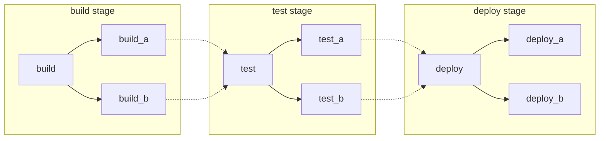
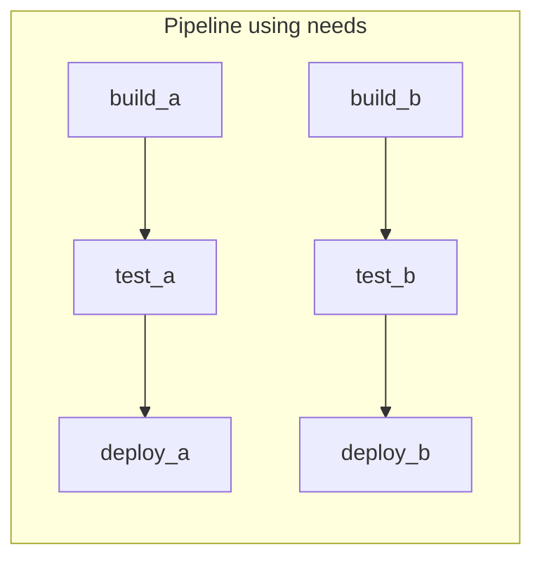
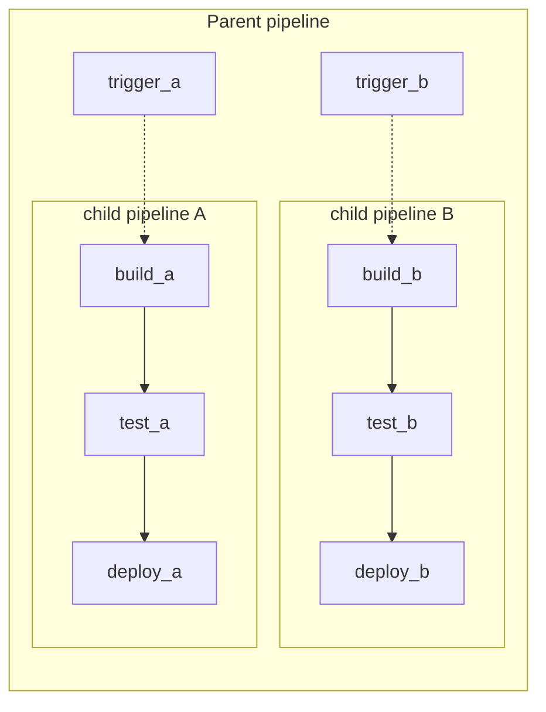



- 계층: Free, Premium, Ultimate
- 제공 서비스: GitLab.com, GitLab Self-Managed, GitLab Dedicated



파이프라인은 GitLab의 CI/CD를 위한 기본 빌딩 블록입니다. 이 페이지에서는 파이프라인과 관련된 중요한 개념을 설명합니다.

각각 고유한 장점이 있는 여러 방법으로 파이프라인을 구조화할 수 있습니다. 필요하면 다음 방법들을 혼합하여 사용할 수 있습니다:

- [기본](#basic-pipelines): 모든 구성이 한 곳에 있는 간단한 프로젝트에 적합합니다.
- [`needs` 키워드를 포함한 파이프라인](#pipelines-with-the-needs-keyword): 효율적인 실행이 필요한 크고 복잡한 프로젝트에 적합합니다.
- [상위-하위 파이프라인](#parent-child-pipelines): 모노레포 및 독립적으로 정의된 많은 컴포넌트가 있는 프로젝트에 적합합니다.

  <i class="fa-youtube-play" aria-hidden="true"></i> 개요는 [상위-하위 파이프라인 기능 데모](https://youtu.be/n8KpBSqZNbk)를 참조하세요.

- [다중 프로젝트 파이프라인](downstream_pipelines.md#multi-project-pipelines): [마이크로서비스 아키텍처](https://about.gitlab.com/blog/trends-in-version-control-land-microservices/)와 같은 교차 프로젝트 종속성이 필요한 대규모 제품에 적합합니다.

  예를 들어, 세 개의 서로 다른 GitLab 프로젝트에서 웹 애플리케이션을 배포할 수 있습니다. 다중 프로젝트 파이프라인을 사용하면 각 프로젝트에서 파이프라인을 트리거할 수 있으며, 각각 자체 빌드, 테스트 및 배포 프로세스가 있습니다. 연결된 파이프라인을 한 곳에서 시각화할 수 있으며, 모든 교차 프로젝트 종속성을 포함합니다.

  <i class="fa-youtube-play" aria-hidden="true"></i> 개요는 [다중 프로젝트 파이프라인 데모](https://www.youtube.com/watch?v=g_PIwBM1J84)를 참조하세요.

## 기본 파이프라인 {#basic-pipelines}

기본 파이프라인은 GitLab의 가장 간단한 파이프라인입니다. 빌드 스테이지의 모든 항목을 동시에 실행하고, 모두 완료되면 테스트 및 후속 스테이지의 모든 항목을 같은 방식으로 실행합니다. 가장 효율적이지는 않으며 많은 단계가 있으면 상당히 복잡해질 수 있지만, 유지 관리하기는 더 쉽습니다:



기본 `/.gitlab-ci.yml` 파이프라인 구성 예시 (다이어그램 매칭):

```yaml
stages:
  - build
  - test
  - deploy

default:
  image: alpine

build_a:
  stage: build
  script:
    - echo "This job builds something."

build_b:
  stage: build
  script:
    - echo "This job builds something else."

test_a:
  stage: test
  script:
    - echo "This job tests something. It will only run when all jobs in the"
    - echo "build stage are complete."

test_b:
  stage: test
  script:
    - echo "This job tests something else. It will only run when all jobs in the"
    - echo "build stage are complete too. It will start at about the same time as test_a."

deploy_a:
  stage: deploy
  script:
    - echo "This job deploys something. It will only run when all jobs in the"
    - echo "test stage complete."
  environment: production

deploy_b:
  stage: deploy
  script:
    - echo "This job deploys something else. It will only run when all jobs in the"
    - echo "test stage complete. It will start at about the same time as deploy_a."
  environment: production
```

## `needs` 키워드를 포함한 파이프라인 {#pipelines-with-the-needs-keyword}

효율성이 중요하고 모든 것이 가능한 한 빠르게 실행되기를 원한다면 [`needs` 키워드](../yaml/needs.md)를 사용하여 작업 간의 종속성을 정의할 수 있습니다. GitLab이 작업 간의 종속성을 알면, 작업은 최대한 빠르게 실행될 수 있으며, 같은 스테이지의 다른 작업보다 먼저 시작할 수도 있습니다.

다음 예제에서 `build_a` 및 `test_a`이(가) `build_b` 및 `test_b`보다 훨씬 빠르면, GitLab은 `build_b`이(가) 아직 실행 중인 경우에도 `deploy_a`을(를) 시작합니다.



`/.gitlab-ci.yml` 구성 예시 (다이어그램 매칭):

```yaml
stages:
  - build
  - test
  - deploy

default:
  image: alpine

build_a:
  stage: build
  script:
    - echo "This job builds something quickly."

build_b:
  stage: build
  script:
    - echo "This job builds something else slowly."

test_a:
  stage: test
  needs: [build_a]
  script:
    - echo "This test job will start as soon as build_a finishes."
    - echo "It will not wait for build_b, or other jobs in the build stage, to finish."

test_b:
  stage: test
  needs: [build_b]
  script:
    - echo "This test job will start as soon as build_b finishes."
    - echo "It will not wait for other jobs in the build stage to finish."

deploy_a:
  stage: deploy
  needs: [test_a]
  script:
    - echo "Since build_a and test_a run quickly, this deploy job can run much earlier."
    - echo "It does not need to wait for build_b or test_b."
  environment: production

deploy_b:
  stage: deploy
  needs: [test_b]
  script:
    - echo "Since build_b and test_b run slowly, this deploy job will run much later."
  environment: production
```

## 상위-하위 파이프라인 {#parent-child-pipelines}

파이프라인이 점점 더 복잡해지면서 몇 가지 관련된 문제가 나타나기 시작합니다:

- 스테이지의 모든 단계가 다음 스테이지의 첫 번째 작업이 시작되기 전에 완료되어야 하는 단계별 구조는 대기 시간이 발생하여 처리 속도를 저하시킵니다.
- 단일 전역 파이프라인의 구성이 관리하기 어려워집니다.
- [`include`](../yaml/_index.md#include)를 포함한 가져오기는 구성의 복잡성을 증가시킬 수 있으며, 작업이 의도하지 않게 중복되는 네임스페이스 충돌을 야기할 수 있습니다.
- 파이프라인 UX에는 작업할 작업 및 스테이지가 너무 많습니다.

추가로, 때때로 파이프라인의 동작이 더욱 동적이어야 합니다. 특히 YAML이 동적으로 생성되는 경우 하위 파이프라인을(를) 시작할지 여부를 선택할 수 있는 기능은 강력한 기능입니다.

이전 [기본 파이프라인](#basic-pipelines) 및 [`needs` 파이프라인](#pipelines-with-the-needs-keyword) 예제에서 두 개의 패키지를 독립적으로 빌드할 수 있습니다. 이러한 경우는 [상위-하위 파이프라인](downstream_pipelines.md#parent-child-pipelines)을(를) 사용하기에 이상적입니다. 구성을 여러 파일로 분리하여 더 간단하게 유지합니다. 상위-하위 파이프라인을(를) 다음과 결합할 수 있습니다:

- [`rules` 키워드](../yaml/_index.md#rules): 예를 들어, 해당 영역에 변경 사항이 있을 때만 자식 파이프라인이 트리거되도록 합니다.
- [`include` 키워드](../yaml/_index.md#include): 공통 동작을 가져와서 자신을 반복하지 않도록 합니다.
- 자식 파이프라인 내의 [`needs` 키워드](#pipelines-with-the-needs-keyword)로, 둘 다의 이점을 달성합니다.



상위 파이프라인과 일치하는 `/.gitlab-ci.yml` 구성 예시:

```yaml
stages:
  - triggers

trigger_a:
  stage: triggers
  trigger:
    include: a/.gitlab-ci.yml
  rules:
    - changes:
        - a/*

trigger_b:
  stage: triggers
  trigger:
    include: b/.gitlab-ci.yml
  rules:
    - changes:
        - b/*
```

자식 `a` 파이프라인 구성 예시, `/a/.gitlab-ci.yml`에 위치, `needs` 키워드 사용:

```yaml
stages:
  - build
  - test
  - deploy

default:
  image: alpine

build_a:
  stage: build
  script:
    - echo "This job builds something."

test_a:
  stage: test
  needs: [build_a]
  script:
    - echo "This job tests something."

deploy_a:
  stage: deploy
  needs: [test_a]
  script:
    - echo "This job deploys something."
  environment: production
```

자식 `b` 파이프라인 구성 예시, `/b/.gitlab-ci.yml`에 위치, `needs` 키워드 사용:

```yaml
stages:
  - build
  - test
  - deploy

default:
  image: alpine

build_b:
  stage: build
  script:
    - echo "This job builds something else."

test_b:
  stage: test
  needs: [build_b]
  script:
    - echo "This job tests something else."

deploy_b:
  stage: deploy
  needs: [test_b]
  script:
    - echo "This job deploys something else."
  environment: production
```

GitLab에서 작업을(를) 자식 파이프라인 트리거 전이나 후에 실행하도록 설정할 수 있으며, 이를 통해 공통 설정 단계나 통합 배포가 가능합니다.
