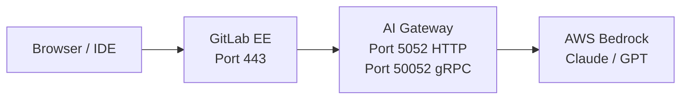



- 티어: Premium, Ultimate
- 제공 서비스: GitLab Self-Managed



이 가이드는 AWS Bedrock을 사용하여 자체 호스팅 AI 모델로 GitLab을 배포하는 과정을 설명하며, 빈 EC2 인스턴스부터 작동하는 Duo Agent Platform(DAP) 플로우까지 다룹니다. 모든 명령어는 복사하여 붙여넣기가 가능합니다. 모든 일반적인 실수가 문서화되어 있습니다.

이 가이드는 단일 EC2 인스턴스에서 GitLab(Docker)과 AI Gateway(Docker Compose)를 나란히 실행하고, AWS Bedrock을 LLM 공급자로 사용합니다. 이 아키텍처는 개념 증명 및 평가 배포에 적합합니다.

프로덕션 배포는 [참조 아키텍처](../../administration/reference_architectures/_index.md)를 참고합니다.

## 전제 조건 {#prerequisites}

시작하기 전에 다음 항목이 필요합니다:

| 요구 사항 | 세부 정보 |
|-------------|---------|
| **AWS account** | 대상 리전에서 Bedrock 액세스 권한 필요(`us-east-1` 권장). |
| **EC2 instance** | `t3.xlarge` 이상(4 vCPU, 16GB RAM). 프로덕션의 경우 `t3.2xlarge` 권장(8 vCPU, 32GB). |
| **Domain name** | EC2 인스턴스를 가리키는 DNS 레코드 2개: `gitlab.example.com` 및 `aigw.example.com`. |
| **GitLab license** | Premium 또는 Ultimate. 기본 Duo 기능(Chat, Code Suggestions)은 [Duo 사용자 할당](../../subscriptions/subscription-add-ons.md)이 필요합니다. 온라인 라이선스를 사용하는 DAP(GitLab 18.9 이상)는 [GitLab Credits를 통한 사용량 기반 청구](../../subscriptions/gitlab_credits.md)를 사용하며 Duo Enterprise 사용자가 필요하지 않습니다. 오프라인 라이선스를 사용하는 DAP의 경우 GitLab 계정 담당자에게 ELA 옵션에 대해 문의합니다. |
| **SSH access** | EC2 인스턴스에 대해. |
| **Security group** | 포트 80, 443, 8443이 인바운드로 열려 있습니다. |

## 아키텍처 개요 {#architecture-overview}



AI Gateway는 GitLab 옆에 사이드카 컨테이너로 실행됩니다. 기본 제공 GitLab NGINX는 HTTPS 및 gRPC 트래픽을 AI Gateway로 프록시합니다. AI Gateway는 LLM 요청을 AWS Bedrock으로 전달합니다.

포트 8443은 DAP 플로우에 필요합니다. DAP는 gRPC를 사용하여 AI Gateway Duo Workflow Service(DWS)와 통신합니다. GitLab NGINX는 포트 8443에서 gRPC TLS를 AI Gateway의 gRPC 포트(50052)로 프록시해야 합니다.

## 1단계:  AWS 인프라 프로비저닝 {#step-1-provision-aws-infrastructure}

### EC2 인스턴스 시작 {#launch-an-ec2-instance}

Ubuntu 22.04 이상 인스턴스를 다음으로 시작합니다:

- **Instance type:** `t3.xlarge` 이상(최소) 또는 `t3.2xlarge` 권장
- **스토리지:** 100GB gp3
- **AMI:** Ubuntu Server 22.04 LTS 또는 24.04

### 보안 그룹 구성 {#configure-the-security-group}

다음 인바운드 포트를 엽니다:

| 포트 | 프로토콜 | 소스 | 목적 |
|------|----------|--------|---------|
| 22 | TCP | 사용자 IP | SSH |
| 80 | TCP | `0.0.0.0/0` | HTTP(Let's Encrypt 검증) |
| 443 | TCP | `0.0.0.0/0` | HTTPS(GitLab 및 AI Gateway 프록시) |
| 8443 | TCP | `0.0.0.0/0` | gRPC TLS(DAP 플로우) |

IDE 클라이언트(VS Code, JetBrains)는 DAP 플로우를 위해 포트 8443에 직접 연결합니다. 사용자가 VPN 뒤에 있으면 소스 IP 범위를 제한할 수 있습니다.

### Docker 설치 {#install-docker}

인스턴스에 SSH로 접속하여 Docker를 설치합니다:

```shell
sudo apt-get update && sudo apt-get upgrade -y

# Install Docker (official method)
curl --fail --silent --show-error --location "https://get.docker.com" | sudo bash

# Install Docker Compose plugin
sudo apt-get install -y docker-compose-plugin

# Verify
sudo docker --version
sudo docker compose version
```

### DNS 설정 {#set-up-dns}

EC2 공개 IP를 가리키는 2개의 A 레코드를 생성합니다:

| 레코드 | 형식 | 값 |
|--------|------|-------|
| `gitlab.example.com` | A | EC2 공개 IP |
| `aigw.example.com` | A | EC2 공개 IP |

두 도메인 모두 동일한 IP를 가리킵니다. GitLab NGINX는 호스트 이름에 따라 트래픽을 라우팅합니다.

DNS 전파 확인:

```shell
dig gitlab.example.com +short
dig aigw.example.com +short
```

두 명령어 모두 EC2 공개 IP를 반환해야 합니다.

## 2단계:  GitLab 설치 {#step-2-install-gitlab}

### 데이터 디렉터리 생성 {#create-data-directories}

```shell
sudo mkdir -p /srv/gitlab/config /srv/gitlab/logs /srv/gitlab/data
```

### GitLab 실행 {#run-gitlab}

이 명령어는 Let's Encrypt를 사용하여 GitLab EE를 설치하고 시작합니다:

```shell
sudo docker run --detach \
  --hostname gitlab.example.com \
  --env GITLAB_OMNIBUS_CONFIG="
    external_url 'https://gitlab.example.com';
    letsencrypt['enable'] = true;
    letsencrypt['auto_renew'] = true;
    letsencrypt['contact_emails'] = ['you@example.com'];
    gitlab_rails['gitlab_shell_ssh_port'] = 2222;
  " \
  --publish 443:443 \
  --publish 80:80 \
  --publish 2222:22 \
  --publish 8443:8443 \
  --name gitlab \
  --restart always \
  --volume /srv/gitlab/config:/etc/gitlab \
  --volume /srv/gitlab/logs:/var/log/gitlab \
  --volume /srv/gitlab/data:/var/opt/gitlab \
  --shm-size 256m \
  gitlab/gitlab-ee:latest
```

> [!note]
> `--publish 8443:8443` 플래그는 DAP(gRPC TLS)에 필요합니다. 생략하면 DAP 플로우가 자동으로 실패합니다. 실행 중인 컨테이너에 포트를 추가할 수 없습니다. 다시 생성해야 합니다.

### GitLab 시작 대기 {#wait-for-gitlab-to-start}

GitLab은 처음 실행 시 초기화하는 데 3-5분이 소요됩니다:

```shell
until curl --silent --fail "https://gitlab.example.com/-/health" > /dev/null 2>&1; do
  echo "Waiting for GitLab to start..."
  sleep 10
done
echo "GitLab is up!"
```

### root 비밀번호 설정 {#set-the-root-password}

```shell
sudo docker exec gitlab cat /etc/gitlab/initial_root_password
```

`https://gitlab.example.com`에서 사용자 이름 `root` 및 명령어 출력의 비밀번호로 로그인합니다. 즉시 변경합니다.

### 라이선스 적용 {#apply-your-license}

1. **운영자 > 구독**으로 이동합니다.
1. GitLab 라이선스 파일을 업로드합니다.

## 3단계:  AI Gateway 배포 {#step-3-deploy-the-ai-gateway}

### 올바른 이미지 태그 찾기 {#find-the-correct-image-tag}

AI Gateway 이미지는 Docker Hub의 `gitlab/model-gateway`에 있습니다. GitLab 버전과 일치하는 버전 태그를 사용해야 합니다.

> [!note]
> `latest` 태그가 없습니다. `gitlab/model-gateway:latest`를 사용하면 image-not-found 오류가 발생합니다.

태그 형식: `self-hosted-v{MAJOR}.{MINOR}.{PATCH}-ee`

사용 가능한 태그 확인:

```shell
curl --silent "https://hub.docker.com/v2/repositories/gitlab/model-gateway/tags?page_size=10&ordering=last_updated" | \
  python3 -c "import sys,json; [print(t['name'], '  ', t['last_updated'][:10]) for t in json.load(sys.stdin)['results']]"
```

### JWT 서명 키 생성 {#generate-a-jwt-signing-key}

AI Gateway는 DWS 요청을 인증하기 위해 JWT 키가 필요합니다:

```shell
sudo mkdir -p /srv/enterprise-sidecar
openssl genrsa -out /srv/enterprise-sidecar/duo_workflow_jwt.key 2048
```

### 환경 파일 생성 {#create-the-environment-file}

`/srv/enterprise-sidecar/.env`을 생성합니다:

```shell
cat << 'EOF' | sudo tee /srv/enterprise-sidecar/.env
# AWS Bedrock credentials
AWS_ACCESS_KEY_ID=<your-aws-access-key>
AWS_SECRET_ACCESS_KEY=<your-aws-secret-key>
AWS_REGION=us-east-1

# AI Gateway: JWT signing key (for DWS authentication)
AIGW_JWT_SIGNING_KEY=<paste contents of duo_workflow_jwt.key>
EOF
```

환경 파일에 대한 제한적 권한을 설정합니다:

```shell
sudo chmod 600 /srv/enterprise-sidecar/.env
```

JWT 키를 환경 파일에 포함하려면 줄 바꿈을 리터럴 `\n`로 바꾸어 키가 한 줄에 맞도록 합니다:

```shell
JWT_KEY=$(sudo awk '{printf "%s\\n", $0}' /srv/enterprise-sidecar/duo_workflow_jwt.key)
sudo sed -i "s|AIGW_JWT_SIGNING_KEY=.*|AIGW_JWT_SIGNING_KEY=${JWT_KEY}|" /srv/enterprise-sidecar/.env
```

### Docker Compose 파일 생성 {#create-the-docker-compose-file}

`/srv/enterprise-sidecar/docker-compose.yml`을 생성합니다:

```yaml
services:
  ai-gateway:
    image: gitlab/model-gateway:self-hosted-v<VERSION>-ee  # Replace <VERSION> with your GitLab version (for example, 18.11.0)
    container_name: ai-gateway
    restart: unless-stopped
    environment:
      AIGW_GITLAB_URL: https://gitlab.example.com
      AIGW_GITLAB_API_URL: https://gitlab.example.com/api/v4/
      DUO_WORKFLOW_SELF_SIGNED_JWT__SIGNING_KEY: ${AIGW_JWT_SIGNING_KEY}
      AWS_ACCESS_KEY_ID: ${AWS_ACCESS_KEY_ID}
      AWS_SECRET_ACCESS_KEY: ${AWS_SECRET_ACCESS_KEY}
      AWS_REGION: ${AWS_REGION:-us-east-1}
      AIGW_LOGGING__LEVEL: INFO
      DUO_WORKFLOW_LOGGING__LEVEL: INFO
    ports:
      - "5052:5052"
      - "50052:50052"
    deploy:
      resources:
        limits:
          memory: 2048M
        reservations:
          memory: 512M
    healthcheck:
      test: ["CMD", "curl", "--silent", "--fail", "http://localhost:5052/monitoring/healthz"]
      interval: 30s
      timeout: 10s
      retries: 3
      start_period: 30s
```

### AI Gateway 시작 {#start-the-ai-gateway}

```shell
cd /srv/enterprise-sidecar
sudo docker compose up -d
```

### AI Gateway 상태 확인 {#verify-ai-gateway-health}

```shell
# Check container is running
sudo docker ps | grep ai-gateway

# Check HTTP health endpoint (empty JSON means healthy)
curl --silent "http://localhost:5052/monitoring/healthz"

# Check logs for errors
sudo docker logs ai-gateway --tail 20
```

## 4단계:  AI Gateway에 대한 TLS 구성 {#step-4-configure-tls-for-the-ai-gateway}

AI Gateway는 HTTPS(Chat 및 Code Suggestions의 경우) 및 gRPC TLS(DAP 플로우의 경우)가 필요합니다. 기본 제공 GitLab NGINX를 역방향 프록시로 사용하고 Let's Encrypt 인증서를 공유합니다.

### Let's Encrypt에 AI Gateway 하위 도메인 추가 {#add-the-ai-gateway-subdomain-to-lets-encrypt}

GitLab 구성을 편집합니다:

```shell
sudo docker exec -it gitlab editor /etc/gitlab/gitlab.rb
```

`letsencrypt` 섹션을 찾고 `alt_names`을 추가합니다:

```ruby
letsencrypt['alt_names'] = ['aigw.example.com']
```

이미 다른 `alt_names`(예: 레지스트리 하위 도메인)이 있으면 `aigw.example.com`을 기존 배열에 추가합니다:

```ruby
letsencrypt['alt_names'] = ['registry.example.com', 'aigw.example.com']
```

새 SAN을 포함하도록 인증서를 갱신합니다:

```shell
sudo docker exec gitlab gitlab-ctl renew-le-certs
```

인증서가 AI Gateway 하위 도메인을 포함하는지 확인합니다:

```shell
echo | openssl s_client -connect gitlab.example.com:443 2>/dev/null | \
  openssl x509 -noout -ext subjectAltName
```

출력에서 `DNS:aigw.example.com`을 볼 수 있어야 합니다.

### NGINX 프록시 구성 생성 {#create-the-nginx-proxy-configuration}

호스트에서 프록시 구성 파일을 생성합니다:

```shell
cat << 'NGINX' | sudo tee /srv/gitlab/config/nginx/aigw-proxy.conf
# AI Gateway reverse proxy: HTTPS for HTTP API, gRPC TLS for DAP

# HTTP API: Duo Chat, Code Suggestions
server {
    listen 443 ssl;
    server_name aigw.example.com;

    ssl_certificate /etc/gitlab/ssl/gitlab.example.com.crt;
    ssl_certificate_key /etc/gitlab/ssl/gitlab.example.com.key;
    ssl_protocols TLSv1.2 TLSv1.3;
    ssl_ciphers HIGH:!aNULL:!MD5;

    location / {
        proxy_pass http://172.17.0.1:5052;
        proxy_set_header Host $host;
        proxy_set_header X-Real-IP $remote_addr;
        proxy_set_header X-Forwarded-For $proxy_add_x_forwarded_for;
        proxy_set_header X-Forwarded-Proto https;
        proxy_read_timeout 600s;
        proxy_send_timeout 600s;
    }

    location /monitoring/healthz {
        proxy_pass http://172.17.0.1:5052/monitoring/healthz;
        access_log off;
    }
}

# gRPC TLS: DAP / Duo Agent Platform flows
server {
    listen 8443 ssl http2;
    server_name aigw.example.com;

    ssl_certificate /etc/gitlab/ssl/gitlab.example.com.crt;
    ssl_certificate_key /etc/gitlab/ssl/gitlab.example.com.key;
    ssl_protocols TLSv1.2 TLSv1.3;
    ssl_ciphers HIGH:!aNULL:!MD5;

    location / {
        grpc_pass grpc://172.17.0.1:50052;
        grpc_read_timeout 600s;
        grpc_send_timeout 600s;
    }
}
NGINX
```

주소 `172.17.0.1`은 Docker의 기본 브리지 게이트웨이 IP입니다. GitLab 컨테이너 내부에서 이 IP는 호스트 머신 및 AI Gateway 컨테이너의 게시된 포트에 도달합니다.

### GitLab NGINX에 구성 포함 {#include-the-configuration-in-the-gitlab-nginx}

구성 파일을 컨테이너 내 NGINX 런타임 디렉터리로 복사합니다:

```shell
sudo docker exec gitlab mkdir -p /var/opt/gitlab/nginx/conf
sudo docker cp /srv/gitlab/config/nginx/aigw-proxy.conf \
  gitlab:/var/opt/gitlab/nginx/conf/aigw-proxy.conf
```

> [!note]
> 파일을 `/etc/gitlab/nginx/`에 넣지 마세요. `custom_nginx_config`에서 참조하는 파일만 `gitlab.rb`에 로드됩니다. 런타임 디렉터리는 `/var/opt/gitlab/nginx/conf/`입니다.

`gitlab.rb`에 포함 지시문을 추가합니다:

```shell
sudo docker exec -it gitlab editor /etc/gitlab/gitlab.rb
```

`nginx['custom_nginx_config']` 줄을 찾거나 추가합니다:

```ruby
nginx['custom_nginx_config'] = "include /var/opt/gitlab/nginx/conf/aigw-proxy.conf;"
```

이미 사용자 지정 NGINX 구성(예: KeyCloak 프록시)이 있으면 세미콜론으로 연결합니다:

```ruby
nginx['custom_nginx_config'] = "include /var/opt/gitlab/nginx/conf/keycloak-proxy.conf; include /var/opt/gitlab/nginx/conf/aigw-proxy.conf;"
```

### GitLab 재구성 {#reconfigure-gitlab}

```shell
sudo docker exec gitlab gitlab-ctl reconfigure
```

### TLS 확인 {#verify-tls}

```shell
# HTTPS for AI Gateway HTTP API
curl --silent "https://aigw.example.com/monitoring/healthz"
# Expected: {}

# gRPC TLS for DAP
openssl s_client -connect aigw.example.com:8443 < /dev/null 2>/dev/null | \
  grep "Verify return code"
# Expected: Verify return code: 0 (ok)
```

## 5단계:  AWS Bedrock 연결 {#step-5-connect-aws-bedrock}

### Bedrock용 IAM 사용자 생성 {#create-an-iam-user-for-bedrock}

AWS 콘솔에서 **IAM > 사용자 > 사용자 생성**으로 이동합니다:

- **이름:** `gitlab-bedrock`(또는 유사함)
- **권한:** `AmazonBedrockFullAccess` 관리형 정책 연결

액세스 키 생성(사용 사례: "AWS 외부에서 실행 중인 애플리케이션"). **액세스 키 ID** 및 **비밀 액세스 키**를 저장합니다.

또는 EC2 인스턴스에 Bedrock 권한이 있는 IAM 역할이 있으면 액세스 키를 건너뛸 수 있습니다. AI Gateway가 인스턴스 프로필을 자동으로 사용합니다.

### Bedrock에서 Anthropic 모델 활성화 {#activate-anthropic-models-on-bedrock}

이 단계는 필수이며 많은 사용자를 놀라게 합니다:

1. **AWS console > Amazon Bedrock > Providers > Anthropic**으로 이동합니다.
1. **Submit use case details** 양식을 작성합니다.
1. 활성화될 때까지 약 15분 정도 기다립니다.

> [!note]
> 이 양식 없이 모든 Bedrock API 호출이 Anthropic 모델로 반환됩니다: `"Model use case details have not been submitted for this account."` 이전의 "모델 액세스" 페이지가 사용 중단되었습니다. 모델은 첫 호출 시 자동으로 활성화되지만 Anthropic은 사용 사례 양식이 필요합니다.

### 모델의 추론 프로필 ID 찾기 {#find-your-models-inference-profile-id}

최신 Claude 모델(Claude 4.5 Sonnet 이상)은 직접 모델 ID 대신 **inference profile ID**가 필요합니다.

```shell
aws bedrock list-inference-profiles --region us-east-1 --output json | \
  python3 -c "
import sys, json
profiles = json.load(sys.stdin)['inferenceProfileSummaries']
for p in profiles:
    if 'claude' in p['inferenceProfileId'].lower():
        print(p['inferenceProfileId'])
"
```

> [!note]
> `us.` 접두사를 사용합니다(예: `us.anthropic.claude-sonnet-4-6`, 기본 모델 ID `anthropic.claude-sonnet-4-6` 아님).
>
> | 모델 식별자 | 결과 |
> |---|---|
> | `bedrock/anthropic.claude-sonnet-4-6` | **400 Bad Request**: "on-demand throughput isn't supported" |
> | `bedrock/us.anthropic.claude-sonnet-4-6` | 작동 |
>
> `us.` 접두사는 US 전용 리전으로 라우팅됩니다. `global.` 접두사는 모든 활성화된 리전에 걸쳐 라우팅됩니다.

### 애플리케이션 추론 프로필 ARN 사용 {#use-an-application-inference-profile-arn}

팀 또는 프로젝트별 비용 할당 또는 지출을 추적하려면 추론 프로필 ID 대신 [애플리케이션 추론 프로필](https://docs.aws.amazon.com/bedrock/latest/userguide/inference-profiles-create.html) ARN을 모델 식별자로 사용합니다. 다음 형식을 사용합니다:

```plaintext
bedrock/converse/arn:aws:bedrock:<region>:<account-id>:application-inference-profile/<id>
```

`converse/` 접두사는 ARN 기반 식별자에 필요한 Amazon Bedrock Converse API를 통해 요청을 라우팅합니다.

### 자격 증명을 사용하여 AI Gateway 재시작 {#restart-the-ai-gateway-with-credentials}

아직 하지 않았다면 AWS 자격 증명을 `/srv/enterprise-sidecar/.env`에 추가한 후 재시작합니다:

```shell
cd /srv/enterprise-sidecar
sudo docker compose down ai-gateway
sudo docker compose up -d ai-gateway
```

## 6단계:  GitLab 관리자 설정 구성 {#step-6-configure-gitlab-admin-settings}

### AI Gateway URL 설정 {#set-ai-gateway-urls}

**운영자 > GitLab Duo**로 이동한 후 **구성 변경**을 선택합니다.

| 설정 | 값 |
|---------|-------|
| 연결 방법 | GitLab Self-Managed를 통한 간접 연결 |
| 로컬 AI Gateway URL | `https://aigw.example.com` |
| 로컬 DAP 서비스 URL | `aigw.example.com:8443` |
| AI Gateway 요청 시간 초과 | `300`(초) |

> [!note]
> Bedrock의 기본 60초 시간 제한이 너무 짧습니다. 단일 DAP 플로우는 5-10분이 소요될 수 있습니다. 최소 300으로 설정합니다.

**변경 사항 저장**을 선택합니다.

### 헬스 체크 실행 {#run-the-health-check}

같은 페이지에서 **헬스 체크 실행**을 선택합니다. 4개의 녹색 체크를 확인해야 합니다:

| 체크 | 예상 |
|-------|----------|
| AI Gateway | 연결됨 |
| 네트워크 | 연결 가능 |
| Code Suggestions | 사용 가능 |
| DAP | 사용 가능 |

### 자체 호스팅 모델 추가 {#add-a-self-hosted-model}

**운영자 > GitLab Duo > Configure models for GitLab Duo**으로 이동합니다.

**자체 호스팅 모델 추가**를 선택하고 작성합니다:

| 필드 | 값 |
|-------|-------|
| 배포 이름 | `Bedrock Claude Sonnet 4.6`(또는 모든 설명적 이름) |
| 플랫폼 | `Amazon Bedrock` |
| 모델 제품군 | `Claude` |
| 모델 식별자 | `bedrock/us.anthropic.claude-sonnet-4-6` |

> [!note]
> 모델 식별자는 `bedrock/`로 시작해야 합니다.

**연결 테스트**를 선택합니다. 다음이 표시되어야 합니다: *"자체 호스팅 모델에 성공적으로 연결되었습니다."*

"400 Bad Request"가 표시되면 잘못된 모델 식별자를 사용하고 있습니다. 직접 모델 ID가 아닌 추론 프로필 ID(`us.anthropic.claude-sonnet-4-6`)를 사용합니다.

**Add model**를 선택합니다.

### 모델을 기능에 할당 {#assign-the-model-to-features}

같은 페이지에서 **AI-네이티브 기능** 탭을 선택합니다.

Bedrock을 통해 라우팅할 각 기능에 대해 드롭다운 목록에서 자체 호스팅 모델을 선택합니다:

| 기능 | 권장 할당 |
|---------|----------------------|
| **GitLab Duo 에이전트 플랫폼 > Agents & flows** | Bedrock Claude Sonnet 4.6 |
| **GitLab Duo 에이전트 플랫폼 > 에이전트 채팅** | Bedrock Claude Sonnet 4.6 |
| Code Suggestions | GitLab 관리형(기본값) 또는 Bedrock |
| 채팅 | GitLab 관리형(기본값) 또는 Bedrock |
| 코드 검토 | GitLab 관리형(기본값) 또는 Bedrock |

먼저 DAP 기능만 Bedrock에 할당하고 Chat 및 Code Suggestions는 GitLab 관리형 기본값으로 유지합니다. 이렇게 하면 일상적인 개발자 환경의 위험 없이 Bedrock 연결을 검증할 수 있습니다. 모든 것이 작동하는지 확인한 후 더 많은 기능을 전환합니다.

## 7단계:  DAP 플로우를 위한 러너 등록 {#step-7-register-a-runner-for-dap-flows}

DAP 플로우는 CI/CD 파이프라인을 생성합니다. 등록된 러너가 없으면 DAP 플로우는 무한정 대기 상태로 유지됩니다.

### 러너 설치 및 등록 {#install-and-register-a-runner}

EC2 인스턴스(또는 별도 머신)에 GitLab Runner를 설치합니다:

```shell
curl --location "https://packages.gitlab.com/install/repositories/runner/gitlab-runner/script.deb.sh" | sudo bash
sudo apt-get install -y gitlab-runner
```

GitLab 인스턴스로 러너를 등록합니다. **운영자 > CI/CD > 러너**로 이동하고 **New instance runner**를 선택하여 등록 토큰을 받은 후 다음을 실행합니다:

```shell
sudo gitlab-runner register \
  --url "https://gitlab.example.com" \
  --token "<REGISTRATION_TOKEN>" \
  --executor docker \
  --docker-image "ruby:3.2" \
  --tag-list "docker" \
  --description "Docker runner for DAP"
```

자세한 내용은 [GitLab Runner 설치](https://docs.gitlab.com/runner/install/) 및 [러너 만들기 및 등록](../../tutorials/create_register_first_runner/_index.md)을 참고합니다.

> [!note]
> DAP 플로우는 Docker-in-Docker 워크플로우를 사용합니다. 러너는 `docker` 실행기를 사용해야 합니다.

## 8단계: 그룹 및 프로젝트에서 Duo 기능 활성화 {#step-8-enable-duo-features-on-groups-and-projects}

관리자 수준 구성(6단계)은 Duo 기능을 인스턴스 전체에서 사용 가능하게 하지만 그룹 및 프로젝트 수준에서도 활성화해야 합니다.

### 그룹에서 Duo 활성화 {#enable-duo-on-a-group}

1. 그룹의 **설정 > 일반**으로 이동합니다.
1. **Permissions and group features**를 확장합니다.
1. **GitLab Duo 기능** 아래에서 **Enable GitLab Duo features**를 선택합니다.
1. DAP를 사용하려면 **Enable experiment and beta features** 및 **플로우 실행 허용**을 선택합니다(활성화할 플로우 유형 선택).
1. **변경 사항 저장**을 선택합니다.

자세한 내용은 [GitLab Duo 켜기 또는 끄기](../../user/gitlab_duo/turn_on_off.md)를 참고합니다.

### 프로젝트에서 Duo 활성화 {#enable-duo-on-a-project}

1. 프로젝트의 **설정 > 일반**으로 이동합니다.
1. **표시 여부, 프로젝트 기능, 권한**을 확장합니다.
1. **GitLab Duo** 아래에서 **Use GitLab Duo features**을 켭니다.
1. **변경 사항 저장**을 선택합니다.

자세한 내용은 [GitLab Duo 켜기 또는 끄기](../../user/gitlab_duo/turn_on_off.md)를 참고합니다.

## 9단계: 엔드투엔드 확인 {#step-9-verify-end-to-end}

### 헬스 체크 {#health-checks}

```shell
# AI Gateway HTTP health
curl --silent "https://aigw.example.com/monitoring/healthz"
# Expected: {}

# gRPC TLS connectivity
openssl s_client -connect aigw.example.com:8443 < /dev/null 2>/dev/null | \
  grep "Verify return code"
# Expected: Verify return code: 0 (ok)
```

브라우저에서 **운영자 > GitLab Duo**로 이동하고 **구성 변경**을 선택한 후 **헬스 체크 실행**을 선택합니다. 4개의 체크 모두 녹색이어야 합니다.

### Rake 확인 작업 실행 {#run-the-rake-verification-task}

```shell
sudo docker exec gitlab gitlab-rake "gitlab:duo:verify_self_hosted_setup[your_username]"
```

라이선스, 기능 플래그, AI Gateway 연결성 및 모델 구성의 전체 체인을 검증합니다.

> [!note]
> Rake 작업의 모델 연결 테스트는 자리 표시자 URL(`bedrockselfhostedmodel.com`)을 사용하며 배포가 올바르게 작동하더라도 오류를 보고할 수 있습니다. 다른 모든 체크(라이선스, AI Gateway, 기능 할당)는 유효합니다.

### Duo Chat 테스트 {#test-duo-chat}

> [!note]
> Bedrock이 있는 Duo Chat은 일부 AI Gateway 버전에서 400 오류(`"This model does not support assistant message prefill"`)를 반환할 수 있습니다. 이는 Duo Chat에만 영향을 줍니다. DAP 플로우는 다른 코드 경로를 사용하고 올바르게 작동합니다. 이 오류가 표시되면 Chat을 GitLab 관리형 모델로 유지하고 DAP 기능에만 Bedrock을 사용합니다.

1. GitLab 인스턴스에서 모든 프로젝트를 엽니다.
1. **Duo Chat** 아이콘을 선택합니다.
1. "머지 리퀘스트란 무엇입니까?"와 같은 간단한 질문을 합니다.
1. 응답을 받는지 확인합니다.

Bedrock 활동에 대한 AI Gateway 로그를 감시합니다:

```shell
sudo docker logs -f ai-gateway 2>&1 | grep -i "litellm\|bedrock\|chat"
```

### DAP 플로우 테스트 {#test-a-dap-flow}

이것은 실제 테스트입니다. Bedrock에서 엔드투엔드 Duo Agent Platform 플로우 실행:

1. 코드가 있는 프로젝트를 생성하거나 엽니다.
1. 이슈를 생성합니다(예: "로그인 양식에 입력 검증 추가").
1. 이슈 페이지에서 **Duo > Start workflow**을 선택합니다.
1. 기다립니다. Bedrock을 사용하는 DAP 플로우는 일반적으로 3-10분이 소요됩니다.
1. 파이프라인 확인: **빌드 > 파이프라인**. `source: duo_workflow`을 찾습니다.

플로우 중 AI Gateway 로그를 감시합니다:

```shell
sudo docker logs -f ai-gateway 2>&1 | grep -i "workflow\|bedrock\|litellm"
```

DAP 플로우 중 예상되는 로그 출력:

```plaintext
LiteLLM completion() model= us.anthropic.claude-sonnet-4-6; provider = bedrock
```

> [!note]
> 플로우가 약 10초 내에 완료되면 문제가 있습니다. 정상 플로우는 초가 아닌 분 단위로 소요됩니다. 오류에 대해 AI Gateway 로그를 확인합니다.

## 10단계: 모니터링(선택 사항) {#step-10-monitoring-optional}

### AI Gateway Prometheus 메트릭 {#ai-gateway-prometheus-metrics}

AI Gateway는 2개의 포트에서 메트릭을 노출합니다:

| 포트 | 엔드포인트 | 내용 |
|------|----------|---------|
| 8082 | `/metrics` | AI Gateway(FastAPI) 메트릭: 요청 수, 지연 시간 |
| 8083 | `/metrics` | DWS 메트릭: gRPC 호출 수 |

Prometheus 수집을 위해 이를 노출하려면 `docker-compose.yml` 포트에 추가합니다:

```yaml
ports:
  - "5052:5052"
  - "50052:50052"
  - "8082:8082"
  - "8083:8083"
```

그리고 해당 환경 변수를 추가합니다:

```yaml
environment:
  AIGW_FASTAPI__METRICS_HOST: "0.0.0.0"
  AIGW_FASTAPI__METRICS_PORT: "8082"
  PROMETHEUS_METRICS__ADDR: "0.0.0.0"
  PROMETHEUS_METRICS__PORT: "8083"
```

## 문제 해결 {#troubleshooting}

### AI Gateway가 시작되지 않음 {#ai-gateway-does-not-start}

컨테이너가 즉시 종료되거나 헬스 체크가 통과되지 않으면:

```shell
sudo docker logs ai-gateway --tail 50
```

| 오류 | 해결 |
|-------|-----|
| `Image not found` | `latest` 태그를 사용했습니다. `self-hosted-v18.9.0-ee`와 같은 명시적 버전을 사용합니다. |
| `AIGW_GITLAB_URL must be set` | 환경 변수를 `docker-compose.yml`에 추가합니다. |
| 헬스 체크에서 연결 거부 | 시작을 위해 30초 대기합니다. 지속되면 포트 바인딩을 확인합니다. |

### 관리자 UI에서 헬스 체크 실패 {#health-check-fails-in-admin-ui}

| 체크 | 일반적인 원인 | 해결 |
|-------|-------------|-----|
| AI Gateway: 연결되지 않음 | 관리자 설정에서 잘못된 URL | `https://aigw.example.com` 사용(`http://` 아님, 포트 5052 아님). |
| 네트워크: 연결할 수 없음 | 컨테이너 내에서 DNS가 해석되지 않음 | `docker exec gitlab dig aigw.example.com`로 확인합니다. |
| DAP: 사용할 수 없음 | 포트 8443이 게시되지 않음 | `--publish 8443:8443`를 사용하여 GitLab 컨테이너를 다시 생성합니다. |

### 모델 연결을 테스트할 때 400 Bad Request {#400-bad-request-when-testing-model-connection}

추론 프로필 ID 대신 직접 모델 ID를 사용하고 있습니다.

`bedrock/anthropic.claude-sonnet-4-6`에서 `bedrock/us.anthropic.claude-sonnet-4-6`로 변경합니다(`us.` 접두사 참고).

### "모델 사용 사례 세부 정보가 제출되지 않음" {#model-use-case-details-have-not-been-submitted}

1. **AWS console > Amazon Bedrock > Providers > Anthropic**으로 이동합니다.
1. 사용 사례 세부 정보 양식을 제출합니다.
1. 활성화될 때까지 약 15분 정도 기다립니다.
1. 다시 시도합니다.

### TLS 오류 {#tls-errors}

`curl "https://aigw.example.com/monitoring/healthz"`이 SSL 오류를 반환하면:

1. `aigw.example.com`을 `letsencrypt['alt_names']`에 `gitlab.rb`로 추가했는지 확인합니다.
1. `gitlab-ctl renew-le-certs`을 실행했는지 확인합니다.
1. NGINX 구성이 올바른 인증서 경로를 사용하는지 확인합니다.
1. NGINX 구성 파일이 `/var/opt/gitlab/nginx/conf/`에 있는지 확인합니다(`/etc/gitlab/nginx/` 아님).
1. `custom_nginx_config`이 `gitlab.rb`에서 파일을 참조하는지 확인합니다.

### DAP 플로우가 시작되지 않음 {#dap-flows-do-not-start}

**Start workflow**을 선택했지만 파이프라인이 표시되지 않으면:

1. 러너가 등록되고 온라인 상태인지 확인합니다(**운영자 > CI/CD > 러너**). [7단계](#step-7-register-a-runner-for-dap-flows)를 참고합니다.
1. 그룹 및 프로젝트에서 Duo가 활성화되어 있는지 확인합니다. [8단계](#step-8-enable-duo-features-on-groups-and-projects)를 참고합니다.
1. 사용자에게 GitLab Credits 또는 Duo 사용자가 있는지 확인합니다(**운영자 > GitLab Duo > Seat assignment**).
1. 포트 8443이 GitLab 컨테이너에서 게시되는지 확인합니다.

### NGINX 구성이 적용되지 않음 {#nginx-configuration-not-taking-effect}

`gitlab.rb`를 편집하고 재구성을 실행한 후:

1. 파일이 런타임 디렉터리에 있는지 확인합니다:

   ```shell
   sudo docker exec gitlab ls -la /var/opt/gitlab/nginx/conf/
   ```

1. 누락되면 다시 복사합니다:

   ```shell
   sudo docker cp /srv/gitlab/config/nginx/aigw-proxy.conf \
     gitlab:/var/opt/gitlab/nginx/conf/aigw-proxy.conf
   ```

1. 재구성 및 NGINX 다시 시작:

   ```shell
   sudo docker exec gitlab gitlab-ctl reconfigure
   sudo docker exec gitlab gitlab-ctl restart nginx
   ```

## 관련 항목 {#related-topics}

- [지원되는 모델 및 하드웨어 요구 사항](../../administration/gitlab_duo_self_hosted/supported_models_and_hardware_requirements.md)
- [지원되는 LLM 서빙 플랫폼](../../administration/gitlab_duo_self_hosted/supported_llm_serving_platforms.md)
- [Duo 기능 구성](../../administration/gitlab_duo_self_hosted/configure_duo_features.md)
- [AI Gateway 설치](../../install/install_ai_gateway.md)
- [Ollama를 사용한 GitLab Duo Self-Hosted](aws_googlecloud_ollama.md)
