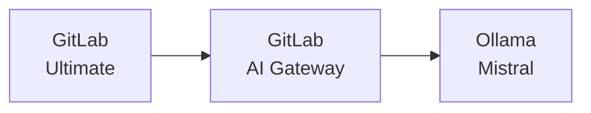



- 티어: Ultimate
- 추가 기능: GitLab Duo Pro 또는 Enterprise
- 제공 서비스: GitLab Self-Managed



이 문서는 GitLab 및 GitLab Duo를 Ollama에서 Mistral 모델을 실행하는 자체 호스팅된 LLM(Large Language Model)과 설치하고 통합하는 방법을 설명합니다. 이 가이드는 3개의 서로 다른 가상 머신을 사용한 설정을 설명하며 AWS 또는 GCP에서 따라할 수 있습니다. 물론 이 프로세스는 다른 배포 플랫폼에도 적용할 수 있습니다.

이 가이드는 원하는 설정을 작동하게 하기 위한 포괄적인 종단 간 지침 모음입니다. 최종 구성 생성을 지원하는 데 사용된 GitLab 문서의 여러 영역에 대한 참조를 표시합니다. 참조된 문서는 특정 시나리오에 맞게 구현을 조정하기 위해 더 많은 배경이 필요할 때 중요합니다.
<!-- TOC -->

- GitLab Duo Self-Hosted: Ollama 통합을 포함한 완전한 AWS/Google Cloud 배포 가이드
  - [필수 조건](#prerequisites)
    - [가상 머신](#virtual-machines)
      - [리소스 및 운영 체제](#resources--operating-system)
      - [네트워킹](#networking)
    - [GitLab](#gitlab)
      - [라이선싱](#licensing)
      - [SSL/TLS](#ssltls)
- [소개](#introduction)
  - [설치](#installation)
    - [AI Gateway](#ai-gateway)
    - [Ollama](#ollama)
      - [설치](#installation)
      - [모델 배포](#model-deployment)
  - [통합](#integration)
    - [GitLab Duo를 루트 사용자에게 활성화](#enable-gitlab-duo-for-root-user)
    - [GitLab에서 자체 호스팅 모델 구성](#configure-gitlab-duo-self-hosted-in-gitlab)
  - [검증](#verification)

<!-- /TOC -->

## 전제 조건 {#prerequisites}

### 가상 머신 {#virtual-machines}

#### 리소스 및 운영 체제 {#resources--operating-system}

GitLab, GitLab AI Gateway 및 Ollama를 각각 자신의 별도 가상 머신에 설치합니다. 이 가이드에서는 Ubuntu 24.0x를 사용했지만 조직의 요구 사항과 선호도를 충족하는 모든 Unix 기반 운영 체제를 선택할 수 있는 유연성이 있습니다. 그러나 이 설정에는 Unix 기반 운영 체제를 사용하는 것이 필수입니다. 이는 시스템 안정성, 보안 및 필요한 소프트웨어 스택과의 호환성을 보장합니다. 이 설정은 테스트 및 평가 단계에서 비용과 성능 간에 좋은 균형을 제공합니다. 다만 프로덕션으로 이동할 때 사용 요구 사항 및 팀 규모에 따라 GPU 인스턴스 유형을 업그레이드해야 할 수 있습니다.

|                | **GCP**       | **AWS**     | **OS**    | **Disk** |
|----------------|---------------|-------------|-----------|----------|
| **GitLab**     | c2-standard-4 | c6xlarge    | Ubuntu 24 | 50 GB    |
| **AI Gateway** | e2-medium     | t2.medium   | Ubuntu 24 | 20 GB    |
| **Ollama**     | n1-standard-4 | g4dn.xlarge | Ubuntu 24 | 50 GB    |

구성 요소 및 그 용도에 대한 자세한 내용은 [AI Gateway](../../administration/gitlab_duo/gateway.md)를 참조하세요.



이러한 구성 요소들이 함께 작동하여 자체 호스팅 AI 기능을 실현합니다. 이 가이드는 Ollama를 LLM 서버로 사용하여 완전한 자체 호스팅 AI 환경을 구축하기 위한 자세한 지침을 제공합니다.

> [!note]
> 전체 프로덕션 환경의 경우 [공식 문서](../../administration/gitlab_duo_self_hosted/supported_models_and_hardware_requirements.md)에서 1x NVIDIA A100(40GB)과 같은 더 강력한 GPU 인스턴스를 권장하지만, g4dn.xlarge 인스턴스 유형은 소규모 사용자 팀의 평가 목적으로는 충분해야 합니다.

#### 네트워킹 {#networking}

GitLab에 대한 액세스를 활성화하려면 정적 공개 IP 주소(AWS의 Elastic IP 또는 Google Cloud의 외부 IP)가 필요합니다. 다른 모든 구성 요소는 내부 통신을 위해 정적 내부 IP 주소를 사용할 수 있으며 사용해야 합니다. 모든 VM이 동일한 네트워크에 있고 직접 통신할 수 있다고 가정합니다.

|                | **Public IP** | **Private IP** |
|----------------|---------------|----------------|
| **GitLab**     | 예           | 예            |
| **AI Gateway** | 아니요            | 예            |
| **Ollama**     | 아니요            | 예            |

내부 IP를 사용하는 이유는?

- 내부 IP는 AWS/Google Cloud의 인스턴스 수명 동안 정적으로 유지됩니다.
- GitLab 서버만 외부 액세스가 필요하며, Ollama와 같은 다른 구성 요소는 내부 통신에 의존합니다.
- 이 방식은 공개 IP 주소 비용을 피하고 LLM 서버를 인터넷에서 접근할 수 없게 유지하여 보안을 강화함으로써 비용을 절감합니다.

### GitLab {#gitlab}

이 가이드의 나머지 부분은 다음 요구 사항을 충족하는 GitLab의 인스턴스가 이미 설치되어 실행 중이라고 가정합니다:

#### 라이선싱 {#licensing}

GitLab Ultimate 라이선스와 GitLab Duo Enterprise 라이선스가 모두 필요합니다. GitLab Ultimate 라이선스는 온라인 또는 오프라인 라이선싱 옵션으로 작동합니다. 이 문서는 두 라이선스 모두 이전에 획득되었으며 구현에 사용할 수 있다고 가정합니다.


#### SSL/TLS {#ssltls}

유효한 SSL 인증서(예: Let's Encrypt)를 GitLab 인스턴스에 구성해야 합니다. 이것은 단순한 보안 모범 사례일 뿐만 아니라 기술적 요구 사항입니다:

- AI Gateway 시스템(2025년 1월 현재)은 GitLab과 통신할 때 적절한 SSL 검증을 엄격하게 요구합니다.
- 자체 서명 인증서는 AI Gateway에서 승인되지 않습니다.
- 비 SSL 연결(HTTP)도 지원되지 않습니다.

GitLab은 편리한 자동화된 SSL 설정 프로세스를 제공합니다:

- GitLab 설치 중에 `https://` 접두사로 URL을 지정하기만 하면 됩니다.
- GitLab은 자동으로 다음을 수행합니다:
  - Let's Encrypt SSL 인증서 획득
  - 인증서 설치
  - HTTPS 구성
- 수동 SSL 인증서 관리가 필요하지 않습니다.

GitLab 설치 중에 절차는 다음과 같이 보입니다:

1. GitLab 인스턴스에 공개 및 정적 IP 주소를 할당하고 연결합니다.
1. 해당 주소를 가리키도록 DNS 레코드를 구성합니다.
1. GitLab 설치 중에 HTTPS URL을 사용합니다(예: `https://gitlab.yourdomain.com`)
1. GitLab이 SSL 인증서 설정을 자동으로 처리하도록 합니다.

자세한 내용은 [문서](https://docs.gitlab.com/omnibus/settings/ssl/) 페이지를 참조하세요.

## 소개 {#introduction}

GitLab Duo Self-Hosted를 설정하기 전에 AI의 작동 방식을 이해하는 것이 중요합니다. AI 모델은 데이터로 훈련된 AI의 뇌입니다. 이 뇌는 LLM Serving Platform 또는 단순히 "Serving Platform"이라고 불리는 프레임워크가 필요합니다. AWS에서는 "Amazon Bedrock", Azure에서는 "Azure OpenAI Service", ChatGPT에서는 자체 플랫폼입니다. Anthropic의 경우 "Claude."입니다. 자체 호스팅 모델의 경우 Ollama는 일반적인 선택입니다.

예를 들어:

- AWS에서 serving platform은 Amazon Bedrock입니다.
- Azure에서는 Azure OpenAI Service입니다.
- ChatGPT의 경우 OpenAI의 독점 플랫폼입니다.
- Anthropic의 경우 serving platform은 Claude입니다.

자신의 AI 모델을 호스팅할 때 serving platform을 선택해야 합니다. 자체 호스팅 모델의 인기 있는 옵션은 Ollama입니다.

이 비유에서 ChatGPT의 뇌 부분은 GPT-4 모델이며, Anthropic 생태계에서는 Claude 3.7 Sonnet 모델입니다. serving platform은 뇌를 세계와 연결하는 중요한 프레임워크로 작동하여 "생각"하고 효과적으로 상호 작용할 수 있게 합니다.

지원되는 serving platform 및 모델에 대한 자세한 내용은 [LLM Serving Platform](../../administration/gitlab_duo_self_hosted/supported_llm_serving_platforms.md)과 [모델](../../administration/gitlab_duo_self_hosted/supported_models_and_hardware_requirements.md)을 참조하세요.

**What is Ollama**?

Ollama는 로컬 환경에서 대형 언어 모델(LLM)을 실행하기 위한 간소화된 오픈 소스 프레임워크입니다. 이는 AI 모델 배포의 전통적으로 복잡한 프로세스를 단순화하여 효율적이고 유연하며 확장 가능한 AI 솔루션을 찾는 개인과 조직 모두에게 액세스할 수 있도록 합니다.

주요 특징:

1. **Simplified Deployment**: 사용자 친화적인 명령줄 인터페이스는 빠른 설정과 번거롭지 않은 설치를 보장합니다.
1. **Wide Model Support**: Llama 2, Mistral 및 Code Llama와 같은 인기 있는 오픈 소스 모델과 호환됩니다.
1. **Optimized Performance**: GPU와 CPU 환경 모두에서 원활하게 작동하여 리소스 효율성을 제공합니다.
1. **Integration-Ready**: 기존 도구 및 워크플로우와 쉽게 통합할 수 있도록 OpenAI와 호환되는 API를 제공합니다.
1. **No Containers Needed**: 호스트 시스템에서 직접 실행되므로 Docker 또는 컨테이너화된 환경이 필요하지 않습니다.
1. **Versatile Hosting Options**: 로컬 머신, 온프레미스 서버 또는 클라우드 GPU 인스턴스에 배포할 수 있습니다.

단순함과 성능을 위해 설계된 Ollama는 사용자가 기존 AI 인프라의 복잡성 없이 LLM의 힘을 활용할 수 있게 합니다. 설정 및 지원되는 모델에 대한 자세한 내용은 나중에 문서에서 다룰 것입니다.

- [Ollama 모델 지원](https://ollama.com/search)

## 설치 {#installation}

### AI Gateway {#ai-gateway}

공식 설치 가이드는 [GitLab AI Gateway 설치](../../install/install_ai_gateway.md)에서 사용할 수 있지만, 다음은 AI Gateway 설정을 위한 간소화된 방법입니다. 2025년 1월 현재 `gitlab/model-gateway:self-hosted-v17.6.0-ee` 이미지는 GitLab 17.7과 함께 작동하도록 확인되었습니다.

1. 다음을 확인하세요 ...

   - API Gateway VM에 대한 TCP 포트 5052가 허용됩니다(보안 그룹 구성 확인).
   - 다음 코드 스니펫에서 `GITLAB_DOMAIN`을 YOUR GitLab 인스턴스의 도메인 이름으로 바꿉니다:

1. GitLab AI Gateway를 시작하려면 다음 명령을 실행합니다:

   ```shell
   GITLAB_DOMAIN="gitlab.yourdomain.com"
   docker run -p 5052:5052 \
     -e AIGW_GITLAB_URL=$GITLAB_DOMAIN \
     -e AIGW_GITLAB_API_URL=https://${GITLAB_DOMAIN}/api/v4/ \
     -e AIGW_AUTH__BYPASS_EXTERNAL=true \
     gitlab/model-gateway:self-hosted-v17.6.0-ee
   ```

다음 표에서 주요 환경 변수 및 인스턴스 설정에서의 역할을 설명합니다:

| **변수**                 | **설명** |
|------------------------------|-----------------|
| `AIGW_GITLAB_URL`            | GitLab 인스턴스 도메인입니다. |
| `AIGW_GITLAB_API_URL`        | GitLab 인스턴스의 API 엔드포인트입니다. |
| `AIGW_AUTH__BYPASS_EXTERNAL` | 인증 처리를 위한 구성입니다. |

초기 설정 및 테스트 단계에서 AIGW_AUTH__BYPASS_EXTERNAL=true를 설정하여 인증을 우회하고 문제를 방지할 수 있습니다. 그러나 이 구성은 프로덕션 환경이나 인터넷에 노출된 서버에서 사용해서는 안 됩니다.

### Ollama {#ollama}

#### 설치 {#installation-1}

1. 공식 설치 스크립트를 사용하여 Ollama를 설치합니다:

   ```shell
   curl --fail --silent --show-error --location "https://ollama.com/install.sh" | sh
   ```

1. `OLLAMA_HOST` 환경 변수를 시작 구성에 추가하여 내부 IP에서 수신하도록 Ollama를 구성합니다.

   ```shell
   systemctl edit ollama.service
   ```

   ```ini
   [Service]
   Environment="OLLAMA_HOST=172.31.11.27"
   ```

   > [!note]
   > IP 주소를 실제 서버의 내부 IP 주소로 바꿉니다.
1. 서비스를 다시 로드하고 다시 시작합니다:

   ```shell
   systemctl daemon-reload
   systemctl restart ollama
   ```

#### 모델 배포 {#model-deployment}

1. 환경 변수를 설정합니다:

   ```shell
   export OLLAMA_HOST=172.31.11.27
   ```

1. Mistral Instruct 모델을 설치합니다:

   ```shell
   ollama pull mistral:instruct
   ```

   `mistral:instruct` 모델에는 약 4.1GB의 저장 공간이 필요하며 연결 속도에 따라 다운로드하는 데 시간이 걸립니다.
1. 모델 설치를 확인합니다:

   ```shell
   ollama list
   ```

   명령은 목록에 설치된 모델을 표시해야 합니다. 

## 통합 {#integration}

### GitLab Duo를 루트 사용자에게 활성화 {#enable-gitlab-duo-for-root-user}

1. GitLab 웹 인터페이스에 액세스합니다.

   - 관리자 사용자로 로그인합니다.
   - 관리자 영역으로 이동합니다(렌치 아이콘).

1. Duo 라이선스 구성

   - 왼쪽 사이드바의 "구독" 섹션으로 이동합니다.
   - "사용된 좌석: 1/5"가 표시되어 사용 가능한 Duo 좌석을 나타냅니다.
   - 참고: 루트 사용자에게는 1개의 좌석만 필요합니다.

1. 루트에 Duo 라이선스 할당

   - "관리자 영역" > "GitLab Duo" > "좌석 사용률"로 이동합니다.
   - 사용자 목록에서 루트 사용자(관리자)를 찾습니다.
   - "GitLab Duo Enterprise" 열의 스위치를 전환하여 루트 사용자에게 Duo를 활성화합니다.
   - 활성화되면 토글 버튼이 파란색으로 변합니다.


> [!note]
> 루트 사용자만 Duo를 활성화하는 것은 초기 설정 및 테스트에 충분합니다. 필요한 경우 나중에 좌석 라이선스 제한 범위 내에서 추가 사용자에게 Duo 액세스 권한을 부여할 수 있습니다.

### GitLab에서 GitLab Duo Self-Hosted 구성 {#configure-gitlab-duo-self-hosted-in-gitlab}

1. GitLab Duo Self-Hosted 구성에 액세스합니다.

   - 관리자 영역 > GitLab Duo > "GitLab Duo Self-Hosted 구성"으로 이동합니다.
   - "자체 호스팅 모델 추가" 버튼을 클릭합니다.

   
1. 모델 설정 구성

   - **배포 이름**: 설명이 포함된 이름(예: `Mistral-7B-Instruct-v0.3 on AWS Tokyo`)을 선택합니다.
   - **모델 패밀리**: 드롭다운 목록에서 "Mistral"을 선택합니다.
   - **엔드포인트**: Ollama 서버 URL을 다음 형식으로 입력합니다:

     ```plaintext
     http://[Internal-IP]:11434/v1
     ```

     예: `http://172.31.11.27:11434/v1`

   - **모델 식별자**: `custom_openai/mistral:instruct`을 입력합니다.
   - **API Key**: 이 필드는 비워둘 수 없으므로 자리 표시자 텍스트(예: `test`)를 입력합니다.


1. AI 기능 활성화

   - "AI 원본 기능" 탭으로 이동합니다.
   - 구성된 모델을 다음 기능에 할당합니다:
     - 코드 제안 > 코드 생성
     - 코드 제안 > 코드 완성
     - GitLab Duo Chat > 일반 채팅
   - 각 기능에 대해 드롭다운 목록에서 배포된 모델을 선택합니다.


이러한 설정은 GitLab 인스턴스와 AI Gateway를 통한 자체 호스팅 Ollama 모델 간의 연결을 설정하여 GitLab 내에서 AI 원본 기능을 활성화합니다.

## 검증 {#verification}

1. GitLab에서 테스트 그룹을 만듭니다.
1. GitLab Duo Chat 아이콘이 오른쪽 위 모서리에 나타나야 합니다.
1. 이는 GitLab과 AI Gateway 간의 통합이 성공적이라는 것을 나타냅니다.


