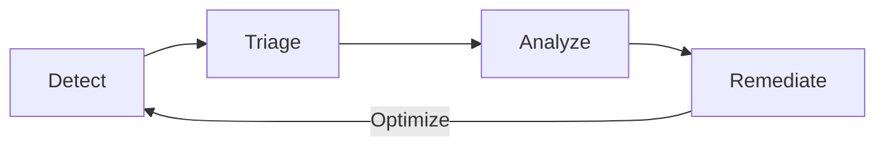



- 티어:  Free, Premium, Ultimate
- 제공 서비스: GitLab.com, GitLab Self-Managed, GitLab Dedicated



GitLab 애플리케이션 보안 테스트는 개발 중 및 변경 사항이 배포된 후 취약성을 지속적으로 감지합니다.

애플리케이션 보안 테스트는 프로젝트의 소스 코드, 의존성, 라이브러리 및 컨테이너 이미지를 스캔합니다. 런타임 취약성은 테스트 환경에서 배포된 애플리케이션에 대한 시뮬레이션된 공격 및 퍼즈 테스팅을 통해 감지됩니다.

개발 중에는 코드가 커밋되거나 머지 리퀘스트가 생성될 때 CI/CD 파이프라인의 일부로 스캔이 자동으로 실행됩니다. 보안 결과가 머지 리퀘스트 및 IDE에 직접 표시되어 코드가 병합되기 전에 개발자에게 알립니다. 이러한 사전 예방적 접근 방식은 개발 후반에 문제를 수정하는 비용과 노력을 줄입니다.

개발 주기 외부에서는 보안 스캔을 요청 시 실행하거나 정기적인 간격으로 실행하도록 예약할 수 있습니다. 취약성 데이터베이스가 새로 발견된 위협 및 제로데이 익스플로잇으로 업데이트되면 프로젝트의 소프트웨어 라이브러리 및 컨테이너 이미지에 대한 새로운 위험이 식별됩니다. 함께, 이러한 방법들은 원래 개발 주기 동안 이전에 알려지지 않은 위험을 식별합니다.

클릭스루 데모는 [파이프라인에 보안 통합](https://gitlab.navattic.com/gitlab-scans)을 참조하세요.
<!-- Demo published on 2024-01-15 -->

## 취약성 관리 주기 {#vulnerability-management-cycle}

GitLab은 애플리케이션 보안 태세를 지속적으로 개선하는 데 도움이 되는 포괄적인 취약성 관리 워크플로를 지원합니다. 이 워크플로는 감지, 분류, 분석, 수정 및 최적화의 지속적인 주기입니다.

1. 감지 - 자동화된 보안 테스트를 통해 취약성을 식별합니다.
1. 분류 - 취약성을 평가하고 우선순위를 지정하여 즉시 주의가 필요한 것과 나중에 처리할 수 있는 것을 결정합니다.
1. 분석 - 확인된 취약성의 상세 분석을 수행하여 영향을 이해하고 적절한 수정 전략을 결정합니다.
1. 수정 - 취약성의 근본 원인을 해결하거나 적절한 위험 완화 조치를 구현합니다.

각 단계의 결과를 사용하여 다음 주기를 개선합니다. 예를 들어, 분석 중에 식별된 거짓 양성을 줄이기 위해 감지 규칙을 조정합니다.

이 주기는 각 코드 변경마다 반복되어 애플리케이션 보안과 취약성 관리 프로세스를 점진적으로 개선합니다. 이러한 지속적인 개선은 취약성 관리가 시간이 지남에 따라 더욱 효과적이고 효율적이 되도록 합니다.
