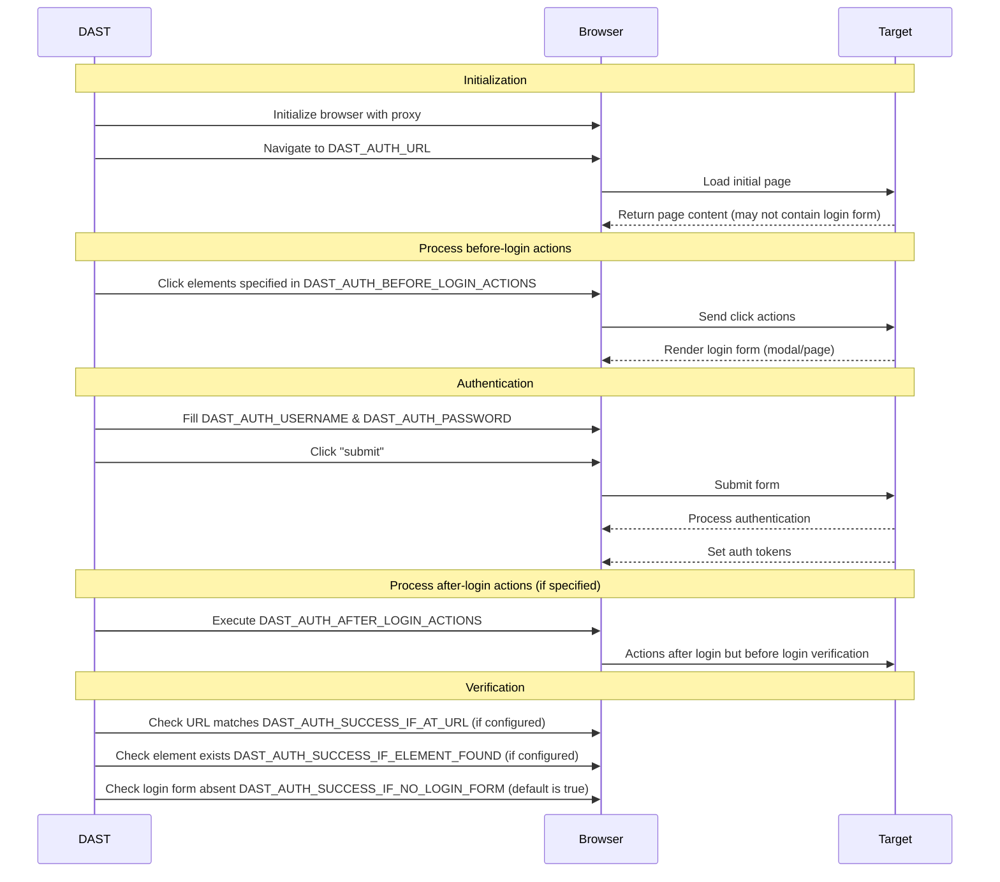

완전한 범위를 위해 DAST 분석기는 테스트 중인 애플리케이션으로 인증해야 합니다. 이를 위해서는 DAST CI/CD 작업에서 인증 자격 증명과 인증 방법을 구성해야 합니다.

DAST는 다음을 위해 인증이 필요합니다:

- 실제 공격을 시뮬레이션하고 공격자가 악용할 수 있는 취약성을 식별합니다.
- 사용자별 기능과 인증 후에만 표시될 수 있는 사용자 지정 동작을 테스트합니다.

DAST 작업은 브라우저에서 로그인 양식을 입력하고 제출하여 애플리케이션으로 인증합니다. 양식이 제출되면 DAST 작업은 인증이 성공했는지 확인합니다. 인증이 성공하면 DAST 작업은 계속 진행하며 대상 애플리케이션을 크롤링할 때 재사용할 자격 증명을 저장합니다. 그렇지 않으면 DAST 작업이 중지됩니다.

DAST에서 지원하는 인증 방법은 다음과 같습니다:

- 단일 단계 로그인 양식
- 다단계 로그인 양식
- 구성된 대상 URL 외부의 URL로 인증

인증 자격 증명을 선택할 때:

- **DO NOT** 프로덕션 시스템, 프로덕션 서버에 대해 유효하거나 프로덕션 데이터에 액세스하는 데 사용되는 자격 증명을 사용하지 마세요.
- **DO NOT** 프로덕션 서버에 대해 인증된 스캔을 실행하지 마세요. 인증된 스캔은 인증된 사용자가 수행할 수 있는 **모두** 기능(데이터 수정 또는 삭제, 양식 제출, 링크 따라가기 포함)을 수행할 수 있습니다. 인증된 스캔은 프로덕션이 아닌 시스템 또는 서버에 대해서만 실행하세요.
- DAST가 전체 애플리케이션을 테스트할 수 있는 자격 증명을 제공합니다.
- 있는 경우 향후 참조를 위해 자격 증명의 만료 날짜를 기록합니다. 예를 들어 1Password와 같은 암호 관리자를 사용합니다.

다음 다이어그램은 인증의 다양한 단계에서 인증 변수의 사용을 보여줍니다:



## 시작하기 {#getting-started}

> [!note]
> 분석기의 인증이 여전히 작동하는지 주기적으로 확인해야 합니다. 애플리케이션 변경으로 인해 시간이 지남에 따라 중단되는 경향이 있습니다.

DAST 인증 스캔을 실행하려면:

- [전제 조건](#prerequisites) 인증에 대한 조건을 읽습니다.
- [대상 웹 사이트 업데이트](#update-the-target-website)를 인증된 사용자의 랜딩 페이지로 설정합니다.
- 로그인 양식에 사용자 이름, 암호 및 제출 버튼이 단일 페이지에 있으면 [CI/CD 변수](#available-cicd-variables)를 사용하여 [단일 단계](#configuration-for-a-single-step-login-form) 로그인 양식 인증을 구성합니다.
- 로그인 양식에 사용자 이름과 암호 필드가 다른 페이지에 있으면 [CI/CD 변수](#available-cicd-variables)를 사용하여 [다단계](#configuration-for-a-multi-step-login-form) 로그인 양식 인증을 구성합니다.
- 사용자가 스캔 중에 [로그아웃](#excluding-logout-urls)되지 않았는지 확인하세요.

### 전제 조건 {#prerequisites}

- 스캔 중에 인증하려는 사용자의 사용자 이름과 암호가 있습니다.
- DAST가 애플리케이션으로 인증할 수 있는지 확인하려면 [알려진 문제](#known-issues)를 확인했습니다.
- [양식 인증](#form-authentication)을 사용 중인 경우 전제 조건을 충족했습니다.
- 양식 인증 플로우에 [시간 기반 일회성 암호](#totp-authentication)가 포함된 경우 추가 전제 조건을 충족했습니다.
- 인증이 성공했는지 여부를 [확인](#verifying-authentication-is-successful)할 수 있는 방법을 생각해 봤습니다.

#### 양식 인증 {#form-authentication}

- 애플리케이션의 로그인 양식 URL을 알고 있습니다. 또는 인증 URL에서 로그인 양식으로 이동하는 방법을 알고 있습니다([로그인 양식으로 이동하기 위해 클릭](#clicking-to-go-to-the-login-form) 참조).
- DAST가 해당 값을 입력하는 데 사용하는 사용자 이름 및 암호 HTML 필드의 [선택기](#finding-an-elements-selector)를 알고 있습니다.
- 선택했을 때 로그인 양식을 제출하는 요소의 [선택기](#finding-an-elements-selector)를 알고 있습니다.

#### TOTP 인증 {#totp-authentication}



- 스캐너 버전 6.9에서 [도입](https://gitlab.com/groups/gitlab-org/-/epics/13633)되었습니다.



- 테스트 사용자의 TOTP 등록을 위한 Base32로 인코딩된 비밀 키가 있습니다.
- 인증 공급자가 다음 TOTP 구성(Google Authenticator와 동일)을 지원하는지 확인했습니다:
  - HMAC 알고리즘: SHA-1
  - 시간 단계: 30초
  - 토큰 길이: 6
- DAST가 생성된 TOTP 토큰을 입력하는 데 사용하는 TOTP 필드의 [선택기](#finding-an-elements-selector)를 알고 있습니다.
- 암호와 별도로 제출되는 경우 TOTP 토큰을 제출하는 요소의 [선택기](#finding-an-elements-selector)를 알고 있습니다.

### 사용 가능한 CI/CD 변수 {#available-cicd-variables}

DAST 인증 CI/CD 변수 목록은 [인증 변수](variables.md#authentication)를 참조하세요.

DAST CI/CD 변수 테이블은 Rake 작업 `bundle exec rake gitlab:dast_variables:compile_docs`에 의해 생성됩니다. [`lib/gitlab/security/dast_variables.rb`](https://gitlab.com/gitlab-org/gitlab/-/blob/master/lib/gitlab/security/dast_variables.rb)에 정의된 변수 메타데이터를 사용합니다.

### 대상 웹 사이트 업데이트 {#update-the-target-website}

CI/CD 변수 `DAST_TARGET_URL`를 사용하여 정의된 대상 웹 사이트는 DAST가 애플리케이션 크롤링을 시작하는 데 사용하는 URL입니다.

인증된 스캔에 최적의 크롤링 결과를 위해 대상 웹 사이트는 사용자가 인증된 후에만 액세스할 수 있는 URL이어야 합니다. 종종 이는 사용자가 로그인한 후 도착하는 페이지의 URL입니다.

예를 들어:

```yaml
include:
  - template: DAST.gitlab-ci.yml

dast:
  variables:
    DAST_TARGET_URL: "https://example.com/dashboard/welcome"
    DAST_AUTH_URL: "https://example.com/login"
```

### HTTP 인증 구성 {#configuration-for-http-authentication}

Basic Authentication과 같은 [HTTP 인증 스키마](https://www.chromium.org/developers/design-documents/http-authentication/)를 사용하려면 `DAST_AUTH_TYPE` 값을 `basic-digest`로 설정할 수 있습니다. Negotiate 또는 NTLM과 같은 다른 스키마는 작동할 수 있지만 현재 자동화된 테스트 범위 부족으로 인해 공식적으로 지원되지 않습니다.

구성을 위해서는 CI/CD 변수 `DAST_AUTH_TYPE`, `DAST_AUTH_URL`, `DAST_AUTH_USERNAME`, `DAST_AUTH_PASSWORD`를 DAST 작업에 대해 정의해야 합니다. 고유한 로그인 URL이 없으면 `DAST_AUTH_URL`를 `DAST_TARGET_URL`과 동일한 URL로 설정하세요.

```yaml
include:
  - template: DAST.gitlab-ci.yml

dast:
  variables:
    DAST_TARGET_URL: "https://example.com"
    DAST_AUTH_TYPE: "basic-digest"
    DAST_AUTH_URL: "https://example.com"
```

보안 위험을 초래할 수 있으므로 YAML 작업 정의 파일에서 `DAST_AUTH_USERNAME`와 `DAST_AUTH_PASSWORD`를 정의하지 마세요. 대신 GitLab UI를 사용하여 마스킹된 CI/CD 변수로 만듭니다. 자세한 내용은 [사용자 정의 CI/CD 변수](../../../../../ci/variables/_index.md#for-a-project)를 참조하세요.

### 단일 단계 로그인 양식 구성 {#configuration-for-a-single-step-login-form}

단일 단계 로그인 양식은 모든 로그인 양식 요소가 단일 페이지에 있습니다. 구성을 위해서는 CI/CD 변수 `DAST_AUTH_URL`, `DAST_AUTH_USERNAME`, `DAST_AUTH_USERNAME_FIELD`, `DAST_AUTH_PASSWORD`, `DAST_AUTH_PASSWORD_FIELD`, `DAST_AUTH_SUBMIT_FIELD`를 DAST 작업에 대해 정의해야 합니다.

작업 정의 YAML에서 URL과 필드의 선택기를 설정해야 합니다(예:

```yaml
include:
  - template: DAST.gitlab-ci.yml

dast:
  variables:
    DAST_TARGET_URL: "https://example.com"
    DAST_AUTH_URL: "https://example.com/login"
    DAST_AUTH_USERNAME_FIELD: "css:[name=username]"
    DAST_AUTH_PASSWORD_FIELD: "css:[name=password]"
    DAST_AUTH_SUBMIT_FIELD: "css:button[type=submit]"
```

보안 위험을 초래할 수 있으므로 YAML 작업 정의 파일에서 `DAST_AUTH_USERNAME`와 `DAST_AUTH_PASSWORD`를 정의하지 마세요. 대신 GitLab UI를 사용하여 마스킹된 CI/CD 변수로 만듭니다. 자세한 내용은 [사용자 정의 CI/CD 변수](../../../../../ci/variables/_index.md#for-a-project)를 참조하세요.

### 다단계 로그인 양식 구성 {#configuration-for-a-multi-step-login-form}

다단계 로그인 양식은 두 페이지로 구성됩니다. 첫 번째 페이지에는 사용자 이름과 다음 제출 버튼이 있는 양식이 있습니다. 사용자 이름이 유효하면 후속 페이지의 두 번째 양식에 암호와 양식 제출 버튼이 있습니다.

구성을 위해서는 DAST 작업에 대해 정의할 CI/CD 변수가 필요합니다:

- `DAST_AUTH_URL`
- `DAST_AUTH_USERNAME`
- `DAST_AUTH_USERNAME_FIELD`
- `DAST_AUTH_FIRST_SUBMIT_FIELD`
- `DAST_AUTH_PASSWORD`
- `DAST_AUTH_PASSWORD_FIELD`
- `DAST_AUTH_SUBMIT_FIELD`.

작업 정의 YAML에서 URL과 필드의 선택기를 설정해야 합니다(예:

```yaml
include:
  - template: DAST.gitlab-ci.yml

dast:
  variables:
    DAST_TARGET_URL: "https://example.com"
    DAST_AUTH_URL: "https://example.com/login"
    DAST_AUTH_USERNAME_FIELD: "css:[name=username]"
    DAST_AUTH_FIRST_SUBMIT_FIELD: "css:button[name=next]"
    DAST_AUTH_PASSWORD_FIELD: "css:[name=password]"
    DAST_AUTH_SUBMIT_FIELD: "css:button[type=submit]"
```

보안 위험을 초래할 수 있으므로 YAML 작업 정의 파일에서 `DAST_AUTH_USERNAME`와 `DAST_AUTH_PASSWORD`를 정의하지 마세요. 대신 GitLab UI를 사용하여 마스킹된 CI/CD 변수로 만듭니다. 자세한 내용은 [사용자 정의 CI/CD 변수](../../../../../ci/variables/_index.md#for-a-project)를 참조하세요.

### 시간 기반 일회성 암호(TOTP) 구성 {#configuration-for-time-based-one-time-password-totp}

TOTP 구성을 위해서는 DAST 작업에 대해 정의할 이러한 CI/CD 변수가 필요합니다:

- `DAST_AUTH_OTP_FIELD`
- `DAST_AUTH_OTP_KEY`

암호가 제출된 후 자체 양식에서 TOTP 토큰을 제출하면 이 변수도 정의해야 합니다:

- `DAST_AUTH_OTP_SUBMIT_FIELD`

`_FIELD` 선택기 변수는 작업 정의 YAML에서 정의할 수 있습니다(예:

```yaml
include:
  - template: DAST.gitlab-ci.yml

dast:
  variables:
    DAST_TARGET_URL: "https://example.com"
    DAST_AUTH_URL: "https://example.com/login"
    DAST_AUTH_USERNAME_FIELD: "css:[name=username]"
    DAST_AUTH_PASSWORD_FIELD: "css:[name=password]"
    DAST_AUTH_SUBMIT_FIELD: "css:button[type=submit]"
    DAST_AUTH_OTP_FIELD: "name:otp"
    DAST_AUTH_OTP_SUBMIT_FIELD: "css:input[type=submit]"
```

보안 위험을 초래할 수 있으므로 YAML 작업 정의 파일에서 `DAST_AUTH_OTP_KEY`를 정의하지 마세요. 대신 GitLab UI를 사용하여 마스킹된 CI/CD 변수로 만듭니다. 자세한 내용은 [사용자 정의 CI/CD 변수](../../../../../ci/variables/_index.md#for-a-project)를 참조하세요.

### Single Sign-On(SSO) 구성 {#configuration-for-single-sign-on-sso}

사용자가 애플리케이션에 로그인할 수 있으면 대부분의 경우 DAST도 로그인할 수 있습니다. 애플리케이션이 Single Sign-On을 사용하더라도. SSO 솔루션을 사용하는 애플리케이션은 [단일 단계](#configuration-for-a-single-step-login-form) 또는 [다단계](#configuration-for-a-multi-step-login-form) 로그인 양식 구성 가이드를 사용하여 DAST 인증을 구성해야 합니다.

DAST는 사용자가 외부 Identity Provider의 사이트로 리디렉션되어 로그인하는 인증 프로세스를 지원합니다. SSO 인증 프로세스가 지원되는지 확인하려면 DAST 인증의 [알려진 문제](#known-issues)를 확인하세요.

### Windows 통합 인증(Kerberos) 구성 {#configuration-for-windows-integrated-authentication-kerberos}

Windows 통합 인증(Kerberos)은 Windows 도메인 내에 호스팅되는 업무용(LOB) 애플리케이션의 일반적인 인증 메커니즘입니다. 사용자의 컴퓨터 로그인을 사용하여 암호 없는 인증을 제공합니다.

이 형식의 인증을 구성하려면 다음 단계를 수행하세요:

1. IT/운영 팀의 지원을 받아 필요한 정보를 수집합니다.
1. `dast` 작업 정의를 `.gitlab-ci.yml` 파일에서 만들거나 업데이트합니다.
1. 수집한 정보를 사용하여 `krb5.conf` 파일의 예를 채웁니다.
1. 필요한 작업 변수를 설정합니다.
1. 프로젝트 **설정** 페이지를 사용하여 필요한 비밀 변수를 설정합니다.
1. 인증이 작동하는지 테스트하고 확인합니다.

IT/운영 부서의 지원을 받아 다음 정보를 수집합니다:

- Windows 도메인 또는 Kerberos Realm의 이름(`EXAMPLE.COM`과 같은 이름에 마침표가 있어야 함)
- Windows/Kerberos 도메인 컨트롤러의 호스트 이름
- Kerberos의 경우 인증 서버 이름입니다. Windows 도메인의 경우 도메인 컨트롤러입니다.

`krb5.conf` 파일을 만듭니다:

```ini
[libdefaults]
  # Realm is another name for domain name
  default_realm = EXAMPLE.COM
  # These settings are not needed for Windows Domains
  # they support other Kerberos implementations
  kdc_timesync = 1
  ccache_type = 4
  forwardable = true
  proxiable = true
  rdns = false
  fcc-mit-ticketflags = true
[realms]
  EXAMPLE.COM = {
    # Domain controller or KDC
    kdc = kdc.example.com
    # Domain controller or admin server
    admin_server = kdc.example.com
  }
[domain_realm]
  # Mapping DNS domains to realms/Windows domain
  # DNS domains provided by DAST_AUTH_NEGOTIATE_DELEGATION
  # should also be represented here (but without the wildcard)
  .example.com = EXAMPLE.COM
  example.com = EXAMPLE.COM
```

이 구성은 `DAST_AUTH_NEGOTIATE_DELEGATION` 변수를 사용합니다. 이 변수는 통합 인증을 허용하는 데 필요한 다음 Chromium 정책을 설정합니다:

- [AuthServerAllowlist](https://chromeenterprise.google/policies/#AuthServerAllowlist)
- [AuthNegotiateDelegateAllowlist](https://chromeenterprise.google/policies/#AuthNegotiateDelegateAllowlist)

이 변수의 설정은 Windows 도메인 또는 Kerberos Realm과 관련된 DNS 도메인입니다. 다음을 제공해야 합니다:

- 소문자와 대문자 모두.
- 와일드카드 패턴 및 도메인 이름만 사용.

예제에서 Windows 도메인은 `EXAMPLE.COM`이고 DNS 도메인은 `example.com`입니다. 이는 `DAST_AUTH_NEGOTIATE_DELEGATION`에 대해 `*.example.com,example.com,*.EXAMPLE.COM,EXAMPLE.COM`의 값을 제공합니다.

작업 정의로 모두 함께 가져옵니다:

```yaml
# This job will extend the dast job defined in
# the DAST template which must also be included.
dast:
  image:
    name: "$SECURE_ANALYZERS_PREFIX/dast:$DAST_VERSION$DAST_IMAGE_SUFFIX"
    docker:
      user: root
  variables:
    DAST_TARGET_URL: https://target.example.com
    DAST_AUTH_URL: https://target.example.com
    DAST_AUTH_TYPE: basic-digest
    DAST_AUTH_NEGOTIATE_DELEGATION: '*.example.com,example.com,*.EXAMPLE.COM,EXAMPLE.COM'
    # Not shown -- DAST_AUTH_USERNAME, DAST_AUTH_PASSWORD set via Settings -> CI -> Variables
  before_script:
    - KRB5_CONF='
[libdefaults]
  default_realm = EXAMPLE.COM
  kdc_timesync = 1
  ccache_type = 4
  forwardable = true
  proxiable = true
  rdns = false
  fcc-mit-ticketflags = true
[realms]
  EXAMPLE.COM = {
    kdc = ad1.example.com
    admin_server = ad1.example.com
  }
[domain_realm]
  .example.com = EXAMPLE.COM
  example.com = EXAMPLE.COM
'
    - cat "$KRB5_CONF" > /etc/krb5.conf
    - echo '$DAST_AUTH_PASSWORD' | kinit $DAST_AUTH_USERNAME
    - klist
```

예상 출력:

작업 콘솔 출력에는 `before` 스크립트의 출력이 포함됩니다. 인증이 성공했으면 다음과 같이 표시됩니다. 스캔을 실행하지 않고 실패하면 작업이 실패해야 합니다.

```plaintext
Password for mike@EXAMPLE.COM:
Ticket cache: FILE:/tmp/krb5cc_1000
Default principal: mike@EXAMPLE.COM

Valid starting       Expires              Service principal
11/11/2024 21:50:50  11/12/2024 07:50:50  krbtgt/EXAMPLE.COM@EXAMPLE.COM
        renew until 11/12/2024 21:50:50
```

DAST 스캐너도 다음을 출력하여 성공을 나타냅니다:

```plaintext
2024-11-08T17:03:09.226 INF AUTH  attempting to authenticate find_auth_fields="basic-digest"
2024-11-08T17:03:09.226 INF AUTH  loading login page LoginURL="https://target.example.com"
2024-11-08T17:03:10.619 INF AUTH  verifying if login attempt was successful true_when="HTTP status code < 400 and has authentication token and no login form found (auto-detected)"
2024-11-08T17:03:10.619 INF AUTH  requirement is satisfied, HTTP login request returned status code 200 want="HTTP status code < 400" url="https://target.example.com/"
2024-11-08T17:03:10.623 INF AUTH  requirement is satisfied, did not detect a login form want="no login form found (auto-detected)"
2024-11-08T17:03:10.623 INF AUTH  authentication token cookies names=""
2024-11-08T17:03:10.623 INF AUTH  authentication token storage events keys=""
2024-11-08T17:03:10.623 INF AUTH  requirement is satisfied, basic authentication detected want="has authentication token"
2024-11-08T17:03:11.230 INF AUTH  login attempt succeeded
```

### 로그인 양식으로 이동하기 위해 클릭 {#clicking-to-go-to-the-login-form}

`DAST_AUTH_BEFORE_LOGIN_ACTIONS`를 정의하여 `DAST_AUTH_URL`에서 클릭할 요소의 경로를 제공하면 DAST가 로그인 양식에 액세스할 수 있습니다. 이 방법은 팝업(모달) 창에서 로그인 양식을 표시하거나 로그인 양식에 고유한 URL이 없을 때 적합합니다.

예를 들어:

```yaml
include:
  - template: DAST.gitlab-ci.yml

dast:
  variables:
    DAST_TARGET_URL: "https://example.com"
    DAST_AUTH_URL: "https://example.com/login"
    DAST_AUTH_BEFORE_LOGIN_ACTIONS: "css:.navigation-menu,css:.login-menu-item"
```

### 로그인 양식 제출 후 추가 작업 수행 {#taking-additional-actions-after-submitting-the-login-form}

`DAST_AUTH_AFTER_LOGIN_ACTIONS`를 정의하여 로그인 양식 제출 후, 인증 세부 정보가 기록될 때 인증 확인 전에 수행할 작업 시퀀스를 제공합니다. 이를 사용하여 "로그인 유지" 대화 상자를 지나갈 수 있습니다.

| 조치                           | 형식                      |
|----------------------------------|-----------------------------|
| 요소 클릭              | `click(on=<selector>)`      |
| 드롭다운에서 옵션 선택 | `select(option=<selector>)` |

작업은 쉼표로 구분됩니다. 선택기에 대한 정보는 [요소의 선택기 찾기](#finding-an-elements-selector)를 참조하세요.

예를 들어:

```yaml
include:
  - template: DAST.gitlab-ci.yml

dast:
  variables:
    DAST_TARGET_URL: "https://example.com"
    DAST_AUTH_URL: "https://example.com/login"
    DAST_AUTH_AFTER_LOGIN_ACTIONS: "select(option=id:accept-yes),click(on=id:continue-button)"
```

### 로그아웃 URL 제외 {#excluding-logout-urls}

DAST가 인증된 스캔을 실행하는 동안 로그아웃 URL을 크롤링하면 사용자는 로그아웃되고 나머지 스캔은 인증되지 않습니다. 따라서 CI/CD 변수 `DAST_SCOPE_EXCLUDE_URLS`를 사용하여 로그아웃 URL을 제외하는 것이 좋습니다. DAST는 제외된 URL에 액세스하지 않으므로 사용자가 로그인 상태를 유지합니다.

제공된 URL은 절대 URL이거나 `DAST_TARGET_URL`의 기본 경로에 상대적인 URL 경로의 정규 표현식일 수 있습니다. 예를 들어:

```yaml
include:
  - template: DAST.gitlab-ci.yml

dast:
  variables:
    DAST_TARGET_URL: "https://example.com/welcome/home"
    DAST_SCOPE_EXCLUDE_URLS: "https://example.com/logout,/user/.*/logout"
```

### 요소의 선택기 찾기 {#finding-an-elements-selector}

선택기는 CI/CD 변수로 사용되어 브라우저의 페이지에 표시되는 요소의 위치를 지정합니다. 선택기의 형식은 `type`:`search string`입니다. DAST는 유형에 따라 검색 문자열을 사용하여 선택기를 검색합니다.

| 선택기 유형 | 예제                            | 설명                                                                                                                                                                                           |
|---------------|------------------------------------|-------------------------------------------------------------------------------------------------------------------------------------------------------------------------------------------------------|
| `css`         | `css:.password-field`              | 제공된 CSS 선택기를 가진 HTML 요소를 검색합니다. 선택기는 성능상의 이유로 가능한 한 구체적이어야 합니다.                                                                    |
| `id`          | `id:element`                       | 제공된 요소 ID를 가진 HTML 요소를 검색합니다.                                                                                                                                            |
| `name`        | `name:element`                     | 제공된 요소 이름을 가진 HTML 요소를 검색합니다.                                                                                                                                          |
| `xpath`       | `xpath://input[@id="my-button"]/a` | 제공된 XPath를 가진 HTML 요소를 검색합니다. XPath 검색은 다른 검색보다 성능이 떨어질 것으로 예상됩니다.                                                                           |

#### Google Chrome으로 선택기 찾기 {#find-selectors-with-google-chrome}

Chrome DevTools 요소 선택기 도구는 선택기를 찾는 효과적인 방법입니다.

1. Chrome을 열고 선택기를 찾고 싶은 페이지(예: 사이트의 로그인 페이지)로 이동합니다.
1. Chrome DevTools에서 `Elements` 탭을 열고 macOS에서 <kbd>Command</kbd>+<kbd>Shift</kbd>+<kbd>C</kbd> 또는 Windows 또는 Linux에서 <kbd>Control</kbd>+<kbd>Shift</kbd>+<kbd>C</kbd> 키보드 단축키를 사용합니다.
1. `Select an element in the page to select it` 도구를 선택합니다. 
1. 페이지에서 선택기를 알고 싶은 필드를 선택합니다.
1. 도구가 활성화된 후 세부 정보를 보고 싶은 필드를 강조합니다. 
1. 강조되면 선택기의 좋은 후보가 될 수 있는 속성을 포함하여 요소의 세부 정보를 볼 수 있습니다.

이 예제에서 `id="user_login"`은 좋은 후보인 것 같습니다. 이를 `DAST_AUTH_USERNAME_FIELD: "id:user_login"`로 설정하여 DAST 사용자 이름 필드의 선택기로 사용할 수 있습니다.

#### 올바른 선택기 선택 {#choose-the-right-selector}

신중한 선택기 선택으로 애플리케이션 변경에 탄력적인 스캔이 가능합니다.

기본 설정 순서로 다음과 같이 선택기를 선택해야 합니다:

- `id` 필드. 이 필드는 일반적으로 페이지에서 고유하며 거의 변경되지 않습니다.
- `name` 필드. 이 필드는 일반적으로 페이지에서 고유하며 거의 변경되지 않습니다.
- 필드에 특정한 `class` 값(예: 사용자 이름 필드의 `username` 클래스에 대한 `"css:.username"` 선택기)
- 필드 특정 데이터 속성의 존재(예: 사용자 이름 필드의 `data-username` 필드에 값이 있을 때 `"css:[data-username]"` 선택기)
- 다중 `class` 계층 값(예: `username` 클래스를 가진 여러 요소가 있지만 `login-form` 클래스를 가진 요소 내에 중첩된 요소가 하나만 있을 때 `"css:.login-form .username"` 선택기)

선택기를 사용하여 특정 필드를 찾을 때 다음을 피해야 합니다:

- 동적으로 생성되는 `id`, `name`, `attribute`, `class` 또는 `value`.
- `column-10` 및 `dark-grey`와 같은 일반 클래스 이름.
- 다른 선택기 검색보다 성능이 떨어지는 XPath 검색.
- `css:*` 및 `xpath://*`로 시작하는 범위가 지정되지 않은 검색.

## 인증이 성공했는지 확인 {#verifying-authentication-is-successful}

DAST가 로그인 양식을 제출한 후 인증 성공 여부를 확인하기 위한 검증 프로세스가 진행됩니다. 인증이 실패하면 스캔이 오류로 중지됩니다.

로그인 양식 제출 후 다음과 같은 경우 인증이 실패로 판단됩니다:

- 로그인 제출 HTTP 응답에 `400` 또는 `500` 계열 상태 코드가 있습니다.
- 모든 [검증 확인](#verification-checks)이 실패합니다.
- 인증 프로세스 중에 충분히 무작위 값을 가진 [인증 토큰](#authentication-tokens)이 설정되지 않습니다.

### 검증 확인 {#verification-checks}

검증 확인은 인증이 완료된 후 브라우저의 상태에 대한 확인을 실행하여 인증이 성공했는지 더 이상 확인합니다.

검증 확인이 구성되지 않은 경우 DAST는 로그인 양식의 부재를 테스트합니다.

#### URL 기반 확인 {#verify-based-on-the-url}

`DAST_AUTH_SUCCESS_IF_AT_URL`를 로그인 양식이 성공적으로 제출된 후 브라우저 탭에 표시되는 URL로 정의합니다.

DAST는 검증 URL을 인증 후 브라우저의 URL과 비교합니다. 동일하지 않으면 인증이 실패합니다.

예를 들어:

```yaml
include:
  - template: DAST.gitlab-ci.yml

dast:
  variables:
    DAST_TARGET_URL: "https://example.com"
    DAST_AUTH_SUCCESS_IF_AT_URL: "https://example.com/user/welcome"
```

#### 요소의 존재 기반 확인 {#verify-based-on-presence-of-an-element}

`DAST_AUTH_SUCCESS_IF_ELEMENT_FOUND`를 로그인 양식이 성공적으로 제출된 후 표시되는 페이지에서 하나 이상의 요소를 찾는 [선택기](#finding-an-elements-selector)로 정의합니다. 요소를 찾지 못하면 인증이 실패합니다. 로그인이 실패할 때 표시되는 페이지에서 선택기를 검색하면 요소를 반환하지 않아야 합니다.

예를 들어:

```yaml
include:
  - template: DAST.gitlab-ci.yml

dast:
  variables:
    DAST_TARGET_URL: "https://example.com"
    DAST_AUTH_SUCCESS_IF_ELEMENT_FOUND: "css:.welcome-user"
```

#### 로그인 양식의 부재 기반 확인 {#verify-based-on-absence-of-a-login-form}

`DAST_AUTH_SUCCESS_IF_NO_LOGIN_FORM`를 `"true"`로 정의하여 로그인 양식이 성공적으로 제출된 후 표시되는 페이지에서 로그인 양식을 검색해야 함을 나타냅니다. 로그인한 후에도 로그인 양식이 여전히 있으면 인증이 실패합니다.

예를 들어:

```yaml
include:
  - template: DAST.gitlab-ci.yml

dast:
  variables:
    DAST_TARGET_URL: "https://example.com"
    DAST_AUTH_SUCCESS_IF_NO_LOGIN_FORM: "true"
```

### 인증 토큰 {#authentication-tokens}

DAST는 인증 프로세스 중에 설정된 인증 토큰을 기록합니다. 인증 토큰은 DAST가 브라우저를 열 때 새로운 브라우저로 로드되어 사용자가 스캔 전체에서 로그인 상태를 유지할 수 있습니다.

토큰을 기록하려면 DAST는 인증 프로세스 전에 애플리케이션에서 설정한 쿠키, 로컬 스토리지 및 세션 스토리지 값의 스냅샷을 찍습니다. DAST는 인증 후 동일한 작업을 수행하고 차이를 사용하여 인증 프로세스에서 생성된 것을 결정합니다.

DAST는 충분히 "무작위" 값으로 설정된 쿠키, 로컬 스토리지 및 세션 스토리지 값을 인증 토큰으로 간주합니다. 예를 들어 `sessionID=HVxzpS8GzMlPAc2e39uyIVzwACIuGe0H`은 인증 토큰으로 간주되지만 `ab_testing_group=A1`는 그렇지 않습니다.

CI/CD 변수 `DAST_AUTH_COOKIE_NAMES`를 사용하여 인증 쿠키의 이름을 지정하고 DAST에서 사용하는 무작위성 확인을 무시할 수 있습니다. 이는 인증 프로세스를 더욱 견고하게 만들 수 있을 뿐만 아니라 인증 토큰을 검사하는 확인에 대한 취약성 확인 정확도를 높일 수 있습니다.

예를 들어:

```yaml
include:
  - template: DAST.gitlab-ci.yml

dast:
  variables:
    DAST_TARGET_URL: "https://example.com"
    DAST_AUTH_COOKIE_NAMES: "sessionID,refreshToken"
```

## 알려진 이슈 {#known-issues}

- 인증 흐름에 CAPTCHA가 포함되어 있으면 DAST는 CAPTCHA를 무시할 수 없습니다. 스캔 중인 애플리케이션에 대한 테스트 환경에서 구성된 사용자의 경우 이들을 해제합니다.
- DAST는 SMS 또는 생체 인식을 사용하여 일회성 암호(OTP)로 인증할 수 없습니다. 스캔 중인 애플리케이션에 대한 테스트 환경에서 구성된 사용자의 경우 이들을 해제합니다. 또는 사용자의 MFA 유형을 TOTP로 변경합니다.
- DAST는 로그인 중에 [인증 토큰](#authentication-tokens)을 설정하지 않는 애플리케이션으로 인증할 수 없습니다.
- DAST는 사용자 이름, 암호 및 선택적 TOTP보다 더 많은 텍스트 입력이 필요한 애플리케이션으로 인증할 수 없습니다.

## 문제 해결 {#troubleshooting}

[로그](#read-the-logs)는 인증 프로세스 중에 DAST가 수행 중인 작업과 예상하는 사항에 대한 통찰력을 제공합니다. 자세한 정보는 [인증 보고서](#configure-the-authentication-report)를 구성하세요.

특정 오류 메시지 또는 상황에 대한 자세한 내용은 [알려진 문제](#known-problems)를 참조하세요.

사용자를 인증하는 데 브라우저 기반 분석기가 사용됩니다. 고급 문제 해결을 위해 [브라우저 기반 문제 해결](../troubleshooting.md)을 참조하세요.

### 로그 읽기 {#read-the-logs}

DAST CI/CD 변수 작업의 콘솔 출력은 `AUTH` 로그 모듈을 사용하여 인증 프로세스에 대한 정보를 표시합니다. 예를 들어 다음 로그는 다단계 로그인 양식에 대한 인증 실패를 보여줍니다. 로그인 후 홈페이지가 표시되어야 하기 때문에 인증이 실패했습니다. 대신 로그인 양식이 여전히 있었습니다.

```plaintext
2022-11-16T13:43:02.000 INF AUTH  attempting to authenticate
2022-11-16T13:43:02.000 INF AUTH  loading login page LoginURL=https://example.com/login
2022-11-16T13:43:10.000 INF AUTH  multi-step authentication detected
2022-11-16T13:43:15.000 INF AUTH  verifying if user submit was successful true_when="HTTP status code < 400"
2022-11-16T13:43:15.000 INF AUTH  requirement is satisfied, no login HTTP message detected want="HTTP status code < 400"
2022-11-16T13:43:20.000 INF AUTH  verifying if login attempt was successful true_when="HTTP status code < 400 and has authentication token and no login form found (no element found when searching using selector css:[id=email] or css:[id=password] or css:[id=submit])"
2022-11-24T14:43:20.000 INF AUTH  requirement is satisfied, HTTP login request returned status code 200 url=https://example.com/user/login?error=invalid%20credentials want="HTTP status code < 400"
2022-11-16T13:43:21.000 INF AUTH  requirement is unsatisfied, login form was found want="no login form found (no element found when searching using selector css:[id=email] or css:[id=password] or css:[id=submit])"
2022-11-16T13:43:21.000 INF AUTH  login attempt failed error="authentication failed: failed to authenticate user"
```

### 인증 보고서 구성 {#configure-the-authentication-report}

> [!warning]
> 인증 보고서에는 로그인 수행에 사용된 자격 증명과 같은 민감한 정보가 포함될 수 있습니다.

인증 보고서를 CI/CD 변수 작업 아티팩트로 저장하여 인증 실패의 원인을 파악할 수 있습니다.

보고서에는 로그인 프로세스 중에 수행된 단계, HTTP 요청 및 응답, DOM(문서 객체 모델) 및 스크린샷이 포함됩니다.


인증 디버그 보고서를 내보내는 예제 구성은 다음과 같을 수 있습니다:

```yaml
dast:
  variables:
    DAST_TARGET_URL: "https://example.com"
    DAST_AUTH_REPORT: "true"
```

### 알려진 문제 {#known-problems}

#### 로그인 양식을 찾지 못함 {#login-form-not-found}

DAST는 로그인 페이지를 로드할 때 로그인 양식을 찾지 못했습니다. 종종 인증 URL을 로드할 수 없기 때문입니다. 로그는 다음과 같은 심각한 오류를 보고합니다:

```plaintext
2022-12-07T12:44:02.838 INF AUTH  loading login page LoginURL=[authentication URL]
2022-12-07T12:44:11.119 FTL MAIN  authentication failed: login form not found
```

제안된 작업:

- HTTP 응답을 검사하려면 [인증 보고서](#configure-the-authentication-report)를 생성합니다.
- 대상 애플리케이션 인증이 배포되고 실행 중인지 확인합니다.
- `DAST_AUTH_URL`이(가) 올바른지 확인합니다.
- GitLab 러너가 `DAST_AUTH_URL`에 액세스할 수 있는지 확인합니다.
- 사용 중인 경우 `DAST_AUTH_BEFORE_LOGIN_ACTIONS`이(가) 유효한지 확인합니다.

#### 스캔이 인증된 페이지를 크롤링하지 않음 {#scan-doesnt-crawl-authenticated-pages}

DAST가 인증 프로세스 중에 잘못된 [인증 토큰](#authentication-tokens)을 캡처하면 스캔이 인증된 페이지를 크롤링할 수 없습니다. 쿠키 및 스토리지 인증 토큰의 이름이 로그에 기록됩니다. 예를 들어:

```plaintext
2022-11-24T14:42:31.492 INF AUTH  authentication token cookies names=["sessionID"]
2022-11-24T14:42:31.492 INF AUTH  authentication token storage events keys=["token"]
```

제안된 작업:

- [인증 보고서](#configure-the-authentication-report)를 생성하고 `Login submit`의 스크린샷을 확인하여 로그인이 예상대로 작동했는지 확인합니다.
- 기록된 인증 토큰이 애플리케이션에서 사용하는 것인지 확인합니다.
- 쿠키를 사용하여 인증 토큰을 저장하는 경우 `DAST_AUTH_COOKIE_NAMES`를 사용하여 인증 토큰 쿠키의 이름을 설정합니다.

#### 선택기로 요소를 찾을 수 없음 {#unable-to-find-elements-with-selector}

DAST는 사용자 이름, 암호, 첫 제출 버튼 또는 제출 버튼 요소를 찾지 못했습니다. 로그는 다음과 같은 심각한 오류를 보고합니다:

```plaintext
2022-12-07T13:14:11.545 FTL MAIN  authentication failed: unable to find elements with selector: css:#username
```

제안된 작업:

- [인증 보고서](#configure-the-authentication-report)를 생성하여 `Login page`의 스크린샷을 사용하여 페이지가 올바르게 로드되었는지 확인합니다.
- 브라우저에서 로그인 페이지를 로드하고 [선택기](#finding-an-elements-selector)가 `DAST_AUTH_USERNAME_FIELD`, `DAST_AUTH_PASSWORD_FIELD`, `DAST_AUTH_FIRST_SUBMIT_FIELD`, `DAST_AUTH_SUBMIT_FIELD`에서 구성되어 있는지 확인합니다.

#### 사용자 인증 실패 {#failed-to-authenticate-user}

DAST는 로그인 검증 확인 실패로 인해 인증에 실패했습니다. 로그는 다음과 같은 심각한 오류를 보고합니다:

```plaintext
2022-12-07T06:39:49.483 INF AUTH  verifying if login attempt was successful true_when="HTTP status code < 400 and has authentication token and no login form found (no element found when searching using selector css:[name=username] or css:[name=password] or css:button[type=\"submit\"])"
2022-12-07T06:39:49.484 INF AUTH  requirement is satisfied, HTTP login request returned status code 303 url=http://auth-manual:8090/login want="HTTP status code < 400"
2022-12-07T06:39:49.513 INF AUTH  requirement is unsatisfied, login form was found want="no login form found (no element found when searching using selector css:[name=username] or css:[name=password] or css:button[type=\"submit\"])"
2022-12-07T06:39:49.589 INF AUTH  login attempt failed error="authentication failed: failed to authenticate user"
2022-12-07T06:39:53.626 FTL MAIN  authentication failed: failed to authenticate user
```

제안된 작업:

- `requirement is unsatisfied`에 대한 로그를 확인합니다. 적절한 오류에 응답합니다.

#### 요구사항을 충족하지 않으면 로그인 양식이 발견되었습니다 {#requirement-unsatisfied-login-form-was-found}

애플리케이션은 일반적으로 사용자가 로그인할 때 대시보드를 표시하고 사용자 이름 또는 암호가 잘못되었을 때 오류 메시지가 있는 로그인 양식을 표시합니다.

이 오류는 DAST가 사용자 인증 후 표시되는 페이지에서 로그인 양식을 감지할 때 발생하며, 로그인 시도가 실패했음을 나타냅니다.

```plaintext
2022-12-07T06:39:49.513 INF AUTH  requirement is unsatisfied, login form was found want="no login form found (no element found when searching using selector css:[name=username] or css:[name=password] or css:button[type=\"submit\"])"
```

제안된 작업:

- 사용된 사용자 이름과 암호/인증 자격 증명이 올바른지 확인합니다.
- [인증 보고서](#configure-the-authentication-report)를 생성하고 `Login submit`에 대한 `Request`이(가) 올바른지 확인합니다.
- 인증 보고서 `Login submit` 요청 및 응답이 비어 있을 수 있습니다. 이는 HTML 양식 제출 시 생성되는 요청과 같이 전체 페이지 다시 로드를 야기할 요청이 없을 때 발생합니다. 이는 웹소켓 또는 AJAX를 사용하여 로그인 양식을 제출할 때 발생합니다.
- 사용자 인증 후 표시되는 페이지에 실제로 로그인 양식 선택기와 일치하는 요소가 있으면 `DAST_AUTH_SUCCESS_IF_AT_URL` 또는 `DAST_AUTH_SUCCESS_IF_ELEMENT_FOUND`를 구성하여 로그인 시도를 확인하는 대체 방법을 사용합니다.

#### 요구사항을 충족하지 않으면 선택기가 결과를 반환하지 않음 {#requirement-unsatisfied-selector-returned-no-results}

DAST는 사용자 로그인 후 표시되는 페이지에서 `DAST_AUTH_SUCCESS_IF_ELEMENT_FOUND`에 제공된 선택기와 일치하는 요소를 찾을 수 없습니다.

```plaintext
2022-12-07T06:39:33.239 INF AUTH  requirement is unsatisfied, searching DOM using selector returned no results want="has element css:[name=welcome]"
```

제안된 작업:

- [인증 보고서](#configure-the-authentication-report)를 생성하고 `Login submit`의 스크린샷을 확인하여 예상 페이지가 표시되는지 확인합니다.
- `DAST_AUTH_SUCCESS_IF_ELEMENT_FOUND` [선택기](#finding-an-elements-selector)가 올바른지 확인합니다.

#### 요구사항을 충족하지 않으면 브라우저가 URL에 없음 {#requirement-unsatisfied-browser-not-at-url}

DAST는 사용자 로그인 후 표시되는 페이지에 `DAST_AUTH_SUCCESS_IF_AT_URL`에 따라 예상되는 것과 다른 URL이 있음을 감지했습니다.

```plaintext
2022-12-07T11:28:00.241 INF AUTH  requirement is unsatisfied, browser is not at URL browser_url="https://example.com/home" want="is at url https://example.com/user/dashboard"
```

제안된 작업:

- [인증 보고서](#configure-the-authentication-report)를 생성하고 `Login submit`의 스크린샷을 확인하여 예상 페이지가 표시되는지 확인합니다.
- `DAST_AUTH_SUCCESS_IF_AT_URL`이(가) 올바른지 확인합니다.

#### 요구사항을 충족하지 않으면 HTTP 로그인 요청 상태 코드 {#requirement-unsatisfied-http-login-request-status-code}

로그인 양식 또는 양식 제출을 로드할 때의 HTTP 응답에 400(클라이언트 오류) 또는 500(서버 오류)의 상태 코드가 있었습니다.

```plaintext
2022-12-07T06:39:53.626 INF AUTH  requirement is unsatisfied, HTTP login request returned status code 502 url="https://example.com/user/login" want="HTTP status code < 400"
```

- 사용된 사용자 이름과 암호/인증 자격 증명이 올바른지 확인합니다.
- [인증 보고서](#configure-the-authentication-report)를 생성하고 `Login submit`에 대한 `Request`이(가) 올바른지 확인합니다.
- 대상 애플리케이션이 예상대로 작동하는지 확인합니다.

#### 요구사항을 충족하지 않으면 인증 토큰이 없음 {#requirement-unsatisfied-no-authentication-token}

DAST는 인증 프로세스 중에 생성된 [인증 토큰](#authentication-tokens)을 감지할 수 없습니다.

```plaintext
2022-12-07T11:25:29.010 INF AUTH  authentication token cookies names=[]
2022-12-07T11:25:29.010 INF AUTH  authentication token storage events keys=[]
2022-12-07T11:25:29.010 INF AUTH  requirement is unsatisfied, no basic authentication, cookie or storage event authentication token detected want="has authentication token"
```

제안 작업:

- [인증 보고서](#configure-the-authentication-report)를 생성하고 `Login submit`의 스크린샷을 확인하여 로그인이 예상대로 작동했는지 확인합니다.
- 브라우저의 개발자 도구를 사용하여 로그인하는 동안 생성된 쿠키 및 로컬/세션 스토리지 객체를 조사합니다. 충분히 무작위 값으로 생성된 인증 토큰이 있는지 확인합니다.
- 쿠키를 사용하여 인증 토큰을 저장하는 경우 `DAST_AUTH_COOKIE_NAMES`를 사용하여 인증 토큰 쿠키의 이름을 설정합니다.
