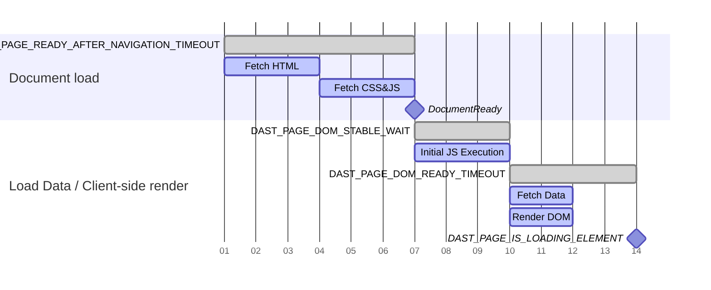

## 범위 관리 {#managing-scope}

범위는 DAST가 대상 애플리케이션을 크롤링할 때 따르는 URL을 제어합니다. 적절히 관리된 범위는 스캔 실행 시간을 최소화하면서 대상 애플리케이션만 취약성 검사를 받도록 합니다.

### 범위의 유형 {#types-of-scope}

범위는 세 가지 유형이 있습니다:

- 범위 포함
- 범위 제외
- 범위에서 제외됨

#### 범위 포함 {#in-scope}

DAST는 범위 포함 URL을 따르고 DOM에서 크롤링을 계속할 후속 작업을 검색합니다. 기록된 범위 포함 HTTP 메시지는 취약성을 수동으로 검사하고 전체 스캔을 실행할 때 공격을 구축하는 데 사용됩니다.

#### 범위 제외 {#out-of-scope}

DAST는 이미지, 스타일시트, 글꼴, 스크립트 또는 AJAX 요청과 같은 문서가 아닌 콘텐츠 유형에 대해 범위 제외 URL을 따릅니다. [인증](#scope-works-differently-during-authentication)을 제외하고, DAST는 외부 웹사이트로의 링크를 클릭할 때와 같이 전체 페이지 로드에 대해 범위 제외 URL을 따르지 않습니다. 정보 유출을 검색하는 수동 검사를 제외하고, 범위 제외 URL에 대해 기록된 HTTP 메시지는 취약성 검사를 받지 않습니다.

#### 범위에서 제외됨 {#excluded-from-scope}

DAST는 범위에서 제외된 URL을 따르지 않습니다. 정보 유출을 검색하는 수동 검사를 제외하고, 범위에서 제외된 URL에 대해 기록된 HTTP 메시지는 취약성 검사를 받지 않습니다.

### 인증 중에 범위가 다르게 작동합니다 {#scope-works-differently-during-authentication}

많은 대상 애플리케이션은 SSO(Single Sign-On)에 대한 ID(ID) 액세스 관리 공급자를 사용할 때와 같이 외부 웹사이트에 의존하는 인증 프로세스를 가지고 있습니다. DAST가 이러한 공급자로 인증할 수 있도록 하려면 DAST는 인증 중에 전체 페이지 로드를 위해 범위 제외 URL을 따릅니다. DAST는 범위에서 제외된 URL을 따르지 않습니다.

### DAST가 HTTP 요청을 차단하는 방법 {#how-dast-blocks-http-requests}

DAST는 범위 규칙으로 인해 요청을 차단할 때 HTTP 요청을 정상적으로 수행하도록 브라우저에 지시합니다. 요청은 이후 `BlockedByClient`의 이유로 차단되고 거부됩니다. 이 접근 방식을 통해 DAST는 HTTP 요청을 기록하면서 대상 서버에 절대 도달하지 않도록 할 수 있습니다. [200.1](../checks/200.1.md)과 같은 수동 검사는 이러한 기록된 요청을 사용하여 외부 호스트로 전송된 정보를 확인합니다.

### 범위를 구성하는 방법 {#how-to-configure-scope}

기본적으로 대상 애플리케이션의 호스트와 일치하는 URL은 범위 포함으로 간주됩니다. 다른 모든 호스트는 범위 제외로 간주됩니다.

범위는 다음 변수를 사용하여 구성됩니다:

- `DAST_SCOPE_ALLOW_HOSTS`을(를) 사용하여 범위 포함 호스트를 추가합니다.
- `DAST_SCOPE_IGNORE_HOSTS`을(를) 사용하여 범위 제외 호스트를 추가합니다.
- `DAST_SCOPE_EXCLUDE_HOSTS`을(를) 사용하여 범위에서 제외된 호스트를 추가합니다.
- `DAST_SCOPE_EXCLUDE_URLS`을(를) 사용하여 특정 URL을 범위에서 제외되도록 설정합니다.

규칙:

- 호스트 제외는 호스트 무시보다 우선 순위가 높으며, 호스트 무시는 호스트 허용보다 우선 순위가 높습니다.
- 호스트에 대한 범위를 구성해도 해당 호스트의 하위 도메인에 대한 범위는 구성되지 않습니다.
- 호스트에 대한 범위를 구성해도 해당 호스트의 모든 포트에 대한 범위는 구성되지 않습니다.

다음은 일반적인 구성이 될 수 있습니다:

```yaml
include:
  - template: DAST.gitlab-ci.yml

dast:
  variables:
    DAST_TARGET_URL: "https://my.site.com"                   # my.site.com URLs are considered in-scope by default
    DAST_SCOPE_ALLOW_HOSTS: "api.site.com:8443"       # include the API as part of the scan
    DAST_SCOPE_IGNORE_HOSTS: "analytics.site.com"      # explicitly disregard analytics from the scan
    DAST_SCOPE_EXCLUDE_HOSTS: "ads.site.com"           # don't visit any URLs on the ads subdomain
    DAST_SCOPE_EXCLUDE_URLS: "https://my.site.com/user/logout"  # don't visit this URL
```

## 취약성 감지 {#vulnerability-detection}

DAST는 포괄적인 [브라우저 기반 취약성 검사](../checks/_index.md)를 통해 취약성을 감지합니다. 이러한 검사는 스캔 중에 웹 애플리케이션의 보안 문제를 식별합니다.

크롤러는 DAST가 프록시 서버로 구성된 브라우저에서 대상 웹사이트를 실행합니다. 이렇게 하면 브라우저에서 수행한 모든 요청과 응답이 DAST에 의해 수동으로 스캔됩니다. 전체 스캔을 실행할 때, DAST에서 실행한 활성 취약성 검사는 브라우저를 사용하지 않습니다. 취약성을 검사하는 방식의 이러한 차이는 스캔이 의도한 대로 작동하도록 대상 웹사이트의 특정 기능을 비활성화해야 하는 문제를 야기할 수 있습니다.

예를 들어, Anti-CSRF 토큰이 있는 양식을 포함하는 대상 웹사이트의 경우, 브라우저가 사용자가 페이지를 보는 것처럼 페이지와 양식을 표시하기 때문에 수동 스캔이 의도한 대로 작동합니다. 그러나 전체 스캔에서 실행되는 활성 취약성 검사는 Anti-CSRF 토큰이 있는 양식을 제출할 수 없습니다. 이러한 경우 전체 스캔을 실행할 때 Anti-CSRF 토큰을 비활성화합니다.

## 스캔 시간 관리 {#managing-scan-time}

브라우저 기반 크롤러를 실행하면 표준 GitLab DAST 솔루션과 비교하여 많은 웹 애플리케이션에 더 나은 범위를 제공할 수 있습니다. 이는 스캔 시간 증가의 비용이 들 수 있습니다.

다음 조치를 통해 범위와 스캔 시간 간의 절충을 관리할 수 있습니다:

- 대상 애플리케이션에 템플릿 기반 페이지 또는 반복적인 콘텐츠가 있는 경우 `DAST_CRAWL_GROUPED_URLS` 변수를 사용하여 [URL을 그룹화](#grouped-urls)할 수 있습니다.
- 러너를 수직으로 확장하고 [변수](variables.md) `DAST_CRAWL_WORKER_COUNT`로 더 많은 수의 브라우저를 사용합니다. 기본값은 사용 가능한 논리적 CPU 수로 동적으로 설정됩니다.
- [변수](variables.md) `DAST_CRAWL_MAX_ACTIONS`로 브라우저에서 실행된 작업의 수를 제한합니다. 기본값은 `10,000`입니다.
- [변수](variables.md) `DAST_CRAWL_MAX_DEPTH`로 브라우저 기반 크롤러가 검사하는 페이지 깊이를 제한합니다. 크롤러는 너비 우선 검색 전략을 사용하므로 더 작은 깊이의 페이지가 먼저 크롤링됩니다. 기본값은 `10`입니다.
- [변수](variables.md) `DAST_CRAWL_TIMEOUT`로 대상 애플리케이션을 크롤링하는 데 걸리는 시간을 제한합니다. 기본값은 `24h`입니다. 크롤러가 시간 초과되면 스캔은 수동 및 활성 검사를 계속합니다.
- [변수](variables.md) `DAST_CRAWL_GRAPH`로 크롤 그래프를 구축하여 어떤 페이지가 크롤링되는지 확인합니다.
- [변수](variables.md) `DAST_SCOPE_EXCLUDE_URLS`를 사용하여 페이지가 크롤링되는 것을 방지합니다.
- [변수](variables.md) `DAST_SCOPE_EXCLUDE_ELEMENTS`를 사용하여 요소가 선택되는 것을 방지합니다. 이 변수를 정의하면 크롤링된 각 페이지에 대해 추가 조회가 발생하므로 주의해서 사용합니다.
- 대상 애플리케이션이 최소한의 또는 빠른 렌더링을 수행하는 경우 [변수](variables.md) `DAST_PAGE_DOM_STABLE_WAIT`를 더 작은 값으로 줄이는 것을 고려합니다. 기본값은 `500ms`입니다.

## 시간 초과 {#timeouts}

열악한 네트워크 조건 또는 높은 애플리케이션 부하로 인해 기본 시간 초과가 애플리케이션에 적용되지 않을 수 있습니다.

브라우저 기반 스캔은 한 페이지에서 다음 페이지로 원활하게 전환될 때 다양한 시간 초과를 조정할 수 있습니다. 이러한 값은 [기간 문자열](https://pkg.go.dev/time#ParseDuration)을(를) 사용하여 구성되며, 이를 통해 다음 접두사로 기간을 구성할 수 있습니다: 분의 경우 `m`, 초의 경우 `s`, 밀리초의 경우 `ms`.

탐색 또는 새 페이지 로드는 JavaScript 또는 CSS 파일과 같은 여러 새 리소스를 로드하고 있기 때문에 일반적으로 가장 많은 시간이 필요합니다. 이러한 리소스의 크기 또는 반환 속도에 따라 기본 `DAST_PAGE_READY_AFTER_NAVIGATION_TIMEOUT`이(가) 충분하지 않을 수 있습니다.

`DAST_PAGE_DOM_READY_TIMEOUT` 또는 `DAST_PAGE_READY_AFTER_ACTION_TIMEOUT`로 구성할 수 있는 안정성 시간 초과도 구성할 수 있습니다. 안정성 시간 초과는 브라우저 기반 스캔이 페이지를 완전히 로드된 것으로 간주할 때를 결정합니다. 브라우저 기반 스캔은 다음 경우에 페이지가 로드되었다고 간주합니다:

1. [DOMContentLoaded](https://developer.mozilla.org/en-US/docs/Web/API/Document/DOMContentLoaded_event) 이벤트가 발생했습니다.
1. JavaScript 및 CSS와 같이 중요하다고 간주되는 열려 있거나 미해결인 요청이 없습니다. 미디어 파일은 일반적으로 중요하지 않은 것으로 간주됩니다.
1. 브라우저가 탐색을 실행했는지, 강제로 전환되었는지 또는 작업을 수행했는지에 따라:

   - `DAST_PAGE_DOM_READY_TIMEOUT` 또는 `DAST_PAGE_READY_AFTER_ACTION_TIMEOUT` 기간 후에 새로운 Document Object Model(DOM) 수정 이벤트가 없습니다.

이러한 이벤트가 발생한 후, 브라우저 기반 스캔은 페이지가 로드되고 준비된 것으로 간주하고 다음 작업을 시도합니다.

애플리케이션에 지연이 있거나 많은 탐색 실패를 반환하는 경우, 다음 예제와 같이 시간 초과 값을 조정하는 것을 고려합니다:

```yaml
include:
  - template: DAST.gitlab-ci.yml

dast:
  variables:
    DAST_TARGET_URL: "https://my.site.com"
    DAST_PAGE_READY_AFTER_NAVIGATION_TIMEOUT: "45s"
    DAST_PAGE_READY_AFTER_ACTION_TIMEOUT: "15s"
    DAST_PAGE_DOM_READY_TIMEOUT: "15s"
```

> [!note]
> 이러한 값을 조정하면 각 브라우저가 다양한 활동이 완료될 때까지 대기하는 시간을 조정하기 때문에 스캔 시간에 영향을 미칠 수 있습니다.

### 페이지 준비 완료 시간 초과 {#page-readiness-timeouts}

페이지 준비 완료는 페이지가 완전히 로드되고, DOM이 안정화되고, 대화형 요소를 사용할 수 있는 상태를 나타냅니다. 적절한 페이지 준비 완료 감지는 다음에 매우 중요합니다:

- **Scanning accuracy**: 페이지가 완전히 로드되기 전에 페이지를 분석하면 콘텐츠를 놓치거나 거짓 부정을 발생시킬 수 있습니다.
- **Crawl efficiency**: 너무 오래 기다리면 스캔 시간이 낭비되고, 충분히 기다리지 않으면 동적 콘텐츠를 놓칩니다.
- **Modern web application support**: 단일 페이지 애플리케이션, AJAX 기반 사이트 및 점진적 로딩 패턴은 정교한 준비 완료 감지가 필요합니다.

선택적 구성 가능한 시간 초과의 순서를 사용하여 DAST 스캐너는 페이지의 다른 부분이 완전히 로드되었을 때를 감지할 수 있습니다.

#### 시간 초과 변수 {#timeout-variables}

다음 CI/CD 변수를 사용하여 DAST 페이지 준비 완료 시간 초과를 사용자 정의합니다. 포괄적인 목록을 보려면 [사용 가능한 CI/CD 변수](variables.md)를 참조합니다.

| 시간 초과 변수 | 기본값 | 설명 |
|:-----------------|:--------|:------------|
| `DAST_PAGE_READY_AFTER_NAVIGATION_TIMEOUT` | `15s` | 브라우저가 한 페이지에서 다른 페이지로 탐색할 때까지 대기할 최대 시간입니다. 전체 페이지 로드에 대한 문서 로드 단계에서 사용됩니다. |
| `DAST_PAGE_READY_AFTER_ACTION_TIMEOUT` | `7s` | 브라우저가 페이지가 로드되고 분석할 준비가 되었다고 간주할 때까지 대기할 최대 시간입니다. 전체 페이지 로드를 트리거하지 않는 페이지 내 작업의 경우 `DAST_PAGE_READY_AFTER_NAVIGATION_TIMEOUT`의 대안으로 사용됩니다. |
| `DAST_PAGE_DOM_STABLE_WAIT` | `500ms` | 페이지가 안정적인지 확인하기 전에 DOM의 업데이트를 기다릴 기간을 정의합니다. 클라이언트 측 렌더 단계의 시작 부분에서 사용됩니다. |
| `DAST_PAGE_DOM_READY_TIMEOUT` | `6s` | 탐색이 완료된 후 브라우저가 페이지가 로드되고 분석할 준비가 되었다고 간주할 때까지 대기할 최대 시간입니다. 백그라운드 데이터 페칭 및 DOM 렌더링 대기를 제어합니다. |
| `DAST_PAGE_IS_LOADING_ELEMENT` | 없음 | 페이지에 더 이상 표시되지 않을 때 선택기는 분석기에 페이지가 로드를 완료했고 스캔을 계속할 수 있음을 나타냅니다. 클라이언트 측 렌더 프로세스의 끝을 표시합니다. |

#### 페이지 로딩 워크플로우 {#page-loading-workflow}

최신 웹 애플리케이션은 여러 단계로 로드됩니다. DAST 스캐너는 프로세스의 각 단계에 대해 특정 시간 초과를 가집니다:

1. **Document loading**: 브라우저는 기본 페이지 구조를 가져오고 처리합니다.

   1. 서버에서 HTML 콘텐츠를 가져옵니다.
   1. 참조된 CSS 및 JavaScript 파일을 로드합니다.
   1. 콘텐츠를 구문 분석하고 초기 페이지를 렌더링합니다.
   1. 표준 "문서 준비" 이벤트를 트리거합니다.

   이 단계는 `DAST_PAGE_READY_AFTER_NAVIGATION_TIMEOUT`(전체 페이지 로드의 경우) 또는 `DAST_PAGE_READY_AFTER_ACTION_TIMEOUT`(페이지 내 작업의 경우)를 사용하며, 이는 문서 로딩에 대한 최대 대기 시간을 설정합니다.

1. **Client-Side rendering**: 초기 로딩 후, 많은 단일 페이지 애플리케이션:

   - 초기 JavaScript 실행을 수행합니다(`DAST_PAGE_DOM_STABLE_WAIT`).
   - AJAX 또는 기타 API 호출로 백그라운드 데이터를 가져옵니다.
   - DOM을 렌더링하고 가져온 데이터를 기반으로 업데이트를 수행합니다(`DAST_PAGE_DOM_READY_TIMEOUT`).
   - 페이지 로딩 표시기를 표시합니다(`DAST_PAGE_IS_LOADING_ELEMENT`).

   스캐너는 이러한 활동을 모니터링하여 페이지가 상호 작용할 준비가 되었을 때를 결정합니다.

다음 차트는 페이지를 크롤링할 때 사용되는 시간 초과 시퀀스를 보여줍니다:



## 그룹화된 URL {#grouped-urls}

DAST 스캐너를 웹사이트에 대해 실행하면 일반적인 스캔을 완료하는 데 몇 시간이 걸릴 수 있습니다. 이 지연은 웹사이트에 동일한 템플릿을 사용하는 비슷한 페이지가 수천 개 있을 때 발생합니다. DAST는 각 페이지를 별도로 취급하고 개별적으로 분석하여 스캔 시간의 대부분을 이러한 비슷한 페이지를 크롤링하는 데 소비합니다.

예를 들어:

- 수천 개의 제품 페이지를 포함하는 전자상거래 사이트(`/products/item-123`, `/products/item-456`)
- 사용자 프로필이 있는 소셜 플랫폼(`/users/john`, `/users/jane`)
- 분류된 기사가 있는 콘텐츠 관리 시스템(`/blog/category/tech`, `/blog/category/news`)
- 페이지가 매겨진 결과가 있는 검색 인터페이스(`/search?q=term&page=1`, `/search?q=term&page=2`)

모든 URL을 고유한 것으로 취급하는 대신, 그룹화된 URL을 통해 비슷한 URL을 그룹화하는 와일드카드 패턴을 정의할 수 있습니다. DAST는 이러한 패턴과 일치하는 URL을 만날 때 각 그룹에서 하나의 대표 URL을 분석하여 스캔 시간을 줄이면서 보안 범위를 유지합니다. 예를 들어, 모든 제품 세부 정보 페이지가 동일한 구조와 보안 모델을 따르는 경우, DAST는 그 중 하나를 철저히 테스트하기만 하면 됩니다.

### 그룹화된 URL이 작동하는 방법 {#how-grouped-urls-work}

그룹화된 URL 패턴을 구성할 때, DAST의 크롤러는 크롤링을 최적화합니다:

1. 패턴 매칭: 크롤러가 새로운 URL을 발견하면 정의된 패턴과 각각을 확인합니다.
1. 스마트 그룹화: 패턴과 일치하는 URL은 함께 그룹화되며 첫 번째 발견된 URL만 완전히 분석됩니다.
1. 탐색 건너뜀: 동일한 패턴과 일치하는 후속 URL은 완전히 크롤링되지 않지만 보고용으로 기록됩니다.
1. 보안 범위: 대표 URL에서 수행된 보안 분석은 전체 그룹에 적용됩니다.

> [!warning]
> 그룹화된 URL 구성으로 인해 건너뛰어진 URL은 크롤 그래프에서 **visited** 또는 **실패**로 나타날 수 있습니다. 이것은 알려진 문제입니다. 자세한 내용은 [이슈 577252](https://gitlab.com/gitlab-org/gitlab/-/issues/577252)를 참조합니다.

### 예제 구성 가이드 {#example-configuration-guide}

다음 예제에서는 가상의 전자상거래 웹사이트를 사용합니다. 이 사이트에는 변수 필터가 쿼리 매개 변수로 있는 제품 나열 페이지와 URL의 하위 경로로 제품 식별자가 있는 제품 세부 정보 페이지가 있습니다.

**Analyze your application's URL patterns**

그룹화된 URL을 구성하기 전에 애플리케이션의 URL 구조를 이해합니다:

1. 사이트맵 또는 애플리케이션 경로를 검토합니다.
1. 이전 스캔에서 DAST 로그를 검토하여 반복적인 패턴을 식별합니다.
1. URL을 기능 목적(제품 페이지, 사용자 프로필, 검색 결과)으로 분류합니다.
1. 동일한 페이지 구조를 공유하는 템플릿 기반 페이지를 식별합니다.

이 예제에서, 전자상거래 사이트의 스캔은 [CI 아티팩트에서 발견된 로그 파일](../troubleshooting.md#log-destination)에서 다음 URL을 생성합니다:

```plaintext
INF REPT  visited 8 URLs
INF REPT  URL visited: (DOC www.your-site.com/products?category=vegetables&sort=price) GET www.your-site.com/products?category=vegetables&sort=price
INF REPT  URL visited: (DOC www.your-site.com/products?category=fruits&sort=price) GET www.your-site.com/products?category=fruits&sort=price
INF REPT  URL visited: (DOC www.your-site.com/products?category=frozen&sort=price) GET www.your-site.com/products?category=frozen&sort=price
INF REPT  URL visited: (DOC www.your-site.com/products?category=frozen&sort=price) GET www.your-site.com/products?category=frozen&sort=price
INF REPT  URL visited: (DOC www.your-site.com/products/029039-apple-93000/details) GET www.your-site.com/products/029039-apple-93000/details
INF REPT  URL visited: (DOC www.your-site.com/products/99345-orange-33322/details) GET www.your-site.com/products/99345-orange/details
INF REPT  URL visited: (DOC www.your-site.com/products/90845-orange-33992/details) GET www.your-site.com/products/90845-orange/details
INF REPT  URL visited: (DOC www.your-site.com/products/100232-bananas-2677/details) GET www.your-site.com/products/100232-bananas-2677/details
```

처음 네 개의 URL은 서로 다른 `category` 및 `sort` 필터가 있는 제품 나열 페이지를 나타냅니다. 마지막 네 개의 URL은 고유한 제품 식별자가 있는 개별 제품 세부 정보 페이지를 나타냅니다. 제품 세부 정보 페이지 중 두 개는 해당 식별자에 `orange`이(가) 있습니다.

이 두 개의 페이지 집합은 동일한 기본 템플릿과 보안 특성을 공유할 가능성이 높습니다. 그룹화된 URL을 사용한 최적화 없이, DAST는 8개의 페이지 모두를 개별적으로 크롤링하고 테스트할 것입니다.

**Design your wildcard patterns**

패턴을 만들 때 다음 규칙을 따릅니다:

1. 패턴 인식을 위해 최소한 하나의 `*` 와일드카드를 포함합니다. `*`은(는) URL의 0자 이상과 일치합니다. URL은 URL의 특정 부분이 아닌 문자로 일치합니다. `*`은(는) URL의 둘 이상의 하위 경로와 일치할 수 있습니다.
1. 크롤 중에 URL의 어느 문자가 변하는지 찾아봅니다. 관련이 없는 페이지의 과도한 그룹화를 방지하기 위해 구체적이어야 합니다.
1. 패턴 순서를 고려합니다. 페이지가 여러 패턴과 일치하는 경우 지정된 첫 번째 패턴이 사용됩니다.

전자상거래 웹사이트에 대한 패턴을 구성합니다:

1. 제품 카테고리 나열 그룹 패턴: 처음 네 개의 URL은 패턴 `www.your-site.com/products?category=*&sort=price`을(를) 사용하여 논리적으로 그룹화할 수 있습니다. 이 패턴은 범주 필터를 모두 사용하고 `sort` 필터로 `price`을(를) 정의하는 모든 페이지와 일치합니다.
1. 제품 세부 정보 그룹 패턴: 마지막 네 개의 URL은 패턴 `www.your-site.com/products/*/details`을(를) 사용하여 논리적으로 그룹화할 수 있습니다. 이 패턴은 제품 식별자에 관계없이 모든 제품 세부 정보 페이지와 일치합니다.

제품 세부 정보 그룹 패턴을 두 개의 그룹으로 더 분할할 수도 있습니다:

1. 주황색 제품 세부 정보 그룹 패턴: 패턴 `www.your-site.com/products/*orange*/details`은(는) 주황색에 대한 두 개의 URL과 일치합니다.
1. 일반 제품 세부 정보 그룹 패턴: 패턴 `www.your-site.com/products/*/details`은(는) 다른 모든 제품과 일치합니다.

하나의 페이지는 둘 이상의 URL 패턴과 일치할 수 있습니다. 일치하길 원하는 순서대로 패턴을 지정합니다. 예를 들어, `www.your-site.com/products/4782-orange-777/details`은(는) 두 패턴과 일치하지만 이것은 주황색 제품 세부 정보 페이지입니다. 주황색 제품 세부 정보 그룹 패턴과 일치하도록 하려면, 구성에서 일반 제품 세부 정보 그룹 패턴 전에 주황색 제품 세부 정보를 지정합니다.

**`DAST_CRAWL_GROUPED_URLS` 변수 구성**

`.gitlab-ci.yml` 파일에 구성을 추가합니다:

```yaml
include:
  - template: DAST.gitlab-ci.yml

dast:
  variables:
    DAST_TARGET_URL: "https://your-site.com"
    DAST_CRAWL_GROUPED_URLS: "https://your-site.com/products?category=*&sort=price,https://your-site.com/products/*orange*/details,https://your-site.com/products/*/details"
```

**Monitor and validate**

그룹화된 URL을 구현한 후:

1. 크롤 그래프(활성화된 경우)를 확인하여 그룹화 동작을 확인합니다. 크롤 그래프에서 더 적은 분기가 표시됩니다.
1. 스캔 로그를 검토하여 예상된 URL 차단을 확인합니다. 더 적은 방문 URL이 표시됩니다.
1. 보안 범위가 손상되지 않았는지 검증합니다. 그룹당 하나의 페이지만 취약성에 대해 스캔되므로 발견 수가 감소할 수 있습니다.
1. 스캔 기간의 성능 개선을 측정합니다. 스캔을 완료하는 데 더 짧은 시간이 걸립니다.

#### 고급 구성 예제 {#advanced-configuration-examples}

다음 예제는 일반적인 웹 애플리케이션 시나리오의 고급 패턴을 보여줍니다:

**Multiple query parameters with wildcards**

여러 다양한 매개 변수가 있는 검색 또는 필터 페이지의 경우:

```yaml
dast:
  variables:
    DAST_TARGET_URL: "https://your-site.com"
    # Match search results with any query and page number
    DAST_CRAWL_GROUPED_URLS: "https://your-site.com/search?q=*&page=*,https://your-site.com/search?q=*&page=*&sort=*"
```

이렇게 하면 검색 용어, 페이지 매김 또는 정렬 옵션에 관계없이 모든 검색 결과 페이지가 함께 그룹화됩니다.

**Combine path and query parameter patterns**

동적 경로와 쿼리 문자열을 모두 사용하는 애플리케이션의 경우:

```yaml
dast:
  variables:
    DAST_TARGET_URL: "https://your-site.com"
    DAST_CRAWL_GROUPED_URLS: |
      https://your-site.com/api/v1/users/*/profile?tab=*,
      https://your-site.com/dashboard/*/reports?year=*&month=*,
      https://your-site.com/catalog/*/items?filter=*
```

이 구성은 다음과 같이 그룹화합니다:

- 다양한 탭이 있는 사용자 프로필 페이지.
- 여러 기간에 걸친 대시보드 보고서.
- 다양한 필터가 있는 카탈로그 항목.

**Hierarchical URL patterns**

여러 수준의 중첩된 리소스 구조의 경우:

```yaml
dast:
  variables:
    DAST_TARGET_URL: "https://your-site.com"
    DAST_CRAWL_GROUPED_URLS: |
      https://your-site.com/organizations/*/teams/*/members/*,
      https://your-site.com/projects/*/issues/*/comments,
      https://your-site.com/categories/*/subcategories/*/products/*
```

이 구성은 여러 경로 세그먼트가 변하는 깊게 중첩된 URL을 처리합니다.

**API endpoints with resource IDs**

다양한 리소스 식별자가 있는 REST API 엔드포인트의 경우:

```yaml
dast:
  variables:
    DAST_TARGET_URL: "https://api.your-site.com"
    DAST_CRAWL_GROUPED_URLS: |
      https://api.your-site.com/v1/customers/*/orders,
      https://api.your-site.com/v1/customers/*/orders/*,
      https://api.your-site.com/v2/resources/*/relationships/*,
      https://api.your-site.com/*/items?id=*
```

이 구성은 API 엔드포인트를 개별 ID가 아닌 리소스 유형별로 그룹화합니다.

**Locale and language variations**

언어 또는 지역 코드가 있는 국제화된 사이트의 경우:

```yaml
dast:
  variables:
    DAST_TARGET_URL: "https://your-site.com"
    DAST_CRAWL_GROUPED_URLS: |
      https://your-site.com/*/products/*,
      https://your-site.com/*/*/articles/*,
      https://*.your-site.com/content/*
```

이 구성은 다음과 같이 그룹화합니다:

- 다양한 언어 간 제품 페이지(`/en/products/123`, `/fr/products/123`).
- 언어 및 지역 코드가 있는 기사(`/en/us/articles/guide`).
- 하위 도메인 기반 로케일(`en.your-site.com/content/page`).

**Session and token parameters**

그룹화되어야 할 세션 ID 또는 임시 토큰이 있는 URL의 경우:

```yaml
dast:
  variables:
    DAST_TARGET_URL: "https://your-site.com"
    DAST_CRAWL_GROUPED_URLS: |
      https://your-site.com/checkout?session=*,
      https://your-site.com/verify?token=*&email=*,
      https://your-site.com/share/*?ref=*
```

이 구성은 DAST가 각 고유한 세션 또는 토큰을 별도의 페이지로 취급하는 것을 방지합니다.

##### 복잡한 전자상거래 시나리오 {#complex-e-commerce-scenarios}

포괄적인 전자상거래 사이트 최적화의 경우:

```yaml
dast:
  variables:
    DAST_TARGET_URL: "https://shop.your-site.com"
    DAST_CRAWL_GROUPED_URLS: |
      https://shop.your-site.com/products?category=*&brand=*&price=*,
      https://shop.your-site.com/products/*/reviews?page=*,
      https://shop.your-site.com/products/*/reviews?page=*&sort=*,
      https://shop.your-site.com/cart?item=*&quantity=*,
      https://shop.your-site.com/user/orders/*/tracking,
      https://shop.your-site.com/compare?products=*
```

이 구성은 다음을 처리합니다:

- 여러 필터 조합이 있는 제품 나열.
- 다양한 정렬이 있는 페이지 매긴 제품 리뷰.
- 장바구니 변형.
- 주문 추적 페이지.
- 제품 비교 페이지.

**Pattern order for specificity**

패턴이 겹치면 가장 구체적인 것부터 가장 일반적인 것 순서로 정렬합니다:

```yaml
dast:
  variables:
    DAST_TARGET_URL: "https://your-site.com"
    # Order matters: specific patterns first, general patterns last
    DAST_CRAWL_GROUPED_URLS: |
      https://your-site.com/products/*-premium-*/details,
      https://your-site.com/products/*-sale-*/details,
      https://your-site.com/products/*/details,
      https://your-site.com/products/*
```

이 구성은 프리미엄 및 판매 제품이 일반 제품 패턴으로 돌아가기 전에 별도로 그룹화되도록 합니다.

**Exclude specific patterns from grouping**

`DAST_SCOPE_EXCLUDE_URLS`과(와) 결합하여 특정 URL을 그룹화와 스캔 모두에서 제외합니다:

```yaml
dast:
  variables:
    DAST_TARGET_URL: "https://your-site.com"
    DAST_CRAWL_GROUPED_URLS: "https://your-site.com/articles/*/comments?page=*"
    # Exclude logout and admin URLs from scanning entirely
    DAST_SCOPE_EXCLUDE_URLS: "https://your-site.com/logout,https://your-site.com/admin/*"
```

이 구성은 기사 댓글 페이지를 그룹화하면서 스캔에서 로그아웃 및 관리 URL을 제외합니다.
