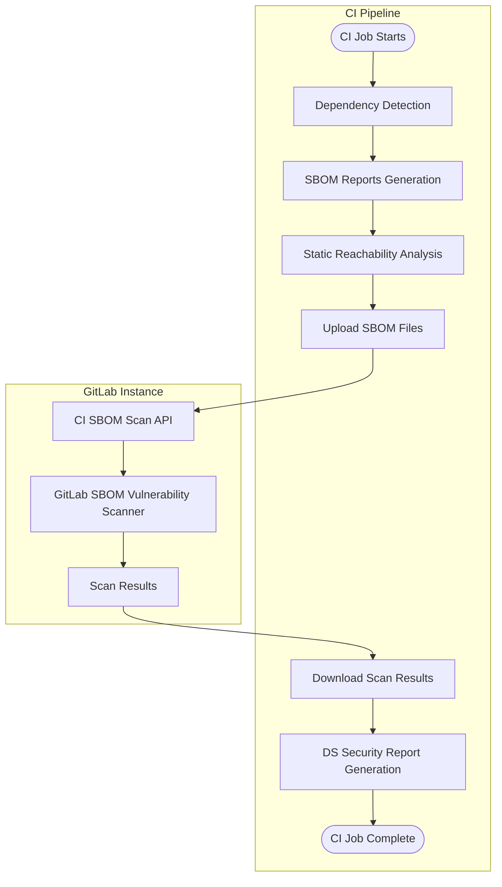



- 티어:  Ultimate
- 제공 서비스: GitLab.com, GitLab Self-Managed, GitLab Dedicated





- `dependency_scanning_using_sbom_reports`라는 이름의 [기능 플래그](../../../../administration/feature_flags/_index.md)로 기본 브랜치 전용 [실험적](../../../../policy/development_stages_support.md#experiment) 기능으로 GitLab 17.4에서 [도입](https://gitlab.com/groups/gitlab-org/-/work_items/8026)되었습니다. 기본적으로 사용 중지되어 있습니다.
- GitLab 17.5에서 [GitLab Self-Managed에 사용으로 설정](https://gitlab.com/gitlab-org/gitlab/-/issues/395692)되었습니다.
- GitLab 17.9에서 실험적에서 모든 브랜치 지원과 함께 베타로 [변경](https://gitlab.com/groups/gitlab-org/-/work_items/15960)되었으며 Cargo, Conda, Cocoapods 및 Swift에 대한 [최신 종속성 검사 CI/CD 템플릿으로 기본적으로 사용으로 설정](https://gitlab.com/gitlab-org/gitlab/-/issues/519597)되었습니다.
- GitLab 17.10에서 기능 플래그 `dependency_scanning_using_sbom_reports`가 제거되었습니다.
- `dependency_scanning_sbom_scan_api`라는 이름의 [기능 플래그](../../../../administration/feature_flags/_index.md) 및 새로운 [V2 CI/CD 종속성 검사 템플릿](https://gitlab.com/gitlab-org/gitlab/-/merge_requests/201175/)과 함께 GitLab 18.5에서 베타에서 GitLab.com 전용 제한적 가용성 단계로 [변경](https://gitlab.com/groups/gitlab-org/-/work_items/15960)되었습니다. 기본적으로 사용 중지되어 있습니다.
- GitLab 18.10에서 기능 플래그 `dependency_scanning_using_sbom_reports`가 [기본적으로 사용으로 설정](https://gitlab.com/gitlab-org/gitlab/-/work_items/551861)되었습니다.
- GitLab 19.0에서 [정식 공개](https://gitlab.com/groups/gitlab-org/-/work_items/20456)되었습니다.



CycloneDX SBOM(Software Bill of Materials)을 사용한 종속성 검사는 애플리케이션의 종속성에서 알려진 취약성을 분석합니다. [전이 종속성을 포함](../_index.md)한 모든 종속성을 검사합니다.

종속성 검사는 흔히 소프트웨어 구성 분석(SCA)의 일부로 간주됩니다. SCA는 코드가 사용하는 항목을 검사하는 측면을 포함할 수 있습니다. 이러한 항목에는 일반적으로 직접 작성한 코드보다는 외부 소스에서 가져온 애플리케이션 및 시스템 종속성이 포함됩니다.

종속성 검사는 애플리케이션 수명 주기의 개발 단계에서 실행할 수 있습니다. CI/CD 파이프라인에서 새로운 종속성 검사 분석기를 사용하면 프로젝트 종속성이 탐지되어 CycloneDX SBOM 보고서에 보고됩니다. 보안 결과가 식별되며 소스 브랜치와 대상 브랜치 간의 비교가 이루어집니다. 발견 사항과 심각도가 병합 요청에 나열되므로, 코드 변경 사항을 커밋하기 전에 애플리케이션의 위험을 선제적으로 해결할 수 있습니다. 보고된 SBOM 구성 요소의 보안 결과는 새로운 보안 권고가 발표될 때 CI/CD 파이프라인과 독립적으로 [지속적 취약성 검사](../../continuous_vulnerability_scanning/_index.md)를 통해 식별됩니다.

GitLab은 이러한 모든 종속성 유형을 포괄할 수 있도록 종속성 검사와 [컨테이너 검사](../../container_scanning/_index.md)를 모두 제공합니다. 위험 영역을 최대한 넓게 보호할 수 있도록 모든 GitLab 보안 검사기를 사용할 것을 권장합니다. 이러한 기능의 비교는 [종속성 검사와 컨테이너 검사 비교](../../comparison_dependency_and_container_scanning.md)를 참조하세요.

새로운 종속성 검사 분석기에 대한 피드백을 이 [피드백 이슈](https://gitlab.com/gitlab-org/gitlab/-/issues/523458)에서 공유해 주세요.

## 종속성 검사 활성화 {#turn-on-dependency-scanning}

프로젝트의 종속성 검사를 활성화합니다.

### 사전 요구 사항 {#prerequisites}

모든 GitLab 인스턴스의 사전 요구 사항:

- 프로젝트에 대한 개발자, 유지 관리자 또는 소유자 역할이 있어야 합니다.
- 리포지토리에 커밋되었거나 CI/CD 파이프라인에서 만들어져 `dependency-scanning` 작업에 아티팩트로 전달되는 [지원되는 잠금 파일 또는 종속성 그래프 내보내기 파일](#supported-languages-and-files)입니다. 또는 [종속성 해결](#dependency-resolution) 기능을 통해 지원되는 에코시스템의 필수 파일을 생성하거나, [매니페스트 파일](#manifest-fallback)을 폴백 옵션으로 사용할 수 있습니다.
- 자체 관리형 러너의 경우, [`docker`](https://docs.gitlab.com/runner/executors/docker/) 또는 [`kubernetes`](https://docs.gitlab.com/runner/install/kubernetes/) 실행기가 있는 러너가 필요합니다.
- GitLab.com에서 호스팅하는 러너에서는 이 구성이 기본적으로 사용으로 설정되어 있습니다.

GitLab Self-Managed 전용: 검사할 모든 PURL 유형에 대한 [패키지 메타데이터](../../../../administration/settings/security_and_compliance.md#choose-package-registry-metadata-to-sync)가 GitLab 인스턴스에 동기화되어 있어야 합니다. GitLab 인스턴스에서 이 데이터를 사용할 수 없는 경우, 종속성 검사가 취약성을 식별할 수 없습니다.

### 프로젝트 파이프라인 구성 업데이트 {#update-project-pipeline-configuration}

종속성 검사를 활성화하려면 프로젝트 파이프라인 구성에 종속성 검사 템플릿을 추가해야 합니다.

기본적으로 `Dependency-Scanning.v2.gitlab-ci.yml` 템플릿은 병합 요청 파이프라인에서 종속성 검사 작업을 실행합니다. 프로젝트의 다른 작업에 병합 요청 파이프라인을 사용하지 않는 경우, 병합 요청 파이프라인에는 종속성 검사 작업만 표시되고 다른 모든 작업은 별도의 브랜치 파이프라인에서 실행됩니다. 이 동작을 사용 중지하려면 [종속성 검사를 위한 병합 요청 파이프라인 사용 중지](#disable-merge-request-pipelines-for-dependency-scanning)를 참조하세요.

GitLab UI를 통한 종속성 검사를 활성화하려면 다음을 수행합니다.

1. 상단 바에서 **검색 또는 이동**을 선택하고 프로젝트를 찾습니다.
1. 왼쪽 사이드바에서 **코드** > **리포지토리**를 선택합니다.
1. `.gitlab-ci.yml` 파일을 선택합니다.
1. **편집** > **단일 파일 편집**을 선택합니다.
1. `Dependency-Scanning.v2` CI/CD 템플릿을 추가합니다.

   ```yaml
   include:
     - template: Jobs/Dependency-Scanning.v2.gitlab-ci.yml
   ```

1. **커밋 변경**을 선택합니다.

## 사용 가능한 컨테이너 이미지 {#available-container-images}

이 기능은 CI 작업을 실행하기 위해 컨테이너 이미지에 의존합니다. 기본 CI 작업 정의는 주 버전 태그(예: `dependency-scanning:2`)로 이 이미지를 참조하므로, CI/CD 구성을 변경하지 않고도 패치 및 마이너 업데이트를 자동으로 받을 수 있습니다.

### 유지 관리 정책 {#maintenance-policy}

GitLab은 [릴리스 및 유지 관리 정책](../../../../policy/maintenance.md)을 따라 현재 안정적인 릴리스에 대한 버그 수정과 이전의 두 달간의 월별 릴리스에 대한 보안 수정을 제공합니다.

CI/CD 작업은 주 버전 태그(예: `dependency-scanning:2`)로 이미지를 참조하므로, 해당 주 이미지 버전과 호환되는 모든 GitLab 버전에서 수정 사항을 자동으로 사용할 수 있습니다.

아래에 나열된 이미지에 적용됩니다. 이전 버전 이미지는 이 정책의 적용 대상이 아닙니다.

### 현재 이미지 {#current-images}

| CI/CD 작업                               | 프로덕션 이미지                                                                                        | GitLab 버전 |
| --------------------------------------- | ------------------------------------------------------------------------------------------------------- | -------------- |
| `dependency-scanning`                   | `registry.gitlab.com/security-products/dependency-scanning:2`                                           | `19.x`         |
| `dependency-scanning:maven-resolution`  | `registry.gitlab.com/security-products/dependency-resolution/ubi9/openjdk-21:1`                         | `18.x`, `19.x` |
| `dependency-scanning:gradle-resolution` | `registry.gitlab.com/security-products/dependency-resolution/ubi9/openjdk-17-with-gradle-8:1`           | `19.x`         |
| `dependency-scanning:python-resolution` | `registry.gitlab.com/security-products/dependency-resolution/ubi9/python-312-minimal-with-piptools-7:9` | `18.x`,`19.x`  |

현재 이미지는 베이스 이미지 공급업체의 업스트림 패치를 반영하기 위해 정기적으로 다시 빌드됩니다.

### 이전 이미지 {#previous-images}

이 이미지들은 더 이상 사용되지 않으며, 버그 수정이나 새 기능 업데이트를 받지 않습니다. 해당 이미지들은 컨테이너 레지스트리에서 계속 사용할 수 있으며, 일치되는 GitLab 버전에서 계속 작동합니다. 더 이상 사용되지 않는 이미지를 최신 버전의 GitLab과 함께 사용하는 것은 권장되지 않으며, 예상치 못한 결과가 발생할 수 있습니다.

| CI/CD 작업             | 프로덕션 이미지                                              | GitLab 버전 | 사용 중단 버전 |
| --------------------- | ------------------------------------------------------------- | -------------- | ------------- |
| `dependency-scanning` | `registry.gitlab.com/security-products/dependency-scanning:1` | `18.x`         | `19.0`        |
| `dependency-scanning` | `registry.gitlab.com/security-products/dependency-scanning:0` | `18.x`         | `19.0`        |

### FIPS 규정 준수 {#fips-compliance}

종속성 검사 분석기 이미지 및 모든 [종속성 해결 이미지](#dependency-resolution)는 FIPS 140 인증 암호화 모듈을 사용하는 [Red Hat UBI](https://www.redhat.com/en/blog/introducing-red-hat-universal-base-image)를 기반으로 합니다. FIPS를 사용으로 설정한 환경에서는 추가 구성이 필요하지 않습니다.

## 결과 이해 {#understanding-the-results}

종속성 검사 분석기 출력 항목:

- 탐지된 각 지원 잠금 파일 또는 종속성 그래프 내보내기에 대한 CycloneDX SBOM입니다.
- 검사된 모든 SBOM 문서에 대한 단일 종속성 검사 보고서입니다.

> [!note]
> 분석기가 [지원되는 파일](#supported-languages-and-files)을 찾지 못하면, 종속성 검사 작업은 성공으로 처리되지만 CI/CD 작업 로그에 경고 메시지를 기록합니다. 이 경우 CycloneDX SBOM이나 종속성 검사 보고서는 생성되지 않습니다.

### CycloneDX 소프트웨어 BOM(SBOM) {#cyclonedx-software-bill-of-materials}

종속성 검사 분석기는 지원되는 잠금 파일, 종속성 그래프 또는 매니페스트 파일이 탐지된 각 디렉터리에 대해 [CycloneDX](https://cyclonedx.org/) 소프트웨어 자재 명세서(SBOM)를 출력합니다. CycloneDX SBOM이 작업 아티팩트로 만들어집니다.

CycloneDX SBOM:

- 이름: `gl-sbom-<package-type>-<package-manager>.cdx.json`
- 종속성 검사 작업의 작업 아티팩트로 제공됩니다.
- `cyclonedx` 보고서 형식으로 업로드됩니다.
- 탐지된 잠금 파일 또는 종속성 그래프 파일과 동일한 디렉터리에 저장됩니다.

예를 들어, 프로젝트 구조가 다음과 같은 경우:

```plaintext
.
├── ruby-project/
│   └── Gemfile.lock
├── ruby-project-2/
│   └── Gemfile.lock
└── php-project/
    └── composer.lock
```

다음과 같은 CycloneDX SBOM이 작업 아티팩트로 만들어집니다.

```plaintext
.
├── ruby-project/
│   ├── Gemfile.lock
│   └── gl-sbom-gem-bundler.cdx.json
├── ruby-project-2/
│   ├── Gemfile.lock
│   └── gl-sbom-gem-bundler.cdx.json
└── php-project/
    ├── composer.lock
    └── gl-sbom-packagist-composer.cdx.json
```

### 종속성 검사 보고서 {#dependency-scanning-report}



- 제공 서비스: GitLab.com, GitLab Self-Managed, GitLab Dedicated



종속성 검사 분석기는 CycloneDX SBOM 파일에 기록된 종속성에서 식별된 모든 취약성을 문서화하는 종속성 검사 보고서를 생성합니다.

종속성 검사 보고서:

- 이름: `gl-dependency-scanning-report.json`
- 종속성 검사 작업의 작업 아티팩트로 사용 가능합니다.
- `dependency_scanning` 보고서로 업로드됩니다.
- 프로젝트의 루트 디렉터리에 저장됩니다.

## 검사 성능 개선 {#improve-scanning-performance}

종속성 검사 성능의 주요 요소는 검사할 종속성 항목의 수입니다. 기본적으로 종속성 검사는 다음 범위로 작동합니다.

- 지원되는 모든 언어 및 파일이 포함됩니다.
- 루트 디렉터리와 그 직계 하위 디렉터리가 포함됩니다.
- 숨겨진 디렉터리는 제외됩니다.

성능을 개선하려면, 특정 경로를 제외하고 검사 디렉터리 깊이를 제한하고 개발 및 테스트 종속성 검사 항목을 제외할 수 있습니다.

### 검사에서 경로 제외 {#exclude-paths-from-scanning}

검사 성능을 개선하려면 경로를 제외하세요. 예를 들어 설명서가 포함된 경로를 제외할 수 있습니다. 경로를 제외할 때 취약성을 숨기지 않도록 주의 깊게 선택하세요.

`.gitlab-ci.yml` 파일에 제외할 경로를 나열합니다.

- 종속성 검사 템플릿의 경우 `DS_EXCLUDED_PATHS` CI/CD 변수를 사용하세요.
- 종속성 검사 CI/CD 구성 요소의 경우 `excluded_paths` 스펙 입력을 사용합니다.

제외 패턴은 다음 규칙을 따릅니다.

- 슬래시가 없는 패턴은 프로젝트의 모든 깊이에서 파일 또는 디렉터리 이름과 일치합니다. 예를 들어 `test`은(는) `./test` 및 `src/test`과(와) 일치합니다.
- 슬래시가 있는 패턴은 해당 패턴으로 시작하는 경로와 일치합니다. 예를 들어 `a/b`은(는) `a/b` 및 `a/b/c`과(와) 일치하지만 `c/a/b`과(와) 일치하지 않습니다.
- 표준 glob 와일드카드가 지원됩니다. 예를 들어 `a/**/b`은(는) `a/b`, `a/x/b` 및 `a/x/y/b`과(와) 일치합니다.
- 선행 및 후행 슬래시는 무시됩니다. 예를 들어 `/build` 및 `build/`은(는) `build`과(와) 동일한 결과와 일치합니다.

### 검사 디렉터리 깊이 제한 {#limit-scan-directory-depth}

기본적으로 검사는 리포지토리의 루트 디렉터리와 그 직계 하위 디렉터리에서만 패키지 관리자 파일만 검색합니다. 검사 성능을 향상시키려면 최대 디렉터리 깊이를 `1`(으)로 설정하여 검색을 리포지토리의 루트 디렉터리로만 제한하세요. 리포지토리의 모든 관련 패키지 관리자 파일을 포함하도록 주의하세요.

`.gitlab-ci.yml` 파일에서 최대 검사 디렉터리 깊이를 지정하려면 다음을 수행하세요.

- 종속성 검사 템플릿의 경우 `DS_MAX_DEPTH` CI/CD 변수를 사용합니다.
- 종속성 검사 CI/CD 구성 요소의 경우 `max_scan_depth` 스펙 입력을 사용합니다.

다음 예에서 `DS_MAX_DEPTH`을(를) `1`(ㅇ)로 설정하면 종속성 검사는 `timer` 디렉터리에서만 패키지 관리자 파일을 검색합니다. 하위 디렉터리는 검사하지 않습니다.

```plaintext
timer
├── integration
└── source
```

### 개발 및 테스트 종속성 제외 {#exclude-development-and-test-dependencies}

기본적으로 개발 및 테스트 종속성은 검사에 포함됩니다. 검사 성능을 향상하려면 다음 중 하나를 설정하여 제외하세요.

- CI/CD 변수 `DS_INCLUDE_DEV_DEPENDENCIES`을(를) `"false"`(으)로
- CI/CD 구성 요소 입력 `include_dev_dependencies`을(를) false(으)로

다음 패키지 관리자를 사용하는 프로젝트만 지원됩니다: Composer, Conda, Gradle, Maven, npm, pnpm, Pipenv, Poetry 및 uv입니다.

## 롤아웃 {#roll-out}

단일 프로젝트의 SBOM 기반 종속성 검사 결과가 안정적이라고 판단되면, 이를 여러 프로젝트 및 그룹으로 확장할 수 있습니다. 자세한 내용은 [여러 프로젝트에 검사를 적용](#enforce-scanning-on-multiple-projects)을 참조하세요.

고유한 요구 사항이 있는 경우, [오프라인 환경](#offline-environment)에서 SBOM 기반 종속성 검사를 실행할 수 있습니다.

## 지원되는 패키지 유형 {#supported-package-types}

보안 분석이 효과적으로 이루어지려면 SBOM 보고서에 나열된 구성 요소가 [GitLab 보안 권고 데이터베이스](../../gitlab_advisory_database/_index.md)에 등록되어 있어야 합니다.

GitLab SBOM 취약성 검사기는 다음과 같은 [PURL 유형](https://github.com/package-url/purl-spec/blob/346589846130317464b677bc4eab30bf5040183a/PURL-TYPES.rst)을 가진 구성 요소에 대해 종속성 검사 취약성을 보고할 수 있습니다.

- `cargo`
- `composer`
- `conan`
- `gem`
- `golang`
- `maven`
- `npm`
- `nuget`
- `pypi`
- `swift`

## 지원되는 언어 및 파일 {#supported-languages-and-files}

| 언어                  | 패키지 관리자 | 파일                                         | 설명                                                                                                                                                                           | 종속성 그래프 내보내기 지원 | 정적 도달 가능성 지원 |
| ------------------------- | --------------- | ----------------------------------------------- | ------------------------------------------------------------------------------------------------------------------------------------------------------------------------------------- | ------------------------------- | --------------------------- |
| C#                        | NuGet           | `packages.lock.json`                            | `nuget`(으)로 생성된 잠금 파일입니다.                                                                                                                                                       |                      |                   |
| C/C++                     | Conan           | `conan.lock`                                    | `conan`(으)로 생성된 잠금 파일입니다.                                                                                                                                                       |                      |                   |
| C/C++/Fortran/Go/Python/R | Conda           | `conda-lock.yml`                                | `conda-lock`(으)로 생성된 환경 파일입니다.                                                                                                                                          |                       |                   |
| Dart                      | pub             | `pubspec.lock`, `pub.graph.json`                | `pub`(으)로 생성된 잠금 파일입니다. `dart pub deps --json > pub.graph.json`에서 파생된 종속성 그래프 내보내기입니다.                                                                           |                      |                   |
| Go                        | go              | `go.mod`, `go.graph`                            | 표준 `go` 도구 체인으로 생성된 모듈 파일입니다. `go mod graph > go.graph`에서 파생된 종속성 그래프 내보내기입니다.                                                                |                      |                   |
| Java                      | ivy             | `ivy-report.xml`                                | `report` Apache Ant 작업으로 생성된 종속성 그래프 내보내기입니다.                                                                                                                   |                       |                  |
| Java                      | Maven           | `maven.graph.json`                              | `mvn dependency:tree -DoutputType=json`으로 생성된 종속성 그래프 내보내기입니다.                                                                                                        |                      |                  |
| Java                      | Maven           | `pom.xml`                                       | [종속성 해결](#dependency-resolution)에 사용되는 Maven 매니페스트 파일이거나 종속성 그래프 내보내기를 사용할 수 없을 때 [매니페스트 폴백](#manifest-fallback) 수단으로 사용됩니다.           |                       |                  |
| Java/Kotlin               | Gradle          | `gradle.graph.txt`                              | `./gradlew dependencies`로 생성된 종속성 그래프 내보내기입니다.                                                                                                                       |                      |                  |
| Java/Kotlin               | Gradle          | `dependencies.lock`, `dependencies.direct.lock` | [gradle-dependency-lock-plugin](https://github.com/nebula-plugins/gradle-dependency-lock-plugin)으로 생성된 잠금 파일입니다.                                                              |                      |                  |
| Java/Kotlin               | Gradle          | `gradle.lockfile`                               | `gradle dependencies --write-locks`(으)로 생성된 잠금 파일입니다.                                                                                                                           |                       |                  |
| Java/Kotlin               | Gradle          | `gradle-html-dependency-report.js`              | [htmlDependencyReport](https://docs.gradle.org/current/dsl/org.gradle.api.tasks.diagnostics.DependencyReportTask.html) 작업으로 생성된 종속성 그래프 내보내기입니다.                |                      |                  |
| Java/Kotlin               | Gradle          | `build.gradle`, `build.gradle.kts`              | [종속성 해결](#dependency-resolution)에 사용되는 Gradle 빌드 파일이거나, 잠금 파일 또는 종속성 그래프 내보내기를 사용할 수 없을 때 [매니페스트 폴백](#manifest-fallback) 수단으로 사용됩니다. |                       |                  |
| JavaScript/TypeScript     | Bun             | `bun.lock`                                      | `bun`(으)로 생성된 잠금 파일입니다.                                                                                                                                                          |                      |                  |
| JavaScript/TypeScript     | npm             | `package-lock.json`, `npm-shrinkwrap.json`      | `npm` v5 이상으로 생성된 잠금 파일입니다(`lockfileVersion` 속성을 생성하지 않는 이전 버전은 지원되지 않습니다).                                                  |                      |                  |
| JavaScript/TypeScript     | pnpm            | `pnpm-lock.yaml`                                | `pnpm`(으)로 생성된 잠금 파일입니다.                                                                                                                                                        |                      |                  |
| JavaScript/TypeScript     | yarn            | `yarn.lock`                                     | `yarn`(으)로 생성된 잠금 파일입니다.                                                                                                                                                        |                      |                  |
| Objective-C               | CocoaPods       | `Podfile.lock`                                  | `cocoapods`(으)로 생성된 잠금 파일입니다.                                                                                                                                                   |                       |                   |
| PHP                       | composer        | `composer.lock`                                 | `composer`(으)로 생성된 잠금 파일입니다.                                                                                                                                                    |                      |                   |
| Python                    | pip             | `pipdeptree.json`                               | `pipdeptree --json`(으)로 생성된 종속성 그래프 내보내기입니다.                                                                                                                            |                      |                  |
| Python                    | pip             | `requirements.txt` (잠금 파일)                   | `pip-compile`(으)로 생성된 잠금 파일입니다.                                                                                                                                                 |                      |                  |
| Python                    | pip             | `requirements.txt`                              | [종속성 해결](#dependency-resolution)에 사용되는 매니페스트 파일이거나, 잠금 파일 또는 종속성 그래프 내보내기를 사용할 수 없을 때 [매니페스트 폴백](#manifest-fallback) 수단으로 사용됩니다.     |                       |                   |
| Python                    | pipenv          | `Pipfile.lock`                                  | `pipenv`(으)로 생성된 잠금 파일입니다.                                                                                                                                                      |                       |                   |
| Python                    | pipenv          | `pipenv.graph.json`                             | `pipenv graph --json-tree >pipenv.graph.json`으로 생성된 종속성 그래프 내보내기입니다.                                                                                                  |                      |                  |
| Python                    | poetry          | `poetry.lock`                                   | `poetry` v1 또는 v2로 생성된 잠금 파일입니다.                                                                                                                                             |                      |                  |
| Python                    | uv <sup>1</sup>  | `uv.lock`                                       | `uv`(으)로 생성된 잠금 파일입니다.                                                                                                                                                          |                      |                  |
| Ruby                      | bundler         | `Gemfile.lock`, `gems.locked`                   | `bundler`(으)로 생성된 잠금 파일입니다.                                                                                                                                                     |                      |                   |
| Rust                      | cargo           | `Cargo.lock`                                    | `cargo`(으)로 생성된 잠금 파일입니다.                                                                                                                                                       |                      |                   |
| Scala                     | sbt             | `dependencies-compile.dot`                      | `sbt dependencyDot`으로 생성된 종속성 그래프 내보내기입니다.                                                                                                                            |                      |                   |
| Swift                     | swift           | `Package.resolved`                              | `swift`(으)로 생성된 잠금 파일입니다.                                                                                                                                                       |                       |                   |

**각주**:

1. 잠금 파일에 환경 마커가 다른 동일 패키지 항목이 여러 개 포함된 경우(예: Python <3.11에 대해 numpy==2.2.6, Python ≥3.11에 대해 numpy==2.4.1), 첫 번째 항목만 구문 분석되어 보고됩니다.

### 패키지 해시 정보 {#package-hash-information}

종속성 검사 SBOM에는 사용 가능한 경우 패키지 해시 정보가 포함됩니다. 이 정보는 NuGet 패키지에 대해서만 제공됩니다. 패키지 해시는 SBOM 내 다음 위치에 표시되며 패키지의 무결성 및 신뢰성을 확인할 수 있습니다.

- 전용 해시 필드
- PURL 한정자

예를 들어:

```json
{
  "name": "Iesi.Collections",
  "version": "4.0.4",
  "purl": "pkg:nuget/Iesi.Collections@4.0.4?sha512=8e579b4a3bf66bb6a661f297114b0f0d27f6622f6bd3f164bef4fa0f2ede865ef3f1dbbe7531aa283bbe7d86e713e5ae233fefde9ad89b58e90658ccad8d69f9",
  "hashes": [
    {
      "alg": "SHA-512",
      "content": "8e579b4a3bf66bb6a661f297114b0f0d27f6622f6bd3f164bef4fa0f2ede865ef3f1dbbe7531aa283bbe7d86e713e5ae233fefde9ad89b58e90658ccad8d69f9"
    }
  ],
  "type": "library",
  "bom-ref": "pkg:nuget/Iesi.Collections@4.0.4?sha512=8e579b4a3bf66bb6a661f297114b0f0d27f6622f6bd3f164bef4fa0f2ede865ef3f1dbbe7531aa283bbe7d86e713e5ae233fefde9ad89b58e90658ccad8d69f9"
}
```

## 분석기 동작 사용자 지정 {#customizing-analyzer-behavior}

분석기를 사용자 지정하는 방법은 활성화 솔루션에 따라 다릅니다.

> [!warning]
> GitLab 분석기에 대한 모든 사용자 지정 설정은 기본 브랜치에 이런 변경 사항을 병합하기 전에 병합 요청에서 먼저 테스트하세요. 그렇지 않은 경우 수많은 오탐을 포함하여 예상치 못한 결과가 발생할 수 있습니다.

### CI/CD 템플릿으로 동작을 사용자 지정 {#customizing-behavior-with-the-cicd-template}

#### 사용 가능한 스펙 입력 {#available-spec-inputs}

다음 `Dependency-Scanning.v2.gitlab-ci.yml` 템플릿과 함께 아래 스펙 입력들을 사용할 수 있습니다.

| 스펙 입력                                  | 유형    | 기본값                                                                                                   | 설명                                                                                                                                                                                                                                                           |
| ------------------------------------------- | ------- | --------------------------------------------------------------------------------------------------------- | --------------------------------------------------------------------------------------------------------------------------------------------------------------------------------------------------------------------------------------------------------------------- |
| `job_name`                                  | 문자열  | `"dependency-scanning"`                                                                                   | 종속성 검사 작업의 이름입니다.                                                                                                                                                                                                                              |
| `stage`                                     | 문자열  | `test`                                                                                                    | 종속성 검사 작업의 스테이지입니다.                                                                                                                                                                                                                             |
| `allow_failure`                             | 부울 | `true`                                                                                                    | 종속성 검사 작업 실패 시 파이프라인 전체를 실패로 처리할지 여부입니다.                                                                                                                                                                                                 |
| `analyzer_image_prefix`                     | 문자열  | `"$CI_TEMPLATE_REGISTRY_HOST/security-products"`                                                          | 분석기 리포지토리를 가리키는 레지스트리 URL 접두사입니다.                                                                                                                                                                                                   |
| `analyzer_image_name`                       | 문자열  | `"dependency-scanning"`                                                                                   | 종속성 검사 작업에서 사용되는 분석기 이미지 리포지토리입니다.                                                                                                                                                                                             |
| `analyzer_image_version`                    | 문자열  | `"2"`                                                                                                     | 종속성 검사 작업에서 사용되는 분석기 이미지의 버전입니다.                                                                                                                                                                                                |
| `additional_ca_cert_bundle`                 | 문자열  |                                                                                                           | 신뢰할 수 있는 CA 인증서 번들입니다. 여기에 제공된 CA 번들은 시스템 인증서에 추가되며, 검사 과정 중 다른 도구에서도 사용됩니다. 자세한 정보는 [사용자 지정 TLS 인증 기관](#custom-tls-certificate-authority)을 참조하세요.              |
| `pip_manifest_file_name_pattern`            | 문자열  |                                                                                                           | 종속성 해결 및 매니페스트 검사에 사용할 사용자 지정 pip 매니페스트 파일 이름 패턴입니다. 패턴은 디렉터리 경로가 아닌 오직 파일 이름과 일치해야 합니다. 구문 세부 정보는 [doublestar 라이브러리](https://www.github.com/bmatcuk/doublestar/tree/v1#patterns)를 참조하세요. |
| `pipcompile_lockfile_file_name_pattern`     | 문자열  |                                                                                                           | 분석할 때 사용하는 사용자 지정 pip-compile 잠금 파일 이름 패턴입니다. 패턴은 디렉터리 경로가 아닌 오직 파일 이름과 일치해야 합니다. 구문 세부 정보는 [doublestar 라이브러리](https://www.github.com/bmatcuk/doublestar/tree/v1#patterns)를 참조하세요.                          |
| `pipcompile_requirements_file_name_pattern` | 문자열  |                                                                                                           | GitLab 19.0에서 [지원 중단됨](https://gitlab.com/gitlab-org/gitlab/-/work_items/598796), 대신 `pipcompile_lockfile_file_name_pattern`을 사용하세요.                                                                                                                           |
| `max_scan_depth`                            | 숫자  | `2`                                                                                                       | 분석기가 지원되는 파일을 검색할 디렉터리 수준을 정의합니다. 값이 -1이면 깊이에 관계없이 분석기가 모든 디렉터리를 검색합니다.                                                                                                       |
| `excluded_paths`                            | 문자열  | `"**/spec,**/test,**/tests,**/tmp"`                                                                       | 검사에서 제외할 경로의 쉼표로 구분된 목록(glob 지원)입니다.                                                                                                                                                                                           |
| `include_dev_dependencies`                  | 부울 | `true`                                                                                                    | 지원되는 파일을 검사할 때 개발 및 테스트 종속성을 포함합니다.                                                                                                                                                                                                 |
| `enable_static_reachability`                | 부울 | `false`                                                                                                   | [정적 도달 가능성](../static_reachability.md)을 사용으로 설정합니다.                                                                                                                                                                                                              |
| `enable_manifest_fallback`                  | 부울 | `true`                                                                                                    | [매니페스트 폴백](#manifest-fallback)을 사용으로 설정합니다.                                                                                                                                                                                                                       |
| `analyzer_log_level`                        | 문자열  | `"info"`                                                                                                  | 종속성 검사에 대한 로깅 수준입니다. 옵션은 fatal, error, warn, info, debug입니다.                                                                                                                                                                               |
| `enable_vulnerability_scan`                 | 부울 | `true`                                                                                                    | 생성된 SBOM의 취약성 분석을 사용으로 설정합니다.                                                                                                                                                                                                                  |
| `api_timeout`                               | 숫자  | `10`                                                                                                      | 종속성 검사 SBOM API 요청 시간 제한(초 단위)입니다.                                                                                                                                                                                                              |
| `api_scan_download_delay`                   | 숫자  | `3`                                                                                                       | 검사 결과를 다운로드하기 전 종속성 검사 SBOM API 초기 지연 시간(초 단위)입니다.                                                                                                                                                                                |
| `resolution_jobs_stage`                     | 문자열  | `.pre`                                                                                                    | 종속성 해결 작업의 스테이지입니다.                                                                                                                                                                                                                         |
| `resolution_jobs_allow_failure`             | 부울 | `true`                                                                                                    | `true`인 경우, 해결 작업이 실패해도 파이프라인이 실패하지 않습니다. `false`인 경우, 해결 실패가 파이프라인을 차단합니다.                                                                                                                                              |
| `disabled_resolution_jobs`                  | 문자열  | `""`                                                                                                      | 쉼표로 구분한 사용 중지할 해결 작업의 목록(예: `"maven, python"`)입니다. 기본적으로 사용 가능한 모든 해결 작업이 사용으로 설정됩니다. 가능한 값은 `maven`, `gradle`, `python`입니다. [종속성 해결](#dependency-resolution)을 참조하세요.                       |
| `resolution_jobs_checkout_timeout`          | 숫자  | `60`                                                                                                      | 해결 서비스가 리포지토리 체크아웃을 기다리는 시간(초)입니다. 양의 정수여야 합니다.                                                                                                                                                         |
| `resolution_jobs_script_timeout`            | 숫자  | `60`                                                                                                      | 종속성 해결 서비스가 해결 스크립트를 생성할 때까지 기다리는 시간(초)입니다. 양의 정수여야 합니다. 서비스가 여전히 리포지토리 체크아웃을 기다리고 있으면 대신 `resolution_jobs_checkout_timeout`을(를) 대신 높이세요.                     |
| `maven_resolution_job_name`                 | 문자열  | `"dependency-scanning:maven-resolution"`                                                                  | Maven 종속성 해결을 위한 작업의 이름입니다.                                                                                                                                                                                                                  |
| `maven_resolution_image`                    | 문자열  | `"registry.gitlab.com/security-products/dependency-resolution/ubi9/openjdk-21:1"`                         | Maven 종속성 해결 작업에서 사용하는 이미지입니다.                                                                                                                                                                                                                |
| `maven_dependency_plugin_version`           | 문자열  | `"3.7.0"`                                                                                                 | Maven 종속성 해결 중 사용하는 `maven-dependency-plugin`의 버전입니다. `3.7.0` 이상이어야 합니다.                                                                                                                                                           |
| `python_resolution_job_name`                | 문자열  | `"dependency-scanning:python-resolution"`                                                                 | Python 종속성 해결을 위한 작업의 이름입니다.                                                                                                                                                                                                                 |
| `python_resolution_image`                   | 문자열  | `"registry.gitlab.com/security-products/dependency-resolution/ubi9/python-312-minimal-with-piptools-7:9"` | Python 종속성 해결 작업에서 사용하는 이미지입니다.                                                                                                                                                                                                               |
| `gradle_resolution_job_name`                | 문자열  | `"dependency-scanning:gradle-resolution"`                                                                 | Gradle 종속성 해결을 위한 작업의 이름입니다.                                                                                                                                                                                                                 |
| `gradle_resolution_image`                   | 문자열  | `"registry.gitlab.com/security-products/dependency-resolution/ubi9/openjdk-17-with-gradle-8:1"`           | Gradle 종속성 해결 작업에서 사용하는 이미지입니다.                                                                                                                                                                                                               |

#### 사용 가능한 CI/CD 변수 {#available-cicd-variables}

이 변수들은 스펙 입력을 대체할 수 있으며, 또한 베타 `latest` 템플릿과 호환됩니다.

| CI/CD 변수                                | 설명                                                                                                                                                                                                                                                                                                                                                                                                                                                                                                                                                                                      |
| ---------------------------------------------- | ------------------------------------------------------------------------------------------------------------------------------------------------------------------------------------------------------------------------------------------------------------------------------------------------------------------------------------------------------------------------------------------------------------------------------------------------------------------------------------------------------------------------------------------------------------------------------------------------ |
| `AST_ENABLE_MR_PIPELINES`                      | 종속성 검사 작업이 병합 요청 또는 브랜치 파이프라인에서 되는지 제어합니다. 기본값: `"true"`. 프로젝트에서 병합 요청 파이프라인을 사용하지 않는 경우, 중복 파이프라인을 방지하기 위해 사용 중지하세요.                                                                                                                                                                                                                                                                                                                                                                                                                  |
| `ADDITIONAL_CA_CERT_BUNDLE`                    | 신뢰할 수 있는 CA 인증서 번들입니다. 여기에 제공된 CA 번들은 시스템 인증서에 추가되며, 검사 과정 중 다른 도구에서도 사용됩니다. 자세한 정보는 [사용자 지정 TLS 인증 기관](#custom-tls-certificate-authority)을 참조하세요.                                                                                                                                                                                                                                                                                                                                         |
| `ANALYZER_ARTIFACT_DIR`                        | CycloneDX 보고서(SBOM)가 저장되는 디렉터리입니다. 기본값 `${CI_PROJECT_DIR}/sca-artifacts`.                                                                                                                                                                                                                                                                                                                                                                                                                                                                                                  |
| `DEPENDENCY_SCANNING_DISABLED`                 | `"true"` 또는 `"1"`로 설정하면 모든 종속성 검사 작업이 사용 중지됩니다. 기본값: 설정되지 않음.                                                                                                                                                                                                                                                                                                                                                                                                                                                                                                          |
| `DS_EXCLUDED_ANALYZERS`                        | 종속성 검사에서 제외할 분석기(이름별)를 지정합니다.                                                                                                                                                                                                                                                                                                                                                                                                                                                                                                                             |
| `DS_EXCLUDED_PATHS`                            | 경로를 기반으로 검사에서 파일 및 디렉터리를 제외합니다. 쉼표로 구분된 패턴 목록입니다. 패턴은 glob(지원되는 패턴은 [`doublestar.Match`](https://pkg.go.dev/github.com/bmatcuk/doublestar/v4@v4.0.2#Match) 참조)이거나 파일 또는 폴더 경로(예: `doc,spec`)일 수 있습니다. 일치 규칙에 대한 [검사에서 경로 제외](#exclude-paths-from-scanning)를 참조하세요. 이것은 검사이 실행되기 전에 적용되는 사전 필터입니다. 종속성 탐지 및 정적 도달 가능성 모두에 적용됩니다. 기본값: `"**/spec,**/test,**/tests,**/tmp,**/node_modules,**/.bundle,**/vendor,**/.git"`. |
| `DS_MAX_DEPTH`                                 | 분석기가 검사할 지원되는 파일을 검색할 디렉터리 깊이 수준을 정의합니다. 값이 `-1`(이)면 깊이에 관계없이 모든 디렉터리를 검사합니다 기본값: `2`.                                                                                                                                                                                                                                                                                                                                                                                                                     |
| `DS_INCLUDE_DEV_DEPENDENCIES`                  | `"false"`로 설정하면 개발 종속성이 보고되지 않습니다. Composer, Conda, Gradle, Maven, npm, pnpm, Pipenv, Poetry 또는 uv를 사용하는 프로젝트만 지원됩니다. 기본값: `"true"`                                                                                                                                                                                                                                                                                                                                                                                                          |
| `DS_PIP_MANIFEST_FILE_NAME_PATTERN`            | glob 패턴 일치를 사용하여 종속성 해결 및 매니페스트 검사에 대해 처리할 pip 매니페스트 파일을 정의합니다(예: `custom-requirements.txt` 또는 `*-requirements.txt`). 패턴은 디렉터리 경로가 아닌 파일 이름에만 일치해야 합니다. 구문 세부 정보는 [glob 패턴 설명서](https://github.com/bmatcuk/doublestar/tree/v1?tab=readme-ov-file#patterns)를 참조하세요.                                                                                                                                                                                                         |
| `PIP_REQUIREMENTS_FILE`                        | GitLab 19.0에서 [지원 중단됨](https://gitlab.com/gitlab-org/gitlab/-/work_items/588580), 대신 `DS_PIP_MANIFEST_FILE_NAME_PATTERN`을 사용하세요.                                                                                                                                                                                                                                                                                                                                                                                                                                                          |
| `DS_PIPCOMPILE_LOCKFILE_FILE_NAME_PATTERN`     | glob 패턴 일치를 사용하여 처리할 pip-compile 잠금 파일을 정의합니다(예: `requirements*.txt` 또는 `*-requirements.txt`). 패턴은 디렉터리 경로가 아닌 파일 이름에만 일치해야 합니다. 구문 세부 정보는 [glob 패턴 설명서](https://github.com/bmatcuk/doublestar/tree/v1?tab=readme-ov-file#patterns)를 참조하세요.                                                                                                                                                                                                                                                             |
| `DS_PIPCOMPILE_REQUIREMENTS_FILE_NAME_PATTERN` | GitLab 19.0에서 [지원 중단됨](https://gitlab.com/gitlab-org/gitlab/-/work_items/598796), 대신 `DS_PIPCOMPILE_LOCKFILE_FILE_NAME_PATTERN`을 사용하세요.                                                                                                                                                                                                                                                                                                                                                                                                                                                   |
| `SECURE_ANALYZERS_PREFIX`                      | 공식 기본 이미지(프록시)를 제공하는 Docker 레지스트리 이름을 재정의합니다.                                                                                                                                                                                                                                                                                                                                                                                                                                                                                                          |
| `DS_FF_LINK_COMPONENTS_TO_GIT_FILES`           | 종속성 목록의 구성 요소를 CI/CD 파이프라인에서 동적으로 생성된 잠금 파일 및 그래프 파일이 아닌 리포지토리에 커밋된 파일로 연결합니다. 이렇게 하면 모든 구성 요소가 리포지토리의 소스 파일에 연결됩니다. 기본값: `"false"`.                                                                                                                                                                                                                                                                                                                                      |
| `SEARCH_IGNORE_HIDDEN_DIRS`                    | 숨겨진 디렉터리를 무시합니다. 종속성 검사 및 정적 도달 가능성 모두에 적용됩니다. 기본값: `"true"`.                                                                                                                                                                                                                                                                                                                                                                                                                                                                                        |
| `DS_STATIC_REACHABILITY_ENABLED`               | [정적 도달 가능성](../static_reachability.md)을 사용으로 설정합니다. 기본값: `"false"`.                                                                                                                                                                                                                                                                                                                                                                                                                                                                                                                    |
| `DS_ENABLE_VULNERABILITY_SCAN`                 | 생성된 SBOM 파일의 취약성 검사를 사용으로 설정합니다. [종속성 검사 보고서](#dependency-scanning-report)를 생성합니다. 기본값: `"true"`.                                                                                                                                                                                                                                                                                                                                                                                                                                                 |
| `DS_API_TIMEOUT`                               | 종속성 검사 SBOM API 요청 시간 제한(초 단위)(최소: `5`, 최대: `300`) 기본값: `10`                                                                                                                                                                                                                                                                                                                                                                                                                                                                                             |
| `DS_API_SCAN_DOWNLOAD_DELAY`                   | 검사 결과를 다운로드하기 전의 초기 지연(초 단위)(최소:  1, 최대:  120) 기본값: `3`                                                                                                                                                                                                                                                                                                                                                                                                                                                                                                 |
| `DS_ENABLE_MANIFEST_FALLBACK`                  | 잠금 파일 또는 종속성 그래프 내보내기를 사용할 수 없을 때 매니페스트 폴백을 사용으로 설정합니다. [매니페스트 폴백](#manifest-fallback)을 참조하세요. 기본값: `"true"`.                                                                                                                                                                                                                                                                                                                                                                                                                                               |
| `DS_SKIP_IF_NO_SUPPORTED_FILES`                | `"true"`로 설정하면 프로젝트에서 [지원되는 파일](#supported-languages-and-files)을 찾지 못한 경우 종속성 검사 작업을 건너뜁니다. 자세한 내용은 [지원되는 파일이 없을 때 작업 건너뛰기](#skip-the-job-when-no-supported-file-is-present)를 참조하세요. 기본값: `"false"`.                                                                                                                                                                                                                                                                                                                            |
| `SECURE_LOG_LEVEL`                             | 로그 수준입니다. 기본값: `"info"`.                                                                                                                                                                                                                                                                                                                                                                                                                                                                                                                                                                    |
| `DS_DISABLED_RESOLUTION_JOBS`                  | 쉼표로 구분한 사용 중지할 해결 작업의 목록(예: `"maven, python"`)입니다. 기본적으로 사용 가능한 모든 해결 작업이 사용으로 설정됩니다. 가능한 값은 `maven`, `gradle`, `python`입니다.                                                                                                                                                                                                                                                                                                                                                                                                      |
| `DS_MAVEN_RESOLUTION_IMAGE`                    | Maven 종속성 해결 작업에서 사용하는 이미지입니다.                                                                                                                                                                                                                                                                                                                                                                                                                                                                                                                                           |
| `DS_MAVEN_DEPENDENCY_PLUGIN_VERSION`           | Maven 종속성 해결 중 사용하는 `maven-dependency-plugin`의 버전입니다. `3.7.0` 이상이어야 합니다. 기본값: `3.7.0`.                                                                                                                                                                                                                                                                                                                                                                                                                                                                    |
| `MAVEN_ARGS`                                   | Maven 종속성 해결 중에 `mvn` 명령에 전달할 추가적 인수입니다. 레거시 `MAVEN_CLI_OPTS` 변수를 대체합니다.                                                                                                                                                                                                                                                                                                                                                                                                                                                             |
| `DS_PYTHON_RESOLUTION_IMAGE`                   | Python 종속성 해결 작업에서 사용하는 이미지입니다.                                                                                                                                                                                                                                                                                                                                                                                                                                                                                                                                          |
| `PIP_INDEX_URL`                                | Python 종속성 해결 중에 사용되는 Python 패키지 인덱스의 기본 URL입니다. 기본값: `https://pypi.org/simple`                                                                                                                                                                                                                                                                                                                                                                                                                                                                            |
| `PIP_EXTRA_INDEX_URL`                          | Python 종속성 해결 중에 `PIP_INDEX_URL`과(와) 함께 사용하는 추가적 Python 패키지 인덱스 URL입니다.                                                                                                                                                                                                                                                                                                                                                                                                                                                                                  |
| `DS_GRADLE_RESOLUTION_IMAGE`                   | Gradle 종속성 해결 작업에서 사용하는 이미지입니다.                                                                                                                                                                                                                                                                                                                                                                                                                                                                                                                                          |
| `GRADLE_CLI_OPTS`                              | Gradle 종속성 해결 중에 `gradle` 또는 `gradlew` 명령에 전달할 추가적 인수입니다.                                                                                                                                                                                                                                                                                                                                                                                                                                                                                          |

### 종속성 검사에 대한 병합 요청 파이프라인 사용 중지 {#disable-merge-request-pipelines-for-dependency-scanning}

기본적으로 `Dependency-Scanning.v2.gitlab-ci.yml` 템플릿은 병합 요청 파이프라인에서 종속성 검사 작업을 실행합니다. 프로젝트에서 다른 작업에 대해 병합 요청 파이프라인을 사용하지 않는 경우, 각 병합 요청마다 파이프라인이 2개씩 실행되고 다른 작업은 별도의 브랜치 파이프라인에서 실행될 수 있습니다. 이 동작을 사용 중지하려면 스펙 입력 `enable_mr_pipelines: false` 또는 CI/CD 변수 `AST_ENABLE_MR_PIPELINES: "false"`를 설정합니다.

### 지원되는 파일이 없을 때 작업 건너뛰기 {#skip-the-job-when-no-supported-file-is-present}

기본적으로 종속성 검사 작업은 프로젝트에 [지원되는 파일](#supported-languages-and-files)이 포함되지 않은 경우에도 해당 템플릿이 포함된 모든 파이프라인에서 실행됩니다. 지원되는 파일을 찾지 못한 경우 작업을 건너뛰려면 `DS_SKIP_IF_NO_SUPPORTED_FILES`를 `"true"`로 설정합니다.

```yaml
include:
  - template: Jobs/Dependency-Scanning.v2.gitlab-ci.yml

variables:
  DS_SKIP_IF_NO_SUPPORTED_FILES: "true"
```

이 변수를 설정하면, 프로젝트에 [지원되는 파일 목록](#supported-languages-and-files) 중 최소 하나 이상의 파일이 포함되어 있거나 `DS_PIPCOMPILE_LOCKFILE_FILE_NAME_PATTERN`, `DS_PIP_MANIFEST_FILE_NAME_PATTERN` 또는 `PIP_REQUIREMENTS_FILE`(지원 중단됨)를 사용하여 사용자 지정 패턴을 설정한 경우에만 종속성 검사 작업이 실행됩니다.

### 사용자 지정 TLS 인증 기관 {#custom-tls-certificate-authority}

종속성 검사에서는 분석기 컨테이너 이미지와 함께 제공되는 기본값 대신 사용자 지정 TLS 인증서를 SSL/TLS 연결에 사용할 수 있습니다.

#### 사용자 지정 TLS 인증 기관 사용 {#using-a-custom-tls-certificate-authority}

사용자 지정 TLS 인증 기관을 사용하려면 [X.509 PEM 공개 키 인증서의 텍스트 표현](https://www.rfc-editor.org/rfc/rfc7468#section-5.1)을 CI/CD 변수 `ADDITIONAL_CA_CERT_BUNDLE`에 할당합니다.

예를 들어 `.gitlab-ci.yml` 파일에서 인증서를 구성하려면 다음을 수행합니다.

```yaml
variables:
  ADDITIONAL_CA_CERT_BUNDLE: |
      -----BEGIN CERTIFICATE-----
      MIIGqTCCBJGgAwIBAgIQI7AVxxVwg2kch4d56XNdDjANBgkqhkiG9w0BAQsFADCB
      ...
      jWgmPqF3vUbZE0EyScetPJquRFRKIesyJuBFMAs=
      -----END CERTIFICATE-----
```

## 종속성 해결 {#dependency-resolution}



- GitLab 18.11에 Maven 및 Python용으로 [도입](https://gitlab.com/groups/gitlab-org/-/work_items/20461)되었으며, 기본적으로 사용 중지되어 있습니다.
- Gradle 지원이 [추가](https://gitlab.com/gitlab-org/gitlab/-/work_items/590734)되었습니다. GitLab 19.0에서 지원되는 모든 프로젝트에 대해 기본적으로 사용으로 설정됩니다.



프로젝트 리포지토리에 커밋된 지원 잠금 파일이나 종속성 그래프 내보내기 파일이 없는 경우, 종속성 해결 기능이 검사 실행 전 필수 파일을 자동으로 생성할 수 있습니다.

종속성 해결은 프로젝트에서 지원되는 매니페스트 파일이 탐지되면 자동으로 트리거됩니다. 해결 작업은 `.pre` 스테이지에서 최소 에코시스템 이미지(예: `ubi9/openjdk-21`)를 사용하여 잠금 파일 또는 종속성 그래프 내보내기 파일을 네이티브 방식으로 생성합니다. 이 작업은 기존 잠금 파일 또는 그래프 내보내기 파일을 보존하며 없을 때만 새로 만듭니다. 이렇게 생성된 아티팩트는 이후 `test` 스테이지의 `dependency-scanning` 작업에서 사용됩니다. 기본 이미지를 동등한 대체 방안(예: `eclipse-temurin:jdk-21`) 또는 필요한 빌드 도구가 포함된 사용자 지정 이미지로 교체할 수 있습니다.

다음 에코시스템에서 종속성 해결을 지원합니다.

| 언어    | 패키지 관리자 | 탐지된 매니페스트 파일                                                                                                           | 해결 명령어    | 출력 아티팩트       |
| ----------- | --------------- | --------------------------------------------------------------------------------------------------------------------------------- | --------------------- | --------------------- |
| Java        | Maven           | `pom.xml`                                                                                                                         | `mvn dependency:tree` | `maven.graph.json`    |
| Java/Kotlin | Gradle          | `build.gradle`, `build.gradle.kts`                                                                                                | `gradle dependencies` | `gradle.graph.txt`    |
| Python      | pip, setuptools | `requirements.txt`, `requirements.in`, `requirements.pip`, `requires.txt`, `setup.py`, `setup.cfg`, `pyproject.toml` (non-Poetry) | `pip-compile`         | `pipcompile.lock.txt` |

### 종속성 해결 사용자 지정 {#customizing-dependency-resolution}

사용 가능한 모든 옵션에 대해 [사용 가능한 스펙 입력](#available-spec-inputs) 및 [사용 가능한 CI/CD 변수](#available-cicd-variables)를 참조하세요.

#### 사용자 지정 종속성 해결 이미지 사용 {#use-a-custom-dependency-resolution-image}

자체 이미지를 사용하려면 다음 입력값을 설정합니다.

- `maven_resolution_image`
- `gradle_resolution_image`
- `python_resolution_image`

예를 들어, Maven 해결에 사용자 지정 이미지를 사용하려면 다음과 같이 설정합니다.

```yaml
include:
  - template: Jobs/Dependency-Scanning.v2.gitlab-ci.yml
    inputs:
      maven_resolution_image: "registry.gitlab.mycorp.com/eclipse-temurin:jdk-21"
```

또는 다음 CI/CD 변수를 설정합니다.

- `DS_MAVEN_RESOLUTION_IMAGE`
- `DS_GRADLE_RESOLUTION_IMAGE`
- `DS_PYTHON_RESOLUTION_IMAGE`

#### 종속성 해결 사용 중지 {#disable-dependency-resolution}

특정 에코시스템에 대해 종속성 해결을 사용 중지하려면 `DS_DISABLED_RESOLUTION_JOBS` CI/CD 변수 또는 `disabled_resolution_jobs` 입력을 사용합니다. 가능한 값은 `maven`, `gradle`, `python`입니다.

예를 들어, Maven에 대한 종속성 해결을 사용 중지하려면 다음과 같이 설정합니다.

```yaml
variables:
  DS_DISABLED_RESOLUTION_JOBS: "maven"

include:
  - template: Jobs/Dependency-Scanning.v2.gitlab-ci.yml
```

### 종속성 해결을 위한 보안 고려 사항 {#security-considerations-for-dependency-resolution}

종속성 해결 작업은 CI/CD 작업 컨테이너 내에서 에코시스템 네이티브 빌드 도구(`mvn`, `gradle`, `pip-compile`)를 실행합니다. 이러한 도구는 다음을 포함하여 기본적으로 시작 시 확장을 로드하거나 임의의 코드를 실행할 수 있는 환경 변수 및 구성 파일을 따릅니다.

- Maven: `MAVEN_ARGS`, `MAVEN_CLI_OPTS` (레거시), `MAVEN_OPTS`, `JAVA_TOOL_OPTIONS`, `-s` 또는 `--settings`를 통해 참조되는 모든 `settings.xml`, `pom.xml` 또는 `settings.xml`에 선언된 `<extensions>`입니다.
- Gradle: `GRADLE_OPTS`, `JAVA_TOOL_OPTIONS`, `--init-script`, 및 `build.gradle` 또는 `build.gradle.kts`의 최상위 Groovy 또는 Kotlin 코드입니다.
- Python: `PIP_INDEX_URL`, `PIP_EXTRA_INDEX_URL`, `setup.py` 및 잠금 파일 설치 후크입니다.

이러한 CI/CD 변수를 설정하거나 프로젝트의 빌드 파일을 수정할 수 있는 사용자는 해결 작업 내에서 임의의 코드를 실행하도록 할 수 있습니다. 해결 작업은 `CI_JOB_TOKEN`으로 실행되며 범위 내의 마스킹된 CI/CD 변수에 액세스하고 작업 기간 동안 프로젝트 리포지토리에 읽거나 씁니다.

이러한 특성은 에코시스템 네이티브 빌드 도구에 내재된 것이며, 종속성 검사에만 국한된 것이 아닙니다. 해결 작업을 민감한 실행 컨텍스트로 취급해야 합니다.

권장 제어 사항:

- 앞서 나열된 변수를 정의하거나 재정의할 수 있는 사용자를 제한합니다. 보호된 브랜치 및 태그로 범위가 지정된 [보호된 CI/CD 변수](../../../../ci/variables/_index.md#for-a-project)를 사용합니다. 모든 개발자가 편집할 수 있는 `.gitlab-ci.yml` `variables:` 블록에서는 설정하지 마세요.
- 표준 코드 검토 프로세스의 일부로 `pom.xml`에서 `MAVEN_ARGS`, `MAVEN_CLI_OPTS`, `GRADLE_OPTS`, `--init-script`, 사용자 지정 `settings.xml` 및 `<extensions>`의 사용에 대한 감사합니다.
- [검사 실행 정책](../../policies/scan_execution_policies.md)을 사용하여 종속성 검사를 적용하는 경우, 대상 프로젝트에서 개발자가 작성한 `variables:`가 주입된 해결 작업으로 유입됩니다. 정책 프레임워크가 전달하는 변수를 검토하고, 정책에서 빌드 도구 변수를 설정 해제하거나 재정의합니다.
- 프로젝트 빌드에서 사용자가 제어하고 신뢰할 수 있는 CI/CD 작업(예: `mvn package`를 실행하는 `build` 스테이지)에서 실행되는 경우, 동일한 작업에서 잠금 파일 또는 종속성 그래프 내보내기 파일을 생성하고 `DS_DISABLED_RESOLUTION_JOBS`로 GitLab에서 제공한 해결 작업을 사용 중지합니다. 이 접근 방식은 빌드 도구 실행의 위험을 줄이지는 않지만, 민감한 작업 컨텍스트를 하나로 제한합니다.
- 알려진 도구 체인을 보장해야 하는 경우 다이제스트로 고정된 [사용자 지정 해결 이미지](#use-a-custom-dependency-resolution-image)를 사용합니다.

### 종속성 해결 제한 사항 {#dependency-resolution-limitations}

종속성 해결은 에코시스템당 단일 고정 런타임 버전 및 빌드 도구가 포함된 바닐라 또는 사용자 지정 이미지에서 에코시스템 네이티브 빌드 도구를 실행합니다.

해결 성공 여부는 해당 환경과 프로젝트의 호환성, 패키지 레지스트리 연결 가능성 및 종속성 수집을 넘어서는 빌드 타임 요구 사항의 부재에 따라 달라집니다.

기본 환경에서 실패하는 프로젝트는 관련 해결 작업 이미지를 재정의하여 필요한 모든 종속성이 포함된 호환 가능한 이미지를 제공할 수 있습니다.

호환되는 경우에도 해결 환경이 프로젝트 빌드에 사용된 정확한 런타임 버전이나 기타 요구 사항과 일치하지 않을 수 있습니다. 따라서 생성된 종속성 그래프는 프로젝트의 실제 빌드 환경에서 해결될 정확한 종속성 집합을 반영하지 않을 수 있습니다. 이러한 차이는 고정된 런타임 버전, 미해결 환경 마커, 플랫폼 특정 종속성, 또는 해결 작업에서 사용할 수 없는 빌드 타임 컨텍스트에 의존하는 조건부 종속성 그룹으로 인해 발생할 수 있습니다.

종속성 해결 워크플로에서 적합하게 처리되지 않는 고도로 사용자 지정된 빌드가 있는 프로젝트의 경우 [잠금 파일 또는 종속성 그래프 내보내기 수동으로 만들기](#create-lockfile-or-dependency-graph-export-manually)에 설명된 대로 자신의 빌드 환경에서 생성된 잠금 파일 또는 종속성 그래프 내보내기를 제공해야 합니다.

#### Maven 해결 알려진 이슈 {#maven-resolution-known-issues}

기본 환경:  Java 21, Maven 3.9

Maven 프로젝트에는 다음 제한 사항이 적용됩니다.

- Maven Enforcer 플러그인:  Maven Enforcer 플러그인에서 엄격한 Java 버전 규칙을 사용하는 프로젝트는 실패할 수 있습니다. 해결 명령은 이를 완화하기 위해 `-Denforcer.skip=true`를 전달하지만, 모든 enforcer 규칙을 건너뛰는 것은 아닙니다.
- 프로필 기반 활성화:  JDK 버전에 의해 활성화되는 조건부 모듈(예: ZXing, Dubbo)을 사용하는 프로젝트는 원래 타겟팅된 Java 버전으로 빌드할 때와 다른 종속성 그래프를 생성할 수 있습니다.
- 초기 수명 주기 단계의 플러그인:  해결 이미지의 Java 버전과 호환되지 않는 validate 또는 initialize 단계에 바인딩된 플러그인은 실패를 유발할 수 있습니다.

#### Gradle 해결 알려진 이슈 {#gradle-resolution-known-issues}

기본 환경:  Java 17, Gradle 8

해결 작업은 Gradle 래퍼가 있는 경우 `./gradlew dependencies`를 실행하고, 그렇지 않은 경우 `gradle dependencies`를 실행합니다. 다중 모듈 프로젝트의 경우 각 하위 프로젝트는 `:<subproject>:dependencies`을 사용하여 개별적으로 해결됩니다. 작업은 해당 프로젝트 디렉터리의 `gradle.graph.txt`에 출력을 기록합니다.

Gradle 프로젝트에는 다음 제한 사항이 적용됩니다.

- 래퍼 요구 사항:  Gradle 래퍼(`gradlew`)가 있는 경우 유효한 `gradle-wrapper.jar`을 참조해야 합니다. 래퍼가 없으면 작업은 시스템 `gradle`을 사용합니다.
- 플러그인 및 버전 호환성:  특정 Gradle 플러그인, 사용자 지정 도구 체인 또는 Java 17 이외의 Java 버전을 요구하는 프로젝트는 실패할 수 있습니다. 해결 이미지(`spec:inputs:gradle_resolution_image`)를 필요한 빌드 환경이 포함된 이미지로 재정의합니다.

#### Python 해결 알려진 이슈 {#python-resolution-known-issues}

기본 환경:  Python 3.12, pip-tools 7

Python 프로젝트에는 다음 제한 사항이 적용됩니다.

- Pipfile 지원되지 않음:  Pipfile 프로젝트(`Pipfile.lock` 파일이 없는 경우)는 지원되지 않습니다. 리포지토리에 `Pipfile` 파일이 있더라도 Python 해결 작업은 트리거되지 않습니다.
- Git/VCS 종속성:  Git 또는 VCS URL(`git+https://...`)로 지정된 종속성은 해결할 수 없습니다. 이 특정 매니페스트 파일에 대해서는 해결 명령이 실패하지만, 다른 파일이 있는 경우 계속 처리합니다.
- 로컬/편집 가능한 설치:  `-e .`, `file:` 또는 로컬 경로 참조를 사용하는 항목은 해결 전에 제거되고 경고가 발생합니다. 이러한 패키지는 출력에 표시되지 않습니다.
- 동적 `install_requires`가 포함된 `setup.py`: 런타임에 `install_requires`가 파일에서 읽어올 때 경고가 발생하며, `pip-compile`이 해결을 시도하지만 실패할 수 있습니다.
- `[project]` 테이블이 없는 `pyproject.toml`:  빌드 시스템 구성만 포함된 `pyproject.toml`은 건너뛰고 경고가 발생합니다.
- `DS_INCLUDE_DEV_DEPENDENCIES` 범위:  개발 종속성 포함은 `[dependency-groups]`이 있는 `pyproject.toml`에 대해서만 구현됩니다.

## 수동으로 잠금 파일 또는 종속성 그래프 내보내기 만들기 {#create-lockfile-or-dependency-graph-export-manually}

프로젝트 리포지토리에 커밋된 지원 [잠금 파일](../../terminology/_index.md#lockfile) 또는 [종속성 그래프 내보내기 파일](../../terminology/_index.md#dependency-graph-export)이 없고 종속성 해결에서 이를 지원하지 않는 경우, 해당 파일을 직접 제공해야 합니다.

복잡한 빌드, 사용자 지정 빌드 단계, 프라이빗 레지스트리 등이 있는 프로젝트의 경우 잠금 파일 또는 종속성 그래프 내보내기 파일을 수동으로 만드는 것을 고려하세요. 기존 빌드 프로세스의 일부로 파일을 생성하는 것이 해당 환경을 복제하도록 [종속성 해결](#dependency-resolution) 기능을 구성하는 것보다 더 빠르고 간단한 경우가 많습니다. 수동 파일 만들기 또한 더 정확한 결과를 제공합니다. 이 파일은 전이 종속성 및 플랫폼별 해결을 포함하여 자체 빌드의 정확한 종속성 버전을 반영합니다.

아래 예는 인기 있는 언어 및 패키지 관리자에 대해 GitLab 분석기에서 지원하는 파일을 만드는 방법을 보여줍니다. [지원되는 언어 및 파일](#supported-languages-and-files)의 전체 목록도 참조하세요.

### Go {#go}

이 방법은 Go 도구 체인의 [`go mod graph` 명령](https://go.dev/ref/mod#go-mod-graph)을 사용하여 직접 및 전이 종속성을 포함해 분석기에 필요한 모든 정보가 담긴 `go.graph` 파일을 생성합니다. 이 파일이 없으면 분석기는 `go.mod`에서만 구성 요소를 추출하며, [종속성 경로](../../dependency_list/_index.md#dependency-paths) 정보를 사용할 수 없으므로 동일한 모듈의 여러 버전이 있는 경우 오탐이 발생할 수 있습니다.

Go 프로젝트에서 분석기를 사용으로 설정하려면 다음을 수행합니다.

1. `Dependency-Scanning.v2` CI/CD 템플릿을 추가합니다.
1. 프로젝트의 기존 빌드 작업에 `go mod graph` 명령을 추가하거나, 빌드 작업이 없는 경우 전용 작업을 만듭니다. 검사가 시작될 때 아티팩트를 사용할 수 있도록 이 작업은 `dependency-scanning` 작업 전에 실행해야 합니다.
1. `go.graph`를 작업 아티팩트로 선언합니다.

기존 빌드 작업에 명령을 추가하면 빌드의 모듈 캐시를 재사용하므로 별도의 작업에서 실행하는 것보다 더 빠릅니다.

예를 들어:

```yaml
stages:
  - build
  - test

include:
  - template: Jobs/Dependency-Scanning.v2.gitlab-ci.yml

build:
  # Running in the build stage ensures that the dependency-scanning job
  # receives the go.graph artifact.
  stage: build
  image: "golang:latest"
  script:
    # Your regular build script
    - go mod tidy
    - go build ./...
    # New instruction to generate the dependency graph
    - go mod graph > go.graph
  # Make the artifact available to the dependency-scanning job.
  artifacts:
    paths:
      - "**/go.graph"
```

### Gradle {#gradle}

Gradle 프로젝트의 경우 다음 방법 중 하나를 사용하여 종속성 그래프 내보내기를 만듭니다.

- Gradle `dependencies` 작업
- Nebula Gradle 종속성 잠금 플러그인
- Gradle `HtmlDependencyReportTask`

#### Gradle 종속성 작업 {#gradle-dependencies-task}

이 방법은 자동 [종속성 해결](#dependency-resolution)을 제공하는 동일한 `gradle dependencies` 작업을 사용합니다. 이 접근 방식은 직접 및 전이 종속성과 [종속성 경로](../../dependency_list/_index.md#dependency-paths)를 사용하기 위한 그래프 정보를 포함하여 분석기에 필요한 모든 정보가 포함된 하나의 `gradle.graph.txt` 파일을 생성하므로 권장되는 방식입니다.

Gradle 프로젝트에서 분석기를 사용으로 설정하려면 다음을 수행합니다.

1. `Dependency-Scanning.v2` CI/CD 템플릿을 추가합니다.
1. 프로젝트의 기존 빌드 작업에 `gradle dependencies` 명령을 추가하거나, 빌드 작업이 없는 경우 전용 작업을 만듭니다. 검사가 시작될 때 아티팩트를 사용할 수 있도록 이 작업은 `dependency-scanning` 작업 전에 실행해야 합니다.
1. `gradle.graph.txt`를 작업 아티팩트로 선언합니다.
1. 자동 종속성 해결을 사용 중지하려면 `gradle`을 `DS_DISABLED_RESOLUTION_JOBS` CI/CD 변수 또는 `disabled_resolution_jobs` 입력값에 추가합니다.

기존 빌드 작업에 명령을 추가하면 빌드의 Gradle 데몬, 캐시, 해결된 구성을 재사용하므로 별도의 작업에서 실행하는 것보다 빠릅니다.

예를 들어:

```yaml
stages:
  - build
  - test

image: gradle:8.0-jdk11

include:
  - template: Jobs/Dependency-Scanning.v2.gitlab-ci.yml

build:
  # Running in the build stage ensures that the dependency-scanning job
  # receives the gradle.graph.txt artifact.
  stage: build
  script:
    # Your regular build script
    - ./gradlew build
    # New instruction to generate the dependency graph
    - ./gradlew dependencies > gradle.graph.txt
  # Make the artifact available to the dependency-scanning job.
  artifacts:
    paths:
      - "**/gradle.graph.txt"
```

#### 종속성 잠금 플러그인 {#dependency-lock-plugin}

> [!warning]
> `gradle-dependency-lock-plugin`은(는) Gradle 9 이상과 호환되지 않습니다. 이러한 버전으로 `dependencies.lock` 파일을 생성하려고 하면 플러그인이 Gradle 9에서 제거된 내부 Gradle API에 의존하기 때문에 빌드가 실패합니다. Gradle 9 이상 프로젝트의 경우 대신에 [Gradle 종속성 작업](#gradle-dependencies-task) 또는 [HtmlDependencyReportTask](#htmldependencyreporttask)를 사용하세요.

이 방법은 [gradle-dependency-lock-plugin](https://github.com/nebula-plugins/gradle-dependency-lock-plugin)을 사용하여 두 개의 잠금 파일 `dependencies.lock`(직접 및 전이 종속성)과 `dependencies.direct.lock`(직접 종속성만)을 생성합니다. 분석기는 이 두 파일을 모두 사용하여 종속성 그래프에서 직접 종속성과 전이 종속성을 구분합니다.

Gradle 프로젝트에서 분석기를 사용으로 설정하려면 다음을 수행합니다.

1. `Dependency-Scanning.v2` CI/CD 템플릿을 추가합니다.
1. `build.gradle`이나 `build.gradle.kts`를 편집하거나 `init` 스크립트를 사용하여 프로젝트에 [gradle-dependency-lock-plugin](https://github.com/nebula-plugins/gradle-dependency-lock-plugin/wiki/Usage#example)을 적용합니다.
1. 프로젝트의 기존 빌드 작업에 `generateLock saveLock` 명령을 추가하거나, 빌드 작업이 없는 경우 전용 작업을 만듭니다. 스캔이 시작될 때 아티팩트를 사용할 수 있도록 이 작업은 `dependency-scanning` 작업 전에 실행해야 합니다.
1. `dependencies.lock` 및 `dependencies.direct.lock`을 작업 아티팩트로 선언합니다.
1. 자동 종속성 해결을 사용 중지하려면 `gradle`을 `DS_DISABLED_RESOLUTION_JOBS` CI/CD 변수 또는 `disabled_resolution_jobs` 입력값에 추가합니다.

예를 들어:

```yaml
stages:
  - build
  - test

image: gradle:8.0-jdk11

include:
  - template: Jobs/Dependency-Scanning.v2.gitlab-ci.yml

generate nebula lockfile:
  # Running in the build stage ensures that the dependency-scanning job
  # receives the scannable artifacts.
  stage: build
  script:
    - |
      cat << EOF > nebula.gradle
      initscript {
          repositories {
            mavenCentral()
          }
          dependencies {
              classpath 'com.netflix.nebula:gradle-dependency-lock-plugin:12.7.1'
          }
      }

      allprojects {
          apply plugin: nebula.plugin.dependencylock.DependencyLockPlugin
      }
      EOF
      ./gradlew --init-script nebula.gradle -PdependencyLock.includeTransitives=true -PdependencyLock.lockFile=dependencies.lock generateLock saveLock
      ./gradlew --init-script nebula.gradle -PdependencyLock.includeTransitives=false -PdependencyLock.lockFile=dependencies.direct.lock generateLock saveLock
      # generateLock saves the lockfile in the build/ directory of a project
      # and saveLock copies it into the root of a project. To avoid duplicates
      # and get an accurate location of the dependency, use find to remove the
      # lockfiles in the build/ directory only.
  after_script:
    - find . -path '*/build/dependencies*.lock' -print -delete
  # Make the artifacts available to the dependency-scanning job.
  artifacts:
    paths:
      - '**/dependencies*.lock'
```

#### `HtmlDependencyReportTask` {#htmldependencyreporttask}

이 방법은 [`HtmlDependencyReportTask`](https://docs.gradle.org/current/dsl/org.gradle.api.reporting.dependencies.HtmlDependencyReportTask.html)을 사용하여 직접 및 전이 종속성이 포함된 `gradle-html-dependency-report.js` 파일을 생성합니다. 이 방법은 Gradle 버전 4부터 8까지 테스트되었으며 Gradle 9 이상 프로젝트에 권장됩니다.

Gradle 프로젝트에서 분석기를 사용으로 설정하려면 다음을 수행합니다.

1. `Dependency-Scanning.v2` CI/CD 템플릿을 추가합니다.
1. 프로젝트의 기존 빌드 작업에 `gradle htmlDependencyReport` 명령을 추가하거나, 빌드 작업이 없는 경우 전용 작업을 만듭니다. 검사가 시작될 때 아티팩트를 사용할 수 있도록 이 작업은 `dependency-scanning` 작업 전에 실행해야 합니다.
1. `gradle-html-dependency-report.js`를 작업 아티팩트로 선언합니다.
1. 자동 종속성 해결을 사용 중지하려면 `gradle`을 `DS_DISABLED_RESOLUTION_JOBS` CI/CD 변수 또는 `disabled_resolution_jobs` 입력값에 추가합니다.

예를 들어:

```yaml
stages:
  - build
  - test

# Define the image that contains Java and Gradle
image: gradle:8.0-jdk11

include:
  - template: Jobs/Dependency-Scanning.v2.gitlab-ci.yml

build:
  stage: build
  script:
    - gradle --init-script report.gradle htmlDependencyReport
  # The gradle task writes the dependency report as a javascript file under
  # build/reports/project/dependencies. Because the file has an un-standardized
  # name, the after_script finds and renames the file to
  # `gradle-html-dependency-report.js` copying it to the  same directory as
  # `build.gradle`
  after_script:
    - |
      reports_dir=build/reports/project/dependencies
      while IFS= read -r -d '' src; do
        dest="${src%%/$reports_dir/*}/gradle-html-dependency-report.js"
        cp $src $dest
      done < <(find . -type f -path "*/${reports_dir}/*.js" -not -path "*/${reports_dir}/js/*" -print0)
  # Make the artifact available to the dependency-scanning job.
  artifacts:
    paths:
      - "**/gradle-html-dependency-report.js"
```

위 명령은 `report.gradle` 파일을 사용하며 `--init-script`를 통해 제공하거나 그 내용을 `build.gradle`에 직접 추가할 수 있습니다.

```kotlin
allprojects {
    apply plugin: 'project-report'
}
```

> [!note]
> 종속성 보고서는 일부 구성의 종속성의 해결이 `FAILED`임을 나타낼 수 있습니다. 이 경우 종속성 검사는 경고를 로그하지만 작업에 실패하지는 않습니다. 해결 실패가 보고될 때 파이프라인이 실패하도록 하려면 위의 `build` 예제에 다음 추가 단계를 설정하세요.

```shell
while IFS= read -r -d '' file; do
  grep --quiet -E '"resolvable":\s*"FAILED' $file && echo "Dependency report has dependencies with FAILED resolution status" && exit 1
done < <(find . -type f -path "*/gradle-html-dependency-report.js -print0)
```

### Maven {#maven}

이 방법은 자동 [종속성 해결](#dependency-resolution)을 수행하는 것과 동일한 `mvn dependency:tree` 명령을 사용합니다. 이렇게 하면 직접 및 전이 종속성을 포함하여 분석기에서 필요한 모든 정보와 [종속성 경로](../../dependency_list/_index.md#dependency-paths)를 사용으로 그래프 정보를 포함한 하나의 `maven.graph.json` 파일이 생성됩니다.

Maven 프로젝트에서 분석기를 사용으로 설정하려면 다음을 수행합니다.

1. `Dependency-Scanning.v2` CI/CD 템플릿을 추가합니다.
1. 프로젝트의 기존 빌드 작업에 `mvn dependency:tree` 명령(`maven-dependency-plugin` 버전 `3.7.0` 이상 사용)을 추가하거나, 빌드 작업이 없는 경우 전용 작업을 만듭니다. 검사가 시작될 때 아티팩트를 사용할 수 있도록 이 작업은 `dependency-scanning` 작업 전에 실행해야 합니다.
1. `maven.graph.json`를 작업 아티팩트로 선언합니다.
1. 자동 종속성 해결을 사용 중지하려면 `maven`을 `DS_DISABLED_RESOLUTION_JOBS` CI/CD 변수 또는 `disabled_resolution_jobs` 입력값에 추가합니다.

기존 빌드 작업에 명령을 추가하면 빌드의 Maven 세션 및 해결된 구성을 다시 사용하므로 별도의 작업에서 실행하는 것보다 더 빠릅니다.

예를 들어:

```yaml
stages:
  - build
  - test

image: maven:3.9.9-eclipse-temurin-21

include:
  - template: Jobs/Dependency-Scanning.v2.gitlab-ci.yml

build:
  # Running in the build stage ensures that the dependency-scanning job
  # receives the maven.graph.json artifacts.
  stage: build
  script:
    # Your regular build script
    - mvn install
    # New instruction to generate the dependency graph
    - mvn org.apache.maven.plugins:maven-dependency-plugin:3.8.1:tree -DoutputType=json -DoutputFile=maven.graph.json
  # Make the artifact available to the dependency-scanning job.
  artifacts:
    paths:
      - "**/*.jar"
      - "**/maven.graph.json"
```

### pip {#pip}

pip 프로젝트의 경우 다음 방법 중 하나를 사용하여 종속성 그래프 내보내기 파일을 만듭니다.

- `pip-compile`
- `pipdeptree`

#### `pip-compile` {#pip-compile}

이 방법은 자동 [종속성 해결](#dependency-resolution)을 수행하는 [`pip-compile`](https://pip-tools.readthedocs.io/en/latest/cli/pip-compile/) 명령을 사용합니다. 이렇게 하면 직접 및 전이 종속성을 포함하여 분석기에서 필요한 모든 정보와 [종속성 경로](../../dependency_list/_index.md#dependency-paths)를 사용으로 설정하기 위한 그래프 정보를 포함한 `requirements.txt` 잠금 파일이 생성됩니다.

pip 프로젝트에서 분석기를 사용으로 설정하려면 다음을 수행합니다.

1. `Dependency-Scanning.v2` CI/CD 템플릿을 추가합니다.
1. 프로젝트의 기존 빌드 작업에 `pip-compile` 명령을 추가하거나, 빌드 작업이 없는 경우 전용 작업을 만듭니다. 검사가 시작될 때 아티팩트를 사용할 수 있도록 이 작업은 `dependency-scanning` 작업 전에 실행해야 합니다.
1. `requirements.txt`를 작업 아티팩트로 선언합니다.
1. 자동 종속성 해결을 사용 중지하려면 `python`을 `DS_DISABLED_RESOLUTION_JOBS` CI/CD 변수 또는 `disabled_resolution_jobs` 입력값에 추가합니다.

기존 빌드 작업에 명령을 추가하면 빌드에서 설치된 종속성을 재사용하므로 별도의 작업에서 실행하는 것보다 더 빠릅니다.

예를 들어:

```yaml
stages:
  - build
  - test

include:
  - template: Jobs/Dependency-Scanning.v2.gitlab-ci.yml

build:
  # Running in the build stage ensures that the dependency-scanning job
  # receives the requirements.txt artifact.
  stage: build
  image: "python:latest"
  script:
    # Your regular build script
    - pip install pip-tools
    # New instruction to generate the dependency lockfile
    - pip-compile requirements.in
  # Make the artifact available to the dependency-scanning job.
  artifacts:
    paths:
      - "**/requirements.txt"
```

#### `pipdeptree` {#pipdeptree}

이 방법으로 [`pipdeptree --json`](https://pypi.org/project/pipdeptree/)을 사용하여 직접 및 전이 종속성을 포함하여 분석에서 필요한 모든 정보와 [종속성 경로](../../dependency_list/_index.md#dependency-paths)를 사용으로 설정하기 위한 그래프 정보를 포함한 `pipdeptree.json` 파일이 생성됩니다.

pip 프로젝트에서 분석기를 사용으로 설정하려면 다음을 수행합니다.

1. `Dependency-Scanning.v2` CI/CD 템플릿을 추가합니다.
1. 프로젝트의 기존 빌드 작업에 `pipdeptree --json` 명령을 추가하거나, 빌드 작업이 없는 경우 전용 작업을 만듭니다. 검사가 시작될 때 아티팩트를 사용할 수 있도록 이 작업은 `dependency-scanning` 작업 전에 실행해야 합니다.
1. `pipdeptree.json`를 작업 아티팩트로 선언합니다.
1. 자동 종속성 해결을 사용 중지하려면 `python`을 `DS_DISABLED_RESOLUTION_JOBS` CI/CD 변수 또는 `disabled_resolution_jobs` 입력값에 추가합니다.

기존 빌드 작업에 명령을 추가하면 빌드에서 설치된 종속성을 재사용하므로 별도의 작업에서 실행하는 것보다 더 빠릅니다.

예를 들어:

```yaml
stages:
  - build
  - test

include:
  - template: Jobs/Dependency-Scanning.v2.gitlab-ci.yml

build:
  # Running in the build stage ensures that the dependency-scanning job
  # receives the pipdeptree.json artifact.
  stage: build
  image: "python:latest"
  script:
    # Your regular build script
    - pip install -r requirements.txt
    # New instructions to generate the dependency graph.
    # Exclude pipdeptree itself to avoid false positives.
    - pip install pipdeptree
    - pipdeptree -e pipdeptree --json > pipdeptree.json
  # Make the artifact available to the dependency-scanning job.
  artifacts:
    paths:
      - "**/pipdeptree.json"
```

[알려진 이슈](https://github.com/tox-dev/pipdeptree/issues/107)로 인해 `pipdeptree`는 [선택적 종속성](https://setuptools.pypa.io/en/latest/userguide/dependency_management.html#optional-dependencies)을 부모 패키지의 종속성으로 표시하지 않습니다. 그 결과 종속성 검사에서는 이를 전이 종속성이 아닌 프로젝트의 직접 종속성으로 표시하게 됩니다.

### Pipenv {#pipenv}

이 방법은 [`pipenv graph`](https://pipenv.pypa.io/en/latest/cli.html#graph) 명령을 사용하여 직접 및 전이 종속성을 포함해 분석기에 필요한 정보를 포함한 `pipenv.graph.json` 파일을 생성합니다. 이 파일이 없으면 분석기는 `Pipfile.lock`에서만 구성 요소를 추출하며, [종속성 경로](../../dependency_list/_index.md#dependency-paths) 정보를 사용할 수 없게 됩니다.

Pipenv 프로젝트에서 분석기를 사용으로 설정하려면 다음을 수행합니다.

1. `Dependency-Scanning.v2` CI/CD 템플릿을 추가합니다.
1. 프로젝트의 기존 빌드 작업에 `pipenv graph --json-tree` 명령을 추가하거나, 빌드 작업이 없는 경우 전용 작업을 만듭니다. 검사가 시작될 때 아티팩트를 사용할 수 있도록 이 작업은 `dependency-scanning` 작업 전에 실행해야 합니다.
1. `pipenv.graph.json`을 작업 아티팩트로 선언합니다.

기존 빌드 작업에 명령을 추가하면 빌드에서 설치된 종속성을 다시 사용하므로 별도의 작업에서 실행하는 것보다 더 빠릅니다.

예를 들어:

```yaml
stages:
  - build
  - test

include:
  - template: Jobs/Dependency-Scanning.v2.gitlab-ci.yml

build:
  # Running in the build stage ensures that the dependency-scanning job
  # receives the pipenv.graph.json artifact.
  stage: build
  image: "python:3.12"
  script:
    # Your regular build script
    - pip install pipenv
    - pipenv install
    # New instruction to generate the dependency graph
    - pipenv graph --json-tree > pipenv.graph.json
  # Make the artifact available to the dependency-scanning job.
  artifacts:
    paths:
      - "**/pipenv.graph.json"
```

### `sbt` {#sbt}

이 방법은 [`sbt-dependency-graph`](https://github.com/sbt/sbt-dependency-graph/blob/master/README.md#usage-instructions) 플러그인을 사용하여 직접 및 전이 종속성을 포함해 분석기에 필요한 모든 정보를 포함한 `dependencies-compile.dot` 파일을 생성합니다.

`sbt` 프로젝트에서 분석기를 사용으로 설정하려면 다음을 수행합니다.

1. `Dependency-Scanning.v2` CI/CD 템플릿을 추가합니다.
1. `plugins.sbt`를 편집하여 [`sbt-dependency-graph`](https://github.com/sbt/sbt-dependency-graph/blob/master/README.md#usage-instructions) 플러그인을 추가합니다.
1. 프로젝트의 기존 빌드 작업에 `sbt dependencyDot` 명령을 추가하거나, 빌드 작업이 없는 경우 전용 작업을 만듭니다. 검사가 시작될 때 아티팩트를 사용할 수 있도록 이 작업은 `dependency-scanning` 작업 전에 실행해야 합니다.
1. `dependencies-compile.dot`을(를) 작업 아티팩트로 선언합니다.

기존 빌드 작업에 명령을 추가하면 빌드의 sbt 세션 및 해결된 구성을 재사용하므로 별도의 작업에서 실행하는 것보다 더 빠릅니다.

예를 들어:

```yaml
stages:
  - build
  - test

include:
  - template: Jobs/Dependency-Scanning.v2.gitlab-ci.yml

build:
  # Running in the build stage ensures that the dependency-scanning job
  # receives the dependencies-compile.dot artifact.
  stage: build
  image: "sbtscala/scala-sbt:eclipse-temurin-17.0.13_11_1.10.7_3.6.3"
  script:
    # Your regular build script
    - sbt compile
    # New instruction to generate the dependency graph
    - sbt dependencyDot
  # Make the artifact available to the dependency-scanning job.
  artifacts:
    paths:
      - "**/dependencies-compile.dot"
```

## 매니페스트 폴백 {#manifest-fallback}



- GitLab 18.9에 [도입](https://gitlab.com/gitlab-org/gitlab/-/work_items/585886)되었습니다. Maven 매니페스트 파일만 지원되며 기본적으로 사용 중지됩니다.
- GitLab 18.9에서 [업데이트](https://gitlab.com/gitlab-org/gitlab/-/work_items/586921)되었습니다. Python 요구 사항 파일 지원이 추가되었으며 기본적으로 사용 중지됩니다.
- GitLab 18.10에서 [업데이트](https://gitlab.com/gitlab-org/gitlab/-/work_items/588788)되었습니다. Gradle 매니페스트 파일 지원이 추가되었으며, 기본적으로 사용 중지됩니다.
- GitLab 19.0에서 기본적으로 사용으로 설정되었습니다.



지원되는 잠금 파일이나 종속성 그래프 내보내기 파일을 사용할 수 없는 경우, 종속성 검사 분석기는 폴백으로 지원되는 매니페스트 파일에서 종속성을 추출할 수 있습니다.

다음 매니페스트 파일이 지원됩니다.

| 언어 | 패키지 관리자 | 매니페스트 파일                      |
| -------- | --------------- | ---------------------------------- |
| Java     | Maven           | `pom.xml`                          |
| Python   | pip             | `requirements.txt`                 |
| Java     | Gradle          | `build.gradle`, `build.gradle.kts` |

> [!warning]
>
> 매니페스트 폴백 기능은 잠금 파일 검사에 비해 정확도가 떨어집니다.
>
> - 전이 종속성 없음: 직접 종속성만 탐지됩니다.
> - 정확하게 해결된 버전을 항상 파악할 수 있는 것은 아닙니다.

### 매니페스트 폴백 사용 중지 {#disable-manifest-fallback}

매니페스트 폴백 기능을 사용 중지하려면 `DS_ENABLE_MANIFEST_FALLBACK` CI/CD 변수 또는 `enable_manifest_fallback` 입력을 사용합니다.

```yaml
variables:
  DS_ENABLE_MANIFEST_FALLBACK: "false"

include:
  - template: Jobs/Dependency-Scanning.v2.gitlab-ci.yml
```

## 애플리케이션 검사 방법 {#how-it-scans-an-application}

SBOM 기능을 활용하는 종속성 검사 기능은 종속성 탐지를 정적 도달 가능성 또는 취약성 검사과 같은 다른 분석 작업과 분리하는 모듈화된 분석 접근 방식을 사용합니다.

이러한 관심사의 분리와 이 아키텍처의 모듈성은 언어 지원의 확대, GitLab 플랫폼 내에서 더 긴밀한 통합과 경험, 업계 표준 보고서 유형으로 전환을 통해 고객을 더 잘 지원할 수 있습니다.

[종속성 해결](#dependency-resolution)이 사용으로 설정되면 해결 작업은 `dependency-scanning` 작업 이전에 `.pre` 스테이지에서 실행됩니다. 이 작업들은 잠금 파일 또는 종속성 그래프 내보내기 파일을 아티팩트로 생성하며, 이후 `dependency-scanning` 작업에서 사용합니다.

종속성 검사의 전체 플로우는 다음에 설명되어 있습니다.



종속성 탐지 단계에서 분석기는 사용 가능한 잠금 파일을 구문 분석하여 프로젝트의 종속성 및 그 관계(종속성 그래프)의 포괄적인 인벤토리를 구축합니다. 이 인벤토리는 CycloneDX SBOM(소프트웨 자재 목록) 문서에 기록됩니다.

정적 도달 가능성 단계에서 분석기는 소스 파일을 구문 분석하여 어떤 SBOM 구성 요소가 실제로 사용 중인지 확인하고 SBOM 파일에서 이에 따라 표시합니다. 이를 통해 사용자는 취약한 구성 요소에 실제로 도달할 수 있는지 여부를 기준으로 취약성의 우선 순위를 지정할 수 있습니다. 자세한 내용은 [정적 도달 가능성 페이지](../static_reachability.md)를 참조하세요.

SBOM 문서는 종속성 검사 SBOM API를 통해 GitLab 인스턴스에 임시로 업로드됩니다. GitLab SBOM 취약성 검사 엔진은 SBOM 구성 요소를 권고 사항과 일치시켜 결과 목록을 생성한 다음 종속성 검사 보고서에 포함하기 위해 분석기에 반환합니다.

이 API는 인증에 대해 기본값 `CI_JOB_TOKEN`을 사용합니다. `CI_JOB_TOKEN` 값을 다른 토큰으로 재정의하면 API에서 403 Forbidden 응답이 발생할 수 있습니다.

사용자는 다음을 사용하여 종속성 검사 SBOM API와 통신하는 분석기 클라이언트를 구성할 수 있습니다.

- `vulnerability_scan_api_timeout` 또는 `DS_API_TIMEOUT`
- `vulnerability_scan_api_download_delay` 또는 `DS_API_SCAN_DOWNLOAD_DELAY`

자세한 내용은 [사용 가능한 스펙 입력](#available-spec-inputs) 및 [사용 가능한 CI/CD 변수](#available-cicd-variables)를 참조하세요.

생성된 보고서는 CI 작업 완료 시 GitLab 인스턴스에 업로드되며, 일반적으로 파이프라인이 완료된 후 처리됩니다.

SBOM 보고서는 [종속성 검사 목록](../../dependency_list/_index.md), [라이선스 검사](../../../compliance/license_scanning_of_cyclonedx_files/_index.md) 또는 [연속적인 취약성 검사](../../continuous_vulnerability_scanning/_index.md)와 같은 다른 SBOM 기반 기능을 지원하는 데 사용됩니다.

종속성 검사 보고서는 [보안 검사 결과](../../detect/security_scanning_results.md)에 대한 일반적인 프로세스를 따릅니다.

- 기본 브랜치의 CI/CD 작업에서 종속성 검사 보고서가 선언된 경우, 취약성이 생성되며 [취약성 보고서](../../vulnerability_report/_index.md)에서 확인할 수 있습니다.
- 종속성 검사 보고서가 기본값이 아닌 브랜치의 CI/CD 작업에서 선언된 경우, 보안 발견 사항이 생성되며 [파이프라인 보기의 보안 탭](../../detect/security_scanning_results.md) 및 [병합 요청 보고서](../../../project/merge_requests/reports.md)에서 확인할 수 있습니다.

## 오프라인 환경 {#offline-environment}



- 티어:  Ultimate
- 제공 서비스: GitLab Self-Managed



인터넷을 통한 외부 리소스 액세스가 제한되거나 간헐적인 환경에 있는 인스턴스의 경우 종속성 검사 작업을 성공적으로 실행하려면 일부 설정을 조정해야 합니다. 자세한 내용은 [오프라인 환경](../../offline_deployments/_index.md)을 참조하세요.

### 요구 사항 {#requirements}

오프라인 환경에서 종속성 검사를 실행하려면 다음 사항을 갖춰야 합니다.

- `docker` 또는 `kubernetes` 실행기가 있는 GitLab Runner입니다.
- 종속성 검사 분석기 이미지의 로컬 복사본입니다.
- [패키지 메타데이터 데이터베이스](../../../../topics/offline/quick_start_guide.md#enabling-the-package-metadata-database)에 대한 액세스 권한입니다. 종속성에 대한 라이선스 및 보안 권고 데이터를 보유하는 데 필요합니다.

### 분석기 이미지의 로컬 복사본 {#local-copies-of-analyzer-images}

종속성 검사 분석기를 사용하려면 사용을 수행합니다.

1. `registry.gitlab.com`에서 [로컬 Docker 컨테이너 레지스트리](../../../packages/container_registry/_index.md)로 [현재 이미지](#current-images)를 가져옵니다. Docker 이미지를 로컬 오프라인 Docker 레지스트리로 가져오는 프로세스는 **네트워크 보안 정책**에 따라 다릅니다. 외부 리소스를 가져오거나 일시적으로 액세스할 수 있는 승인된 프로세스에 대해서는 IT 담당자에게 문의하세요. 이러한 이미지는 새로운 기능, 버그 수정 및 패치로 정기적으로 업데이트되므로 주기적으로 다운로드하는 것이 좋습니다. 오프라인 인스턴스가 GitLab 레지스트리에 액세스할 수 있는 경우 [보안 바이너리 템플릿](../../offline_deployments/_index.md#using-the-official-gitlab-template)을 사용하여 최신 종속성 검사 분석기 이미지를 다운로드할 수 있습니다.

1. 로컬 분석기를 사용하도록 GitLab CI/CD를 구성합니다.

   CI/CD 변수 `SECURE_ANALYZERS_PREFIX` 또는 `analyzer_image_prefix` 스펙 입력을 로컬 Docker 레지스트리(이 예제에서는 `docker-registry.example.com`)로 설정합니다.

   ```yaml
   include:
     - template: Jobs/Dependency-Scanning.v2.gitlab-ci.yml

   variables:
     SECURE_ANALYZERS_PREFIX: "docker-registry.example.com/analyzers"
   ```

## 여러 프로젝트에서 검사 실행 {#enforce-scanning-on-multiple-projects}

보안 정책을 사용하여 여러 프로젝트에 종속성 검사를 강제 적용합니다. 종속성 검사를 수행하려면 잠금 파일 또는 종속성 그래프 내보내기 파일과 같은 검사 가능한 아티팩트가 필요합니다. 검사 가능한 아티팩트가 프로젝트 리포지토리에 커밋되어 있는지 여부에 따라 선택할 정책이 달라집니다.

- 검사 가능한 아티팩트가 리포지토리에 커밋되어 있는 경우 [검사 실행 정책](../../policies/scan_execution_policies.md)을 사용합니다.

  검사 가능한 아티팩트가 리포지토리에 커밋되어 있거나 [종속성 해결](#dependency-resolution)로 지원되는 프로젝트의 경우 검사 실행 정책에서 종속성 검사를 적용하는 가장 직접적인 방법을 제공합니다.

- 검사 가능한 아티팩트가 리포지토리에 커밋되어 있지 않고 [종속성 해결](#dependency-resolution)에서 지원되지 않는 경우 [파이프라인 실행 정책](../../policies/pipeline_execution_policies.md)을 사용합니다.

  검사 가능한 아티팩트가 리포지토리에 커밋되어 있지 않은 프로젝트의 경우 파이프라인 실행 정책을 사용해야 합니다. 이 정책은 종속성 검사를 호출하기 전에 검사 가능한 아티팩트를 생성하는 사용자 지정 CI/CD 작업을 정의해야 합니다.

  파이프라인 실행 정책은 다음과 같이 동작해야 합니다.

  - CI/CD 파이프라인의 일부로 잠금 파일 또는 종속성 그래프 내보내기 파일을 생성합니다.
  - 특정 프로젝트 요구 사항에 맞게 종속성 탐지 프로세스를 사용자 지정합니다.
  - Gradle 및 Maven과 같은 빌드 도구에 대한 언어별 방법을 구현합니다.

다음 예제는 Gradle `nebula` 플러그인을 사용하여 잠금 파일을 생성합니다. 다른 언어에 대해서는 [잠금 파일 또는 종속성 그래프 내보내기 수동으로 만들기](#create-lockfile-or-dependency-graph-export-manually) 섹션을 참조하세요.

### 예:  Gradle 프로젝트를 위한 파이프라인 실행 정책 {#example-pipeline-execution-policy-for-a-gradle-project}

리포지토리에 검사 가능한 아티팩트가 커밋되지 않은 Gradle 프로젝트의 경우 파이프라인 실행 정책에서 아티팩트 생성 단계를 정의해야 합니다. 다음 예제는 `nebula` 플러그인을 사용합니다.

1. 전용 보안 정책 프로젝트에서 메인 정책 파일(예: `policy.yml`)을 만들거나 업데이트합니다.

   ```yaml
   pipeline_execution_policy:
   - name: Enforce Gradle dependency scanning with SBOM
     description: Generate dependency artifact and run dependency scanning.
     enabled: true
     pipeline_config_strategy: inject_policy
     content:
       include:
         - project: $SECURITY_POLICIES_PROJECT
           file: "dependency-scanning.yml"
   ```

1. `dependency-scanning.yml` 정책 파일을 추가합니다.

   ```yaml
   stages:
     - build
     - test

   include:
     - template: Jobs/Dependency-Scanning.v2.gitlab-ci.yml

   generate nebula lockfile:
     image: openjdk:11-jdk
     stage: build
     script:
       - |
         cat << EOF > nebula.gradle
         initscript {
             repositories {
               mavenCentral()
             }
             dependencies {
                 classpath 'com.netflix.nebula:gradle-dependency-lock-plugin:12.7.1'
             }
         }

         allprojects {
             apply plugin: nebula.plugin.dependencylock.DependencyLockPlugin
         }
         EOF
         ./gradlew --init-script nebula.gradle -PdependencyLock.includeTransitives=true -PdependencyLock.lockFile=dependencies.lock generateLock saveLock
         ./gradlew --init-script nebula.gradle -PdependencyLock.includeTransitives=false -PdependencyLock.lockFile=dependencies.direct.lock generateLock saveLock
     after_script:
       - find . -path '*/build/dependencies.lock' -print -delete
     artifacts:
       paths:
         - '**/dependencies.lock'
         - '**/dependencies.direct.lock'
   ```

이 접근 방식은 다음을 보장합니다.

1. Gradle 프로젝트에서 실행되는 파이프라인이 검사 가능한 아티팩트를 생성합니다.
1. 종속성 검사가 강제 적용되며 검사 가능한 아티팩트에 액세스할 수 있습니다.
1. 정책 범위 내의 모든 프로젝트가 동일한 종속성 검사 접근 방식을 일관되게 따릅니다.
1. 구성 변경 사항을 중앙 집중식으로 관리하고 여러 프로젝트에 적용할 수 있습니다.

## 새로운 종속성 검사 기능을 사용으로 설정하는 다른 방법 {#other-ways-of-enabling-the-new-dependency-scanning-feature}

`v2` 템플릿을 사용하여 종속성 검사 기능을 사용으로 설정하는 것이 좋습니다. 가능하지 않은 경우 다음 방법 중 하나를 선택할 수 있습니다.

### `latest` 템플릿 사용 {#using-the-latest-template}

> [!warning]
> `latest` 템플릿은 안정적인 버전으로 간주되지 않으며 작동을 중단시키는 변경 사항이 포함될 수 있습니다. [템플릿 에디션](../../detect/security_configuration.md#template-editions)을 참조하세요.

`latest` 종속성 검사 CI/CD 템플릿 `Dependency-Scanning.latest.gitlab-ci.yml`을 사용하여 GitLab에서 제공하는 분석기를 사용으로 설정합니다.

- (지원 중단된) Gemnasium 분석기가 기본적으로 사용됩니다.
- 새로운 종속성 검사 분석기를 사용하려면 CI/CD 변수 `DS_ENFORCE_NEW_ANALYZER`를 `true`로 설정합니다.
- [지원되는 잠금 파일 또는 종속성 그래프 내보내기](#create-lockfile-or-dependency-graph-export-manually) 또는 [트리거 파일](#trigger-files-for-the-latest-template)이 파이프라인에서 `dependency-scanning` 작업을 만들기 위해 리포지토리에 있어야 합니다.

  ```yaml
  include:
    - template: Jobs/Dependency-Scanning.latest.gitlab-ci.yml

  variables:
    DS_ENFORCE_NEW_ANALYZER: 'true'
  ```

또는 [검사 실행 정책](../../policies/scan_execution_policies.md)을 `latest` 템플릿과 함께 사용하여 기능을 사용으로 설정하고 CI/CD 변수 `DS_ENFORCE_NEW_ANALYZER`를 `true`로 설정하여 새로운 종속성 검사 분석기를 적용할 수 있습니다.

분석기 동작을 사용자 지정하려면 [사용 가능한 CI/CD 변수](#available-cicd-variables)를 사용하세요.

#### `latest` 템플릿 {#trigger-files-for-the-latest-template}의 트리거 파일

트리거 파일은 [최신 종속성 검사 CI/CD 템플릿](https://gitlab.com/gitlab-org/gitlab/-/blob/master/lib/gitlab/ci/templates/Jobs/Dependency-Scanning.latest.gitlab-ci.yml)을 사용할 때 `dependency-scanning` CI/CD 작업이 만들어집니다. 분석기는 이 파일을 검사하지 않습니다. 트리거 파일을 사용하여 [잠금 파일 또는 종속성 그래프 내보내기 파일을 수동으로 만드는](#create-lockfile-or-dependency-graph-export-manually) 경우 프로젝트에서 지원할 수 있습니다.

| 언어        | 파일                                                     |
| --------------- | --------------------------------------------------------- |
| C#/Visual Basic | `*.csproj`, `*.vbproj`                                    |
| Java            | `pom.xml`                                                 |
| Java/Kotlin     | `build.gradle`, `build.gradle.kts`                        |
| Python          | `requirements.pip`, `Pipfile`, `requires.txt`, `setup.py` |
| Scala           | `build.sbt`                                               |

### 종속성 검사 CI/CD 구성 요소 사용 {#using-the-dependency-scanning-cicd-component}



- GitLab 17.5에서 [베타](../../../../policy/development_stages_support.md#beta)로 도입되었습니다. [종속성 검사 CI/CD 구성 요소](https://gitlab.com/explore/catalog/components/dependency-scanning) 버전 [`0.4.0`](https://gitlab.com/components/dependency-scanning/-/tags/0.4.0)입니다.
- GitLab 18.8에서 [정식 공개](https://gitlab.com/gitlab-org/gitlab/-/issues/578686)되었습니다. [종속성 검사 CI/CD 구성 요소](https://gitlab.com/explore/catalog/components/dependency-scanning) 버전 [`1.0.0`](https://gitlab.com/components/dependency-scanning/-/tags/1.0.0)입니다.



새로운 종속성 검사 분석기를 사용으로 설정하려면 [종속성 검사 CI/CD 구성 요소](https://gitlab.com/explore/catalog/components/dependency-scanning)를 사용합니다. 이 방식을 선택하기 전에 GitLab Self-Managed에 대한 현재 [제한 사항](../../../../ci/components/_index.md#use-a-gitlabcom-component-on-gitlab-self-managed)을 검토하세요.

  ```yaml
  include:
    - component: $CI_SERVER_FQDN/components/dependency-scanning/main@1
  ```

또한 [수동으로 잠금 파일 또는 종속성 그래프 내보내기 파일을 만들어야](#create-lockfile-or-dependency-graph-export-manually) 합니다.

종속성 검사 CI/CD 구성 요소를 사용할 때 [입력값](https://gitlab.com/explore/catalog/components/dependency-scanning)을 구성하여 분석기를 사용자 지정할 수 있습니다.

### 자체 SBOM 가져오기 {#bringing-your-own-sbom}

> [!warning]
> 타사 SBOM 지원은 기술적으로 가능하지만, 이 [에픽](https://www.gitlab.com/groups/gitlab-org/-/epics/14760)을 통해 공식 지원이 완료됨에 따라 내용이 크게 변경될 수 있습니다.

타사 CycloneDX SBOM 생성기 또는 사용자 지정 도구로 생성된 자체 CycloneDX SBOM 설명서를 사용자 지정 CI 작업에서 [CI/CD 아티팩트 보고서](../../../../ci/yaml/artifacts_reports.md#artifactsreportscyclonedx)로 사용하세요.

SBOM을 사용하여 종속성 검사를 활성화하려면 제공되는 CycloneDX SBOM 문서가 다음 요건을 충족해야 합니다.

- [CycloneDX 사양](https://github.com/CycloneDX/specification) 버전 `1.4`, `1.5` 또는 `1.6`을 준수합니다. [CycloneDX Web Tool](https://cyclonedx.github.io/cyclonedx-web-tool/validate)에서 온라인 유효성 확인 도구를 사용할 수 있습니다.
- [GitLab CycloneDX 속성 분류](../../../../development/sec/cyclonedx_property_taxonomy.md)를 준수합니다.
- 성공한 CI 작업에서 [CI/CD 아티팩트 보고서](../../../../ci/yaml/artifacts_reports.md#artifactsreportscyclonedx)로 업로드되어야 합니다.
