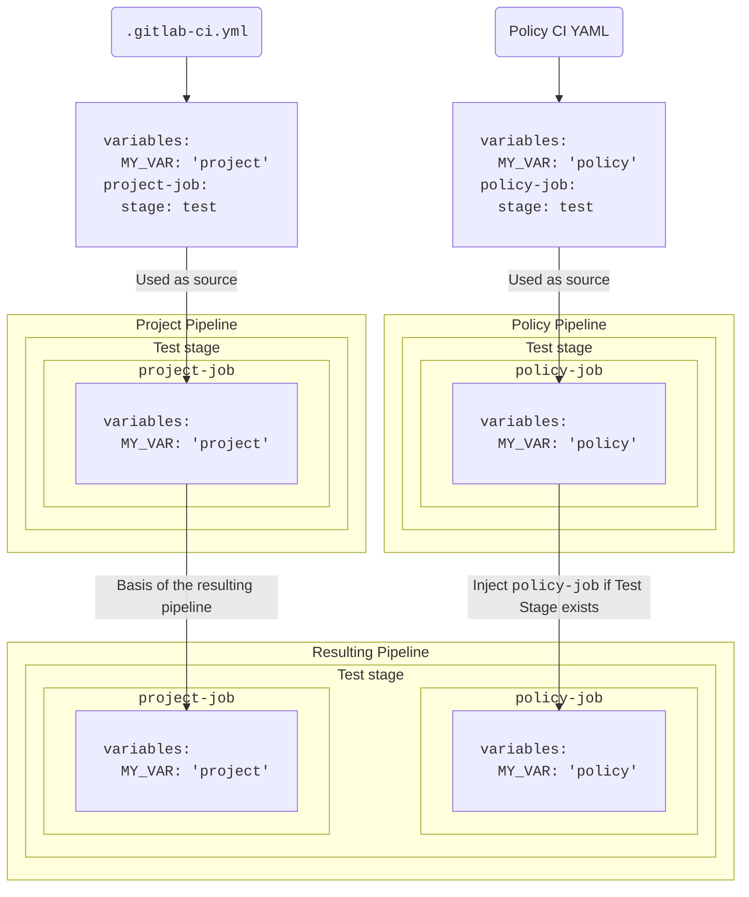



- 계층: Ultimate
- 제공 서비스: GitLab.com, GitLab Self-Managed, GitLab Dedicated





- [GitLab 17.2에 도입됨](https://gitlab.com/groups/gitlab-org/-/epics/13266) [플래그 사용](../../../administration/feature_flags/_index.md) `pipeline_execution_policy_type`. 기본적으로 활성화됩니다.
- GitLab 17.3에서 [일반적으로 사용 가능](https://gitlab.com/gitlab-org/gitlab/-/issues/454278)합니다. 기능 플래그 `pipeline_execution_policy_type`이 제거되었습니다.



을 사용하여 단일 구성으로 여러 프로젝트의 을 관리하고 적용합니다.

> [!warning]
> 을 활성화하기 전에 같은 프로젝트의 기존 [규정 준수 파이프라인](../../compliance/compliance_pipelines.md)을 마이그레이션했는지 확인하세요. 두 가지 모두 구성되면 규정 준수 이 표준 프로젝트 을 대체하지만 은 원본 프로젝트 을 기반으로 적용됩니다. 이는 파이프라인 실행 정책 전략 및 CI/CD 구성에 따라 달라지는 예측 불가능한 동작을 만들고, 중복된 작업, 파이프라인 실패 또는 누락된 중요한 보안 및 규정 준수 검사로 인해 발생할 수 있습니다. 규정 준수 은 [더 이상 사용되지 않습니다](../../../update/deprecations.md#compliance-pipelines). 기존 규정 준수 을 최대한 빨리 마이그레이션하고, 모든 새로운 구현에 을 사용해야 합니다.

- <i class="fa-youtube-play" aria-hidden="true"></i> 비디오 설명은 [보안 정책: 파이프라인 실행 정책 유형](https://www.youtube.com/watch?v=QQAOpkZ__pA).

## 스키마 {#schema}



- [GitLab 17.4에서 활성화됨](https://gitlab.com/gitlab-org/gitlab/-/merge_requests/159858) `suffix` 필드.
- [변경됨](https://gitlab.com/gitlab-org/gitlab/-/merge_requests/165096) 실행은 GitLab 17.7에서 이후 가 `.pipeline-policy-pre` 의 완료를 기다리도록 합니다.
- [변경됨](https://gitlab.com/gitlab-org/gitlab/-/issues/558233) 실행은 GitLab 18.10에서 `.pipeline-policy-pre` 가 실패할 때 모든 이후 을 건너뜁니다. 기본적으로 활성화됩니다.
- 새 실행 [GitLab 19.0에서 일반적으로 사용 가능](https://gitlab.com/gitlab-org/gitlab/-/merge_requests/233245). 기능 플래그 `ensure_pipeline_policy_pre_succeeds`이 제거되었습니다.



파일은 `pipeline_execution_policy` 키 아래 중첩된 스키마와 일치하는 객체 배열로 구성됩니다. 프로젝트당 `pipeline_execution_policy` 키 아래에서 최대 5개의 정책을 구성할 수 있습니다. 처음 5개 이후에 구성된 다른 정책은 적용되지 않습니다.

새 정책을 저장할 때, GitLab은 해당 내용을 [이 JSON 스키마](https://gitlab.com/gitlab-org/gitlab/-/blob/master/ee/app/validators/json_schemas/security_orchestration_policy.json)에 대해 검증합니다. [JSON 스키마](https://json-schema.org/) 읽는 방법에 익숙하지 않으면 다음 섹션과 표에서 대안을 제공합니다.

| 필드 | 형식 | 필수 | 설명 |
|-------|------|----------|-------------|
| `pipeline_execution_policy` | 의 `array` | 참 | 목록(최대 5개) |

## `pipeline_execution_policy` 스키마 {#pipeline_execution_policy-schema}

| 필드 | 형식 | 필수 | 설명                                                                                                                                                                                                                                                                                                                     |
|-------|------|----------|---------------------------------------------------------------------------------------------------------------------------------------------------------------------------------------------------------------------------------------------------------------------------------------------------------------------------------|
| `name` | `string` | 참 | 정책의 이름입니다. 최대 255자입니다.                                                                                                                                                                                                                                                                                  |
| `description` (선택 사항) | `string` | 참 | 정책의 설명입니다.                                                                                                                                                                                                                                                                                                      |
| `enabled` | `boolean` | 참 | 정책을 활성화(`true`) 또는 비활성화(`false`)하는 플래그입니다.                                                                                                                                                                                                                                                                        |
| `content` | [`content`](#content-type)의 `object` | 참 | 프로젝트 파이프라인에 주입할 CI/CD 구성에 대한 참조입니다.                                                                                                                                                                                                                                                          |
| `pipeline_config_strategy` | `string` | 거짓 | `inject_policy`, `inject_ci` (더 이상 사용되지 않음) 또는 `override_project_ci`일 수 있습니다. 자세한 내용은 [전략](#pipeline-configuration-strategies)을 참조하세요.                                                                                                                                                                 |
| `policy_scope` | [`policy_scope`](_index.md#configure-the-policy-scope)의 `object` | 거짓 | 지정한 프로젝트, 그룹 또는 규정 준수 프레임워크 레이블을 기반으로 정책의 범위를 지정합니다.                                                                                                                                                                                                                                        |
| `suffix` | `string` | 거짓 | `on_conflict` (기본값) 또는 `never`일 수 있습니다. 이름 충돌을 처리하기 위한 동작을 정의합니다. `on_conflict`은 고유성을 중단할 의 이름에 고유한 접미사를 적용합니다. `never`는 프로젝트 및 적용 가능한 모든 정책 전체의 이름이 고유하지 않으면 이 실패하도록 합니다. |
| `skip_ci` | [`skip_ci`](pipeline_execution_policies.md#skip_ci-type)의 `object` | 거짓 | 사용자가 `skip-ci` 지시자를 적용할 수 있는지 여부를 정의합니다. 기본적으로 `skip-ci`의 사용은 무시되므로 이 있는 은 건너뛸 수 없습니다.                                                                                                                                             |
| `no_pipeline` | [`no_pipeline`](pipeline_execution_policies.md#no_pipeline-type)의 `object` | 거짓 | 사용자가 `no_pipeline` 지시자를 적용할 수 있는지 여부를 정의합니다. 기본적으로 `no_pipeline`의 사용은 무시되므로 이 있는 은 생성할 수 없습니다.                                                                                                                                 |
| `variables_override` | [`variables_override`](pipeline_execution_policies.md#variables_override-type)의 `object` | 거짓 | 사용자가 정책으로 생성된 에서 정책 변수의 동작을 재정의할 수 있는지 제어합니다. 기본적으로 정책 변수는 최고 우선 순위로 적용되며 사용자는 재정의할 수 없습니다.                                                                                                               |

다음을 참고하세요:

- 에 지정된 파일에 대해 최소 읽기 액세스 권한이 있어야 을 트리거하는 사용자는 이 시작되지 않습니다.
- 파일이 삭제되거나 이름이 변경되면 정책이 적용된 프로젝트의 이 작동을 중지할 수 있습니다.
- 을 다음 두 개의 예약된 중 하나에 할당할 수 있습니다:
  - `.pipeline-policy-pre` 의 시작 부분, `.pre` 이전입니다.
  - `.pipeline-policy-post` 의 맨 끝, `.post` 이후입니다.
- 예약된 에 을 주입하는 것은 항상 작동합니다. 실행 을 모든 표준(build, test, deploy) 또는 사용자 선언 에 할당할 수도 있습니다. 그러나 이 경우 프로젝트 구성에 따라 이 무시될 수 있습니다.
- 외부의 예약된 에 을 할당할 수 없습니다.
- 에 대해 고유한 이름을 선택하세요. 일부 CI/CD 구성은 작업 이름을 기반으로 하며, 같은 파이프라인에 여러 번 작업 이름이 존재하면 예상치 못한 결과가 발생할 수 있습니다. 예를 들어, `needs` 키워드는 한 을 다른 에 종속시킵니다. `example` 이름의 여러 이 있으면 `needs` `example` 이름을 사용하는 은 `example` 인스턴스 중 하나에만 무작위로 의존합니다.
- 파이프라인 실행 정책은 프로젝트에 CI/CD 구성 파일이 없는 경우에도 적용됩니다.
- 정책의 순서는 적용된 접미사에 중요합니다.
- 주어진 프로젝트에 적용된 정책에 `suffix: never`이 있으면 같은 이름의 다른 이 이미 에 있으면 이 실패합니다.
- 은 모든 브랜치 및 소스에 적용됩니다. 그러나 [머지 리퀘스트 파이프라인](../../../ci/pipelines/merge_request_pipelines.md#configure-merge-request-pipelines)의 경우 일부 `rules:` 또는 `workflow:rules` 구성은 작업이 실행되는 것을 방지할 수 있습니다. [규칙](../../../ci/yaml/workflow.md)을 사용하여 이 적용되는 시점을 제어하세요.

### 보안 정책 검사 {#security-policy-pipeline-check}



- 계층: Ultimate
- 제공 서비스: GitLab.com, GitLab Self-Managed, GitLab Dedicated
- 상태:  실험적 기능





- [GitLab 18.11에 도입됨](https://gitlab.com/gitlab-org/gitlab/-/issues/589650) [플래그 사용](../../../administration/feature_flags/_index.md) `security_policy_pipeline_check`. 기본적으로 비활성화되어 있습니다.
- [GitLab 18.11에서 기본적으로 활성화됨](https://gitlab.com/gitlab-org/gitlab/-/issues/592205).



파이프라인 실행 정책 또는 [스캔 실행 정책](scan_execution_policies.md)이 프로젝트에 대해 구성될 때, 보안 정책 파이프라인 검사는 머지 리퀘스트를 병합하기 전에 최신 커밋에 대한 모든 파이프라인이 성공해야 합니다. 이 검사는 으로 생성된 뿐만 아니라 때문에 실행되는 모든 에 적용됩니다.

보안 정책 검사는 이 통과하지만 다른 (으로 생성된 브랜치 등)이 실패할 때 병합을 방지하여 검증되지 않은 코드가 병합될 수 있습니다.

보안 정책 검사는 다음과 같이 작동합니다:

- 프로젝트 설정 **파이프라인이 성공해야 함**이 활성화되면 실패한 으로 인해 병합을 방지하는 하드 블록이 발생합니다.
- **파이프라인이 성공해야 함**이 활성화되지 않으면 실패한 으로 인해 경고가 발생합니다. 는 여전히 [자동 병합](../../project/merge_requests/auto_merge.md)으로 설정할 수 있습니다.
- 프로젝트 설정 **생략한 파이프라인은 성공한 것으로 간주됩니다.**이 활성화되면 건너뛴 은 통과된 것으로 처리됩니다.

### `.pipeline-policy-pre` {#pipeline-policy-pre-stage}



- [변경됨](https://gitlab.com/gitlab-org/gitlab/-/issues/558233) 실행은 GitLab 18.10에서 `.pipeline-policy-pre` 가 실패할 때 모든 이후 을 건너뜁니다. 기본적으로 활성화됩니다.
- 새 실행 [GitLab 19.0에서 일반적으로 사용 가능](https://gitlab.com/gitlab-org/gitlab/-/merge_requests/233245). 기능 플래그 `ensure_pipeline_policy_pre_succeeds`이 제거되었습니다.



`.pipeline-policy-pre` 의 은 항상 실행됩니다. 이 는 보안 및 규정 준수 사용 사례를 위해 설계되었습니다. 의 은 `.pipeline-policy-pre` 가 완료될 때까지 시작되지 않습니다.

`.pipeline-policy-pre` 가 실패하거나 의 모든 이 건너뛰어지면 이후 의 모든 이 건너뛰어집니다:

- `needs: []`을 가진 .
- `when: always`을 가진 .

워크플로우에 이 동작이 필요하지 않으면 `.pre` 또는 사용자 정의 를 사용하세요.

> [!note]
> GitLab 18.9 이전에는 `needs: []` 또는 `when: always`을 가진 이 실패한 `.pipeline-policy-pre` 를 우회할 수 있습니다. 이 동작은 GitLab 18.10에서 기본값이 되었으며 GitLab 19.0부터 영구적입니다.

### 이름 지정 모범 사례 {#job-naming-best-practice}



- 이름 충돌 처리 [GitLab 17.4에 도입됨](https://gitlab.com/gitlab-org/gitlab/-/issues/473189).



으로 생성된 에는 표시되는 표시기가 없습니다. 정책으로 생성된 을 식별하고 이름 충돌을 피우기 쉽게 하려면 이름에 고유한 접두사 또는 접미사를 추가하세요.

예:

- 사용: `policy1:deployments:sast`. 이 이름은 모든 다른 정책 및 프로젝트 전체에서 고유할 가능성이 높습니다.
- 사용하지 마세요: `sast`. 이 이름은 다른 정책 및 프로젝트에 중복될 가능성이 높습니다.

은 `suffix` 속성에 따라 이름 충돌을 처리합니다. 같은 이름의 여러 이 있으면:

- `on_conflict` (기본값) 사용, 의 다른 과 해당 이름이 충돌하면 에 접미사가 추가됩니다.
- `never` 사용, 충돌 시 접미사가 추가되지 않으며 이 실패합니다.

접미사는 이 기본 에 병합되는 순서를 기반으로 추가됩니다.

순서는 다음과 같습니다:

1. 프로젝트 
1. 프로젝트 (해당하는 경우)
1. 그룹 (해당하는 경우, 계층 순서, 가장 상위 그룹은 마지막으로 적용됨)

적용된 접미사의 형식은 다음과 같습니다:

`:policy-<security-policy-project-id>-<policy-index>`.

결과 예: `sast:policy-123456-0`.

한 프로젝트의 여러 정책이 같은 이름을 정의하면 수치 접미사는 충돌하는 정책의 인덱스에 해당합니다.

결과 예:

- `sast:policy-123456-0`
- `sast:policy-123456-1`

### 모범 사례 {#job-stage-best-practice}

파이프라인 실행 정책에 정의된 작업은 프로젝트의 CI/CD 구성에 정의된 모든 [스테이지](../../../ci/yaml/_index.md#stage), 예약된 스테이지 `.pipeline-policy-pre` 및 `.pipeline-policy-post`을 사용할 수 있습니다.

> [!note]
> 정책이 `.pre` 및 `.post` 에만 을 포함하면 정책의 이 `empty`로 평가됩니다. 프로젝트의 파이프라인과 병합되지 않습니다.
>
> 에서 `.pre` 및 `.post` 를 사용하려면 다른 에서 실행되는 최소 1개의 다른 을 포함해야 합니다. 예: `.pipeline-policy-pre`.

`inject_policy` [전략](#pipeline-configuration-strategies)을 사용할 때 대상 프로젝트에 자신의 `.gitlab-ci.yml` 파일이 없으면 모든 가 에 주입됩니다.

(더 이상 사용되지 않음) `inject_ci` [전략](#pipeline-configuration-strategies)을 사용할 때 대상 프로젝트에 자신의 `.gitlab-ci.yml` 파일이 없으면 사용 가능한 유일한 는 기본 및 예약된 입니다.

수정할 권한이 없는 CI/CD 구성이 있는 프로젝트에 파이프라인 실행 정책을 적용할 때 `.pipeline-policy-pre` 및 `.pipeline-policy-post` 스테이지에 작업을 정의해야 합니다. 이 스테이지는 프로젝트의 CI/CD 구성에 관계없이 항상 사용 가능합니다.

`override_project_ci` [전략](#pipeline-configuration-strategies)을 여러 과 사용자 정의 와 함께 사용할 때 는 서로 호환되도록 같은 상대 순서로 정의해야 합니다:

유효한 구성 예:

```yaml
  - override-policy-1 stages: [build, test, policy-test, deploy]
  - override-policy-2 stages: [test, deploy]
```

유효하지 않은 구성 예:

```yaml
  - override-policy-1 stages: [build, test, policy-test, deploy]
  - override-policy-2 stages: [deploy, test]
```

1개 이상의 `override_project_ci` 정책이 유효하지 않은 `stages` 구성을 가지면 이 실패합니다.

### `content` 유형 {#content-type}

| 필드 | 형식 | 필수 | 설명 |
|-------|------|----------|-------------|
| `project` | `string` | 참 | 같은 GitLab 인스턴스의 프로젝트에 대한 전체 GitLab 프로젝트 경로입니다. |
| `file` | `string` | 참 | 루트 디렉터리(/)를 기준으로 한 전체 파일 경로입니다. YAML 파일에는 `.yml` 또는 `.yaml` 확장명이 있어야 합니다. |
| `ref` | `string` | 거짓 | 파일을 검색할 ref입니다. 지정되지 않을 때 프로젝트의 HEAD를 기본값으로 지정합니다. |

정책에서 `content` 유형을 사용하여 다른 리포지토리에 저장된 구성을 참조하세요. 이렇게 하면 여러 정책에 걸쳐 같은 구성을 재사용할 수 있으며 이러한 구성을 유지 관리하는 오버헤드가 줄어듭니다. 예를 들어 정책 A와 정책 B에 적용하려는 사용자 정의 시크릿 검색 CI/CD 구성이 있으면 단일 YAML 구성 파일을 생성하고 두 정책 모두에서 구성을 참조할 수 있습니다.

전제 조건:

- `content` 유형이 적용된 정책이 있는 프로젝트에서 실행되는 파이프라인을 트리거하는 사용자는 CI/CD를 포함하는 프로젝트에 대해 최소 읽기 전용 액세스 권한이 있어야 합니다.
- 파이프라인 실행 정책을 적용하는 프로젝트에서 사용자는 파이프라인을 트리거하기 위해 CI/CD 구성을 포함하는 프로젝트에 대해 최소 읽기 전용 액세스 권한이 있어야 합니다.

  GitLab 17.4 이상에서 `content` 유형을 사용하여 보안 정책 프로젝트에 지정된 CI/CD 구성 파일에 필요한 읽기 전용 액세스 권한을 부여할 수 있습니다. 그렇게 하려면 프로젝트의 일반 설정에서 **파이프라인 실행 정책** 설정을 활성화하세요. 이 설정을 활성화하면 파이프라인을 트리거한 사용자에게 파이프라인 실행 정책으로 적용된 CI/CD 구성 파일을 읽을 수 있는 액세스 권한이 부여됩니다. 이 설정은 구성 파일이 저장된 프로젝트의 다른 부분에 대한 사용자 액세스 권한을 부여하지 않습니다. 자세한 내용은 [자동으로 액세스 권한 부여](#grant-access-automatically)를 참조하세요.

### `skip_ci` 유형 {#skip_ci-type}



- [GitLab 17.7에서 도입됨](https://gitlab.com/gitlab-org/gitlab/-/merge_requests/173480).



은 `[skip ci]` 지시자를 사용할 수 있는 사용자를 제어합니다. `[skip ci]`을 사용할 수 있는 특정 사용자 또는 을 지정할 수 있으며 중요한 보안 및 규정 준수 검사가 수행됩니다.

`skip_ci` 키워드를 사용하여 사용자가 `skip_ci` 지시자를 적용하여 을 건너뛸 수 있는지 여부를 지정하세요. 키워드를 지정하지 않으면 `skip_ci` 지시자가 무시되어 모든 사용자가 을 우회하지 못합니다.

| 필드                   | 형식     | 가능한 값          | 설명 |
|-------------------------|----------|--------------------------|-------------|
| `allowed` | `boolean`   | `true`, `false` | 이 적용된 에 대해 `skip-ci` 지시자의 사용을 허용(`true`) 또는 방지(`false`)하는 플래그입니다. |
| `allowlist`             | `object` | `users` | `allowed` 플래그에 관계없이 항상 `skip-ci` 지시자를 사용할 수 있는 사용자를 지정하세요. `users:`을 사용한 후 사용자 ID를 나타내는 `id` 키를 가진 객체 배열을 사용하세요. |

### `no_pipeline` 유형 {#no_pipeline-type}

은 `[no_pipeline]` 지시자를 사용할 수 있는 사용자를 제어합니다. `[no_pipeline]`을 사용할 수 있는 특정 사용자 또는 을 지정할 수 있으며 중요한 보안 및 규정 준수 검사가 수행됩니다.

`no_pipeline` 키워드를 사용하여 사용자가 `no_pipeline` 지시자를 적용하여 을 생성하지 않을 수 있는지 여부를 지정하세요. 키워드를 지정하지 않으면 `no_pipeline` 지시자가 무시되어 모든 사용자가 을 우회하지 못합니다.

| 필드                   | 형식     | 가능한 값          | 설명 |
|-------------------------|----------|--------------------------|-------------|
| `allowed` | `boolean`   | `true`, `false` | 이 적용된 에 대해 `no_pipeline` 지시자의 사용을 허용(`true`) 또는 방지(`false`)하는 플래그입니다. |
| `allowlist`             | `object` | `users` | `allowed` 플래그에 관계없이 항상 `no_pipeline` 지시자를 사용할 수 있는 사용자를 지정하세요. `users:`을 사용한 후 사용자 ID를 나타내는 `id` 키를 가진 객체 배열을 사용하세요. |

### `variables_override` 유형 {#variables_override-type}



- [GitLab 18.1에 도입됨](https://gitlab.com/groups/gitlab-org/-/epics/16430).



| 필드                   | 형식     | 가능한 값          | 설명 |
|-------------------------|----------|--------------------------|-------------|
| `allowed` | `boolean`   | `true`, `false` | `true`일 때 다른 구성이 변수를 재정의할 수 있습니다. `false`일 때 다른 구성이 변수를 재정의할 수 없습니다. |
| `exceptions` | `array` | `string`의 `array` | 전역 규칙의 예외인 변수입니다. `allowed: false`일 때 `exceptions`은 허용 목록입니다. `allowed: true`일 때 `exceptions`은 거부 목록입니다. |
| `dotenv` | `string` | `respect_policy`, `allow_override` | [dotenv 아티팩트](../../../ci/yaml/artifacts_reports.md#artifactsreportsdotenv) 변수가 `variables_override` 규칙을 존중하는지 제어합니다. 기본적으로 (지정되지 않거나 `respect_policy`으로 설정된 경우) dotenv 변수는 다른 변수와 같은 재정의 규칙을 따릅니다. `allow_override`로 설정하여 dotenv 변수가 규칙을 우회하도록 합니다. 이 옵션은 dotenv 아티팩트가 변수를 재정의하는 워크플로우와의 역호환성을 위해 제공됩니다. `allow_override`을 사용하는 것은 `variables_override`으로 제공되는 보안 보장을 약화시키므로 권장되지 않습니다. |

이 옵션은 정책이 적용된 에서 사용자 정의 변수를 처리하는 방법을 제어합니다. 이 기능을 사용하면 다음을 수행할 수 있습니다:

- 기본적으로 사용자 정의 변수를 거부(권장)하여 더 강한 보안을 제공하지만 사용자 정의할 수 있어야 하는 모든 변수를 `exceptions` 허용 목록에 추가해야 합니다.
- 기본적으로 사용자 정의 변수를 허용하여 더 많은 유연성을 제공하지만 보안이 낮으므로 적용에 영향을 미칠 수 있는 변수를 `exceptions` 거부 목록에 추가해야 합니다.
- `allowed` 전역 규칙에 대한 예외를 정의하세요.

사용자 정의 변수는 의 모든 의 동작에 영향을 미칠 수 있으며 다양한 소스에서 올 수 있습니다:

- [변수](../../../ci/variables/_index.md#use-pipeline-variables).
- [프로젝트 변수](../../../ci/variables/_index.md#for-a-project).
- [그룹 변수](../../../ci/variables/_index.md#for-a-group).
- [인스턴스 변수](../../../ci/variables/_index.md#for-an-instance).

`variables_override` 옵션을 지정하지 않으면 "최고 우선 순위" 동작이 유지됩니다. 이 동작에 대한 자세한 내용은 [의 변수 우선 순위](#precedence-of-variables-in-pipeline-execution-policies)를 참조하세요.

이 변수 우선 순위를 제어할 때 로그에는 구성된 `variables_override` 옵션과 이름이 포함됩니다. 이러한 로그를 보려면 `gitlab-runner`을(를) 버전 18.1 이상으로 업데이트해야 합니다.

#### 예 `variables_override` 구성 {#example-variables_override-configuration}

`variables_override` 옵션을 구성에 추가하세요:

```yaml
pipeline_execution_policy:
  - name: Security Scans
    description: 'Enforce security scanning'
    enabled: true
    pipeline_config_strategy: inject_policy
    content:
      include:
        - project: gitlab-org/security-policies
          file: security-scans.yml
    variables_override:
      allowed: false
      exceptions:
        - CS_IMAGE
        - SAST_EXCLUDED_ANALYZERS
```

##### 보안 스캔을 적용하면서 컨테이너 사용자 정의 허용(허용 목록 접근) {#enforcing-security-scans-while-allowing-container-customization-allowlist-approach}

보안 스캔을 적용하되 프로젝트 팀이 자신의 컨테이너 이미지를 지정하도록 허용하려면:

```yaml
variables_override:
  allowed: false
  exceptions:
    - CS_IMAGE
```

이 구성은 `CS_IMAGE`을(를) 제외한 모든 사용자 정의 변수를 차단하여 보안 스캔을 비활성화할 수 없도록 하면서 팀이 컨테이너 이미지를 사용자 정의할 수 있습니다.

##### 특정 보안 변수 재정의 방지(거부 목록 접근) {#prevent-specific-security-variable-overrides-denylist-approach}

대부분의 변수를 허용하되 보안 스캔 비활성화를 방지하려면:

```yaml
variables_override:
  allowed: true
  exceptions:
    - SECRET_DETECTION_DISABLED
    - SAST_DISABLED
    - DEPENDENCY_SCANNING_DISABLED
    - DAST_DISABLED
    - CONTAINER_SCANNING_DISABLED
```

이 구성은 보안 스캔을 비활성화할 수 있는 변수를 제외한 모든 사용자 정의 변수를 허용합니다.

> [!warning]
> 이 구성은 유연성을 제공할 수 있지만 보안 의미로 인해 권장되지 않습니다. `exceptions`에 명시적으로 나열되지 않은 모든 변수는 사용자에 의해 주입될 수 있습니다. 결과적으로 구성은 `allowlist` 접근 방식을 사용할 때만큼 보호되지 않습니다.

### `policy scope` 스키마 {#policy-scope-schema}

적용을 사용자 정의하기 위해 의 범위를 정의하여 지정된 프로젝트, 그룹 또는 규정 준수 프레임워크 레이블을 포함하거나 제외할 수 있습니다. 자세한 내용은 [범위](_index.md#configure-the-policy-scope)를 참조하세요.

> [!note]
> `policy_scope` 필드를 빈 컬렉션(예: `including: []`)으로 설정하는 것은 필드를 생략하는 것과 같이 처리되므로 은 해당 범위 차원의 모든 프로젝트에 적용됩니다. 을 완전히 비활성화하려면 `enabled: false`을 사용하세요. 자세한 내용은 [`policy_scope`의 빈 컬렉션](_index.md#empty-collections-in-policy_scope)을 참조하세요.

## 구성에 대한 액세스 관리 {#manage-access-to-the-cicd-configuration}

프로젝트에 파이프라인 실행 정책을 적용할 때 파이프라인을 트리거하는 사용자는 정책 CI/CD 구성을 포함하는 프로젝트에 대해 최소 읽기 전용 액세스 권한이 있어야 합니다. 프로젝트에 대한 액세스 권한을 수동으로 또는 자동으로 부여할 수 있습니다.

### 수동으로 액세스 권한 부여 {#grant-access-manually}

사용자 또는 그룹이 파이프라인 실행 정책을 적용한 파이프라인을 실행할 수 있도록 하려면 정책 CI/CD 구성을 포함하는 프로젝트에 초대할 수 있습니다.

### 자동으로 액세스 권한 부여 {#grant-access-automatically}

파이프라인 실행 정책이 적용된 프로젝트에서 파이프라인을 실행하는 모든 사용자에게 정책 CI/CD 구성에 대한 액세스 권한을 자동으로 부여할 수 있습니다.

전제 조건:

- 파이프라인 실행 정책 CI/CD 구성이 보안 정책 프로젝트에 저장되어 있는지 확인하세요.
- 프로젝트의 일반 설정에서 **파이프라인 실행 정책** 설정을 활성화하세요.

아직 프로젝트가 없고 첫 을 생성하려면 빈 프로젝트를 생성하고 프로젝트로 연결하세요. 프로젝트를 연결하려면:

1. 을 적용하려는 그룹 또는 프로젝트에서 **보안** > **정책** > **정책 프로젝트 편집**을 선택하세요.
1. 프로젝트를 선택하세요.

프로젝트가 보안 정책 프로젝트가 되고 설정을 사용할 수 있습니다.

> [!note]
> `$CI_JOB_TOKEN`을(를) 사용하여 을 생성하려면 프로젝트 및 그룹이 프로젝트를 요청할 권한이 있는지 확인해야 합니다. 프로젝트에서 **설정** > **CI/CD** > **작업 토큰 권한**으로 이동하여 승인된 그룹 및 프로젝트를 허용 목록에 추가하세요. **CI/CD** 설정이 표시되지 않으면 **설정** > **일반** > **표시 여부, 프로젝트 기능, 권한**으로 이동하여 **CI/CD**를 활성화하세요.

#### 구성 {#configuration}

1. 프로젝트에서 **설정** > **일반** > **표시 여부, 프로젝트 기능, 권한**을 선택하세요.
1. **파이프라인 실행 정책** 설정을 활성화하세요.
1. 정책 프로젝트에서 정책 CI/CD 구성의 파일을 만드세요.

   ```yaml
   # policy-ci.yml

   policy-job:
     script: ...
   ```

1. 정책을 적용하려는 그룹 또는 프로젝트에서 파이프라인 실행 정책을 만들고 보안 정책 프로젝트에 대한 CI/CD 구성 파일을 지정하세요.

   ```yaml
   pipeline_execution_policy:
   - name: My pipeline execution policy
     description: Enforces CI/CD jobs
     enabled: true
     pipeline_config_strategy: inject_policy
     content:
       include:
       - project: my-group/my-security-policy-project
         file: policy-ci.yml
   ```

## 구성 전략 {#pipeline-configuration-strategies}

구성 전략은 구성과 프로젝트 을 병합하는 방법을 정의합니다. 은 `.gitlab-ci.yml` 파일에 정의된 을 격리된 에서 실행하며, 이는 대상 프로젝트의 으로 병합됩니다.

### `inject_policy` 유형 {#inject_policy-type}



- [GitLab 17.9에 도입됨](https://gitlab.com/gitlab-org/gitlab/-/issues/475152).



이 전략은 사용자 정의 CI/CD 구성을 기존 프로젝트 파이프라인에 추가하며 프로젝트의 원본 CI/CD 구성을 완전히 대체하지 않습니다. 이는 새 보안 스캔, 규정 준수 검사 또는 사용자 정의 스크립트 추가와 같은 추가 단계로 현재 을 향상 또는 확장하려는 경우에 적합합니다.

더 이상 사용되지 않는 `inject_ci` 전략과 달리 `inject_policy`은(는) 사용자 정의 정책 스테이지를 파이프라인에 주입할 수 있으므로 CI/CD 워크플로우에 정책 규칙을 적용할 위치를 더 세밀하게 제어할 수 있습니다.

여러 이 활성화되면 이 전략은 각 의 모든 을 주입합니다.

이 전략을 사용할 때 프로젝트 CI/CD 구성은 각 파이프라인이 격리된 YAML 구성을 가지므로 정책 파이프라인에 정의된 모든 동작을 재정의할 수 없습니다.

`.gitlab-ci.yml` 파일이 없는 프로젝트의 경우 이 전략은 `.gitlab-ci.yml` 파일을 암묵적으로 만듭니다. 실행된 에는 에 정의된 만 포함됩니다.

> [!note]
> 파이프라인 실행 정책이 작업이 실행되지 않도록 방지하는 워크플로우 규칙을 사용하면 실행되는 유일한 작업은 프로젝트의 CI/CD 작업입니다. 프로젝트가 프로젝트 CI/CD 작업이 실행되지 않도록 방지하는 워크플로우 규칙을 사용하면 실행되는 유일한 작업은 파이프라인 실행 정책 작업입니다.

#### 주입 {#stages-injection}

정책 파이프라인의 스테이지는 일반적인 CI/CD 구성을 따릅니다. 사용자 정의 를 프로젝트 에 주입하는 순서를 정의하려면 사용자 정의 앞뒤의 를 제공하세요.

프로젝트 및 는 방향 비순환 그래프(DAG)로 표현되며, 여기서 노드는 이고 모서리는 종속성을 나타냅니다. 을 결합할 때 개별 DAG이 더 크고 단일 DAG로 병합됩니다. 그 후 위상 정렬이 수행되어 모든 의 를 실행해야 하는 순서를 결정합니다. 이 정렬은 모든 종속성이 최종 순서에서 존중되도록 합니다. 충돌하는 종속성이 있으면 이 실행되지 않습니다. 종속성을 수정하려면 프로젝트 및 에 걸쳐 사용되는 가 정렬되어 있는지 확인하세요.

가 구성에 명시적으로 정의되지 않으면 은 기본 `stages: [build, test, deploy]`을 사용합니다. 이 를 포함하되 다른 순서로 나열하면 이 `Cyclic dependencies detected when enforcing policies` 오류로 실패합니다.

다음 예제는 이 동작을 보여줍니다. 모든 예제는 다음 프로젝트 구성을 가정합니다:

```yaml
# .gitlab-ci.yml
stages: [build, test, deploy]

project-build-job:
  stage: build
  script: ...

project-test-job:
  stage: test
  script: ...

project-deploy-job:
  stage: deploy
  script: ...
```

##### 예 1 {#example-1}

```yaml
# policy-ci.yml
stages: [test, policy-stage, deploy]

policy-job:
  stage: policy-stage
  script: ...
```

이 예에서 `policy-stage` :

- `test` 이후에 주입되어야 합니다 (있는 경우).
- `deploy` 이전에 주입되어야 합니다 (있는 경우).

결과: 에는 다음 가 포함됩니다: `[build, test, policy-stage, deploy]`.

특별한 경우:

- `.gitlab-ci.yml`이 를 `[build, deploy, test]`로 지정한 경우 은 `Cyclic dependencies detected when enforcing policies` 오류로 실패합니다 (제약 조건을 만족할 수 없으므로). 실패를 수정하려면 프로젝트 구성을 조정하여 과 를 정렬하세요.
- `.gitlab-ci.yml`이 를 `[build]`로 지정한 경우 결과 에는 다음 가 있습니다: `[build, policy-stage]`.

##### 예 2 {#example-2}

```yaml
# policy-ci.yml
stages: [policy-stage, deploy]

policy-job:
  stage: policy-stage
  script: ...
```

이 예에서 `policy-stage` :

- `deploy` 이전에 주입되어야 합니다 (있는 경우).

결과: 에는 다음 가 포함됩니다: `[build, test, policy-stage, deploy]`.

특별한 경우:

- `.gitlab-ci.yml`이 를 `[build, deploy, test]`로 지정한 경우 결과 는 `[build, policy-stage, deploy, test]`입니다.
- 프로젝트 에 `deploy` 가 없으면 `policy-stage` 는 의 끝 부분에 주입되며 `.pipeline-policy-post` 바로 앞입니다.

##### 예 3 {#example-3}

```yaml
# policy-ci.yml
stages: [test, policy-stage]

policy-job:
  stage: policy-stage
  script: ...
```

이 예에서 `policy-stage` :

- `test` 이후에 주입되어야 합니다 (있는 경우).

결과: 에는 다음 가 포함됩니다: `[build, test, deploy, policy-stage]`.

특별한 경우:

- 프로젝트 에 `test` 가 없으면 `policy-stage` 는 의 끝 부분에 주입되며 `.pipeline-policy-post` 바로 앞입니다.

##### 예 4 {#example-4}

```yaml
# policy-ci.yml
stages: [policy-stage]

policy-job:
  stage: policy-stage
  script: ...
```

이 예에서 `policy-stage` 는 제약 조건이 없습니다.

결과: 에는 다음 가 포함됩니다: `[build, test, deploy, policy-stage]`.

##### 예 5 {#example-5}

```yaml
# policy-ci.yml
stages: [check, lint, test, policy-stage, deploy, verify, publish]

policy-job:
  stage: policy-stage
  script: ...
```

이 예에서 `policy-stage` :

- `check`, `lint`, `test` 이후에 주입되어야 합니다 (있는 경우).
- `deploy`, `verify`, `publish` 이전에 주입되어야 합니다 (있는 경우).

결과: 에는 다음 가 포함됩니다: `[build, test, policy-stage, deploy]`.

특별한 경우:

- `.gitlab-ci.yml`이 를 `[check, publish]`로 지정한 경우 결과 에는 다음 가 있습니다: `[check, policy-stage, publish]`

#### 기본 순서 {#default-stage-order}

에 가 정의되지 않으면 GitLab은 기본 순서를 적용합니다:

1. `.pre`
1. `build`
1. `test`
1. `deploy`
1. `.post`.

기본 순서는 다른 순서로 이러한 기본 를 사용하는 프로젝트와 충돌할 수 있습니다. 예를 들어, `stages: [test, build, deploy]`에서 `build` 이전에 `test` 사용.

#### 순환 종속성 방지 {#avoiding-cyclic-dependencies}

순환 종속성 오류는 의 순서가 프로젝트의 순서와 충돌할 때 발생합니다. 이 오류를 방지하려면:

- 항상 의 를 명시적으로 정의하여 순서가 명확하고 프로젝트와 호환되는지 확인하세요. 이 기본 `build`, `test` 또는 `deploy`을 사용하면 모든 프로젝트에 순서가 적용됩니다.
- 예약된 (`.pipeline-policy-pre` 및 `.pipeline-policy-post`)만 사용할 경우 에 기본 를 정의할 필요가 없습니다. 이러한 예약된 는 항상 의 시작과 끝에 배치됩니다.

이 지침을 따르면 다양한 구성을 가진 프로젝트 전체에서 안정적으로 작동하는 을 만들 수 있습니다.

### `inject_ci` (더 이상 사용되지 않음) {#inject_ci-deprecated}

> [!warning]
> 이 기능은 GitLab 17.9에서 [더 이상 사용되지 않습니다](https://gitlab.com/gitlab-org/gitlab/-/issues/475152). 의 적용을 지원하므로 [`inject_policy`](#inject_policy-type)을(를) 대신 사용하세요.

이 전략은 사용자 정의 CI/CD 구성을 기존 프로젝트 파이프라인에 추가하며 프로젝트의 원본 CI/CD 구성을 완전히 대체하지 않습니다. 이는 새 보안 스캔, 규정 준수 검사 또는 사용자 정의 스크립트 추가와 같은 추가 단계로 현재 을 향상 또는 확장하려는 경우에 적합합니다.

여러 이 활성화되면 모든 이 가산적으로 주입됩니다.

이 전략을 사용할 때 프로젝트 CI/CD 구성은 각 파이프라인이 격리된 YAML 구성을 가지므로 정책 파이프라인에 정의된 모든 동작을 재정의할 수 없습니다.

`.gitlab-ci.yml` 파일이 없는 프로젝트의 경우 이 전략은 `.gitlab-ci.yml` 파일을 암묵적으로 만듭니다. 이렇게 하면 에 정의된 만 포함하는 이 실행될 수 있습니다.

> [!note]
> 파이프라인 실행 정책이 작업이 실행되지 않도록 방지하는 워크플로우 규칙을 사용하면 실행되는 유일한 작업은 프로젝트의 CI/CD 작업입니다. 프로젝트가 프로젝트 CI/CD 작업이 실행되지 않도록 방지하는 워크플로우 규칙을 사용하면 실행되는 유일한 작업은 파이프라인 실행 정책 작업입니다.

### `override_project_ci` {#override_project_ci}



- 워크플로우 규칙 처리 업데이트됨:
  - [GitLab 17.8에 도입됨](https://gitlab.com/gitlab-org/gitlab/-/merge_requests/175088) [플래그 사용](../../../administration/feature_flags/_index.md) `policies_always_override_project_ci`. 기본적으로 활성화됩니다.
  - [GitLab 17.10에서 일반적으로 사용 가능](https://gitlab.com/gitlab-org/gitlab/-/issues/512877). 기능 플래그 `policies_always_override_project_ci`이 제거되었습니다.
- `override_project_ci` 처리 [변경됨](https://gitlab.com/gitlab-org/gitlab/-/issues/504434) GitLab 17.9에서 이 과 함께 실행될 수 있습니다.



이 전략은 프로젝트의 기존 CI/CD 구성을 파이프라인 실행 정책으로 정의된 새로운 구성으로 대체합니다. 이 전략은 전체 파이프라인을 표준화하거나 대체해야 할 때(예: 규제가 많은 산업에서 조직 전체 CI/CD 표준 또는 규정 준수 요구 사항을 적용하려는 경우) 이상적입니다. 파이프라인 구성을 재정의하려면 CI/CD 작업을 정의하고 `include:project`을 사용하지 마세요.

전략은 `inject_ci` 또는 `inject_policy` 전략을 사용하는 다른 보다 우선순위가 높습니다. `override_project_ci`과 함께 정책이 적용되면 프로젝트 CI/CD 구성이 무시됩니다. 그러나 다른 구성은 재정의되지 않습니다.

`override_project_ci`을 파이프라인 실행 정책과 함께 검사 실행 정책과 함께 사용할 때 CI/CD 구성이 병합되고 두 정책이 결과 파이프라인에 적용됩니다.

또는 프로젝트의 구성을 재정의하는 대신 프로젝트의 `.gitlab-ci.yml`과 병합할 수 있습니다. 구성을 병합하려면 `include:project`을(를) 사용하세요. 이 전략을 통해 사용자는 파이프라인 실행 정책 구성에 프로젝트 CI/CD 구성을 포함할 수 있으므로 사용자가 정책 작업을 사용자 정의할 수 있습니다. 예를 들어 정책 및 프로젝트 CI/CD 구성을 하나의 YAML 파일로 결합하여 `before_script` 구성을 재정의하거나 컨테이너 스캔 경로를 정의하는 데 필요한 `CS_IMAGE`와 같은 필수 변수를 정의할 수 있습니다. 이 동작의 [짧은 데모](https://youtu.be/W8tubneJ1X8)를 참조하세요. 다음 다이어그램은 프로젝트 및 수준에서 정의된 변수가 결과 에서 어떻게 선택되는지 보여줍니다:



> [!note]
> 파이프라인 실행 정책의 워크플로우 규칙이 프로젝트의 원본 CI/CD 구성을 재정의합니다. 정책에 워크플로우 규칙을 정의하면 브랜치 사용 방지와 같이 연결된 모든 프로젝트에 적용되는 규칙을 설정할 수 있습니다.

#### 이름 {#pipeline-name}

`override_project_ci` 전략을 사용하는 파이프라인 실행 정책은 프로젝트의 원본 CI/CD 구성에 정의된 [파이프라인 이름](../../../ci/yaml/_index.md#workflowname)을 재정의합니다.

구성에 이름을 정의할 수 있습니다.

`override_project_ci` 전략을 사용하는 여러 이 있으면 그룹 계층 구조에서 가장 낮은 것이 적용됩니다. 예를 들어 프로젝트에 대한 이 프로젝트가 속하는 그룹에 대한 을 재정의합니다. 하위 그룹에 대한 은 하위 그룹이 속하는 그룹에 대한 보다 우선합니다.

### 파이프라인 실행 정책 구성에 프로젝트의 CI/CD 구성 포함 {#include-a-projects-cicd-configuration-in-the-pipeline-execution-policy-configuration}

`override_project_ci` 전략을 사용할 때 프로젝트 구성을 구성에 포함할 수 있습니다:

```yaml
include:
  - project: $CI_PROJECT_PATH
    ref: $CI_COMMIT_SHA
    file: $CI_CONFIG_PATH
    rules:
      - exists:
          paths:
            - '$CI_CONFIG_PATH'
          project: '$CI_PROJECT_PATH'
          ref: '$CI_COMMIT_SHA'

compliance_job:
 ...
```

> [!note]
> 프로젝트의 `.gitlab-ci.yml` 구성이 `override_project_ci` 에 `include:project`을(를) 사용하여 포함되면 프로젝트 구성은 의 일부가 됩니다. 이 시나리오에서 포함된 프로젝트 구성은 예약된 (`.pipeline-policy-pre` 및 `.pipeline-policy-post`)에 을 할당할 수 있습니다 (예약된 의 사용은 내에서 허용되므로). 이 예외를 제외하고 [예약된 에 을 할당할 수 없습니다](#job-stage-best-practice).

## CI/CD 변수 {#cicd-variables}

> [!warning]
> 민감한 정보 또는 자격 증명을 변수에 저장하지 마세요 (Git 리포지토리의 일반 텍스트 구성 부분으로 저장되기 때문).

기본적으로 은 격리 상태에서 실행되며, 정책 외부에서 정의된 변수를 적용하지 않습니다.

[`variables_override` 설정](#variables_override-type) 설정을 활성화하면 은 다음 사용자 정의 변수에 액세스할 수 있습니다:

- 그룹 설정의 변수입니다.
- 프로젝트 설정의 변수입니다.
- 새 을 실행할 때 사용자가 지정한 변수입니다.

그러나 `variables_override` 설정이 활성화되었을 때도 은 다음 유형의 변수에 액세스할 수 없습니다:

- 다른 에 정의된 변수입니다.
- 프로젝트의 `.gitlab-ci.yml` 파일에 정의된 변수입니다.

활성화되면 `variables_override` 설정을 통해 정책이 표준 [CI/CD 변수 우선 순위](../../../ci/variables/_index.md#cicd-variable-precedence) 규칙에 따라 변수에 액세스하고 적용할 수 있습니다.

그러나 우선 순위 규칙은 을 사용할 때 더 복잡하며 전략에 따라 달라질 수 있습니다:

- `inject_policy` 전략: 변수가 에 정의되면 이 항상 이 값을 사용합니다. 변수가 에 정의되지 않으면 은 그룹 또는 프로젝트 설정의 값을 적용합니다.
- `inject_ci` 전략: 변수가 에 정의되면 이 항상 이 값을 사용합니다. 변수가 에 정의되지 않으면 은 그룹 또는 프로젝트 설정의 값을 적용합니다.
- `override_project_ci` 전략: 결과 의 모든 이 으로 취급됩니다. 에서 정의된 변수 (포함된 파일의 변수 포함)는 프로젝트 및 그룹 변수보다 우선합니다. 이는 포함된 프로젝트의 CI/CD 구성의 작업에서 변수가 프로젝트 및 그룹 설정에서 정의된 변수보다 우선함을 의미합니다.

의 변수에 대한 자세한 내용은 [의 변수 우선 순위](#precedence-of-variables-in-pipeline-execution-policies)를 참조하세요.

[UI에서 프로젝트 또는 그룹 변수를 정의할 수 있습니다](../../../ci/variables/_index.md#define-a-cicd-variable-in-the-ui).

### 의 변수 우선 순위 {#precedence-of-variables-in-pipeline-execution-policies}

파이프라인 실행 정책을 사용할 때, 특히 `override_project_ci` 전략을 사용할 때 여러 위치에서 정의된 변수 값의 우선 순위는 표준 GitLab CI/CD 파이프라인과 다를 수 있습니다. 다음은 이해해야 할 몇 가지 중요한 요점입니다:

- `override_project_ci`을 사용할 때 결과 파이프라인의 모든 작업이 포함된 프로젝트의 CI/CD 구성을 포함한 정책 작업으로 간주됩니다.
- (전체 인스턴스 또는 에 대해)에서 정의된 변수는 프로젝트 또는 그룹 설정에서 정의된 변수보다 우선합니다.
- 이 동작은 프로젝트의 CI/CD 구성 파일(`.gitlab-ci.yml`)에서 포함된 작업을 포함한 모든 작업에 적용됩니다.

#### 예 {#example}

프로젝트의 CI/CD 구성의 변수와 포함된 `.gitlab-ci.yml` 파일에 정의된 작업 변수가 같은 이름을 가지면 `override_project_ci`을 사용할 때 작업 변수가 우선합니다.

프로젝트의 설정에서 `MY_VAR` 변수가 정의됩니다:

- 키: `MY_VAR`
- 값: `Project configuration variable value`

`.gitlab-ci.yml`의 포함된 프로젝트에서 같은 변수가 정의됩니다:

```yaml
project-job:
  variables:
    MY_VAR: "Project job variable value"
  script:
    - echo $MY_VAR  # This will output "Project job variable value"
```

이 경우 변수 값 `Project job variable value`이 우선합니다.

### 수동 실행 의 변수 사전 채우기 {#prefill-variables-in-manually-run-pipelines}



- [GitLab 18.5에 도입됨](https://gitlab.com/gitlab-org/gitlab/-/issues/527021).



> [!warning]
> 이 기능은 GitLab 18.5 이전에 생성된 과 함께 작동하지 않습니다. 이전 과 함께 이 기능을 사용하려면 다음 중 하나를 수행할 수 있습니다:
>
> - 의 기존 YAML 구성 파일에 변경 사항을 적용합니다.
> - 정책을 복사, 삭제 및 재생성합니다.
>
> 자세한 내용은 [재생성](#recreate-pipeline-execution-policies)를 참조하세요.

`description`, `value` 및 `options` 키워드를 사용하여 [사용자가 수동으로 파이프라인을 실행할 때 사전 입력되는](../../../ci/pipelines/_index.md#prefill-variables-in-manual-pipelines) CI/CD 변수를 정의할 수 있습니다. 설명을 사용하여 변수의 용도 및 허용되는 값이 무엇인지와 같은 관련 정보를 제공하세요.

특정 변수는 사전 채울 수 없습니다.

수동으로 트리거된 파이프라인에서 **새 파이프라인** 페이지는 모든 적용 가능한 정책의 CI/CD 구성에 정의된 `description`이 있는 모든 파이프라인 변수를 표시합니다.

[`variables_override`](pipeline_execution_policies.md#variables_override-type)을 사용하여 사전 입력된 변수를 허용된 것으로 구성해야 합니다. 그렇지 않으면 수동으로 을 트리거할 때 사용된 값이 무시됩니다.

#### 재생성 {#recreate-pipeline-execution-policies}

을 재생성하려면:

<!-- markdownlint-disable MD044 -->

1. 상단 표시줄에서 **검색 또는 이동**을 선택하고 그룹을 찾습니다.
1. 왼쪽 사이드바에서 **보안** > **정책**을 선택하세요.
1. 재생성하려는 을 선택하세요.
1. 오른쪽 사이드바에서 **YAML** 탭을 선택하고 전체 파일의 내용을 복사하세요.
1. 표 옆에서 수직 줄임표()를 선택하고 **삭제**를 선택하세요.
1. 생성된 를 병합하세요.
1. **보안** > **정책**으로 돌아가서 **새 정책**을 선택하세요.
1. **파이프라인 실행 정책** 섹션에서 **정책 선택**을 선택하세요.
1. **.yaml 모드**에 이전 의 내용을 붙여넣으세요.
1. **머지 리퀘스트를 통해 업데이트**를 선택하고 생성된 를 병합하세요.

<!-- markdownlint-enable MD044 -->

## 보안 중요 이 실행되는지 확인 {#ensuring-that-security-critical-policies-execute}

보안 및 규정 준수 목적으로 을 구현할 때 을 우회하거나 손상시킬 수 없도록 다음 모범 사례를 고려하세요.

### `changes:` 규칙을 보안 중요 에 피하기 {#avoid-changes-rules-for-security-critical-jobs}

보안 중요 에서 `changes:` 규칙을 사용하지 마세요 (브랜치 에서 예상치 못한 결과를 생성할 수 있으므로). `changes:` 키워드는 SHA 기반 diff에 의존하며 `git commit --amend` 후 강제 푸시와 같은 특정 시나리오에서 우회될 수 있습니다.

`git commit --amend` 후 강제 푸시를 사용할 때 GitLab은 변경된 파일을 다르게 계산합니다:

1. 첫 번째 푸시 (표준 ):
   1. GitLab은 새 을 부모와 비교합니다.
   1. GitLab은 대상 파일이 변경되었음을 감지합니다.
   1. `changes: [filename]` 규칙이 올바르게 트리거됩니다.

1. 두 번째 푸시 (`--force`로 수정된 ):
   1. 수정된 이 새 SHA로 이전 을 완전히 대체합니다.
   1. GitLab은 `git diff HEAD~`을(를) 사용하여 변경 내용을 계산하며 이는 브랜치의 이전 과 비교됩니다.
   1. 브랜치의 이전 에도 같은 파일 변경사항이 있으므로 diff는 **no new changes**을 표시합니다.
   1. `changes:` 규칙이 트리거되지 않습니다.

대신 우회할 수 없는 조건을 사용하세요:

```yaml
check-critical-files:
  stage: .pipeline-policy-pre
  script:
    - |
      # Check if critical files differ from the target branch
      if git diff origin/$CI_MERGE_REQUEST_TARGET_BRANCH_NAME --name-only | grep -q "Makefile\|\.gitlab-ci\.yml"; then
        echo "Critical files have been modified"
        exit 1
      fi
  rules:
    - if: $CI_PIPELINE_SOURCE == "merge_request_event"
      when: always
```

또는 `changes:` 조건 없이 모든 에서 검사를 실행하세요:

```yaml
security-check:
  stage: .pipeline-policy-pre
  script:
    - echo "Running security checks"
    - ./run-security-checks.sh
  rules:
    - when: always
```

`changes:` 동작에 대한 자세한 내용은 [`changes`을 사용할 때 또는 이 예상치 못하게 실행됨](../../../ci/jobs/job_troubleshooting.md#jobs-or-pipelines-run-unexpectedly-when-using-changes)을 참조하세요.

### `.pipeline-policy-pre` 를 중요 보안 검사에 사용 {#use-the-pipeline-policy-pre-stage-for-critical-security-checks}

`.pipeline-policy-pre` 의 은 보안 및 규정 준수 사용 사례를 위해 설계되었습니다. 다른 모든 은 이 가 완료될 때까지 기다립니다. `.pipeline-policy-pre` 가 실패하면 모든 후속 이 건너뛰어집니다.

#### 중복된 보안 구성 감지 {#detect-duplicate-security-configurations}

`.pipeline-policy-pre`을(를) 사용하여 기존 보안 구성을 확인하고 지침을 제공하는 사용자 정의 검증 을 만들 수 있습니다. 예를 들어 이 조직 전체에서 보안 스캔을 적용하지만 일부 프로젝트에 이미 자신의 보안 스캔 구현이 있을 때 `.pipeline-policy-pre`을 사용하여 중복된 스캔을 식별할 수 있습니다.

예 정책 CI/CD 구성:

```yaml
# policy-ci.yml
check-duplicate-scans:
  stage: .pipeline-policy-pre
  script:
    - |
      echo "Checking for duplicate security scan configurations..."
      if [ -f ".gitlab-ci.yml" ]; then
        if grep -q "secret_detection:" .gitlab-ci.yml || \
           grep -q "sast:" .gitlab-ci.yml || \
           grep -q "dependency_scanning:" .gitlab-ci.yml || \
           grep -q "container_scanning:" .gitlab-ci.yml; then
          echo "WARNING: Duplicate security scans detected."
          echo ""
          echo "This project has security scans defined in .gitlab-ci.yml"
          echo "that might duplicate the scans enforced by pipeline execution policies."
          echo ""
          echo "To avoid redundant scans and reduce pipeline time:"
          echo "1. Review your .gitlab-ci.yml for security scanning jobs."
          echo "2. Remove duplicate jobs (secret_detection, sast, dependency_scanning, and so on)."
          echo "3. The pipeline execution policy ensures these scans still run."
          echo ""
          echo "For questions, contact your security team."
        else
          echo "No duplicate security scans detected."
        fi
      fi
  allow_failure: true
  rules:
    - when: always
```

이 구성:

- 을 차단하지 않고 잠재적 중복 구성을 감지합니다.
- 개발 팀에 실행 가능한 지침을 제공합니다.
- 정리가 필요한 프로젝트에 대한 가시성을 유지합니다.
- 의도하지 않은 결과를 야기할 수 있는 을 자동으로 제거하는 복잡성을 피합니다.

이 예제를 확장하여 다른 구성 문제를 확인하거나 팀이 프로젝트 전체 규정 준수를 추적하는 보고서를 생성할 수 있습니다.

### 변수 재정의 제어 {#control-variable-overrides}

[`variables_override`](#variables_override-type) 구성을 사용하여 사용자가 보안 스캔을 비활성화하거나 중요 보안 구성을 수정하여 중요 보안 변수를 재정의하지 못하도록 합니다.

```yaml
variables_override:
  allowed: false
  exceptions:
    - CS_IMAGE  # Allow customization of container image only
```

### 보안 이름 {#secure-job-naming}

고유하고 설명적인 이름을 접두사와 함께 사용하여 충돌을 방지하고 이 보안 강제됨을 사용자에게 명확히 하세요:

```yaml
# Good: Clear security policy job name
security-policy:sast-scan:
  stage: .pipeline-policy-pre
  script: ...

# Avoid: Generic name that could conflict
sast:
  stage: .pipeline-policy-pre
  script: ...
```

## `[no_pipeline]`을(를) 사용한 동작 {#behavior-with-no_pipeline}

기본적으로 일반 이 생성되는 것을 방지하기 위해 사용자는 `[no_pipeline]`을(를) 푸시 옵션으로 보호된 브랜치에 을 푸시할 수 있습니다. 그러나 으로 정의된 이 항상 트리거되는 것은 이 `[no_pipeline]` 지시자를 무시합니다. 이렇게 하면 개발자가 에 정의된 실행을 건너뛸 수 없어 중요한 보안 및 규정 준수 검사가 항상 수행됩니다.

`[no_pipeline]` 동작에 대한 더 유연한 제어를 위해 [`no_pipeline` 유형](#no_pipeline-type) 섹션을 참조하세요.

## `[skip ci]`을(를) 사용한 동작 {#behavior-with-skip-ci}

기본적으로 일반 트리거를 방지하기 위해 사용자는 `[skip ci]`을(를) 메시지에 푸시할 수 있습니다. 그러나 으로 정의된 이 항상 트리거되는 것은 이 `[skip ci]` 지시자를 무시합니다. 이렇게 하면 개발자가 에 정의된 실행을 건너뛸 수 없어 중요한 보안 및 규정 준수 검사가 항상 수행됩니다.

`[skip ci]` 동작에 대한 더 유연한 제어를 위해 [`skip_ci` 유형](#skip_ci-type) 섹션을 참조하세요.

## 예제 {#examples}

이 예제는 으로 달성할 수 있는 것을 보여줍니다.

### 파이프라인 실행 정책 {#pipeline-execution-policy}

[프로젝트](enforcement/security_policy_projects.md)에 저장된 `.gitlab/security-policies/policy.yml` 파일에 다음 예제를 사용할 수 있습니다:

```yaml
---
pipeline_execution_policy:
- name: My pipeline execution policy
  description: Enforces CI/CD jobs
  enabled: true
  pipeline_config_strategy: override_project_ci
  content:
    include:
    - project: my-group/pipeline-execution-ci-project
      file: policy-ci.yml
      ref: main # optional
  policy_scope:
    projects:
      including:
      - id: 361
```

### 프로젝트 변수를 기반으로 적용된 사용자 정의 {#customize-enforced-jobs-based-on-project-variables}

은 프로젝트 특정 변수를 기반으로 동작을 조정합니다. 적용된 의 특정 측면을 사용자 정의할 수 있도록 하면서 합리적인 기본값을 제공하는 유연한 을 만들 수 있습니다.

#### 변수 평가 {#variable-evaluation}

의 규칙(`if: $PROJECT_CS_IMAGE`과 같은)은 프로젝트의 컨텍스트가 아닌 실행 중에 평가됩니다. 이는 다음을 의미합니다:

- 프로젝트 변수는 표준 이름(`$PROJECT_CS_IMAGE`과 같은)을 사용하여 에서 사용할 수 있습니다.
- 프로젝트 변수는 으로 정의된 변수보다 우선할 수 있습니다.
- GitLab이 을 구성할 때 사용할 변수를 결정하는 평가가 발생합니다.

#### 변수 이름 지정 패턴 {#variable-naming-patterns}

사용자 정의 가능한 을 만들 때 이 이름 지정 규칙을 따르세요:

- 정책 변수: 기본값에 표준 이름(예: `CS_IMAGE`)을 사용합니다.
- 프로젝트 재정의 변수: 목적을 명확하게 나타내기 위해 설명적인 접두사(예: `PROJECT_CS_IMAGE`)를 사용합니다.

이 패턴은 명명 충돌을 방지하고 의도를 명확하게 합니다.

#### 예: 사용자 지정 가능한 이미지를 포함한 컨테이너 스캐닝 {#example-container-scanning-with-customizable-image}

이 예제는 기본 컨테이너 이미지를 사용하지만 프로젝트가 자신의 이미지를 지정할 수 있는 정책을 만드는 방법을 보여줍니다:

```yaml
variables:
  CS_ANALYZER_IMAGE: "$CI_TEMPLATE_REGISTRY_HOST/security-products/container-scanning:8"
  CS_IMAGE: alpine:latest  # Default fallback value

policy::container-security:
  stage: .pipeline-policy-pre
  rules:
    - if: $PROJECT_CS_IMAGE  # Check if project defined a custom image
      variables:
        CS_IMAGE: $PROJECT_CS_IMAGE  # Use project's custom image
    - when: always  # Always run the job (with default or custom image)
  script:
    - echo "CS_ANALYZER_IMAGE:$CS_ANALYZER_IMAGE"
    - echo "CS_IMAGE:$CS_IMAGE"
```

작동 방식:

1. 기본 동작: 프로젝트에 `PROJECT_CS_IMAGE`이 정의되지 않으면 `CS_IMAGE`는 `alpine:latest`으로 유지됩니다.
1. 사용자 지정 동작: 프로젝트가 `PROJECT_CS_IMAGE`을 정의하면 해당 값이 `CS_IMAGE`을 재정의합니다.
1. 규칙 평가: `if: $PROJECT_CS_IMAGE` 조건은 정책 컨텍스트에서 평가되며 프로젝트 변수에 액세스할 수 있습니다.
1. 변수 우선순위: 정책의 변수 할당이 기본값보다 우선순위가 높습니다.

컨테이너 이미지를 사용자 지정하려면 프로젝트가 `PROJECT_CS_IMAGE`을 [프로젝트 변수](../../../ci/variables/_index.md#for-a-project)로 정의해야 하며 `.gitlab-ci.yml` 파일에 지정할 수 없습니다.

#### 변수 고려 사항 요약 {#summary-of-variable-considerations}

변수 소스:

- 프로젝트 변수는 `.gitlab-ci.yml`이 아닌 프로젝트의 CI/CD 설정에서 정의해야 합니다.
- 정책은 그룹 변수 및 인스턴스 변수에 표준 이름을 사용하여 액세스할 수도 있습니다.
- 같은 이름으로 정의된 정책 변수는 프로젝트 변수보다 우선순위가 높습니다.

규칙 평가:

- 파이프라인 실행 정책의 모든 `rules:` 조건은 정책이 실행될 때 평가됩니다. 이는 정책이 프로젝트별 변수에 액세스하고 반응할 수 있음을 의미합니다.
- 평가는 파이프라인 구성 중에 진행되며, 작업이 실행되기 전에 발생합니다.

모범 사례:

- 프로젝트 재정의를 위해 접두사가 있는 설명적인 변수 이름을 사용하세요(예: `PROJECT_*`).
- 정책에서 항상 적절한 기본값을 제공하세요.
- 사용자를 위해 사용 가능한 사용자 정의 변수를 문서화하세요.

### `.gitlab-ci.yml` 및 아티팩트를 사용하여 강제 작업 사용자 정의 {#customize-enforced-jobs-using-gitlab-ciyml-and-artifacts}

정책 파이프라인이 격리 상태에서 실행되기 때문에 파이프라인 실행 정책은 `.gitlab-ci.yml`의 변수를 직접 읽을 수 없습니다. 프로젝트의 CI/CD 구성에서 정의하는 대신 `.gitlab-ci.yml`의 변수를 사용하려면 아티팩트를 사용하여 `.gitlab-ci.yml` 구성에서 파이프라인 실행 정책의 파이프라인으로 변수를 전달할 수 있습니다.

```yaml
# .gitlab-ci.yml

build-job:
  stage: build
  script:
    - echo "BUILD_VARIABLE=value_from_build_job" >> build.env
  artifacts:
    reports:
      dotenv: build.env
```

```yaml
stages:
- build
- test

test-job:
  stage: test
  script:
    - echo "$BUILD_VARIABLE" # Prints "value_from_build_job"
```

### 프로젝트 구성에서 `before_script`을(를) 사용하여 보안 스캐너 동작 사용자 정의 {#customize-security-scanners-behavior-with-before_script-in-project-configurations}

정책에 의해 강제되는 보안 작업의 동작을 프로젝트의 `.gitlab-ci.yml`에서 사용자 정의하려면 `before_script`을(를) 재정의할 수 있습니다. 이렇게 하려면 정책에서 `override_project_ci` 전략을 사용하고 프로젝트의 CI/CD 구성을 포함하세요. 예제 파이프라인 실행 정책 구성:

```yaml
# policy.yml
type: pipeline_execution_policy
name: Secret detection
description: >
  This policy enforces secret detection and allows projects to override the
  behavior of the scanner.
enabled: true
pipeline_config_strategy: override_project_ci
content:
  include:
    - project: gitlab-org/pipeline-execution-policies/compliance-project
      file: secret-detection.yml
```

```yaml
# secret-detection.yml
include:
  - project: $CI_PROJECT_PATH
    ref: $CI_COMMIT_SHA
    file: $CI_CONFIG_PATH
  - template: Jobs/Secret-Detection.gitlab-ci.yml
```

프로젝트의 `.gitlab-ci.yml`에서 스캐너에 대해 `before_script`을(를) 정의할 수 있습니다:

```yaml
include:
  - template: Jobs/Secret-Detection.gitlab-ci.yml

secret_detection:
  before_script:
    - echo "Before secret detection"
```

`override_project_ci`을(를) 사용하고 프로젝트의 구성을 포함하면 YAML 구성을 병합할 수 있습니다.

### 리소스 특정 변수 제어 구성 {#configure-resource-specific-variable-control}

팀이 파이프라인 실행 정책 변수를 재정의할 수 있는 전역 변수를 설정하면서도 작업별 재정의를 허용할 수 있습니다. 이를 통해 팀은 보안 스캔에 대한 적절한 기본값을 설정하면서도 다른 작업에 적절한 리소스를 사용할 수 있습니다.

`resource-optimized-scans.yml`에 포함:

```yaml
variables:
  # Default resource settings for all jobs
  KUBERNETES_MEMORY_REQUEST: 4Gi
  KUBERNETES_MEMORY_LIMIT: 4Gi
  # Default values that teams can override via project variables
  SAST_KUBERNETES_MEMORY_REQUEST: 4Gi

sast:
  variables:
    SAST_EXCLUDED_ANALYZERS: 'spotbugs'
    KUBERNETES_MEMORY_REQUEST: $SAST_KUBERNETES_MEMORY_REQUEST
    KUBERNETES_MEMORY_LIMIT: $SAST_KUBERNETES_MEMORY_REQUEST
```

`policy.yml`에 포함:

```yaml
pipeline_execution_policy:
- name: Resource-Optimized Security Policy
  description: Enforces security scans with efficient resource management
  enabled: true
  pipeline_config_strategy: inject_ci
  content:
    include:
    - project: security/policy-templates
      file: resource-optimized-scans.yml
      ref: main

  variables_override:
    allowed: false
    exceptions:
      # Allow scan-specific resource overrides
      - SAST_KUBERNETES_MEMORY_REQUEST
      - SECRET_DETECTION_KUBERNETES_MEMORY_REQUEST
      - CS_KUBERNETES_MEMORY_REQUEST
      # Allow necessary scan customization
      - CS_IMAGE
      - SAST_EXCLUDED_PATHS
```

이 접근 방식을 통해 팀은 스캔별 리소스 변수(예: `SAST_KUBERNETES_MEMORY_REQUEST`)를 사용하여 파이프라인의 모든 작업에 영향을 주지 않고 변수 재정의를 설정할 수 있으며, 이를 통해 대규모 프로젝트의 리소스 관리가 개선됩니다. 이 예제는 개발자에게 확장할 수 있는 다른 일반적인 스캔 사용자 정의 옵션의 사용을 보여줍니다. 개발 팀이 변수를 활용할 수 있도록 사용 가능한 변수를 문서화하세요.

### 파이프라인 실행 정책에서 그룹 또는 프로젝트 변수 사용 {#use-group-or-project-variables-in-a-pipeline-execution-policy}

파이프라인 실행 정책에서 그룹 또는 프로젝트 변수를 사용할 수 있습니다.

`PROJECT_VAR="I'm a project"`의 프로젝트 변수를 사용하면 다음 파이프라인 실행 정책 작업이 결과적으로 `I'm a project`이 됩니다.

```yaml
pipeline execution policy job:
    stage: .pipeline-policy-pre
    script:
    - echo "$PROJECT_VAR"
```

### 파이프라인 실행 정책에 프로젝트 구성의 변수 포함 {#include-variables-from-the-project-configuration-in-a-pipeline-execution-policy}

파이프라인 실행 정책은 자체 격리된 컨텍스트에서 실행되므로, 프로젝트의 `.gitlab-ci.yml` 파일에서 정의된 변수는 정책 작업에 자동으로 사용할 수 없습니다. 그러나 프로젝트에서 별도의 변수 파일을 참조하여 프로젝트에서 정의한 변수를 포함할 수 있습니다.

다음 경우에 이 접근 방식을 사용하세요:

- Docker 컨테이너에 대한 사용자 정의 명명 규칙을 사용해야 합니다.
- 정책이 준수해야 하는 프로젝트별 구성을 유지하려고 합니다.
- 같은 프로젝트에서 빌드된 다른 이름의 컨테이너가 여러 개 있습니다.

#### 예: 프로젝트 변수 파일 포함 {#example-include-project-variables-file}

프로젝트 리포지토리에 변수 파일을 생성하세요(예: `gitlab-variables.yml`):

```yaml
# gitlab-variables.yml
variables:
  DOCKER_TLS_CERTDIR: "/certs"
  CS_IMAGE: ${CI_REGISTRY_IMAGE}:build
  CUSTOM_VARIABLE: "custom-value"
```

파이프라인 실행 정책 구성에서 이 변수 파일을 포함하세요:

```yaml
# Pipeline execution policy configuration
include:
  - project: $CI_PROJECT_PATH
    ref: $CI_COMMIT_SHA
    file: 'gitlab-variables.yml'
  - template: Jobs/Container-Scanning.gitlab-ci.yml

container_scanning:
  stage: test
  before_script:
    - echo "CS_IMAGE = $CS_IMAGE"
    - echo "CUSTOM_VARIABLE = $CUSTOM_VARIABLE"
```

이 구성:

1. 스캔하는 프로젝트에서 `gitlab-variables.yml` 파일을 포함합니다.
1. 해당 파일에서 정의된 변수를 정책 작업에 사용할 수 있게 합니다.
1. 각 프로젝트가 일관된 정책 구조를 유지하면서 자체 변수 값을 정의할 수 있습니다.

#### 중요한 고려 사항 {#important-considerations}

- 변수 우선순위: 프로젝트 파일에서 포함된 변수는 파이프라인 실행 정책에 대한 표준 [변수 우선순위 규칙](#precedence-of-variables-in-pipeline-execution-policies)을 따릅니다.
- 파일 위치: 변수 파일은 프로젝트 리포지토리의 어디든 위치할 수 있습니다. 찾기 쉽고 유지하기 쉽도록 설명적인 이름과 위치를 사용하세요.
- 전체 CI/CD 구성 포함 방지: 이 접근 방식을 사용할 때 전체 `.gitlab-ci.yml`이 아닌 변수 파일만 포함하세요. 전체 CI/CD 구성을 포함하면 작업 중복이 발생할 수 있습니다.
- 보안: 변수 파일에 민감한 정보를 저장하지 마세요. 민감한 데이터의 경우 프로젝트 또는 그룹 설정에서 정의한 [CI/CD 변수](../../../ci/variables/_index.md#define-a-cicd-variable-in-the-ui)를 사용하세요.

#### 대체: 프로젝트 CI/CD 설정 사용 {#alternative-use-project-cicd-settings}

동적으로 설정된 변수가 필요하지 않으면 별도 파일을 사용하는 대신 프로젝트의 CI/CD 설정에서 상수를 설정할 수 있습니다(**설정** > **CI/CD** > **변수**). 이러한 변수는 추가 구성 없이 파이프라인 실행 정책 작업에 자동으로 사용할 수 있습니다.

### 파이프라인 실행 정책을 사용하여 변수 값 적용 {#enforce-a-variables-value-by-using-a-pipeline-execution-policy}

파이프라인 실행 정책에서 정의된 변수 값은 같은 이름의 그룹 또는 정책 변수 값을 재정의합니다. 이 예제에서 변수 `PROJECT_VAR`의 프로젝트 값이 재정의되고 작업 결과는 `I'm a pipeline execution policy`입니다.

```yaml
variables:
  PROJECT_VAR: "I'm a pipeline execution policy"

pipeline execution policy job:
    stage: .pipeline-policy-pre
    script:
    - echo "$PROJECT_VAR"
```

### `policy.yml` 예제(보안 정책 범위 포함) {#example-policyyml-with-security-policy-scopes}

이 예제에서 보안 정책의 `policy_scope`:

- ID가 `9`인 규정 준수 프레임워크가 적용된 모든 프로젝트를 포함합니다.
- ID가 `456`인 프로젝트를 제외합니다.

```yaml
pipeline_execution_policy:
- name: Pipeline execution policy
  description: ''
  enabled: true
  pipeline_config_strategy: inject_policy
  content:
    include:
    - project: my-group/pipeline-execution-ci-project
      file: policy-ci.yml
  policy_scope:
    compliance_frameworks:
    - id: 9
    projects:
      excluding:
      - id: 456
```

### 파이프라인 실행 정책에서 `ci_skip` 구성 {#configure-ci_skip-in-a-pipeline-execution-policy}

다음 예제에서 파이프라인 실행 정책이 적용되고 ID가 `75`인 사용자를 제외하고는 [CI 건너뛰기](#skip_ci-type)가 허용되지 않습니다.

```yaml
pipeline_execution_policy:
  - name: My pipeline execution policy with ci.skip exceptions
    description: 'Enforces CI/CD jobs'
    enabled: true
    pipeline_config_strategy: inject_policy
    content:
      include:
        - project: group-a/project1
          file: README.md
    skip_ci:
      allowed: false
      allowlist:
        users:
          - id: 75
```

### 파이프라인 실행 정책에서 `ci_no_pipeline` 구성 {#configure-ci_no_pipeline-in-a-pipeline-execution-policy}

다음 예제에서 파이프라인 실행 정책이 적용되고 ID가 `75`인 사용자를 제외하고는 [파이프라인 생성 안 함](#no_pipeline-type)이 허용되지 않습니다.

```yaml
pipeline_execution_policy:
  - name: My pipeline execution policy with ci.no_pipeline exceptions
    description: 'Enforces CI/CD jobs'
    enabled: true
    pipeline_config_strategy: inject_policy
    content:
      include:
        - project: group-a/project1
          file: README.md
    no_pipeline:
      allowed: false
      allowlist:
        users:
          - id: 75
```

### `exists` 조건 구성 {#configure-the-exists-condition}

`exists` 규칙을 사용하여 특정 파일이 존재할 때 프로젝트에서 CI/CD 구성 파일을 포함하도록 파이프라인 실행 정책을 구성합니다.

다음 예제에서 `Dockerfile`이 존재하면 파이프라인 실행 정책은 프로젝트의 CI/CD 구성을 포함합니다. `exists` 규칙을 `project`로 `'$CI_PROJECT_PATH'`을(를) 사용하도록 설정해야 합니다. 그렇지 않으면 GitLab은 보안 정책 CI/CD 구성을 보유하는 프로젝트에서 파일이 존재하는 위치를 평가합니다.

```yaml
include:
  - project: $CI_PROJECT_PATH
    ref: $CI_COMMIT_SHA
    file: $CI_CONFIG_PATH
    rules:
      - exists:
          paths:
            - 'Dockerfile'
          project: '$CI_PROJECT_PATH'
```

이 접근 방식을 사용하려면 그룹 또는 프로젝트가 `override_project_ci` 전략을 사용해야 합니다.

### `CI_JOB_TOKEN`을(를) 사용하여 파이프라인 스테이지 및 작업 검증 {#validate-pipeline-stages-and-jobs-with-ci_job_token}

`.pipeline-policy-pre` 작업에서 `CI_JOB_TOKEN`을(를) 사용하여 GitLab API를 호출하고 파이프라인 스테이지 및 작업이 승인된 스테이지 또는 작업 목록에 있는지 검증할 수 있습니다. 이 패턴은 프로젝트가 승인되지 않은 CI/CD 스테이지 및 작업을 사용하는 것을 방지하려는 경우에 유용합니다.

다음 예제 스크립트는 API에서 파이프라인의 작업을 가져오고, 고유한 스테이지 및 작업 이름을 추출한 후, 각각을 `APPROVED_STAGES` 및 `APPROVED_JOBS` 변수에 대해 확인합니다. 승인되지 않은 스테이지 또는 작업이 발견되면 다른 작업이 실행되기 전에 파이프라인이 실패합니다.

`APPROVED_STAGES` 및 `APPROVED_JOBS`을(를) 프로젝트, 그룹 또는 정책 구성에서 [CI/CD 변수](../../../ci/variables/_index.md)로 정의합니다.

```yaml
validate-pipeline:
  stage: .pipeline-policy-pre
  image: alpine:latest
  before_script:
    - apk add --no-cache curl jq bash
  script:
    - |
      #!/bin/bash

      echo "Checking pipeline stages and jobs..."

      # Fetch pipeline jobs using CI_JOB_TOKEN
      api_url="$CI_API_V4_URL/projects/$CI_PROJECT_ID/pipelines/$CI_PIPELINE_ID/jobs"
      echo "API URL: $api_url"

      jobs=$(curl --silent --header "JOB-TOKEN: $CI_JOB_TOKEN" "$api_url")
      echo "Fetched Jobs: $jobs"

      if [[ "$jobs" == *"404 Project Not Found"* ]]; then
        echo "Failed to authenticate with GitLab API: Project not found"
        exit 1
      fi

      # Extract stages and jobs
      pipeline_stages=$(echo "$jobs" | jq -r '.[].stage' | sort | uniq | tr '\n' ',')
      pipeline_jobs=$(echo "$jobs" | jq -r '.[].name' | sort | uniq | tr '\n' ',')

      echo "Pipeline Stages: $pipeline_stages"
      echo "Pipeline Jobs: $pipeline_jobs"

      # Check if pipeline stages are approved
      for stage in $(echo $pipeline_stages | tr ',' ' '); do
        echo "Checking stage: $stage"
        if ! [[ ",$APPROVED_STAGES," =~ ",$stage," ]]; then
          echo "Stage $stage is not approved."
          exit 1
        fi
      done

      # Check if pipeline jobs are approved
      for job in $(echo $pipeline_jobs | tr ',' ' '); do
        echo "Checking job: $job"
        if ! [[ ",$APPROVED_JOBS," =~ ",$job," ]]; then
          echo "Job $job is not approved."
          exit 1
        fi
      done
```

### 파이프라인 실행 정책을 사용하여 컨테이너 스캐닝 `component` 적용 {#enforce-a-container-scanning-component-using-a-pipeline-execution-policy}

보안 스캔 컴포넌트를 사용하여 버전 관리의 처리 및 적용을 개선할 수 있습니다.

```yaml
include:
  - component: gitlab.com/components/container-scanning/container-scanning@main
    inputs:
      cs_image: $CI_REGISTRY_IMAGE:$CI_COMMIT_SHA

container_scanning: # override component with additional configuration
  variables:
    CS_REGISTRY_USER: $CI_REGISTRY_USER
    CS_REGISTRY_PASSWORD: $CI_REGISTRY_PASSWORD
    SECURE_LOG_LEVEL: debug # add for verbose debugging of the container scanner
  before_script:
  - echo $CS_IMAGE # optionally add a before_script for additional debugging
```
