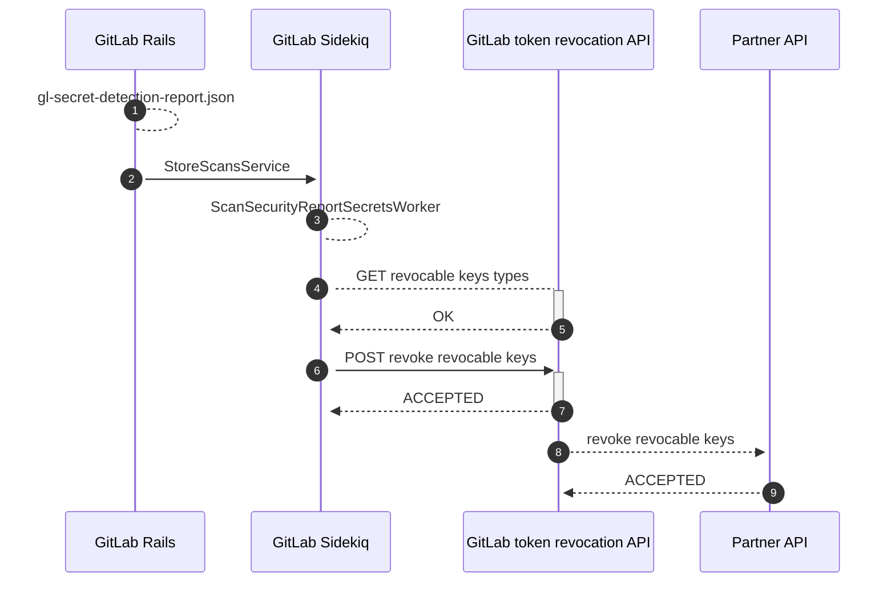
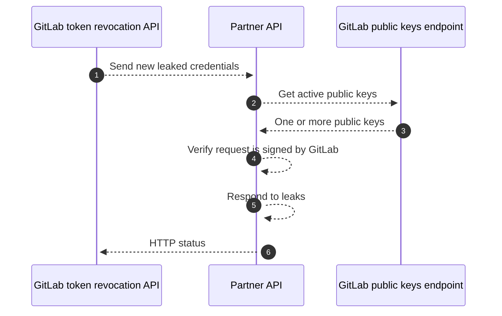



- 티어:  Ultimate
- 제공 서비스: GitLab.com, GitLab Self-Managed, GitLab Dedicated



GitLab 시크릿 검색은 특정 유형의 유출된 시크릿을 찾을 때 자동으로 대응합니다. 자동 대응은 다음을 수행할 수 있습니다:

- 시크릿을 자동으로 해지합니다.
- 시크릿을 발급한 파트너에게 알립니다. 파트너는 시크릿을 해지하거나 소유자에게 알리거나 남용으로부터 보호할 수 있습니다.

## 지원되는 시크릿 유형 및 작업 {#supported-secret-types-and-actions}

GitLab은 다음 유형의 시크릿에 대해 자동 대응을 지원합니다:

| 시크릿 유형 | 수행된 작업 | GitLab.com에서 지원 | GitLab Self-Managed에서 지원 |
| ----- | --- | --- | --- |
| GitLab [개인 액세스 토큰](../../profile/personal_access_tokens.md) | 토큰을 즉시 해지하고 소유자에게 이메일을 보냅니다. <sup>1</sup> | ✅ | ✅ |
| Amazon Web Services (AWS) [IAM 액세스 키](https://docs.aws.amazon.com/IAM/latest/UserGuide/id_credentials_access-keys.html) | AWS에 알립니다. | ✅ | ⚙ |
| Google Cloud [서비스 계정 키](https://cloud.google.com/iam/docs/best-practices-for-managing-service-account-keys), [API 키](https://cloud.google.com/docs/authentication/api-keys), 그리고 [OAuth 클라이언트 시크릿](https://support.google.com/cloud/answer/6158849#rotate-client-secret) | Google Cloud에 알립니다. | ✅ | ⚙ |
| Postman [API 키](https://learning.postman.com/docs/developer/postman-api/authentication/) | Postman에 알립니다. Postman은 [키 소유자에게 알립니다](https://learning.postman.com/docs/administration/managing-your-team/secret-scanner/#protect-postman-api-keys-in-gitlab). | ✅ | ⚙ |

**각주**:

1. `gitlab_personal_access_token`, `gitlab_personal_access_token_routable`, 그리고 `gitlab_personal_access_token_routable_versioned` [검색 규칙](https://gitlab.com/gitlab-org/security-products/secret-detection/secret-detection-rules/-/blob/3204c843e960cec1b26a6cf8f95f609c68400de8/rules/mit/gitlab/gitlab.toml)에 대해 지원됩니다.

**구성 요소 범례**:

- ✅ - 기본적으로 사용 가능
- ⚙ - 토큰 해지 API를 사용한 수동 통합 필요

## 기능 가용성 {#feature-availability}

자격 증명은 시크릿 검색이 다음을 찾을 때만 후처리됩니다:

- 공개 프로젝트에서는 공개적으로 노출된 자격 증명이 증가된 위협을 초래하기 때문입니다. 비공개 프로젝트로의 확장은 [이슈 391379](https://gitlab.com/gitlab-org/gitlab/-/issues/391379)에서 검토 중입니다.
- GitLab Ultimate 포함 프로젝트에서는 기술적인 이유 때문입니다. 모든 티어로의 확장은 [이슈 391763](https://gitlab.com/gitlab-org/gitlab/-/issues/391763)에서 추적됩니다.

## 자동 토큰 해지 켜기 {#turn-on-automatic-token-revocation}

GitLab.com에서는 자동 토큰 해지가 기본적으로 켜져 있으며 조치가 필요하지 않습니다.

GitLab Self-Managed 및 GitLab Dedicated에서는 관리자가 `secret_detection_token_revocation_enabled`을(를) `true`로 설정하여 켜야 합니다. 이 설정에는 UI가 없으며 [애플리케이션 설정 API](../../../api/settings.md) 또는 [Rails 콘솔](../../../administration/operations/rails_console.md)을 통해 구성해야 합니다.





[애플리케이션 설정 API](../../../api/settings.md)를 관리자 액세스 토큰과 함께 사용합니다.

현재 값을 확인하려면 응답에서 `secret_detection_token_revocation_enabled` 필드를 찾으세요:

```shell
curl --header "PRIVATE-TOKEN: <your_admin_access_token>" \
  --url "https://gitlab.example.com/api/v4/application/settings"
```

이 설정을 켜려면:

```shell
curl --request PUT \
  --header "PRIVATE-TOKEN: <your_admin_access_token>" \
  --data "secret_detection_token_revocation_enabled=true" \
  --url "https://gitlab.example.com/api/v4/application/settings"
```





[Rails 콘솔 세션](../../../administration/operations/rails_console.md#starting-a-rails-console-session)을 엽니다.

현재 값을 확인하려면:

```ruby
::Gitlab::CurrentSettings.secret_detection_token_revocation_enabled?
```

설정을 켜려면:

```ruby
::Gitlab::CurrentSettings.update!(secret_detection_token_revocation_enabled: true)
```





## 상위 수준 아키텍처 {#high-level-architecture}

이 다이어그램은 후처리 후크가 GitLab 애플리케이션에서 시크릿을 해지하는 방법을 설명합니다:



1. 시크릿 검색 작업이 포함된 파이프라인이 완료되어 스캔 보고서를 생성합니다 (**1**).
1. 보고서는 (**2**) 서비스 클래스에 의해 처리되며, 토큰 해지가 가능한 경우 비동기 작업자를 예약합니다.
1. 비동기 작업자 (**3**)는 외부에 배포된 HTTP 서비스 (**4** 및 **5**)와 통신하여 자동으로 해지할 수 있는 시크릿 종류를 결정합니다.
1. 작업자는 (**6** 및 **7**) GitLab 토큰 해지 API가 해지할 수 있는 검색된 시크릿 목록을 보냅니다.
1. GitLab 토큰 해지 API는 (**8** 및 **9**) 각 해지 가능한 토큰을 각 벤더의 [파트너 API](#implement-a-partner-api)로 보냅니다.

## 유출된 자격 증명 알림을 위한 파트너 프로그램 {#partner-program-for-leaked-credential-notifications}

GitLab은 GitLab.com의 공개 리포지토리에서 발급한 자격 증명이 유출될 때 파트너에게 알립니다. 클라우드 또는 SaaS 제품을 운영 중이고 이러한 알림을 받고 싶으시면 [에픽 4944](https://gitlab.com/groups/gitlab-org/-/epics/4944)에서 자세히 알아보세요. 파트너는 GitLab 토큰 해지 API가 호출하는 [파트너 API를 구현](#implement-a-partner-api)해야 합니다.

### 파트너 API 구현 {#implement-a-partner-api}

파트너 API는 GitLab 토큰 해지 API와 통합하여 유출된 토큰 해지 요청을 수신하고 응답합니다. 서비스는 멱등성과 속도 제한이 있는 공개적으로 접근 가능한 HTTP API여야 합니다.

서비스에 대한 요청에는 하나 이상의 유출된 토큰과 요청 본문의 서명이 포함된 헤더가 포함될 수 있습니다. 이 서명을 사용하여 들어오는 요청을 검증하여 GitLab의 정당한 요청임을 증명할 것을 강력히 권장합니다. 아래 다이어그램은 유출된 토큰을 수신, 확인 및 해지하기 위한 필요한 단계를 자세히 설명합니다:



1. GitLab 토큰 해지 API는 (**1**) [해지 요청](#revocation-request)을 파트너 API로 보냅니다. 요청에는 공개 키 식별자와 요청 본문의 서명이 포함된 헤더가 포함됩니다.
1. 파트너 API는 (**2**) GitLab에서 [공개 키](#public-keys-endpoint) 목록을 요청합니다. 응답 (**3**)은 키 로테이션 이벤트에서 여러 공개 키를 포함할 수 있으며 요청 헤더의 식별자로 필터링해야 합니다.
1. 파트너 API는 공개 키를 사용하여 (**4**) 실제 요청 본문에 대해 [서명을 확인](#verifying-the-request)합니다.
1. 파트너 API는 유출된 토큰을 처리하며, 여기에는 자동 해지 (**5**)가 포함될 수 있습니다.
1. 파트너 API는 GitLab 토큰 해지 API에 (**6**) 적절한 HTTP 상태 코드로 응답합니다:
   - 성공 응답 코드(HTTP 200~299)는 파트너가 요청을 수신하고 처리했음을 확인합니다.
   - 오류 코드(HTTP 400 이상)는 GitLab 토큰 해지 API가 요청을 다시 시도하도록 합니다.

#### 해지 요청 {#revocation-request}

이 JSON 스키마 문서는 해지 요청의 본문을 설명합니다:

```json
{
    "type": "array",
    "items": {
        "description": "A leaked token",
        "type": "object",
        "properties": {
            "type": {
                "description": "The type of token. This is vendor-specific and can be customized to suit your revocation service",
                "type": "string",
                "examples": [
                    "my_api_token"
                ]
            },
            "token": {
                "description": "The substring that was matched by the secret detection analyzer. In most cases, this is the entire token itself",
                "type": "string",
                "examples": [
                    "XXXXXXXXXXXXXXXX"
                ]
            },
            "url": {
                "description": "The URL to the raw source file hosted on GitLab where the leaked token was detected",
                "type": "string",
                "examples": [
                    "https://gitlab.example.com/some-repo/-/raw/abcdefghijklmnop/compromisedfile1.java"
                ]
            }
        }
    }
}
```

예제:

```json
[{"type": "my_api_token", "token": "XXXXXXXXXXXXXXXX", "url": "https://example.com/some-repo/-/raw/abcdefghijklmnop/compromisedfile1.java"}]
```

이 예제에서 시크릿 검색은 `my_api_token`의 인스턴스가 유출되었음을 확인했습니다. 토큰의 값과 유출된 토큰이 포함된 파일의 원본 콘텐츠에 대한 공개적으로 접근 가능한 URL이 제공됩니다.

요청에는 두 가지 특별한 헤더가 포함됩니다:

| 헤더 | 형식 | 설명 |
|--------|------|-------------|
| `Gitlab-Public-Key-Identifier` | 문자열 | 이 요청에 서명하는 데 사용되는 키 쌍의 고유 식별자입니다. 주로 키 로테이션을 돕기 위해 사용됩니다. |
| `Gitlab-Public-Key-Signature` | 문자열 | 요청 본문의 base64 인코딩 서명입니다. |

이 헤더를 GitLab 공개 키 엔드포인트와 함께 사용하여 해지 요청이 정당한지 확인할 수 있습니다.

#### 공개 키 엔드포인트 {#public-keys-endpoint}

GitLab은 해지 요청을 확인하는 데 사용되는 공개 키를 검색하기 위해 공개적으로 접근 가능한 엔드포인트를 유지합니다. 엔드포인트는 요청 시 제공될 수 있습니다.

이 JSON 스키마 문서는 공개 키 엔드포인트의 응답 본문을 설명합니다:

```json
{
    "type": "object",
    "properties": {
        "public_keys": {
            "description": "An array of public keys managed by GitLab used to sign token revocation requests.",
            "type": "array",
            "items": {
                "type": "object",
                "properties": {
                    "key_identifier": {
                        "description": "A unique identifier for the keypair. Match this against the value of the Gitlab-Public-Key-Identifier header",
                        "type": "string"
                    },
                    "key": {
                        "description": "The value of the public key",
                        "type": "string"
                    },
                    "is_current": {
                        "description": "Whether the key is currently active and signing new requests",
                        "type": "boolean"
                    }
                }
            }
        }
    }
}
```

예제:

```json
{
    "public_keys": [
        {
            "key_identifier": "6917d7584f0fa65c8c33df5ab20f54dfb9a6e6ae",
            "key": "-----BEGIN PUBLIC KEY-----\nMFkwEwYHKoZIzj0CAQYIKoZIzj0DAQcDQgAEN05/VjsBwWTUGYMpijqC5pDtoLEf\nuWz2CVZAZd5zfa/NAlSFgWRDdNRpazTARndB2+dHDtcHIVfzyVPNr2aznw==\n-----END PUBLIC KEY-----\n",
            "is_current": true
        }
    ]
}
```

#### 요청 확인 {#verifying-the-request}

위의 API 응답에서 가져온 해당 공개 키를 사용하여 `Gitlab-Public-Key-Signature` 헤더를 요청 본문에 대해 검증하여 해지 요청이 정당한지 확인할 수 있습니다. SHA256 해싱을 사용한 [ECDSA](https://en.wikipedia.org/wiki/Elliptic_Curve_Digital_Signature_Algorithm)를 사용하여 서명을 생성한 다음 헤더 값으로 base64 인코딩합니다.

아래의 Python 스크립트는 서명을 확인하는 방법을 보여줍니다. 인기 있는 [pyca/cryptography](https://cryptography.io/en/latest/) 모듈을 암호화 작업에 사용합니다:

```python
import hashlib
import base64
from cryptography.hazmat.primitives import hashes
from cryptography.hazmat.primitives.serialization import load_pem_public_key
from cryptography.hazmat.primitives.asymmetric import ec

public_key = str.encode("")      # obtained from the public keys endpoint
signature_header = ""            # obtained from the `Gitlab-Public-Key-Signature` header
request_body = str.encode(r'')   # obtained from the revocation request body

pk = load_pem_public_key(public_key)
decoded_signature = base64.b64decode(signature_header)

pk.verify(decoded_signature, request_body, ec.ECDSA(hashes.SHA256()))  # throws if unsuccessful

print("Signature verified!")
```

주요 단계는 다음과 같습니다:

1. 공개 키를 사용 중인 암호 라이브러리에 적합한 형식으로 로드합니다.
1. `Gitlab-Public-Key-Signature` 헤더 값을 Base64 디코딩합니다.
1. SHA256 해싱을 사용한 ECDSA를 지정하면서 디코딩된 서명에 대해 본문을 확인합니다.
