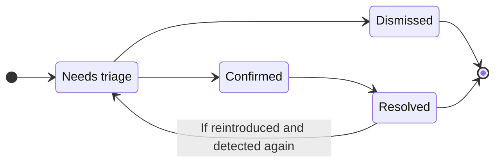



- 티어:  Ultimate
- 제공 서비스: GitLab.com, GitLab Self-Managed, GitLab Dedicated





- 재설계된 취약성 페이지가 [베타](../../../policy/development_stages_support.md#beta) 기능으로 `vulnerability_details_enrichment`라는 [기능 플래그로](../../../administration/feature_flags/_index.md) GitLab 19.0에서 [도입](https://gitlab.com/groups/gitlab-org/-/epics/21907)되었습니다. 기본적으로 사용 중지되어 있습니다.
- GitLab 19.3에서 [GitLab.com, GitLab Self-Managed 및 GitLab Dedicated에 사용](https://gitlab.com/gitlab-org/gitlab/-/work_items/606953)으로 설정되었습니다.



> [!flag]
> 재설계된 취약성 페이지의 사용 가능성은 기능 플래그로 제어됩니다. 자세한 내용은 기록을 참조하세요.

프로젝트의 각 취약성에는 취약성 페이지가 있습니다. 페이지 헤더는 취약성 제목, 탐지된 시점 및 파이프라인, 관련된 병합 요청 이슈의 수(있는 경우) 및 사용 가능한 작업을 표시합니다. 오른쪽 사이드바는 취약성의 상태와 심각도를 표시합니다. 나머지 취약성 데이터는 다음 섹션으로 그룹화됩니다.

- **위험**: 취약성의 우선 순위를 정하는 데 도움이 되는 점수 및 플래그입니다.
- **수정**: 검사기가 보고한 솔루션(있는 경우)입니다.
- **상세 정보**: 취약성 설명, 이를 보고한 검사기, 코드에서 위치, 컨테이너 이미지 또는 종속성입니다.
- **관련 정보**: CVE 및 CWE와 같은 식별자, 외부 참조에 링크 및 보안 교육입니다.
- **증거**: 요청을 및 응답을 보고한 검사기에 대해 검사기가 기록한 요청 및 응답입니다.
- **관련 MR** 및 **관련된 이슈**: 취약성에 연결된 병합 요청과 이슈입니다.
- **작업**: 상태 변경, 댓글 및 탐지 이벤트의 로그입니다.

각 섹션을 접을 수 있습니다. 섹션의 내용을 숨기거나 표시하려면 섹션 헤더에서 **접기** () 또는 **펼치기** ()를 선택하세요.

[CVE(공통 취약성 및 노출)](https://www.cve.org/) 카탈로그의 취약성의 경우, **위험** 섹션에는 다음도 포함됩니다:

- CVSS 점수
- [EPSS 점수](risk_assessment_data.md#epss)
- [KEV 상태](risk_assessment_data.md#kev)
- [도달 가능성 상태](../dependency_scanning/static_reachability.md)(제한적 출시)

자세한 내용은 [취약성 위험 평가 데이터](risk_assessment_data.md)를 참조하세요.

검사기에서 취약성을 오탐으로 판단하는 경우, **위험** 섹션 위에 알림이 표시됩니다. GitLab Duo에서 취약성을 오탐일 수 있는 것으로 식별한 경우, **위험** 섹션에 **오탐 확신도** 점수가 대신 표시됩니다. 자세한 정보는 [오탐 탐지](false_positive_detection.md)를 참조하세요.

SAST에서 탐지한 취약성의 경우 GitLab Duo는 자동으로 이를 분석하고 컨텍스트 인식 코드 수정을 포함한 병합 요청을 생성할 수 있습니다. 자세한 내용은 [에이전틱 SAST 취약성 해결](agentic_vulnerability_resolution.md)을 참조하세요.

## 스크릿 오탐 탐지 {#secret-false-positive-detection}



- 티어:  Ultimate
- 추가 기능: GitLab Duo Core, Pro 또는 Enterprise
- 제공 서비스: GitLab.com, GitLab Self-Managed, GitLab Dedicated
- 상태:  베타





- GitLab 18.10에서 `duo_secret_detection_false_positive` [기능 플래그](../../../administration/feature_flags/_index.md)의 [베타](../../../policy/development_stages_support.md#beta) 기능으로 [에픽 17885](https://gitlab.com/groups/gitlab-org/-/work_items/20152)가 도입되었습니다. [GitLab.com, GitLab Self-Managed 및 GitLab Dedicated에 사용](https://gitlab.com/gitlab-org/gitlab/-/merge_requests/227074)으로 설정되었습니다.



GitLab Duo는 시크릿 탐지 결과를 자동으로 분석하여 잠재적 오탐을 식별합니다. 오탐을 해제하면 실제 보안 위험이 아닐 가능성이 높은 결과를 표시하여 취약성 보고서의 노이즈를 줄입니다.

분석된 각 취약성에 대해 GitLab Duo는 다음 정보를 제공합니다.

- 평가가 정확할 가능성을 나타내는 신뢰도 점수.
- 결과가 정확할 수도, 정확하지 않을 수도 있는 이유에 대한 설명.
- 취약성이 취약성 보고서에서 잠재적 오탐으로 식별되었음을 나타내는 시각적 표시기.

자세한 내용은 [스크릿 오탐 탐지](secret_false_positive_detection.md)를 참조하세요.

## 취약성 해결 {#vulnerability-resolution}



- 티어:  Ultimate
- 추가 기능: GitLab Duo Enterprise, GitLab Duo with Amazon Q
- 제공 서비스: GitLab.com, GitLab Self-Managed, GitLab Dedicated





- [기본 LLM](../../gitlab_duo/model_selection.md#default-models)
- Amazon Q용 LLM: Amazon Q 개발자
- [자가 호스팅 모델이 포함된 GitLab Duo](../../../administration/gitlab_duo_self_hosted/_index.md)에서 사용 가능





- GitLab 16.7에서 GitLab.com에 [실험적 기능](../../../policy/development_stages_support.md#experiment)으로 [도입](https://gitlab.com/groups/gitlab-org/-/work_items/10779)되었습니다.
- GitLab 17.3에서 베타로 변경되었습니다.
- GitLab 17.6 이상에서 GitLab Duo 애드온을 요구하도록 변경되었습니다.



GitLab Duo 취약성 해결을 사용하여 취약성을 해결하는 병합 요청을 자동으로 만듭니다. 기본적으로 Anthropic [`claude-3.5-sonnet`](https://console.cloud.google.com/vertex-ai/publishers/anthropic/model-garden/claude-3-5-sonnet) 모델로 지원됩니다.

GitLab은 대규모 언어 모델이 올바른 결과를 생성함을 보장할 수 없습니다. 병합하기 전에 항상 제안된 변경 사항을 검토해야 합니다. 검토할 때 다음을 확인하세요.

- 애플리케이션의 기존 기능이 보존됩니다.
- 취약성이 조직의 기준에 따라 해결됩니다.

<i class="fa-youtube-play" aria-hidden="true"></i> [개요 시청](https://www.youtube.com/watch?v=VJmsw_C125E&list=PLFGfElNsQthZGazU1ZdfDpegu0HflunXW)

사전 요구 사항:

- GitLab Ultimate 구독 티어와 GitLab Duo Enterprise가 필요합니다.
- 프로젝트의 구성원이어야 합니다.
- 취약성은 지원되는 분석기에서 SAST 결과여야 합니다.
  - 모든 [GitLab 지원 분석기](../sast/analyzers.md).
  - 취약성 위치와 각 취약성에 대한 CWE 식별자를 보고하는 적절히 통합된 타사 SAST 검사기입니다.
- 취약성은 [지원되는 유형](#supported-vulnerabilities-for-vulnerability-resolution)이어야 합니다.

[모든 GitLab Duo 기능을 사용으로 설정하는 방법](../../gitlab_duo/turn_on_off.md)에 대해 자세히 알아보세요.

취약성을 해결하려면 다음을 수행합니다.

1. 상단 바에서 **검색 또는 이동**을 선택하고 프로젝트를 찾습니다.
1. 왼쪽 사이드바에서 **보안** > **취약성 보고서**를 선택합니다.
1. 선택 사항입니다. 기본 필터를 제거하려면 **지우기**()를 선택합니다.
1. 취약성 목록 위의 필터 막대를 선택합니다.
1. 표시되는 드롭다운 목록에서 **작업**을 선택한 다음 **GitLab Duo(AI)** 범주에서 **사용 가능한 취약성 해결**을 선택합니다.
1. 필터 필드 외부를 선택합니다. 취약성 심각도 합계 및 일치하는 취약성 목록이 업데이트됩니다.
1. 해결하려는 SAST 취약성을 선택합니다.
   - 취약성 해결이 지원되는 취약성 옆에 파란색 아이콘이 표시됩니다.
1. 오른쪽 위 모서리에서 **AI로 해결**을 선택합니다. 해당 버튼이 표시되지 않으면 **AI 작업**을(를) 선택한 다음 **AI로 해결**을 선택하세요. 이 프로젝트가 공개 프로젝트인 경우, 병합 요청을 만들면 취약성과 제시된 해결 방안이 공개적으로 노출된다는 것을 주의하세요. MR을 비공개로 만들려면 [비공개 포크 만들고](../../project/merge_requests/confidential.md) 이 프로세스를 반복합니다.
1. MR에 추가 커밋을 추가합니다. 이렇게 하면 새 파이프라인이 실행됩니다.
1. 파이프라인이 완료된 후 [파이프라인 보안 탭](../detect/security_scanning_results.md)에서 취약성이 더 이상 나타나지 않는지 확인합니다.
1. 취약성 보고서에서 [취약성을 수동으로 업데이트](../vulnerability_report/_index.md#change-status-of-vulnerabilities)합니다.

AI 수정 제안을 포함하는 병합 요청이 열립니다. 제안된 변경 사항을 검토한 다음 표준 워크플로우에 따라 병합 요청을 처리합니다.

[이슈 476553](https://gitlab.com/gitlab-org/gitlab/-/issues/476553)에서 이 기능에 대한 피드백을 제공하세요.

### 취약성 해결이 지원되는 취약성 {#supported-vulnerabilities-for-vulnerability-resolution}

제안된 해결의 높은 품질을 보장하기 위해 취약성 해결은 특정 취약성 집합에 대해 사용할 수 있습니다. 시스템은 취약성의 CWE(Common Weakness Enumeration) 식별자를 기반으로 취약성 해결 방법을 제공할 것인지 결정합니다.

현재 취약성 집합은 자동화된 시스템 및 보안 전문가의 테스트에 따라 선택됩니다. GitLab은 더 많은 유형의 취약성으로 적용 범위를 확대하기 위해 적극적으로 노력하고 있습니다.

<details><summary style="color:#5943b6; margin-top: 1em;"><a>취약성 해결에 대해 지원되는 CWE의 전체 목록 보기</a></summary>

<ul>
  <li>CWE-23: 상대 경로 트래버설</li>
  <li>CWE-73: 파일 이름 또는 경로의 외부 제어</li>
  <li>CWE-78: OS 명령에 사용되는 특수 요소의 부적절한 중립화('OS 명령 주입')</li>
  <li>CWE-80: 웹 페이지의 스크립트 관련 HTML 태그의 부적절한 중립화(기본 XSS)</li>
  <li>CWE-89: SQL 명령에 사용되는 특수 요소의 부적절한 중립화('SQL 주입')</li>
  <li>CWE-116: 출력의 부적절한 인코딩 또는 이스케이프</li>
  <li>CWE-118: 인덱싱 가능 리소스에 대한 잘못된 액세스('범위 오류')</li>
  <li>CWE-119: 메모리 버퍼 범위 내의 작업에 대한 부적절한 제한</li>
  <li>CWE-120: 입력 크기 확인 없이 버퍼 복사('클래식 버퍼 오버플로우')</li>
  <li>CWE-126: 버퍼 오버리드</li>
  <li>CWE-190: 정수 오버플로우 또는 래핑</li>
  <li>CWE-200: 권한이 없는 행위자에게 민감한 정보 노출</li>
  <li>CWE-208: 관찰 가능한 타이밍 불일치</li>
  <li>CWE-209: 민감한 정보를 포함하는 오류 메시지 생성</li>
  <li>CWE-272: 최소 권한 위반</li>
  <li>CWE-287: 부적절한 인증</li>
  <li>CWE-295: 부적절한 인증서 검증</li>
  <li>CWE-297: 호스트 불일치가 있는 인증서의 부적절한 검증</li>
  <li>CWE-305: 기본 약점에 의한 인증 우회</li>
  <li>CWE-310: 암호화 문제</li>
  <li>CWE-311: 민감한 데이터의 암호화 부재</li>
  <li>CWE-323: 암호화에서 Nonce, 키 쌍 재사용</li>
  <li>CWE-327: 손상되었거나 위험한 암호화 알고리즘 사용</li>
  <li>CWE-328: 약한 해시 사용</li>
  <li>CWE-330: 불충분하게 무작위인 값 사용</li>
  <li>CWE-338: 암호화적으로 약한 의사 난수 생성기(PRNG) 사용</li>
  <li>CWE-345: 데이터 진위성의 불충분한 검증</li>
  <li>CWE-346: 원본 검증 오류</li>
  <li>CWE-352: 교차 사이트 요청 위조</li>
  <li>CWE-362: 공유 리소스를 사용한 동시 실행과 부적절한 동기화('경쟁 조건')</li>
  <li>CWE-369: 0으로 나누기</li>
  <li>CWE-377: 안전하지 않은 임시 파일</li>
  <li>CWE-378: 보안이 낮은 권한이 있는 임시 파일 만들기</li>
  <li>CWE-400: 제한되지 않은 리소스 소비</li>
  <li>CWE-489: 활성 디버그 코드</li>
  <li>CWE-521: 약한 비밀번호 요구 사항</li>
  <li>CWE-539: 민감한 정보가 포함된 영구 쿠키 사용</li>
  <li>CWE-599: OpenSSL 인증서의 누락된 검증</li>
  <li>CWE-611: XML 외부 엔티티 참조의 부적절한 제한</li>
  <li>CWE-676: 잠재적으로 위험한 함수 사용</li>
  <li>CWE-704: 잘못된 타입 변환 또는 캐스트</li>
  <li>CWE-754: 비정상적이거나 예외적인 조건에 대한 부적절한 확인</li>
  <li>CWE-770: 제한 또는 제한 없이 리소스 할당</li>
  <li>CWE-1004: 'HttpOnly' 플래그가 없는 민감한 쿠키</li>
  <li>CWE-1275: SameSite 특성이 부적절한 민감한 쿠키</li>
</ul>
</details>

### 문제 해결 {#troubleshooting}

취약성 해결에서 제안되는 수정을 생성할 수 없는 경우가 있습니다. 일반적인 원인은 다음을 포함합니다.

- 오탐 탐지됨
  - 수정을 제안하기 전에 AI 모델은 취약성이 유효한지 평가합니다. 취약성이 실제 취약성이 아니거나 수정할 가치가 없다고 판단할 수 있습니다.
  - 취약성이 테스트 코드에서 발생하면 이런 일이 발생할 수 있습니다. 조직에서 테스트 코드에서 발생하는 취약성을 수정하기로 선택할 수 있지만 모델에서 이를 오탐으로 평가하는 경우가 있습니다.
  - 취약성이 오탐이거나 수정할 가치가 없다고 생각하면 [취약성을 무시](#vulnerability-status-values)하고 [일치하는 이유 선택](#vulnerability-dismissal-reasons)해야 합니다.
    - SAST 구성을 사용자 지정하거나 GitLab SAST 규칙의 문제를 보고하려면 [SAST 규칙](../sast/rules.md)을 참조하세요.
- 일시적 또는 예기치 않은 오류:
  - 오류 메시지에 `an unexpected error has occurred`, `the upstream AI provider request timed out`, `something went wrong` 또는 유사한 원인이 표시될 수 있습니다.
  - 이러한 오류는 AI 공급자 또는 GitLab Duo의 일시적인 문제로 인해 발생할 수 있습니다.
  - 새 요청이 성공할 수 있으므로 취약성을 다시 해결하도록 시도할 수 있습니다.
  - 계속해서 이러한 오류가 표시되면 GitLab에 문의하여 도움을 받으세요.

### 취약성 해결에 대해 타사 AI API와 공유하는 데이터 {#data-shared-with-third-party-ai-apis-for-vulnerability-resolution}

다음 데이터는 타사 AI API와 공유됩니다.

- 취약성 이름
- 취약성 설명
- 식별자(CWE, OWASP)
- 취약한 코드 라인을 포함하는 전체 파일
- 취약한 코드 라인(라인 번호)

## 병합 요청에서 취약성 해결 방법 {#vulnerability-resolution-in-a-merge-request}



- 티어:  Ultimate
- 추가 기능: GitLab Duo Enterprise
- 제공 서비스: GitLab.com, GitLab Self-Managed, GitLab Dedicated





- GitLab 17.6에서 [도입](https://gitlab.com/groups/gitlab-org/-/work_items/14862)되었습니다.
- GitLab 17.7에서 [기본적으로 사용](https://gitlab.com/gitlab-org/gitlab/-/merge_requests/175150)으로 설정되었습니다.
- GitLab 17.11에서 [일반 공개](https://gitlab.com/gitlab-org/gitlab/-/merge_requests/185452)되었습니다. `resolve_vulnerability_in_mr` 기능 플래그가 제거되었습니다.



GitLab Duo 취약성 해결을 사용하여 취약성 발견 사항을 해결하는 병합 요청 제안 댓글을 자동으로 만듭니다. 기본적으로 Anthropic [`claude-3.5-sonnet`](https://console.cloud.google.com/vertex-ai/publishers/anthropic/model-garden/claude-3-5-sonnet) 모델로 지원됩니다.

취약성 발견 사항을 해결하려면 다음을 수행합니다.

1. 상단 바에서 **검색 또는 이동**을 선택하고 프로젝트를 찾습니다.
1. 왼쪽 사이드바에서 **코드** > **병합 요청**을 선택합니다.
1. 병합 요청을 선택합니다.
   - 취약성 해결에서 지원하는 취약성 발견 사항은 tanuki AI 아이콘()으로 표시됩니다.
1. 지원되는 결과를 선택하여 보안 결과 대화 상자를 엽니다.
1. 오른쪽 아래 모서리에서 **AI로 해결**을 선택합니다.

AI 수정 제안을 포함하는 댓글이 병합 요청에서 열립니다. 제안된 변경 사항을 검토한 다음 표준 워크플로우에 따라 병합 요청 제안을 적용합니다.

[이슈 476553](https://gitlab.com/gitlab-org/gitlab/-/issues/476553)에서 이 기능에 대한 피드백을 제공하세요.

### 문제 해결 {#troubleshooting-1}

병합 요청의 취약성 해결은 제안된 수정을 생성할 수 없는 경우가 있습니다. 일반적인 원인은 다음을 포함합니다.

- 오탐 탐지됨
  - 수정을 제안하기 전에 AI 모델은 취약성이 유효한지 평가합니다. 취약성이 실제 취약성이 아니거나 수정할 가치가 없다고 판단할 수 있습니다.
  - 취약성이 테스트 코드에서 발생하면 이런 일이 발생할 수 있습니다. 조직에서 테스트 코드에서 발생하는 취약성을 수정하기로 선택할 수 있지만 모델에서 이를 오탐으로 평가하는 경우가 있습니다.
  - 취약성이 오탐이거나 수정할 가치가 없다고 생각하면 [취약성을 무시](#vulnerability-status-values)하고 [일치하는 이유 선택](#vulnerability-dismissal-reasons)해야 합니다.
    - SAST 구성을 사용자 지정하거나 GitLab SAST 규칙의 문제를 보고하려면 [SAST 규칙](../sast/rules.md)을 참조하세요.
- 일시적 또는 예기치 않은 오류:
  - 오류 메시지에 `an unexpected error has occurred`, `the upstream AI provider request timed out`, `something went wrong` 또는 유사한 원인이 표시될 수 있습니다.
  - 이러한 오류는 AI 공급자 또는 GitLab Duo의 일시적인 문제로 인해 발생할 수 있습니다.
  - 새 요청이 성공할 수 있으므로 취약성을 다시 해결하도록 시도할 수 있습니다.
  - 계속해서 이러한 오류가 표시되면 GitLab에 문의하여 도움을 받으세요.
- `Resolution target could not be found in the merge request, unable to create suggestion` 오류:
  - 이 오류는 대상 브랜치가 전체 보안 검사 파이프라인을 실행하지 않았을 때 발생할 수 있습니다. [병합 요청 설명서](../detect/security_scanning_results.md)를 참조하세요.

## 취약성 코드 플로우 {#vulnerability-code-flow}



- 티어:  Ultimate
- 제공 서비스: GitLab.com, GitLab Self-Managed, GitLab Dedicated



특정 유형의 취약성의 경우 GitLab Advanced SAST는 [코드 플로우](../sast/gitlab_advanced_sast.md#code-flow) 정보를 제공합니다. 취약성의 코드 플로우는 사용자 입력(소스)에서 취약한 코드 라인(싱크)까지 모든 할당, 조작 및 삭제를 통해 데이터가 이동하는 경로입니다.

취약성의 코드 플로우을 확인는 방법에 대한 자세한 내용은 [취약성 코드 플로우](../sast/gitlab_advanced_sast.md#code-flow)을 참조하세요.


## 취약성 상태 값 {#vulnerability-status-values}

취약성의 상태는 다음과 같을 수 있습니다.

- **분류 필요**: 새로 발견된 취약성의 기본 상태.
- **확인됨**: 사용자가 이 취약성을 확인했으며 정확한 것으로 확인했습니다.
- **해지됨**: 사용자가 이 취약성을 평가하고 [이를 해제](#vulnerability-dismissal-reasons)했습니다. 해제된 취약성은 후속 검사에서 탐지되면 무시됩니다.
- **해결됨**: 취약성이 수정되었거나 더 이상 존재하지 않습니다. 해결된 취약성이 다시 도입되어 탐지되면 해당 기록이 복구되고 상태가 **분류 필요**로 설정됩니다.

취약성은 일반적으로 다음과 같은 수명 주기를 거칩니다.



## 더 이상 탐지되지 않은 취약성 {#vulnerability-is-no-longer-detected}



- GitLab 17.9에서 취약성을 해결한 커밋에 대한 링크가 [도입](https://gitlab.com/gitlab-org/gitlab/-/issues/372799)되었으며 [GitLab Self-Managed 및 GitLab Dedicated에서 일반 공개](https://gitlab.com/gitlab-org/gitlab/-/merge_requests/178748)되었습니다. `vulnerability_representation_information` 기능 플래그가 제거되었습니다.



취약성이 더 이상 탐지되지 않을 수 있는 이유는 의도적으로 수정하기 위해 변경되었거나 다른 변경의 부작용 때문입니다. 보안 검사가 실행되고 기본 브랜치에서 더 이상 취약성이 탐지되지 않으면 검사기는 **더 이상 탐지되지 않음**을 기록의 작업 로그에 추가하지만 기록의 상태는 변경되지 않습니다. 대신, 취약성이 해결되었음을 검사하고 확인하여 해결된 경우 상태를 수동으로 [**해결됨**으로 변경해야](#change-the-status-of-a-vulnerability)합니다. [취약성 관리 정책](../policies/vulnerability_management_policy.md)을 사용하여 특정 조건과 일치하는 취약성의 상태를 **해결됨**으로 자동으로 변경할 수도 있습니다.

취약성 페이지의 **작업** 섹션에서 취약성을 해결한 커밋에 링크를 찾을 수 있습니다.

## 취약성 해제 이유 {#vulnerability-dismissal-reasons}

취약성을 해제할 때 다음 이유 중 하나를 선택해야 합니다.

- **수용할 수 있는 위험**: 취약성은 알려져 있으며 수정되거나 완화되지 않았지만 수용할 수 있는 비즈니스 위험으로 간주됩니다.
- **오탐**: 취약성이 존재하지 않을 때 테스트 결과가 잘못되게 시스템에 취약성의 존재를 나타내는 보고 오류.
- **완화 컨트롤**: 취약성의 위험은 조직에서 사용하는 관리, 운영 또는 기술 제어(즉, 보안 장치 또는 대책)에 의해 완화되며, 정보 시스템에 동등하거나 비교 가능한 보호를 제공합니다.
- **데스트에 사용됨**: 결과는 테스트의 일부이거나 테스트 데이터이기 때문에 취약성이 아닙니다.
- **적용할 수 없음**: 취약성은 알려져 있으며 수정되거나 완화되지 않았지만 업데이트되지 않을 애플리케이션 부분에 있는 것으로 간주됩니다.

## 취약성의 상태 변경 {#change-the-status-of-a-vulnerability}



- 취약성의 상태를 변경할 수 있는 `Developer` 역할의 사용자에게 허용하는 권한(`admin_vulnerability`)이 GitLab 16.4에서 [더 이상 사용되지 않으며](https://gitlab.com/gitlab-org/gitlab/-/issues/424133) GitLab 17.0에서 [제거](https://gitlab.com/gitlab-org/gitlab/-/issues/412693)되었습니다.
- GitLab 17.9에서 **댓글** 텍스트 상자가 [추가](https://gitlab.com/gitlab-org/gitlab/-/issues/451480)되었습니다.



사전 요구 사항:

- 프로젝트에 대한 보안 관리자, 유지관리자 또는 소유자 역할이 있거나 `admin_vulnerability` 권한을 가진 사용자 지정 역할이 있어야 합니다.

취약성 페이지에서 취약성의 상태를 변경하려면 다음을 수행합니다.

1. 상단 바에서 **검색 또는 이동**을 선택하고 프로젝트를 찾습니다.
1. 왼쪽 사이드바에서 **보안** > **취약성 보고서**를 선택합니다.
1. 취약성의 설명을 선택합니다.
1. 오른쪽 사이드바에 **상태** 섹션에서 **편집**을 선택합니다.
1. **상태** 드롭다운 목록에서 상태 또는 취약성의 상태를 **해지됨**으로 변경하려는 경우 [해제 이유](#vulnerability-dismissal-reasons)를 선택합니다.
1. **댓글** 텍스트 상자에서 해제 이유에 대한 자세한 내용을 포함한 댓글을 제공합니다. **해지됨** 상태를 적용하면 댓글이 필요합니다.
1. **상태 변경**을 선택합니다.

상태 변경 세부 정보(변경을 수행한 사용자 및 시간 포함)는 취약성 페이지의 **작업** 섹션에 기록됩니다.

## 취약성에 대한 GitLab 이슈 만들기 {#create-a-gitlab-issue-for-a-vulnerability}

GitLab 이슈를 만들어서 취약성을 해결하거나 완화하기 위해 수행한 모든 작업을 추적합니다. 취약성에 대한 GitLab 이슈를 만들며면 다음을 수행합니다.

1. 상단 바에서 **검색 또는 이동**을 선택하고 프로젝트를 찾습니다.
1. 왼쪽 사이드바에서 **보안** > **취약성 보고서**를 선택합니다.
1. 취약성의 설명을 선택합니다.
1. **이슈 만들기**를 선택합니다.

취약성 보고서의 정보로 GitLab 프로젝트에 이슈가 만들어집니다.

Jira 이슈를 만들려면 [취약성에 대한 Jira 이슈 만들기](../../../integration/jira/configure.md#create-a-jira-issue-for-a-vulnerability)를 참조하세요.

## 취약성을 GitLab 및 Jira 이슈와 연결 {#linking-a-vulnerability-to-gitlab-and-jira-issues}

취약성을 하나 이상의 기존 [GitLab](#create-a-gitlab-issue-for-a-vulnerability) 또는 [Jira](../../../integration/jira/configure.md#create-a-jira-issue-for-a-vulnerability) 이슈와 연결할 수 있습니다. 한 번에 하나의 연결 기능만 사용할 수 있습니다. 링크를 추가하면 취약성을 해결하거나 완화하는 이슈를 추적하는 데 도움이 됩니다.

### 취약성을 기존 GitLab 이슈와 연결 {#link-a-vulnerability-to-existing-gitlab-issues}

사전 요구 사항:

- [Jira 이슈 통합](../../../integration/jira/configure.md)을 사용으로 설정하지 않아야 합니다.

취약성을 기존 GitLab 이슈와 연결하려면 다음을 수행합니다.

1. 상단 바에서 **검색 또는 이동**을 선택하고 프로젝트를 찾습니다.
1. 왼쪽 사이드바에서 **보안** > **취약성 보고서**를 선택합니다.
1. 취약성의 설명을 선택합니다.
1. **관련된 이슈** 섹션에서 **기존 이슈 추가**를 선택하세요.
1. 연결할 각 이슈에 대해:
   - 이슈에 대한 링크를 붙여넣습니다.
   - 이슈의 ID를 입력합니다(해시 `#`로 접두사 붙임).
1. **추가**를 선택합니다.

선택한 GitLab 이슈가 **관련된 이슈** 섹션에 추가되고 연결된 이슈 카운터가 업데이트됩니다.

취약성과 연결된 GitLab 이슈는 취약성 보고서 및 취약성의 페이지에 표시됩니다.

취약성과 연결된 GitLab 이슈 간의 다음 조건을 인식하세요.

- 취약성 페이지는 관련 이슈를 표시하지만 이슈 페이지는 관련 취약성을 표시하지 않습니다.
- 이슈는 한 번에 하나의 취약성에만 연결될 수 있습니다.
- 이슈는 그룹 및 프로젝트 전체에 연결될 수 있습니다.

### 취약성을 기존 Jira 이슈와 연결 {#link-a-vulnerability-to-existing-jira-issues}

사전 요구 사항:

- Jira 이슈 통합이 [구성](../../../integration/jira/configure.md#configure-the-integration)되어 있고 **취약성에 대한 Jira 이슈 만들기** 확인란이 선택되어 있는지 확인하세요.

취약성을 기존 Jira 이슈와 연결하려면 Jira 이슈 설명에 다음 라인을 추가합니다.

```plaintext
/-/security/vulnerabilities/<id>
```

`<id>`은 모든 [취약성 ID](../../../api/vulnerabilities.md#retrieve-a-vulnerability)입니다. 한 설명에 다양한 ID가 있는 여러 라인을 추가할 수 있습니다.

적절한 설명이 있는 Jira 이슈가 **관련 Jira 이슈** 섹션에 추가되고 연결된 이슈 카운터가 업데이트됩니다.

취약성과 연결된 Jira 이슈는 취약성 페이지에만 표시됩니다.

취약성과 연결된 Jira 이슈 간의 다음 조건을 인식하세요.

- 취약성 페이지 및 이슈 페이지는 관련된 취약성을 표시합니다.
- 이슈는 한 번에 하나 이상의 취약성과 연결될 수 있습니다.

## 취약성 해결 {#resolve-a-vulnerability}

일부 취약성의 경우, 솔루션이 이미 알려져 있지만 수동으로 구현해야 합니다. 취약성 페이지의 **수정** 섹션은 보고 발견 사항을 보고한 보안 검사 도구에서 제공한 솔루션 또는 [취약성의 수동 만들기](../vulnerability_report/_index.md#manually-add-a-vulnerability) 중에 입력한 솔루션을 표시합니다. GitLab 도구는 [GitLab 권고 데이터베이스](../gitlab_advisory_database/_index.md)의 정보를 활용합니다.

또한 일부 도구에는 제안된 해결 방법을 적용할 소프트웨어 패치가 포함될 수 있습니다. 이런 인스턴스에서 취약성 페이지의 **기타 작업** 드롭다운 목록에는 **검사기 제안으로 해결** 작업이 포함됩니다.

다음 스캐너는 이 기능에서 지원됩니다.

- [종속성 검사](../dependency_scanning/_index.md). 자동 패치 만들기는 `yarn`으로 관리하는 Node.js 프로젝트에 대해서만 사용할 수 있습니다. 자동 패치 만들기는 [FIPS 모드](../../../development/fips_gitlab.md#enable-fips-mode)가 사용 중지되어 있을 때만 지원됩니다.

- [컨테이너 검사](../container_scanning/_index.md).

취약성을 해결하려면 다음 중 하나를 수행할 수 있습니다.

- [병합 요청을 통해 취약성을 해결](#resolve-a-vulnerability-with-a-merge-request)합니다.
- [취약성을 수동 해결](#resolve-a-vulnerability-manually)합니다.

### 병합 요청을 통해 취약성 해결 {#resolve-a-vulnerability-with-a-merge-request}

병합 요청을 통해 취약성을 해결하려면 다음을 수행합니다.

1. 상단 바에서 **검색 또는 이동**을 선택하고 프로젝트를 찾습니다.
1. 왼쪽 사이드바에서 **보안** > **취약성 보고서**를 선택합니다.
1. 취약성의 설명을 선택합니다.
1. 오른쪽 위 모서리에서 **기타 작업**을 선택한 다음 **검사기 제안으로 해결**을 선택하세요.

취약성을 해결하는 데 필요한 패치를 적용하는 병합 요청이 만들어집니다. 표준 워크플로우에 따라 병합 요청을 처리합니다.

### 취약성 수동 해결 {#resolve-a-vulnerability-manually}

GitLab에서 생성한 취약성 패치를 수동으로 적용하려면 다음을 수행합니다.

1. 상단 바에서 **검색 또는 이동**을 선택하고 프로젝트를 찾습니다.
1. 왼쪽 사이드바에서 **보안** > **취약성 보고서**를 선택합니다.
1. 취약성의 설명을 선택합니다.
1. 오른쪽 위 모서리에서 **다른 작업**을 선택한 다음 **패치 다운로드**를 선택합니다.
1. 패치를 생성하는 데 사용된 것과 동일한 커밋이 로컬 프로젝트에 체크 아웃되었는지 확인합니다.
1. `git apply remediation.patch`를 실행합니다.
1. 브랜치에 변경 사항을 확인하고 커밋합니다.
1. 주 브랜치에 변경 사항을 적용하는 병합 요청을 만듭니다.
1. 표준 워크플로우에 따라 병합 요청을 처리합니다.

## 취약성에 대한 보안 교육을 사용 {#enable-security-training-for-vulnerabilities}

> [!note]
> 보안 교육은 오프라인 환경에서는 액세스할 수 없습니다. 즉, 보안 조치로 공용 인터넷에서 격리된 컴퓨터입니다. 특히 GitLab 서버는 선택한 모든 교육 공급자의 API 엔드포인트를 쿼리할 수 있어야 합니다. 일부 타사 교육 공급업체는 무료 계정에 가입하도록 요구할 수 있습니다. [Secure Code Warrior](https://www.securecodewarrior.com/), [Kontra](https://application.security/) 또는 [SecureFlag](https://www.secureflag.com/index.html) 중 하나로 이동하여 계정에 가입합니다. GitLab은 이러한 타사 공급업체에 사용자 정보를 보내지 않습니다. GitLab은 CWE 또는 OWASP 식별자와 파일 확장자의 언어 이름을 보냅니다.

보안 교육은 개발자가 취약성을 수정하는 방법을 배우는 데 도움이 됩니다. 개발자는 선택한 교육 공급자의 탐지된 취약성과 관련된 보안 교육을 볼 수 있습니다.

프로젝트에 취약성에 대한 보안 교육을 사용으로 설정하려면 다음을 수행합니다.

1. 상단 바에서 **검색 또는 이동**을 선택하고 프로젝트를 찾습니다.
1. 왼쪽 사이드바에서 **보안** > **보안 구성**을 선택합니다.
1. 탭 막대에서 **취약성 관리**를 선택합니다.
1. 보안 교육 공급자를 사용으로 설정하려면 토글을 켭니다.

각 통합은 취약성 식별자(예: CWE 또는 OWASP) 및 언어를 보안 교육 공급업체에 제출합니다. 공급업체 교육에 대한 결과 링크는 GitLab 취약성에 표시되는 것입니다.

## 취약성에 대한 보안 교육 보기 {#view-security-training-for-a-vulnerability}

취약성 페이지는 보안 교육이 사용으로 설정된 경우 탐지된 취약성과 관련된 교육 링크를 포함할 수 있습니다. 교육의 사용 가능성은 사용으로 설정된 교육 공급자가 특정 취약성과 일치하는 콘텐츠를 가지고 있는지에 따라 달라집니다. 교육 콘텐츠는 취약성 식별자를 기반으로 요청됩니다. 취약성에 지정된 식별자는 취약성마다 다르며, 사용 가능한 교육 콘텐츠는 공급업체마다 다릅니다. 일부 취약성은 교육 콘텐츠를 표시하지 않습니다. CWE를 포함하는 취약성은 교육 결과를 반환할 가능성이 가장 높습니다.

취약성에 대한 보안 교육을 보려면 다음을 수행합니다.

1. 상단 바에서 **검색 또는 이동**을 선택하고 프로젝트를 찾습니다.
1. 왼쪽 사이드바에서 **보안** > **취약성 보고서**를 선택합니다.
1. 보안 교육을 보려는 취약성을 선택합니다.
1. **관련 정보** 섹션에서 **교육** 아래의 **교육 보기**를 선택합니다.

## 종속성 전이에서 취약성의 위치 보기 {#view-the-location-of-a-vulnerability-in-transitive-dependencies}



- 종속성 경로 보기 옵션이 `dependency_paths`라는 [기능 플래그로](../../../administration/feature_flags/_index.md) GitLab 17.11에서 [도입](https://gitlab.com/gitlab-org/gitlab/-/issues/519965)되었습니다. 기본적으로 사용 중지되어 있습니다.
- GitLab 18.2에서 종속성 경로 보기 옵션이 [일반 공개](https://gitlab.com/gitlab-org/gitlab/-/merge_requests/197224)되었습니다. `dependency_paths` 기능 플래그가 기본적으로 사용으로 설정되어 있습니다.



> [!flag]
> 이 기능의 사용 가능 여부는 기능 플래그에 의해 제어됩니다. 자세한 내용은 기록을 참조하세요.

종속성에서 발견된 취약성을 관리할 때, 취약성 페이지의 **상세정보** 섹션에는 다음이 표시됩니다.

- 취약성이 발견된 직접 종속성의 위치.
- 가능한 경우 취약성이 발생하는 특정 라인 번호.

취약성이 하나 이상의 전이 종속성에서 발생하는 경우 직접 종속성만 아는 것으로는 충분하지 않을 수 있습니다. 전이 종속성은 직접 종속성을 상위 항목으로 가진 간접 종속성입니다.

전이 종속성이 존재하면 취약성을 포함하는 전이 종속성을 포함한 모든 종속성의 경로를 볼 수 있습니다.

- 취약성 페이지의 **상세 정보** 섹션에서 **종속성 경로 보기**를 선택하세요. **종속성 경로 보기**가 표시되지 않으면 전이 종속성이 없는 것입니다.
