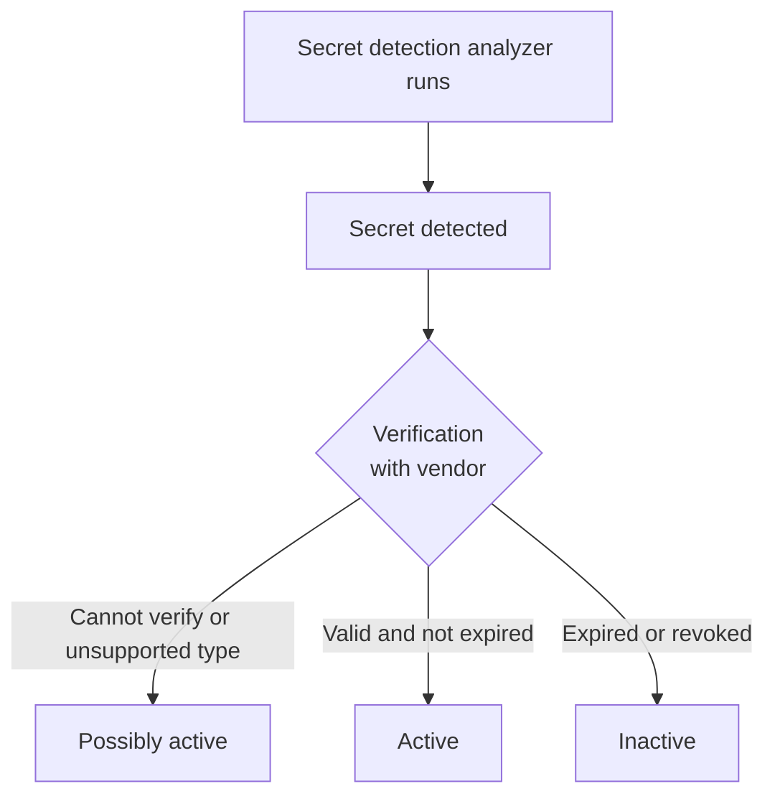



- 티어:  Ultimate
- 제공 서비스: GitLab.com, GitLab Self-Managed, GitLab Dedicated





- GitLab 18.0에서 `validity_checks` [기능 플래그](../../../api/feature_flags.md)로 [도입](https://gitlab.com/gitlab-org/gitlab/-/issues/520923)되었습니다. 기본적으로 사용 중지됩니다.
- 추가 액세스는 [GitLab 18.2에서 도입](https://gitlab.com/gitlab-org/gitlab/-/issues/556765)되었으며 `validity_checks_security_finding_status`라는 플래그가 있습니다. 기본적으로 사용 중지됩니다.
- [GitLab.com에서 활성화됨](https://gitlab.com/gitlab-org/gitlab/-/issues/531222) GitLab 18.5에서
- GitLab 18.5에서 실험에서 베타로 [변경](https://gitlab.com/gitlab-org/gitlab/-/merge_requests/206929)되었습니다.
- GitLab 18.7에서 [일반적으로 사용 가능](https://gitlab.com/gitlab-org/gitlab/-/merge_requests/213223)하게 되었습니다. `validity_checks_security_finding_status` 기능 플래그가 제거되었습니다.
- GitLab 18.7에서 [일반적으로 사용 가능](https://gitlab.com/gitlab-org/gitlab/-/merge_requests/216525)하게 되었습니다. 기능 플래그 `validity_checks`는 기본적으로 활성화됩니다.
- [제거됨](https://gitlab.com/gitlab-org/gitlab/-/merge_requests/216100) 기능 플래그 `validity_checks` GitLab 18.8에서



> [!flag]
> 이 기능의 사용 가능성은 기능 플래그로 제어합니다. 자세한 내용은 기록을 참조하세요.

GitLab 유효성 검사는 액세스 토큰과 같은 시크릿이 활성 상태인지 여부를 확인합니다. 시크릿이 활성 상태인 경우:

- 만료되지 않았습니다.
- 인증에 사용할 수 있습니다.

활성 시크릿은 정당한 사용자를 사칭하는 데 사용될 수 있으므로 비활성 시크릿보다 더 큰 보안 위험을 초래합니다. 여러 시크릿이 한 번에 유출되는 경우, 어떤 시크릿이 활성인지 파악하는 것은 분류 및 수정의 중요한 부분입니다.

## 유효성 검사 활성화 {#enable-validity-checks}

사전 요구 사항:

- 파이프라인 보안 검사가 활성화된 프로젝트가 있어야 합니다.
- 인스턴스는 파트너 검증 API에 [아웃바운드 네트워크 액세스](#configure-outbound-network-access)를 해야 합니다.

프로젝트에 유효성 검사를 활성화하려면:

1. 상단 바에서 **검색 또는 이동**을 선택하고 프로젝트를 찾습니다.
1. 왼쪽 사이드바에서 **보안** > **보안 구성**을 선택합니다.
1. **파이프라인 비밀 탐지** 아래에서 **유효성 검사** 토글을 켭니다.

`secret_detection` CI/CD 작업이 완료되면 GitLab은 감지된 시크릿의 상태를 확인합니다. 시크릿의 상태를 보려면 취약성 세부 정보 페이지를 봅니다. 시크릿의 상태를 업데이트하려면, 예를 들어 해지한 후 `secret_detection` CI/CD 작업을 다시 실행합니다.

그룹 수준에서 유효성 검사를 켜려면 유지 관리자 이상의 역할로 [GraphQL API 변경](../../../api/graphql/reference/_index.md#mutationsetgroupvaliditychecks)을 사용합니다:

```graphql
mutation {
  setGroupValidityChecks(input: {
    validityChecksEnabled: true,
    namespacePath: "my-group/my-subgroup",
    projectsToExclude: [100, 105, 108]
  }) {
    clientMutationId
    validityChecksEnabled
  }
}
```

### 보안 범위 {#coverage}



- [GitLab 18.7에서 외부 서비스 토큰에 대한 지원 도입](https://gitlab.com/groups/gitlab-org/-/epics/16890) [기능 플래그](../../../api/feature_flags.md) `secret_detection_partner_token_verification`. 기본적으로 사용으로 설정됩니다.
- GitLab 18.8에서 [정식 출시(GA)](https://gitlab.com/gitlab-org/gitlab/-/work_items/567736)되었습니다. 
- GitLab 19.3에서 외부 서비스 토큰에 대한 유효성 검사 [확장](https://gitlab.com/gitlab-org/gitlab/-/work_items/612115)됨.
- GitLab 19.4에서 기능 플래그 `secret_detection_partner_token_verification`가 [제거](https://gitlab.com/gitlab-org/gitlab/-/work_items/619506)되었습니다.
- GitLab 19.4에서 더 많은 GitHub 토큰 유형에 대한 유효성 검사 [확장](https://gitlab.com/gitlab-org/gitlab/-/work_items/624216)됨.
- GitLab 19.5에서 더 많은 OpenAI 토큰 유형에 대한 유효성 검사 [확장](https://gitlab.com/gitlab-org/gitlab/-/work_items/628281)됨.



유효성 검사는 다음 시크릿 유형을 지원합니다:

**GitLab 토큰:**

- GitLab 개인 액세스 토큰
- 라우팅 가능한 GitLab 개인 액세스 토큰
- GitLab 배포 토큰
- GitLab 러너 인증 토큰
- 라우팅 가능한 GitLab 러너 인증 토큰
- GitLab Kubernetes 에이전트 토큰
- GitLab SCIM OAuth 토큰
- GitLab CI/CD 작업 토큰
- GitLab 수신 이메일 토큰
- GitLab 피드 토큰(v2)
- GitLab 파이프라인 트리거 토큰

**외부 서비스 토큰:**

- Anthropic API 키
- AWS IAM 장기 액세스 키 ID(`AKIA`로 시작)
- Datadog API 키
- GitHub 앱 설치 토큰
- GitHub 세분화된 개인 액세스 토큰
- GitHub OAuth 액세스 토큰
- GitHub 개인 액세스 토큰(클래식)
- Google Cloud API 키
- Heroku API 키
- OpenAI 관리 API 키
- OpenAI 프로젝트 API 키
- OpenAI 서비스 계정 키
- OpenAI 사용자 API 키
- Postman API 토큰
- SendGrid API 토큰
- Stripe 라이브 시크릿 키

AWS IAM 액세스 키 ID, Google Cloud API 키 및 Postman API 토큰에 대한 유효성 검사는 모든 시크릿 검색 분석기에서 작동합니다. GitLab은 향후 추가되는 토큰 유형을 포함한 다른 모든 외부 서비스 토큰 유형을 [GitLab Secret Scanning for Source Code](../secret_detection/gitlab_secret_scanner/_index.md)가 시크릿을 감지할 때만 검증합니다.

### 아웃바운드 네트워크 액세스 구성 {#configure-outbound-network-access}

유효성 검사는 오프라인 환경에서 지원되지 않습니다. 이 기능은 감지된 토큰이 활성인지 확인하기 위해 파트너 검증 API에 아웃바운드 네트워크 액세스가 필요합니다.

GitLab 인스턴스가 방화벽 뒤에 있지만 인터넷 액세스가 있는 경우 각 파트너의 검증 API에 대한 URL을 허용 목록에 추가합니다. 지원되는 URL은:

- `https://api.anthropic.com/v1/models`
- `https://api.datadoghq.com/api/v1/validate`
- `https://api.getpostman.com/me`
- `https://api.github.com/installation/repositories`
- `https://api.github.com/user`
- `https://api.heroku.com/account`
- `https://api.openai.com/v1/models`
- `https://api.openai.com/v1/organization/admin_api_keys`
- `https://api.sendgrid.com/v3/scopes`
- `https://api.stripe.com/v1/balance`
- `https://sts.amazonaws.com/`
- `https://www.googleapis.com/discovery/v1/apis`

이러한 엔드포인트에 대한 아웃바운드 액세스를 허용할 수 없으면 이 기능을 활성화하지 마세요. 제한된 네트워크 환경에서 유효성 검사를 활성화하면 검증 중에 네트워크 오류가 발생합니다.

## 유효성 검사 워크플로우 {#validity-check-workflow}

시크릿 검색 분석기가 잠재적 시크릿을 감지하면 GitLab은 벤더와의 시크릿 상태를 확인하고 감지에 다음 상태 중 하나를 할당합니다:

- 활성일 수 있음: GitLab은 시크릿 상태를 확인할 수 없거나 시크릿 유형이 유효성 검사에서 지원되지 않습니다.
- 활성: 시크릿이 만료되지 않았으며 인증에 사용할 수 있습니다.
- 비활성: 시크릿이 만료되었거나 해지되었으며 인증에 사용할 수 없습니다.

활성 및 활성일 수 있는 시크릿을 가능한 한 빨리 회전해야 합니다.



## 시크릿 상태 새로 고침 {#refresh-secret-status}



- `secret_detection_validity_checks_refresh_token`라는 이름의 [기능 플래그](../../../api/feature_flags.md)로 GitLab 18.2에서 [도입](https://gitlab.com/gitlab-org/gitlab/-/issues/537133)되었습니다. 기본적으로 사용 중지됩니다.
- GitLab 18.7에서 [일반적으로 사용 가능](https://gitlab.com/gitlab-org/gitlab/-/work_items/552306) 기능 플래그 `secret_detection_validity_checks_refresh_token` 제거됨.



유효성 검사가 실행된 후에는 토큰이 해지되거나 만료되더라도 토큰의 상태가 자동으로 업데이트되지 않습니다. 토큰을 업데이트하려면 상태를 수동으로 새로 고칠 수 있습니다:

1. 취약성 보고서에서 새로 고칠 취약성을 선택합니다.
1. 토큰 상태 옆에서 **재시도**()를 선택합니다.

유효성 검사가 다시 실행되고 토큰 상태가 업데이트됩니다.

## 문제 해결 {#troubleshooting}

유효성 검사로 작업할 때 다음 문제가 발생할 수 있습니다.

### 예상치 못한 토큰 상태 {#unexpected-token-status}

GitLab이 유효성을 확인할 수 없을 때 토큰이 활성일 수 있는 상태를 갖습니다. 이것이 다음과 같은 이유일 수 있습니다:

- 시크릿 검증 작업이 실행되지 않았습니다.
- 시크릿 유형이 유효성 검사에서 지원되지 않습니다.
- 토큰 공급자에 연결하는 데 문제가 있었습니다.

이 문제를 해결하려면 `secret_detection` 작업을 다시 실행합니다. 몇 번의 시도 후에도 상태가 지속되면 시크릿을 수동으로 검증해야 할 수도 있습니다.

토큰이 활성이 아니라고 확신하지 않는 한 활성일 수 있는 시크릿을 가능한 한 빨리 해지하고 교체해야 합니다.

### 외부 서비스 토큰 검증 지연 {#external-service-token-verification-delays}

외부 서비스로 인한 속도 제한으로 인해 외부 서비스 토큰 검증이 GitLab 토큰 검증보다 오래 걸릴 수 있습니다. 외부 서비스 토큰이 **활성일 수 있는** 상태를 일시적으로 표시하면 이는 일반적입니다. 검증이 대기 중이며 곧 완료됩니다. **최근 검증 :** 타임스탬프를 확인하여 상태가 마지막으로 업데이트된 시간을 확인하거나 몇 순간 후에 페이지를 새로 고칩니다.
