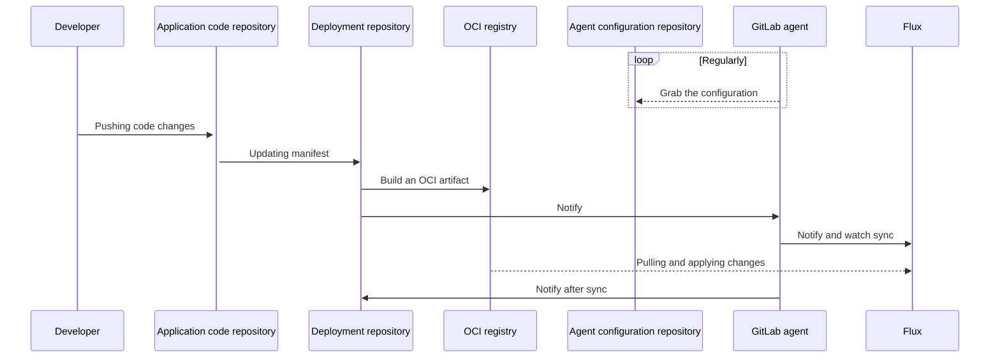



- 티어:  Free, Premium, Ultimate
- 제공 서비스: GitLab.com, GitLab Self-Managed, GitLab Dedicated



GitLab은 GitOps를 위해 [Flux](https://fluxcd.io/flux/)를 통합합니다. Flux를 시작하려면 [Flux for GitOps 튜토리얼](getting_started.md)을 참조하세요.

GitOps를 사용하면 Git 리포지토리에서 컨테이너화된 클러스터와 애플리케이션을 관리할 수 있습니다:

- 시스템의 단일 정보 소스입니다.
- 시스템을 운영하는 단일 위치입니다.

GitLab, Kubernetes, GitOps를 결합하면 다음을 얻을 수 있습니다:

- GitOps 운영자로서의 GitLab.
- 자동화 및 수렴 시스템으로서의 Kubernetes.
- 지속적 통합을 위한 GitLab CI/CD.
- 지속적 배포 및 클러스터 관찰성을 위한 에이전트.
- 기본 제공 자동 드리프트 수정.
- [서버 측 적용](https://kubernetes.io/docs/reference/using-api/server-side-apply/)을 통한 리소스 관리(투명한 다중 행위자 필드 관리).

## 배포 시퀀스 {#deployment-sequence}

이 다이어그램은 GitOps 배포의 리포지토리와 주요 행위자를 보여줍니다:



GitOps 배포를 위해 Flux와 `agentk`을 모두 사용해야 합니다. Flux는 클러스터 상태를 소스와 동기화된 상태로 유지하는 반면, `agentk`은 Flux 설정을 단순화하고, 클러스터에서 GitLab으로의 액세스 관리를 제공하고, GitLab UI에서 클러스터 상태를 시각화합니다.

### 소스 제어를 위한 OCI {#oci-for-source-control}

Flux의 소스 제어기로 Git 리포지토리 대신 OCI 이미지를 사용해야 합니다. [GitLab 컨테이너 레지스트리](../../packages/container_registry/_index.md)는 OCI 이미지를 지원합니다.

| OCI 레지스트리 | Git 리포지토리 |
| ---          | ---              |
| 대규모 컨테이너 이미지 제공용으로 설계되었습니다. | 소스 코드 버전 관리 및 저장용으로 설계되었습니다. |
| 불변이며, 보안 검사를 지원합니다. | 변경 가능합니다. |
| 기본 Git 브랜치는 동기화를 트리거하지 않고 클러스터 상태를 저장할 수 있습니다. | 기본 Git 브랜치는 클러스터 상태를 저장할 때 동기화를 트리거합니다. |

## 리포지토리 구조 {#repository-structure}

구성을 단순화하려면 팀당 하나의 배포 리포지토리를 사용하세요. 배포 리포지토리를 애플리케이션당 여러 OCI 이미지로 패키지할 수 있습니다.

추가 리포지토리 구조 권장사항은 [Flux 문서](https://fluxcd.io/flux/guides/repository-structure/)를 참조하세요.

## 즉시 Git 리포지토리 조정 {#immediate-git-repository-reconciliation}

일반적으로 Flux 소스 제어기는 구성된 간격으로 Git 리포지토리를 조정합니다. 이로 인해 `git push`과 클러스터 상태 조정 사이에 지연이 발생할 수 있으며, GitLab에서 불필요한 풀이 발생합니다.

Kubernetes용 에이전트는 에이전트가 연결된 인스턴스의 GitLab 프로젝트를 참조하는 Flux `GitRepository` 개체를 자동으로 감지하고 인스턴스에 대해 [`Receiver`](https://fluxcd.io/flux/components/notification/receivers/)를 구성합니다. Kubernetes용 에이전트가 액세스 권한이 있는 리포지토리에 대한 `git push`을 감지하면 `Receiver`가 트리거되고 Flux는 리포지토리의 변경 사항과 클러스터를 조정합니다.

즉시 Git 리포지토리 조정을 사용하려면 다음을 실행하는 Kubernetes 클러스터가 있어야 합니다:

- Kubernetes용 에이전트.
- Flux `source-controller`과 `notification-controller`.

즉시 Git 리포지토리 조정은 푸시와 조정 사이의 시간을 줄일 수 있지만, 모든 `git push` 이벤트를 받을 수 있음을 보장하지는 않습니다. 여전히 [`GitRepository.spec.interval`](https://fluxcd.io/flux/components/source/gitrepositories/#interval)를 적절한 기간으로 설정해야 합니다.

> [!note]
> 에이전트는 에이전트 구성 프로젝트와 모든 공개 프로젝트에만 액세스할 수 있습니다. 에이전트는 에이전트 구성 프로젝트를 제외한 개인 프로젝트를 즉시 조정할 수 없습니다. 에이전트가 개인 프로젝트에 액세스할 수 있도록 허용하는 것은 [이슈 389393](https://gitlab.com/gitlab-org/gitlab/-/issues/389393)에서 제안되었습니다.

### 사용자 정의 웹후크 엔드포인트 {#custom-webhook-endpoints}

Kubernetes용 에이전트가 `Receiver` 웹후크를 호출하면, 에이전트는 `http://webhook-receiver.flux-system.svc.cluster.local`로 기본 설정되며, 이는 Flux 부트스트랩 설치에서 설정한 기본 URL이기도 합니다. 사용자 정의 엔드포인트를 구성하려면 `flux.webhook_receiver_url`을 에이전트가 확인할 수 있는 URL로 설정하세요. 예를 들어:

```yaml
flux:
  webhook_receiver_url: http://webhook-receiver.another-flux-namespace.svc.cluster.local
```

[서비스 프록시 URL](https://kubernetes.io/docs/tasks/access-application-cluster/access-cluster-services/)에 대한 특별한 처리가 있으며, 이 형식으로 구성됩니다: `/api/v1/namespaces/[^/]+/services/[^/]+/proxy`. 예를 들어:

```yaml
flux:
  webhook_receiver_url: /api/v1/namespaces/flux-system/services/http:webhook-receiver:80/proxy
```

이 경우 Kubernetes용 에이전트는 사용 가능한 Kubernetes 구성 및 컨텍스트를 사용하여 API 엔드포인트에 연결합니다. 클러스터 외부에서 에이전트를 실행하고 Flux 알림 제어기용 [`Ingress`를 구성](https://fluxcd.io/flux/guides/webhook-receivers/#expose-the-webhook-receiver)하지 않은 경우 이를 사용할 수 있습니다.

> [!warning]
> 신뢰할 수 있는 서비스 프록시 URL만 구성해야 합니다. 서비스 프록시 URL을 제공하면 Kubernetes용 에이전트는 API 서비스로 인증하는 데 필요한 자격 증명을 포함하는 일반적인 Kubernetes API 요청을 보냅니다.

## 토큰 관리 {#token-management}

특정 Flux 기능을 사용하려면 여러 액세스 토큰이 필요할 수 있습니다. 또한 동일한 결과를 얻기 위해 여러 토큰 유형을 사용할 수 있습니다.

이 섹션은 필요한 토큰에 대한 지침을 제공하고, 가능한 경우 토큰 유형 권장사항을 제공합니다.

### Flux의 GitLab 액세스 {#gitlab-access-by-flux}

GitLab 컨테이너 레지스트리 또는 Git 리포지토리에 액세스하려면 Flux는 다음을 사용할 수 있습니다:

- 프로젝트 또는 그룹 배포 토큰.
- 프로젝트 또는 그룹 배포 키.
- 프로젝트 또는 그룹 액세스 토큰.
- 개인 액세스 토큰.

토큰은 쓰기 액세스가 필요하지 않습니다.

`http` 액세스가 가능하면 프로젝트 배포 토큰을 사용해야 합니다. `git+ssh` 액세스가 필요하면 배포 키를 사용해야 합니다. 배포 키와 배포 토큰을 비교하려면 [배포 키](../../project/deploy_keys/_index.md)를 참조하세요.

배포 토큰 생성, 회전, 보고 자동화를 위한 지원이 [이슈 389393](https://gitlab.com/gitlab-org/gitlab/-/issues/389393)에서 제안되었습니다.

### Flux에서 GitLab으로의 알림 {#flux-to-gitlab-notification}

Git 소스에서 동기화하도록 Flux를 구성하면 [Flux는 외부 작업 상태를 등록](https://fluxcd.io/flux/components/notification/providers/#git-commit-status-updates)할 수 있습니다. GitLab 파이프라인에서 말입니다.

Flux에서 외부 작업 상태를 얻으려면 다음을 사용할 수 있습니다:

- 프로젝트 또는 그룹 배포 토큰.
- 프로젝트 또는 그룹 액세스 토큰.
- 개인 액세스 토큰.

토큰은 `api` 범위가 필요합니다. 유출된 토큰의 공격 표면을 최소화하려면 프로젝트 액세스 토큰을 사용해야 합니다.

Flux를 GitLab 파이프라인에 작업으로 통합하는 것이 [이슈 405007](https://gitlab.com/gitlab-org/gitlab/-/issues/405007)에서 제안되었습니다.

## 관련 항목 {#related-topics}

- [교육 및 데모를 위한 GitOps 작업 예제](https://gitlab.com/groups/guided-explorations/gl-k8s-agent/gitops/-/wikis/home)
- [자가 속도 교실 워크숍](https://gitlab-for-eks.awsworkshop.io) (AWS EKS를 사용하지만 다른 Kubernetes 클러스터에도 사용 가능)
- GitOps 워크플로우에서 Kubernetes 시크릿 관리
  - [Flux에 기본 제공되는 SOPS 사용](https://fluxcd.io/flux/guides/mozilla-sops/)
  - [봉인된 시크릿 사용](https://fluxcd.io/flux/guides/sealed-secrets/)
