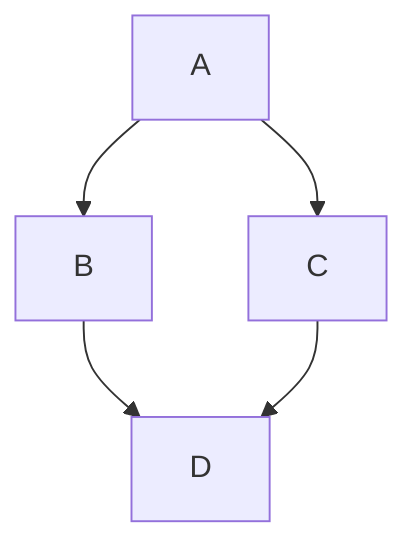



- 티어:  Free, Premium, Ultimate
- 제공 서비스: GitLab.com, GitLab Self-Managed, GitLab Dedicated



GitLab은 [`gitlab-markup`](https://gitlab.com/gitlab-org/gitlab-markup) gem을 사용하며, 이는 [`org-ruby`](https://github.com/wallyqs/org-ruby) gem을 사용하여 Org 모드 콘텐츠를 HTML로 변환합니다. Org 모드 구문의 완전한 참조를 보려면 [Org 매뉴얼](https://orgmode.org/manuals.html)을 참조하십시오.

다음 영역에서 Org 모드를 사용할 수 있습니다:

- 리포지토리 내의 Org 모드 문서(`.org`)
- 스니펫(스니펫 파일의 이름이 `.org` 확장자로 지정된 경우)
- 위키 페이지

## 제목 {#headings}

앞에 붙는 별표(`*`)는 제목 1부터 6으로 렌더링됩니다.

```org
* Heading 1
** Heading 2
*** Heading 3
**** Heading 4
***** Heading 5
****** Heading 6
```

`#+TITLE:`은 페이지 맨 위의 H1 제목으로 렌더링됩니다:

```org
#+TITLE: Welcome to Org-mode
```

### 제목 앵커 {#heading-anchors}

GitLab은 모든 Org 모드 제목에 자동으로 앵커를 추가하므로 링크를 만들 수 있습니다.

가리키면 해당 앵커에 링크가 표시되어 제목 링크를 쉽게 복사하여 다른 곳에서 사용할 수 있습니다.

앵커는 다음 규칙에 따라 제목의 내용에서 생성됩니다:

1. 모든 텍스트가 소문자로 변환됩니다.
1. 문자, 숫자, 하이픈 및 밑줄을 제외한 모든 문자가 제거됩니다.
1. 모든 공간이 하이픈으로 변환됩니다.
1. 동일한 앵커를 가진 제목이 이미 생성된 경우 고유한 증가 번호가 추가되며, 1부터 시작합니다.

예제:

<!--
Translation note: DO NOT TRANSLATE this example.
The example must stay untranslated to stay in sync with the example anchors.
-->

```org
* This heading has spaces in it
** This heading has an accent in it: Café
** This heading has Unicode in it: 日本語
** This heading has spaces in it
*** This heading has spaces in it
** This heading has 3.5 in it (& parentheses)
** This heading has  multiple spaces and - hyphens_and_underscores
```

다음과 같은 제목 앵커가 생성됩니다:

1. `#this-heading-has-spaces-in-it`
1. `#this-heading-has-an-accent-in-it-café`
1. `#this-heading-has-unicode-in-it-日本語`
1. `#this-heading-has-spaces-in-it-1`
1. `#this-heading-has-spaces-in-it-2`
1. `#this-heading-has-35-in-it--parentheses`
1. `#this-heading-has--multiple-spaces-and---hyphens_and_underscores`

스니펫에서 제목은 파일명에서 파생된 접두사도 가져오므로 여러 파일 간 앵커 충돌을 방지합니다. 예를 들어, `README.org` 파일에 `* TL;DR` 제목이 `#tldr` 대신에 `#readme-tldr` 앵커를 갖게 됩니다.

## 목록 {#lists}

Org 모드는 순서 없는 목록, 순서 있는 목록, 설명 목록 및 중첩된 목록을 지원합니다.

### 순서 없는 목록 {#unordered-lists}

하이픈(`-`) 또는 더하기 기호(`+`)는 순서 없는 목록을 만듭니다:

```org
- Item one
- Item two
  - Nested item
```

```org
+ Item one
+ Item two
  + Nested item
```

렌더링될 때 두 예제는 다음과 유사하게 표시됩니다:

> - 항목 1
> - 항목 2
>   - 중첩된 항목

### 순서 있는 목록 {#ordered-lists}

숫자 뒤에 마침표(`.`) 또는 닫는 괄호(`)`)는 순서 있는 목록을 만듭니다:

```org
1. First item
2. Second item
   1. Nested item
```

```org
1) First item
2) Second item
   1) Nested item
```

렌더링될 때 두 예제는 다음과 유사하게 표시됩니다:

> 1. 첫 번째 항목
> 1. 두 번째 항목
>    1. 중첩된 항목

### 설명 목록 {#description-lists}

```org
- term1 :: Definition of term one
- term2 :: Definition of term two
```

렌더링하면 예제는 다음과 같습니다.

> 용어1 : 용어 1의 정의
>
> 용어2 : 용어 2의 정의

## 확인란 {#checkboxes}

`[ ]`, `[X]`, `[-]`은 목록 마커 뒤에 확인란 입력 요소로 렌더링됩니다. `[-]`(부분적으로 선택됨)는 확정되지 않은 확인란으로 렌더링됩니다:

<!--
Translation note: DO NOT TRANSLATE this example.
The example must stay untranslated to stay in sync with the image.
-->

```org
- [-] Prepare release
  - [X] Update changelog
  - [ ] Review merge requests
```

렌더링되면 예제는 다음과 같습니다.


확인란은 순서 있는 목록에서도 작동합니다:

<!--
Translation note: DO NOT TRANSLATE this example.
The example must stay untranslated to stay in sync with the image.
-->

```org
1. [-] Prepare release
   1. [X] Update changelog
   2. [ ] Review merge requests
```

렌더링되면 예제는 다음과 같습니다.


## 표 {#tables}

파이프(`|`)는 테이블을 만듭니다. 대시(`-`)와 더하기 기호(`+`)로 만든 구분자 행은 위의 행을 테이블 헤더로 바꿉니다:

```org
| Item  | Unit price ($) | Quantity | Subtotal ($) |
|-------+----------------+----------+--------------|
| Eggs  |              3 |        2 |            6 |
| Milk  |              2 |        1 |            2 |
| Bread |              1 |        3 |            3 |
|-------+----------------+----------+--------------|
| Total |                |          |           11 |
#+TBLFM: $>=$2*$3::@>$>=vsum(@I..@II)
```

렌더링하면 예제는 다음과 같습니다.

> | 항목  | 단가($) | 수량 | 소계($) |
> |-------|----------------|----------|--------------|
> | 계란  | 3              | 2        | 6            |
> | 우유  | 2              | 1        | 2            |
> | 빵 | 1              | 3        | 3            |
> | 합계 |                |          | 11           |

## 링크 {#links}

여러 방법으로 링크를 만들 수 있습니다.

```org
- This line shows an [[https://example.com][inline-style link]]
- This line shows a [[./permissions.md][link to a file in the same directory]]
- This line shows a [[../_index.md][relative link to a file one directory higher]]
- This line links to a [[#headings][heading on the same page, using a `#` and the heading anchor]]
```

렌더링하면 예제는 다음과 같습니다.

> - 이 줄은 [인라인 스타일 링크](https://example.com)를 보여줍니다.
> - 이 줄은 [같은 디렉토리의 파일로의 링크](permissions.md)를 보여줍니다
> - 이 줄은 [한 디렉터리 위의 파일에 상대적 링크](../_index.md)를 보여줍니다.
> - 이 줄은 [`#`를 사용하여 같은 페이지의 제목으로의 링크](#headings)를 표시합니다

### URL 자동 연결 {#url-auto-linking}

텍스트에 넣는 거의 모든 URL이 자동으로 연결됩니다.

```org
See https://example.com for details.
```

렌더링하면 예제는 다음과 같습니다.

> 자세한 내용은 <https://example.com>을 참조하십시오.

## 강조 {#emphasis}

| 스타일                           | 출력                                |
|---------------------------------|---------------------------------------|
| `*bold*`                        | **굵음**                              |
| `/italic/`                      | *기울임*                              |
| `+strikethrough+`               | ~~취소선~~                     |
| `=verbatim=`                    | `verbatim`                            |
| `~code~`                        | `code`                                |
| `This is a ^{superscript} text` | 이는 <sup>위첨자</sup> 텍스트입니다 |
| `This is a _{subscript} text`   | 이는 <sub>아래첨자</sub> 텍스트입니다   |

## 이미지 {#images}

설명 없이 이미지 파일에 링크하면 이미지가 인라인으로 포함됩니다:

```org
[[img/markdown_logo_v17_11.png]]
```

렌더링하면 예제는 다음과 같습니다.


## 가로줄 {#horizontal-rules}

5개 이상의 연속 하이픈(`-`)은 가로줄을 만듭니다:

```org
Paragraph before.

-----

Paragraph after.
```

렌더링하면 예제는 다음과 같습니다.

> 이전 단락입니다.
>
> ---
>
> 다음 단락입니다.

## 주석 {#comments}

`#`로 시작하고 그 뒤에 공백이 있는 줄은 렌더링되지 않습니다:

```org
Visible before.

# This line is a comment and isn't rendered.

Visible after.
```

렌더링하면 예제는 다음과 같습니다.

> 이전에 표시됨
>
> 이후에 표시됨

`#+BEGIN_COMMENT`과 `#+END_COMMENT` 사이의 콘텐츠는 렌더링되지 않습니다:

```org
Visible before the block.

#+BEGIN_COMMENT
This entire block is a comment.
None of these lines are rendered.
#+END_COMMENT

Visible after the block.
```

렌더링하면 예제는 다음과 같습니다.

> 블록 전에 표시됨
>
> 블록 이후에 표시됨

`COMMENT`로 표시된 제목이 제목 마커 바로 뒤에 있으면 그 아래에 중첩된 모든 항목은 렌더링되지 않습니다:

```org
* Visible heading

Some visible text.

* COMMENT Hidden heading

This text isn't rendered.

** Nested under hidden heading

This text isn't rendered either.

* Another visible heading
```

`Visible heading`과 `Another visible heading` 그리고 그 사이의 텍스트만 렌더링된 출력에 나타납니다.

## 텍스트 블록 {#text-blocks}

`#+BEGIN_QUOTE`과 `#+END_QUOTE`는 인용 블록을 만듭니다:

```org
#+BEGIN_QUOTE
Everything should be made as simple as possible,
but not any simpler ---Albert Einstein
#+END_QUOTE
```

렌더링하면 예제는 다음과 같습니다.

> > 모든 것을 최대한 단순하게 만들어야 하지만 더 단순하게는 안 됩니다 —Albert Einstein

`#+BEGIN_EXAMPLE`과 `#+END_EXAMPLE`는 미리 형식이 지정된 텍스트 블록을 만듭니다:

```org
#+BEGIN_EXAMPLE
Here is an example.
#+END_EXAMPLE
```

렌더링하면 예제는 다음과 같습니다.

> ```plaintext
> Here is an example.
> ```

콜론(`:`) 및 공백도 미리 형식이 지정된 텍스트 블록을 만듭니다:

```org
: Here is an example.
```

렌더링하면 예제는 다음과 같습니다.

> ```plaintext
> Here is an example.
> ```

## 소스 코드 블록 {#source-code-blocks}

언어 이름이 있는 `#+BEGIN_SRC`과 `#+END_SRC`는 구문 강조 코드 블록을 만듭니다:

```org
#+BEGIN_SRC python
import requests
data = requests.get("https://jsonplaceholder.typicode.com/users/1").json()
#+END_SRC
```

렌더링하면 예제는 다음과 같습니다.

> ```python
> import requests
> data = requests.get("https://jsonplaceholder.typicode.com/users/1").json()
> ```

GitLab은 구문 강조를 위해 [Rouge Ruby 라이브러리](https://github.com/rouge-ruby/rouge)를 사용합니다. 지원되는 언어 목록을 보려면 [Rouge 프로젝트 위키](https://github.com/rouge-ruby/rouge/wiki/List-of-supported-languages-and-lexers)를 참조하십시오.

블록 헤더에 `:exports both`을 추가하면 소스 블록의 실행 결과(`#+RESULTS:`)가 렌더링된 출력에 포함됩니다:

```org
#+BEGIN_SRC python :exports both :results output code
import requests
data = requests.get("https://jsonplaceholder.typicode.com/users/1").json()
print([data["username"], data["email"]])
#+END_SRC

#+RESULTS:
#+begin_src python
['Bret', 'Sincere@april.biz']
#+end_src
```

렌더링하면 예제는 다음과 같습니다.

> ```python
> import requests
> data = requests.get("https://jsonplaceholder.typicode.com/users/1").json()
> print([data["username"], data["email"]])
> ```
>
> ```python
> ['Bret', 'Sincere@april.biz']
> ```

## 다이어그램 및 순서도 {#diagrams-and-flowcharts}

소스 코드 블록의 텍스트에서 다이어그램을 생성할 수 있습니다. 이는 [GitLab Flavored Markdown](markdown.md#diagrams-and-flowcharts)과 동일한 방식입니다.

### Mermaid {#mermaid}

```org
#+BEGIN_SRC mermaid
graph TD;
    A-->B;
    A-->C;
    B-->D;
    C-->D;
#+END_SRC
```

렌더링하면 예제는 다음과 같습니다.



### PlantUML {#plantuml}

PlantUML 통합은 GitLab.com에 사용으로 설정되어 있습니다. GitLab Self-Managed에서 PlantUML을 사용할 수 있게 하려면 GitLab 관리자가 [활성화해야 합니다](../administration/integration/plantuml.md).

```org
#+BEGIN_SRC plantuml
Bob -> Alice : hello
Alice -> Bob : hi
#+END_SRC
```

## 수학 방정식 {#math-equations}

언어가 `math`로 선언된 소스 코드 블록에 작성된 수학식은 [KaTeX](https://github.com/KaTeX/KaTeX)로 렌더링됩니다. KaTeX는 LaTeX의 [하위 집합](https://katex.org/docs/supported.html)만 지원합니다.

```org
#+BEGIN_SRC math
\left( \sum_{k=1}^n a_k b_k \right)^2 \leq \left( \sum_{k=1}^n a_k^2 \right) \left( \sum_{k=1}^n b_k^2 \right)
#+END_SRC
```

렌더링되면 예제는 다음과 같습니다.


## GitLab 쿼리 언어(GLQL) {#gitlab-query-language-glql}

언어가 `glql`로 선언된 소스 코드 블록은 [GitLab 쿼리 언어(GLQL)](glql/_index.md) 뷰를 포함합니다:

<!--
Translation note: DO NOT TRANSLATE this example.
The example must stay untranslated to stay in sync with the image.
-->

```yaml
#+BEGIN_SRC glql
display: table
title: GLQL table 🎉
description: This view lists my open issues
fields: title, state, health, epic, milestone, weight, updated
limit: 5
query: type = Issue AND group = "gitlab-org" AND assignee = currentUser() AND state = opened
#+END_SRC
```

렌더링되면 예제는 다음과 같습니다.


