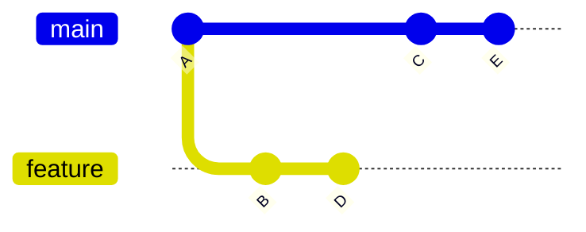
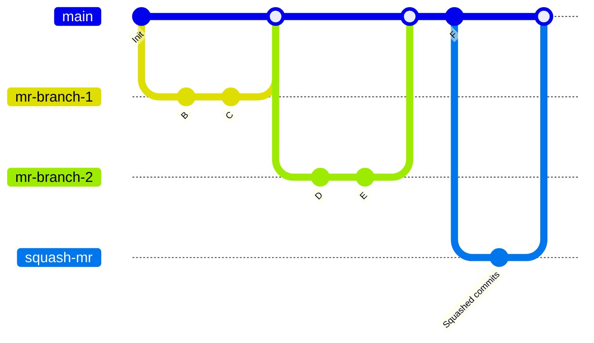
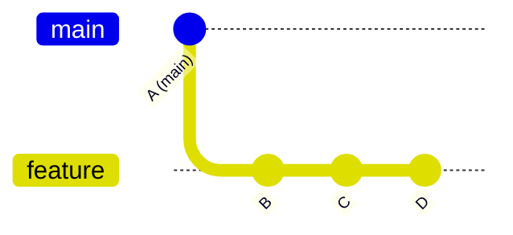
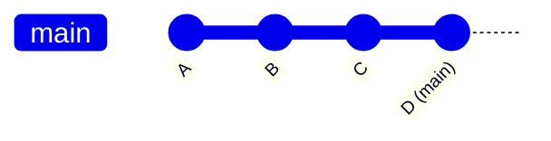
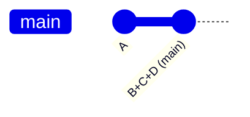



- 티어: Free, Premium, Ultimate
- 제공 서비스: GitLab.com, GitLab Self-Managed, GitLab Dedicated



선택한 머지 방법은 머지 리퀘스트의 변경 사항이 기존 브랜치에 머지되는 방식을 결정합니다.

이 페이지의 예제는 커밋 A, C, E가 있는 `main` 브랜치와 커밋 B, D가 있는 `feature` 브랜치를 가정합니다:



## 프로젝트의 머지 방법 구성 {#configure-a-projects-merge-method}

1. 상단 바에서 **검색 또는 이동**을 선택하고 프로젝트를 찾습니다.
1. 왼쪽 사이드바에서 **설정** > **머지 리퀘스트**를 선택합니다.
1. 원하는 **머지 방법**을 다음 옵션에서 선택합니다:
   - 머지 커밋
   - 준선형 이력으로 머지 커밋
   - 패스트 포워드 머지
1. **머지할 때 커밋 스쿼시**에서 커밋 처리의 기본 동작을 선택합니다:
   - **허용하지 않음**: 스쿼싱이 수행되지 않으며 사용자가 동작을 변경할 수 없습니다.
   - **허용**: 스쿼싱이 기본적으로 비활성화되지만 사용자가 동작을 변경할 수 있습니다.
   - **권장**: 스쿼싱이 기본적으로 활성화되지만 사용자가 동작을 변경할 수 있습니다.
   - **요구**: 스쿼싱이 항상 수행되며 사용자가 동작을 변경할 수 없습니다.
1. **변경 사항 저장**을 선택합니다.

## 머지 커밋 {#merge-commit}

기본적으로 GitLab은 브랜치가 `main`에 머지될 때 머지 커밋을 생성합니다. 커밋이 [머지할 때 스쿼시](../squash_and_merge.md)되는지 여부에 관계없이 별도의 머지 커밋이 항상 생성됩니다. 이 전략은 스쿼시 커밋과 머지 커밋 모두가 `main` 브랜치에 추가되는 결과를 낳을 수 있습니다.

다음 다이어그램은 **머지 커밋** 전략을 사용할 경우 `feature` 브랜치가 `main`로 머지되는 방식을 보여줍니다. 이는 `git merge --no-ff <feature>` 명령과 동등하며, GitLab UI에서 **머지 방법**으로 `Merge commit`을 선택하는 것과 동등합니다:

- 브랜치가 **머지 커밋** 방법으로 머지된 후 `main` 브랜치는 다음과 같이 보입니다:

  ```mermaid
  %%{init: { 'gitGraph': {'logLevel': 'debug', 'showBranches': true, 'showCommitLabel':true,'mainBranchName': 'main', 'fontFamily': 'GitLab Sans'}} }%%
  gitGraph
     accTitle: Diagram of a merge commit
     accDescr: A Git graph showing how merge commits are created in GitLab when a feature branch is merged.
     commit id: "A"
     branch feature
     commit id: "B"
     commit id: "D"
     checkout main
     commit id: "C"
     commit id: "E"
     merge feature
  ```

- 비교하면 스쿼시 머지는 스쿼시 커밋, 즉 `feature` 브랜치의 모든 커밋의 가상 복사본을 구성합니다. 원본 커밋(B 및 D)은 `feature` 브랜치에서 변경되지 않은 상태로 남아 있으며, 그 후 스쿼시 브랜치를 머지하기 위해 `main` 브랜치에 머지 커밋이 생성됩니다:

  ```mermaid
  %%{init: { 'gitGraph': {'showBranches': true, 'showCommitLabel':true,'mainBranchName': 'main', 'fontFamily': 'GitLab Sans'}} }%%
  gitGraph
     accTitle: Diagram of a squash merge
     accDescr: A Git graph showing repository and branch structure after a squash commit is added to the main branch.
     commit id:"A"
     branch feature
     checkout main
     commit id:"C"
     checkout feature
     commit id:"B"
     commit id:"D"
     checkout main
     commit id:"E"
     branch "B+D"
     commit id: "B+D"
     checkout main
     merge "B+D"
  ```

스쿼시 머지 그래프는 GitLab UI의 다음 설정과 동등합니다:

- **머지 방법**: 머지 커밋.
- **머지할 때 커밋 스쿼시**는 다음 중 하나로 설정되어야 합니다:
  - 요구.
  - 허용 또는 권장, 그리고 스쿼싱이 머지 리퀘스트에서 선택되어야 합니다.

스쿼시 머지 그래프는 또한 다음 명령과 동등합니다:

  ```shell
  git checkout `git merge-base feature main`
  git merge --squash feature
  git commit --no-edit
  SOURCE_SHA=`git rev-parse HEAD`
  git checkout main
  git merge --no-ff $SOURCE_SHA
  ```

스쿼시 머지 후 장시간 실행되는 소스 브랜치에서 계속 작업하면 이후 머지 리퀘스트에 이전에 머지된 커밋과 소스 브랜치가 대상 브랜치보다 뒤떨어져 있다는 경고가 표시될 수 있습니다. 자세한 내용은 [장시간 실행되는 브랜치 동작](../squash_and_merge.md#long-running-branch-behavior)을 참조하세요.

## 준선형 이력으로 머지 커밋 {#merge-commit-with-semi-linear-history}

머지마다 머지 커밋이 생성되지만 브랜치는 패스트 포워드 머지가 가능할 때만 머지됩니다. 이렇게 하면 머지 리퀘스트 빌드가 성공한 경우 머지 후 대상 브랜치 빌드도 성공합니다. 이 머지 방법을 사용하여 생성된 커밋 그래프의 예:



`Merge commit with semi-linear history` 방법이 선택된 머지 리퀘스트 페이지를 방문할 때 패스트 포워드 머지가 가능한 경우에만 이를 수락할 수 있습니다. 패스트 포워드 머지가 불가능하면 사용자에게 리베이스 옵션이 제공되며, [(반)선형 머지 방법에서의 리베이스](#rebasing-in-semi-linear-merge-methods)를 참조하세요.

이 방법은 **머지 커밋** 방법과 동일한 Git 명령과 동등합니다. 그러나 소스 브랜치가 대상 브랜치의 오래된 버전(예: `main`)을 기반으로 하는 경우 소스 브랜치를 리베이스해야 합니다. 이 머지 방법은 더욱 깔끔한 이력을 생성하는 동시에 모든 브랜치가 시작되고 머지된 위치를 볼 수 있도록 합니다.

## 패스트 포워드 머지 {#fast-forward-merge}

경우에 따라 워크플로우 정책이 머지 커밋이 없는 깔끔한 커밋 이력을 요구할 수 있습니다. 이러한 경우 패스트 포워드 머지가 적절합니다. 패스트 포워드 머지 리퀘스트를 사용하면 머지 커밋을 생성하지 않고도 선형 Git 이력을 유지할 수 있습니다.

패스트 포워드 머지는 대상 브랜치(예: `main`)이 소스 브랜치의 기본 커밋에서 벗어나지 않았을 때만 가능합니다. 대상 브랜치에 소스 브랜치에 없는 새로운 커밋이 있는 경우 먼저 소스 브랜치를 리베이스해야 합니다.

패스트 포워드 머지([`--ff-only`](https://git-scm.com/docs/git-merge#git-merge---ff-only)) 설정이 활성화되면 브랜치를 패스트 포워드할 수 있는 경우에만 머지가 허용됩니다. 패스트 포워드 머지가 불가능하면 리베이스 옵션이 제공됩니다. 자세한 내용은 [(반)선형 머지 방법에서의 리베이스](#rebasing-in-semi-linear-merge-methods)를 참조하세요.

### 스쿼시하지 않음 {#without-squashing}

스쿼싱이 비활성화되면 소스 브랜치의 모든 커밋이 대상 브랜치에 직접 추가되어 개별 커밋 이력을 유지합니다.

머지 전, `main`이 커밋 A에 있고 `feature`가 B, C, D 커밋을 포함하는 경우:



패스트 포워드 머지 후 `main`은 커밋 D를 가리키며 feature 브랜치의 모든 커밋을 포함합니다:



이 방법은 `git merge --ff-only <source-branch>`과 동등합니다.

### 스쿼시와 함께 {#with-squashing}

스쿼싱이 활성화되면 소스 브랜치의 모든 커밋이 먼저 단일 커밋으로 결합된 후 대상 브랜치로 패스트 포워드됩니다.

머지 전, `main`이 커밋 A에 있고 `feature`가 B, C, D 커밋을 포함하는 경우:


스쿼싱을 포함한 패스트 포워드 머지 후 `main`은 B, C, D의 모든 변경 사항을 포함하는 단일 커밋을 포함합니다:



이 방법은 `git merge --squash <source-branch>`이 `git commit`뒤에 오는 것과 동등합니다.

## (반)선형 머지 방법에서의 리베이스 {#rebasing-in-semi-linear-merge-methods}

이러한 머지 방법에서는 소스 브랜치가 대상 브랜치와 최신 상태일 때만 머지할 수 있습니다:

- 준선형 이력으로 머지 커밋.
- 패스트 포워드 머지.

패스트 포워드 머지가 불가능하지만 충돌 없는 리베이스가 가능한 경우 GitLab은 다음을 제공합니다:

- [`/rebase` 빠른 작업](../conflicts.md#rebase).
- 사용자 인터페이스에서 **Rebase**를 선택하는 옵션.

다음 조건이 모두 참인 경우 패스트 포워드 머지 전에 소스 브랜치를 로컬에서 리베이스해야 합니다:

- 대상 브랜치가 소스 브랜치보다 앞서 있습니다.
- 충돌 없는 리베이스는 불가능합니다.

스쿼싱 자체가 리베이스와 동등한 것으로 간주될 수 있지만 스쿼싱 전에 리베이스가 필요할 수 있습니다.

### 머지 전 자동 리베이스 {#automatic-rebase-before-merge}



- [GitLab 18.0에 도입됨](https://gitlab.com/gitlab-org/gitlab/-/merge_requests/183928) [기능 플래그](../../../../administration/feature_flags/_index.md) `rebase_on_merge_automatic` 이름으로. 기본적으로 비활성화되었습니다.
- GitLab 18.11의 [GitLab.com에서 활성화](https://gitlab.com/gitlab-org/gitlab/-/work_items/524048)되었습니다.
- 기능 플래그 `rebase_on_merge_automatic` [GitLab 19.0에서 제거됨](https://gitlab.com/gitlab-org/gitlab/-/merge_requests/231406).
- GitLab 19.2에서 [일반적으로 사용 가능](https://gitlab.com/gitlab-org/gitlab/-/merge_requests/243879)합니다.



**준선형 이력으로 머지 커밋** 또는 **패스트 포워드 머지** 방법을 사용하면 머지 전 자동 리베이스를 켤 수 있습니다. 이 설정이 켜진 경우 GitLab은 소스 브랜치가 대상 브랜치보다 뒤떨어진 경우 머지 시 소스 브랜치를 대상 브랜치로 자동으로 리베이스합니다. 머지하기 전에 수동으로 리베이스하거나 리베이스가 완료될 때까지 기다릴 필요가 없습니다.

서버 측 리베이스는 커밋에서 GPG 서명을 제거합니다. 프로젝트에 서명된 커밋이 필요한 경우 자동 리베이스가 적절한지 고려하세요.

자동 리베이스:

- 원본 소스 브랜치를 수정하지 않고 소스 브랜치의 서버 측 리베이스를 생성합니다.
- 리베이스된 커밋을 포함하도록 대상 브랜치를 패스트 포워드합니다.
- 리베이스된 결과에 대해 CI/CD 파이프라인을 다시 실행하지 않습니다.
- 리베이스가 머지 충돌 없이 완료될 수 있어야 합니다.

> [!note]
> CI/CD 파이프라인이 자동 리베이스 후 다시 실행되지 않으므로 머지된 결과가 마지막 파이프라인 실행과 다를 수 있습니다. 머지 전 리베이스된 결과를 검증하려면 [머지 트레인](../../../../ci/pipelines/merge_trains.md)을 사용합니다.

#### 머지 전 자동 리베이스 켜기 {#turn-on-automatic-rebase-before-merge}

전제 조건:

- 프로젝트에 대한 Maintainer 또는 Owner 역할.
- 프로젝트 [머지 방법](#configure-a-projects-merge-method)이 **준선형 이력으로 머지 커밋** 또는 **패스트 포워드 머지**로 설정되어야 합니다.

자동 리베이스를 활성화하려면:

1. 상단 바에서 **검색 또는 이동**을 선택하고 프로젝트를 찾습니다.
1. 왼쪽 사이드바에서 **설정** > **머지 리퀘스트**를 선택합니다.
1. **머지 방법** 섹션에서 **머지하기 전에 자동 리베이스 활성화**를 선택합니다.
1. **변경 사항 저장**을 선택합니다.

### CI/CD 파이프라인 없이 Rebase {#rebase-without-cicd-pipeline}

머지 리퀘스트의 브랜치를 CI/CD 파이프라인을 트리거하지 않고 리베이스하려면 머지 리퀘스트 보고서 섹션에서 **파이프라인 없이 Rebase**를 선택합니다.

이 옵션은:

- 패스트 포워드 머지는 불가능하지만 충돌 없는 리베이스가 가능할 때 사용 가능합니다.
- **파이프라인이 성공해야 함** 옵션이 활성화된 경우 사용할 수 없습니다.

CI/CD 파이프라인 없이 리베이싱하면 빈번한 리베이스가 필요한 준선형 워크플로우가 있는 프로젝트에서 리소스를 절약합니다.

## 관련 항목 {#related-topics}

- [스쿼시 및 머지](../squash_and_merge.md)
