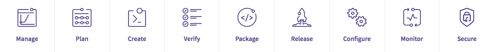

  <em>Visit <a href="https://docs.gitlab.com/ee/">docs.gitlab.com</a> for optimized
  navigation, discoverability, and readability.</em>

<!-- the div above will not display on the docs site but will display on /help -->

# GitLab Docs

Welcome to [GitLab](https://about.gitlab.com/) Documentation.

Here you can access the complete documentation for GitLab, the single application for the
[entire DevOps lifecycle](#the-entire-devops-lifecycle).

## Overview

No matter how you use GitLab, we have documentation for you.

| Essential Documentation                                                                                                                    | Essential Documentation                                                                                                    |
|:-------------------------------------------------------------------------------------------------------------------------------------------|:---------------------------------------------------------------------------------------------------------------------------|
| [**User Documentation**](user/index.md) Discover features and concepts for GitLab users.                                               | [**Administrator documentation**](administration/index.md) Everything GitLab self-managed administrators need to know. |
| [**Contributing to GitLab**](#contributing-to-gitlab) At GitLab, everyone can contribute!                                              | [**New to Git and GitLab?**](#new-to-git-and-gitlab) We have the resources to get you started.                             |
| [**Building an integration with GitLab?**](#building-an-integration-with-gitlab) Consult our automation and integration documentation. | [**Coming to GitLab from another platform?**](#coming-to-gitlab-from-another-platform) Consult our handy guides.       |
| [**Install GitLab**](https://about.gitlab.com/install/) Installation options for different platforms.                                  | [**Customers**](subscriptions/index.md) Information for new and existing customers.                                    |
| [**Update GitLab**](update/README.md) Update your GitLab self-managed instance to the latest version.                                  | [**GitLab Releases**](https://about.gitlab.com/releases/) What's new in GitLab.                                        |

## Popular Documentation

Have a look at some of our most popular documentation resources:

| Popular Topic                                                   | Description                                                      |
|:----------------------------------------------------------------|:-----------------------------------------------------------------|
| [Configuring `.gitlab-ci.yml`](ci/yaml/README.md)               | Complete syntax documentation for configuring your CI pipelines. |
| [GitLab CI/CD examples](ci/examples/README.md)                  | Get up to speed quickly with common CI/CD scenarios.             |
| [GitLab Container Registry](user/packages/container_registry/index.md) | Host Docker images within GitLab.                         |
| [GitLab Pages](user/project/pages/index.md)                     | Host static websites for your projects with GitLab.              |
| [GitLab.com settings](user/gitlab_com/index.md)                 | Settings for GitLab.com.                                         |
| [Kubernetes integration](user/project/clusters/index.md)        | Use GitLab with Kubernetes.                                      |
| [SSH authentication](ssh/README.md)                             | Secure your network communications.                              |
| [Using Docker images](ci/docker/using_docker_images.md)         | Build and test your applications with Docker.                    |
| [GraphQL](api/graphql/index.md)                                 | Explore GitLab's GraphQL API.                                    |

## The entire DevOps Lifecycle

GitLab is the first single application for software development, security,
and operations that enables [Concurrent DevOps](https://about.gitlab.com/concurrent-devops/),
making the software lifecycle faster and radically improving the speed of business.

GitLab provides solutions for [all the stages of the DevOps lifecycle](https://about.gitlab.com/stages-devops-lifecycle/):

GitLab is like a top-of-the-line kitchen for making software. As the executive
chef, you decide what software you want to serve. Using your recipe, GitLab handles
all the prep work, cooking, and delivery, so you can turn around orders faster
than ever.

The following sections provide links to documentation for each DevOps stage:

| DevOps Stage            | Documentation for                                           |
|:------------------------|:------------------------------------------------------------|
| [Manage](#manage)       | Statistics and analytics features.                          |
| [Plan](#plan)           | Project planning and management features.                   |
| [Create](#create)       | Source code and data creation and management features.      |
| [Verify](#verify)       | Testing, code quality, and continuous integration features. |
| [Package](#package)     | Docker container registry.                                  |
| [Release](#release)     | Application release and delivery features.                  |
| [Configure](#configure) | Application and infrastructure configuration tools.         |
| [Monitor](#monitor)     | Application monitoring and metrics features.                |
| [Secure](#secure)       | Security capability features.                               |

  <a type="button" class="btn btn-default" href="#overview">
    Back to Overview <i class="fa fa-angle-double-up" aria-hidden="true"></i>
  </a>

### Manage

GitLab provides statistics and insight into ways you can maximize the value of GitLab in your organization.

The following documentation relates to the DevOps **Manage** stage:

| Manage Topics                                                                         | Description                                                                                                                                                                                                                  |
|:--------------------------------------------------------------------------------------|:-----------------------------------------------------------------------------------------------------------------------------------------------------------------------------------------------------------------------------|
| [Authentication and Authorization](administration/auth/README.md) **(CORE ONLY)** | Supported authentication and authorization providers.                                                                                                                                                                        |
| [GitLab Cycle Analytics](user/project/cycle_analytics.md)                             | Measure the time it takes to go from an [idea to production](https://about.gitlab.com/blog/2016/08/05/continuous-integration-delivery-and-deployment-with-gitlab/#from-idea-to-production-with-gitlab) for each project you have. |
| [Instance Statistics](user/instance_statistics/index.md)                              | Discover statistics on how many GitLab features you use and user activity.                                                                                                                                                   |

  <a type="button" class="btn btn-default" href="#overview">
    Back to Overview <i class="fa fa-angle-double-up" aria-hidden="true"></i>
  </a>

### Plan

Whether you use Waterfall, Agile, or Conversational Development, GitLab streamlines your collaborative workflows.

Visualize, prioritize, coordinate, and track your progress your way with GitLab’s flexible project
management tools.

The following documentation relates to the DevOps **Plan** stage:

| Plan Topics                                                                                                                                                                                                                                                        | Description                                                                                                                                      |
|:-------------------------------------------------------------------------------------------------------------------------------------------------------------------------------------------------------------------------------------------------------------------|:-------------------------------------------------------------------------------------------------------------------------------------------------|
| [Burndown Charts](user/project/milestones/burndown_charts.md) **(STARTER)**                                                                                                                                                                                        | Watch your project's progress throughout a specific milestone.                                                                                   |
| [Discussions](user/discussions/index.md)                                                                                                                                                                                                                           | Threads, comments, and resolvable threads in issues, commits, and  merge requests.                                                           |
| [Due Dates](user/project/issues/due_dates.md)                                                                                                                                                                                                                      | Keep track of issue deadlines.                                                                                                                   |
| [Epics](user/group/epics/index.md) **(ULTIMATE)**                                                                                                                                                                                                                  | Tracking groups of issues that share a theme.                                                                                                    |
| [Issues](user/project/issues/index.md), including [confidential issues](user/project/issues/confidential_issues.md), [issue and merge request templates](user/project/description_templates.md), and [moving issues](user/project/issues/managing_issues.md#moving-issues) | Project issues, restricting access to issues, create templates for submitting new issues and merge requests, and moving issues between projects. |
| [Labels](user/project/labels.md)                                                                                                                                                                                                                                   | Categorize issues or merge requests with descriptive labels.                                                                                     |
| [Milestones](user/project/milestones/index.md)                                                                                                                                                                                                                     | Set milestones for delivery of issues and merge requests, with optional due date.                                                                |
| [Project Issue Board](user/project/issue_board.md)                                                                                                                                                                                                                 | Display issues on a Scrum or Kanban board.                                                                                                       |
| [Quick Actions](user/project/quick_actions.md)                                                                                                                                                                                                                     | Shortcuts for common actions on issues or merge requests, replacing the need to click buttons or use dropdowns in GitLab's UI.                   |
| [Related Issues](user/project/issues/related_issues.md) **(STARTER)**                                                                                                                                                                                              | Create a relationship between issues.                                                                                                            |
| [Roadmap](user/group/roadmap/index.md) **(ULTIMATE)**                                                                                                                                                                                                              | Visualize epic timelines.                                                                                                                        |
| [Service Desk](user/project/service_desk.md) **(PREMIUM)**                                                                                                                                                                                                         | A simple way to allow people to create issues in your GitLab instance without needing their own user account.                                    |
| [Time Tracking](user/project/time_tracking.md)                                                                                                                                                                                                                         | Track time spent on issues and merge requests.                                                                                                   |
| [Todos](user/todos.md)                                                                                                                                                                                                                                         | Keep track of work requiring attention with a chronological list displayed on a simple dashboard.                                                |

  <a type="button" class="btn btn-default" href="#overview">
    Back to Overview <i class="fa fa-angle-double-up" aria-hidden="true"></i>
  </a>

### Create

Consolidate source code into a single [distributed version control system](https://en.wikipedia.org/wiki/Distributed_version_control)
that’s easily managed and controlled without disrupting your workflow.

GitLab’s Git repositories come complete with branching tools and access
controls, providing a scalable, single source of truth for collaborating
on projects and code.

The following documentation relates to the DevOps **Create** stage:

#### Projects and Groups

| Create Topics - Projects and Groups                                                                                                                                                              | Description                                                                                      |
|:-------------------------------------------------------------------------------------------------------------------------------------------------------------------------------------------------|:-------------------------------------------------------------------------------------------------|
| [Advanced global search](user/search/advanced_global_search.md) **(STARTER)**                                                                                                                    | Leverage Elasticsearch for faster, more advanced code search across your entire GitLab instance. |
| [Advanced syntax search](user/search/advanced_search_syntax.md) **(STARTER)**                                                                                                                    | Use advanced queries for more targeted search results.                                           |
| [Contribution analytics](user/group/contribution_analytics/index.md) **(STARTER)**                                                                                                               | See detailed statistics of group contributors.                                                   |
| [Create](gitlab-basics/create-project.md) and [fork](gitlab-basics/fork-project.md) projects, and [import and export projects between instances](user/project/settings/import_export.md) | Create, duplicate, and move projects.                                                            |
| [File locking](user/project/file_lock.md) **(PREMIUM)**                                                                                                                                          | Lock files to avoid merge conflicts.                                                             |
| [GitLab Pages](user/project/pages/index.md)                                                                                                                                                      | Build, test, and deploy your static website with GitLab Pages.                                   |
| [Groups](user/group/index.md) and [Subgroups](user/group/subgroups/index.md)                                                                                                                     | Organize your projects in groups.                                                                |
| [Issues Analytics](user/group/issues_analytics/index.md) **(PREMIUM)**                                                                                                                           | Check how many issues were created per month.                                                    |
| [Projects](user/project/index.md), including [project access](public_access/public_access.md) and [settings](user/project/settings/index.md)                                                 | Host source code, and control your project's visibility and set configuration.                   |
| [Search through GitLab](user/search/index.md)                                                                                                                                                    | Search for issues, merge requests, projects, groups, and todos.                                  |
| [Snippets](user/snippets.md)                                                                                                                                                                     | Snippets allow you to create little bits of code.                                                |
| [Web IDE](user/project/web_ide/index.md)                                                                                                                                                         | Edit files within GitLab's user interface.                                                       |
| [Wikis](user/project/wiki/index.md)                                                                                                                                                              | Enhance your repository documentation with built-in wikis.                                       |

  <a type="button" class="btn btn-default" href="#overview">
    Back to Overview <i class="fa fa-angle-double-up" aria-hidden="true"></i>
  </a>

#### Repositories

| Create Topics - Repositories                                                                                                                                                                                                                                                                                | Description                                                                     |
|:------------------------------------------------------------------------------------------------------------------------------------------------------------------------------------------------------------------------------------------------------------------------------------------------------------|:--------------------------------------------------------------------------------|
| [Branches](user/project/repository/branches/index.md) and the [default branch](user/project/repository/branches/index.md#default-branch)                                                                                                                                                                    | How to use branches in GitLab.                                                  |
| [Commits](user/project/repository/index.md#commits) and [signing commits](user/project/repository/gpg_signed_commits/index.md)                                                                                                                                                                              | Work with commits, and use GPG to sign your commits.                            |
| [Create branches](user/project/repository/web_editor.md#create-a-new-branch), [create](user/project/repository/web_editor.md#create-a-file) and [upload](user/project/repository/web_editor.md#upload-a-file) files, and [create directories](user/project/repository/web_editor.md#create-a-directory) | Create branches, create and upload files, and create directories within GitLab. |
| [Delete merged branches](user/project/repository/branches/index.md#delete-merged-branches)                                                                                                                                                                                                                  | Bulk delete branches after their changes are merged.                            |
| [File templates](user/project/repository/web_editor.md#template-dropdowns)                                                                                                                                                                                                                                  | File templates for common files.                                                |
| [Files](user/project/repository/index.md#files)                                                                                                                                                                                                                                                             | Files management.                                                               |
| [Jupyter Notebook files](user/project/repository/index.md#jupyter-notebook-files)                                                                                                                                                                                                                           | GitLab's support for `.ipynb` files.                                            |
| [Protected branches](user/project/protected_branches.md)                                                                                                                                                                                                                                                    | Use protected branches.                                                         |
| [Push rules](push_rules/push_rules.md) **(STARTER)**                                                                                                                                                                                                                                                        | Additional control over pushes to your projects.                                |
| [Repositories](user/project/repository/index.md)                                                                                                                                                                                                                                                            | Manage source code repositories in GitLab's user interface.                     |
| [Repository mirroring](user/project/repository/repository_mirroring.md) **(STARTER)**                                                                                                                                                                                                                                      | Push to or pull from repositories outside of GitLab                             |
| [Start a merge request](user/project/repository/web_editor.md#tips)                                                                                                                                                                                                                                         | Start merge request when committing via GitLab's user interface.                |

  <a type="button" class="btn btn-default" href="#overview">
    Back to Overview <i class="fa fa-angle-double-up" aria-hidden="true"></i>
  </a>

#### Merge Requests

| Create Topics - Merge Requests                                                                                                              | Description                                                                                                                           |
|:--------------------------------------------------------------------------------------------------------------------------------------------|:--------------------------------------------------------------------------------------------------------------------------------------|
| [Checking out merge requests locally](user/project/merge_requests/reviewing_and_managing_merge_requests.md#checkout-merge-requests-locally) | Tips for working with merge requests locally.                                                                                         |
| [Cherry-picking](user/project/merge_requests/cherry_pick_changes.md)                                                                        | Use GitLab for cherry-picking changes.                                                                                                |
| [Merge request thread resolution](user/discussions/index.md#moving-a-single-thread-to-a-new-issue)                                          | Resolve threads, move threads in a merge request to an issue, and only allow merge requests to be merged if all threads are resolved. |
| [Merge requests](user/project/merge_requests/index.md)                                                                                      | Merge request management.                                                                                                             |
| [Work In Progress "WIP" merge requests](user/project/merge_requests/work_in_progress_merge_requests.md)                                     | Prevent merges of work-in-progress merge requests.                                                                                    |

  <a type="button" class="btn btn-default" href="#overview">
    Back to Overview <i class="fa fa-angle-double-up" aria-hidden="true"></i>
  </a>

#### Integration and Automation

| Create Topics - Integration and Automation                                    | Description                                                                                                            |
|:------------------------------------------------------------------------------|:-----------------------------------------------------------------------------------------------------------------------|
| [GitLab API](api/README.md)                                                   | Integrate GitLab via a simple and powerful API.                                                                        |
| [GitLab Integration](integration/README.md)                                   | Integrate with multiple third-party services with GitLab to allow external issue trackers and external authentication. |
| [GitLab Webhooks](user/project/integrations/webhooks.md)                      | Let GitLab notify you when new code has been pushed to your project.                                                   |
| [Jira Development Panel](integration/jira_development_panel.md) **(PREMIUM)** | See GitLab information in the Jira Development Panel.                                                                  |
| [Project Services](user/project/integrations/project_services.md)             | Integrate a project with external services, such as CI and chat.                                                       |
| [Trello Power-Up](integration/trello_power_up.md)                             | Integrate with GitLab's Trello Power-Up.                                                                               |

  <a type="button" class="btn btn-default" href="#overview">
    Back to Overview <i class="fa fa-angle-double-up" aria-hidden="true"></i>
  </a>

### Verify

Spot errors sooner, improve security and shorten feedback cycles with built-in
static code analysis, code testing, code quality, dependency checking, and Review
Apps. Customize your approval workflow controls, automatically test the quality
of your code, and spin up a staging environment for every code change.

GitLab Continuous Integration is the most popular next generation testing system that
scales to run your tests faster.

The following documentation relates to the DevOps **Verify** stage:

| Verify Topics                                                                     | Description                                                                                             |
|:----------------------------------------------------------------------------------|:--------------------------------------------------------------------------------------------------------|
| [Code Quality reports](user/project/merge_requests/code_quality.md) **(STARTER)** | Analyze source code quality.                                                                            |
| [GitLab CI/CD](ci/README.md)                                                      | Explore the features and capabilities of Continuous Integration with GitLab.                            |
| [JUnit test reports](ci/junit_test_reports.md)                                    | Display JUnit test reports on merge requests.                                                           |
| [Multi-project pipelines](ci/multi_project_pipelines.md) **(PREMIUM)**            | Visualize entire pipelines that span multiple projects, including all cross-project inter-dependencies. |
| [Pipeline Graphs](ci/pipelines.md#visualizing-pipelines)                          | Visualize builds.                                                                                       |
| [Review Apps](ci/review_apps/index.md)                                            | Preview changes to your application right from a merge request.                                         |

  <a type="button" class="btn btn-default" href="#overview">
    Back to Overview <i class="fa fa-angle-double-up" aria-hidden="true"></i>
  </a>

### Package

GitLab Packages allows organizations to utilize GitLab as a private repository
for a variety of common package managers. Users are able to build and publish
packages, which can be easily consumed as a dependency in downstream projects.

The following documentation relates to the DevOps **Package** stage:

| Package Topics                                                  | Description                                            |
|:----------------------------------------------------------------|:-------------------------------------------------------|
| [Container Registry](user/packages/container_registry/index.md)   | The GitLab Container Registry enables every project in GitLab to have its own space to store [Docker](https://www.docker.com/) images. |
| [Dependency Proxy](user/packages/dependency_proxy/index.md) **(PREMIUM)** | The GitLab Dependency Proxy sets up a local proxy for frequently used upstream images/packages. |
| [Conan Repository](user/packages/conan_repository/index.md) **(PREMIUM)** | The GitLab Conan Repository enables every project in GitLab to have its own space to store [Conan](https://conan.io/) packages. |
| [Maven Repository](user/packages/maven_repository/index.md) **(PREMIUM)** | The GitLab Maven Repository enables every project in GitLab to have its own space to store [Maven](https://maven.apache.org/) packages. |
| [NPM Registry](user/packages/npm_registry/index.md) **(PREMIUM)**  | The GitLab NPM Registry enables every project in GitLab to have its own space to store [NPM](https://www.npmjs.com/) packages. |

  <a type="button" class="btn btn-default" href="#overview">
    Back to Overview <i class="fa fa-angle-double-up" aria-hidden="true"></i>
  </a>

### Release

Spend less time configuring your tools, and more time creating. Whether you’re
deploying to one server or thousands, build, test, and release your code
confidently and securely with GitLab’s built-in Continuous Delivery and Deployment.

The following documentation relates to the DevOps **Release** stage:

| Release Topics                                                                                                                      | Description                                                                                                                           |
|:------------------------------------------------------------------------------------------------------------------------------------|:--------------------------------------------------------------------------------------------------------------------------------------|
| [Auto Deploy](topics/autodevops/index.md#auto-deploy)                                                                               | Configure GitLab for the deployment of your application.                                                                              |
| [Canary Deployments](user/project/canary_deployments.md) **(PREMIUM)**                                                              | Employ a popular CI strategy where a small portion of the fleet is updated to the new version first.                                  |
| [Deploy Boards](user/project/deploy_boards.md) **(PREMIUM)**                                                                        | View the current health and status of each CI environment running on Kubernetes, displaying the status of the pods in the deployment. |
| [Environments and deployments](ci/environments.md)                                                                                  | With environments, you can control the continuous deployment of your software within GitLab.                                          |
| [Environment-specific variables](ci/variables/README.md#limiting-environment-scopes-of-environment-variables) | Limit scope of variables to specific environments.                                                                                    |
| [GitLab CI/CD](ci/README.md)                                                                                                        | Explore the features and capabilities of Continuous Deployment and Delivery with GitLab.                                              |
| [GitLab Pages](user/project/pages/index.md)                                                                                         | Build, test, and deploy a static site directly from GitLab.                                                                           |
| [Protected Runners](ci/runners/README.md#protected-runners)                                                                         | Select Runners to only pick jobs for protected branches and tags.                                                                     |
| [Scheduled Pipelines](user/project/pipelines/schedules.md)                                                                          | Execute pipelines on a schedule.                                                                                                      |

  <a type="button" class="btn btn-default" href="#overview">
    Back to Overview <i class="fa fa-angle-double-up" aria-hidden="true"></i>
  </a>

### Configure

Automate your entire workflow from build to deploy and monitoring with GitLab
Auto DevOps. Best practice templates get you started with minimal to zero
configuration. Then customize everything from buildpacks to CI/CD.

The following documentation relates to the DevOps **Configure** stage:

| Configure Topics                                                                                                                   | Description                                                               |
|:-----------------------------------------------------------------------------------------------------------------------------------|:--------------------------------------------------------------------------|
| [Auto DevOps](topics/autodevops/index.md)                                                                                          | Automatically employ a complete DevOps lifecycle.                         |
| [Create Kubernetes clusters](user/project/clusters/add_remove_clusters.md#add-new-cluster)                                         | Use Kubernetes and GitLab.                                                |
| [Executable Runbooks](user/project/clusters/runbooks/index.md)                                                                     | Documented procedures that explain how to carry out particular processes. |
| [GitLab ChatOps](ci/chatops/README.md)                                                                                             | Interact with CI/CD jobs through chat services.                           |
| [Installing Applications](user/project/clusters/index.md#installing-applications)                                                  | Deploy Helm, Ingress, and Prometheus on Kubernetes.                       |
| [Mattermost slash commands](user/project/integrations/mattermost_slash_commands.md)                                                | Enable and use slash commands from within Mattermost.                     |
| [Multiple Kubernetes Clusters](user/project/clusters/index.md#multiple-kubernetes-clusters-premium) **(PREMIUM)**                  | Associate more than one Kubernetes clusters to your project.              |
| [Protected variables](ci/variables/README.md#protected-environment-variables)                                                      | Restrict variables to protected branches and tags.                        |
| [Serverless](user/project/clusters/serverless/index.md)                                                                            | Run serverless workloads on Kubernetes.                                   |
| [Slack slash commands](user/project/integrations/slack_slash_commands.md)                                                          | Enable and use slash commands from within Slack.                          |
| [Manage your infrastructure with Terraform](user/infrastructure/index.md)                                                  | Manage your infrastructure as you run your CI/CD pipeline.                |

  <a type="button" class="btn btn-default" href="#overview">
    Back to Overview <i class="fa fa-angle-double-up" aria-hidden="true"></i>
  </a>

### Monitor

Ensure your applications are always responsive and available.

GitLab collects and displays performance metrics for deployed applications so you can know in an
instant how code changes impact your production environment.

The following documentation relates to the DevOps **Monitor** stage:

| Monitor Topics                                                                                  | Description                                                                                                                              |
|:------------------------------------------------------------------------------------------------|:-----------------------------------------------------------------------------------------------------------------------------------------|
| [GitLab Performance Monitoring](administration/monitoring/performance/index.md) **(CORE ONLY)** | Use InfluxDB and Grafana to monitor the performance of your GitLab instance (will be eventually replaced by Prometheus).                 |
| [GitLab Prometheus](administration/monitoring/prometheus/index.md) **(CORE ONLY)**              | Configure the bundled Prometheus to collect various metrics from your GitLab instance.                                                   |
| [Health check](user/admin_area/monitoring/health_check.md)                                      | GitLab provides liveness and readiness probes to indicate service health and reachability to required services.                          |
| [Prometheus project integration](user/project/integrations/prometheus.md)                       | Configure the Prometheus integration per project and monitor your CI/CD environments.                                                    |
| [Prometheus metrics](user/project/integrations/prometheus_library/index.md)                     | Let Prometheus collect metrics from various services, like Kubernetes, NGINX, NGINX Ingress controller, HAProxy, and Amazon Cloud Watch. |
| [Incident management](user/incident_management/index.md)                     | Use GitLab to help you better respond to incidents that may occur in your systems. |

  <a type="button" class="btn btn-default" href="#overview">
    Back to Overview <i class="fa fa-angle-double-up" aria-hidden="true"></i>
  </a>

### Secure

Check your application for security vulnerabilities that may lead to unauthorized access,
data leaks, and denial of services. GitLab will perform static and dynamic tests on the
code of your application, looking for known flaws and report them in the merge request
so you can fix them before merging. Security teams can use dashboards to get a
high-level view on projects and groups, and start remediation processes when needed.

The following documentation relates to the DevOps **Secure** stage:

| Secure Topics                                                                                         | Description                                                            |
|:------------------------------------------------------------------------------------------------------|:-----------------------------------------------------------------------|
| [Container Scanning](user/application_security/container_scanning/index.md) **(ULTIMATE)**            | Use Clair to scan docker images for known vulnerabilities.             |
| [Dependency List](user/application_security/dependency_list/index.md) **(ULTIMATE)**                  | View your project's dependencies and their known vulnerabilities.      |
| [Dependency Scanning](user/application_security/dependency_scanning/index.md) **(ULTIMATE)**          | Analyze your dependencies for known vulnerabilities.                   |
| [Dynamic Application Security Testing (DAST)](user/application_security/dast/index.md) **(ULTIMATE)** | Analyze running web applications for known vulnerabilities.            |
| [Group Security Dashboard](user/application_security/security_dashboard/index.md#group-security-dashboard) **(ULTIMATE)**      | View vulnerabilities in all the projects in a group and its subgroups. |
| [Instance Security Dashboard](user/application_security/security_dashboard/index.md#instance-security-dashboard) **(ULTIMATE)**      | View vulnerabilities in all the projects you're interested in. |
| [License Compliance](user/application_security/license_compliance/index.md) **(ULTIMATE)**            | Search your project's dependencies for their licenses.                 |
| [Pipeline Security Dashboard](user/application_security/security_dashboard/index.md#pipeline-security-dashboard) **(ULTIMATE)**    | View the security reports for your project's pipelines.               |
| [Project Security Dashboard](user/application_security/security_dashboard/index.md#project-security-dashboard) **(ULTIMATE)**    | View the latest security reports for your project.                     |
| [Static Application Security Testing (SAST)](user/application_security/sast/index.md) **(ULTIMATE)**  | Analyze source code for known vulnerabilities.                         |

## New to Git and GitLab?

Working with new systems can be daunting.

We have the following documentation to rapidly uplift your GitLab knowledge:

| Topic                                                                                                                  | Description                                                    |
|:-----------------------------------------------------------------------------------------------------------------------|:---------------------------------------------------------------|
| [GitLab basics guides](gitlab-basics/README.md)                                                                        | Start working on the command line and with GitLab.             |
| [GitLab workflow overview](https://about.gitlab.com/blog/2016/10/25/gitlab-workflow-an-overview/)                           | Enhance your workflow with the best of GitLab Workflow.        |
| [Get started with GitLab CI/CD](ci/quick_start/README.md)                                                              | Quickly implement GitLab CI/CD.                                |
| [Auto DevOps](topics/autodevops/index.md)                                                                              | Learn more about GitLab's Auto DevOps.                         |
| [GitLab Markdown](user/markdown.md)                                                                                    | GitLab's advanced formatting system (GitLab Flavored Markdown) |

  <a type="button" class="btn btn-default" href="#overview">
    Back to Overview <i class="fa fa-angle-double-up" aria-hidden="true"></i>
  </a>

### User account

Learn more about GitLab account management:

| Topic                                                      | Description                                                                                                                |
|:-----------------------------------------------------------|:---------------------------------------------------------------------------------------------------------------------------|
| [User account](user/profile/index.md)                      | Manage your account.                                                                                                       |
| [Authentication](topics/authentication/index.md)           | Account security with two-factor authentication, set up your SSH keys, and deploy keys for secure access to your projects. |
| [Profile settings](user/profile/index.md#profile-settings) | Manage your profile settings, two factor authentication, and more.                                                         |
| [User permissions](user/permissions.md)                    | Learn what each role in a project can do.                                                                                  |

  <a type="button" class="btn btn-default" href="#overview">
    Back to Overview <i class="fa fa-angle-double-up" aria-hidden="true"></i>
  </a>

### Git and GitLab

Learn more about using Git, and using Git with GitLab:

| Topic                                                                       | Description                                                                |
|:----------------------------------------------------------------------------|:---------------------------------------------------------------------------|
| [Git](topics/git/index.md)                                                  | Getting started with Git, branching strategies, Git LFS, and advanced use. |
| [Git cheat sheet](https://about.gitlab.com/images/press/git-cheat-sheet.pdf) | Download a PDF describing the most used Git operations.                    |
| [GitLab Flow](topics/gitlab_flow.md)                                      | Explore the best of Git with the GitLab Flow strategy.                     |

  <a type="button" class="btn btn-default" href="#overview">
    Back to Overview <i class="fa fa-angle-double-up" aria-hidden="true"></i>
  </a>

## Coming to GitLab from another platform

If you are coming to GitLab from another platform, you'll find the following information useful:

| Topic                                                          | Description                                                                            |
|:---------------------------------------------------------------|:---------------------------------------------------------------------------------------|
| [Importing to GitLab](user/project/import/index.md)            | Import your projects from GitHub, Bitbucket, GitLab.com, FogBugz, and SVN into GitLab. |
| [Migrating from SVN](user/project/import/svn.md) | Convert a SVN repository to Git and GitLab.                                            |

  <a type="button" class="btn btn-default" href="#overview">
    Back to Overview <i class="fa fa-angle-double-up" aria-hidden="true"></i>
  </a>

## Building an integration with GitLab

There are many ways to integrate with GitLab, including:

| Topic                                                      | Description                                     |
|:-----------------------------------------------------------|:------------------------------------------------|
| [GitLab API](api/README.md)                                | Integrate GitLab via a simple and powerful API. |
| [Integrations and automation](#integration-and-automation) | All GitLab integration and automation options.  |

  <a type="button" class="btn btn-default" href="#overview">
    Back to Overview <i class="fa fa-angle-double-up" aria-hidden="true"></i>
  </a>

## Contributing to GitLab

GitLab Community Edition is [open source](https://gitlab.com/gitlab-org/gitlab-foss/)
and GitLab Enterprise Edition is [open-core](https://gitlab.com/gitlab-org/gitlab/).

Learn how to contribute to GitLab with the following resources:

| Topic                                                       | Description                              |
|:------------------------------------------------------------|:-----------------------------------------|
| [Development](development/README.md)                        | How to contribute to GitLab development. |
| [Legal](legal/README.md)                                    | Contributor license agreements.          |
| [Writing documentation](development/documentation/index.md) | How to contribute to GitLab Docs.        |

  <a type="button" class="btn btn-default" href="#overview">
    Back to Overview <i class="fa fa-angle-double-up" aria-hidden="true"></i>
  </a>

