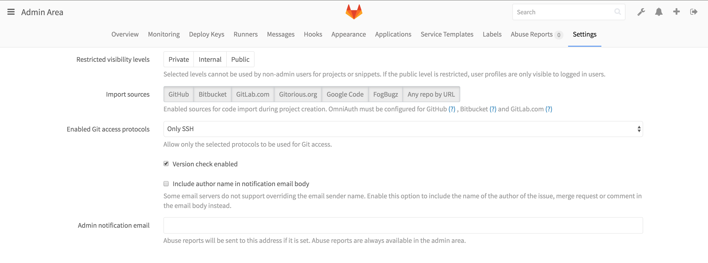
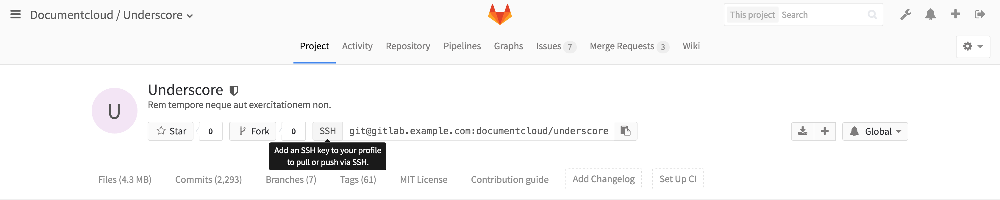
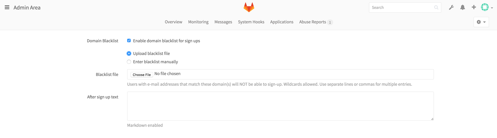

# Access Restrictions

> **Note:** These features are only available on versions 8.10 and above.

With GitLab's Access restrictions you can choose which Git access protocols you
want your users to use to communicate with GitLab. This feature can be enabled
via the `Application Settings` in the Admin interface.

The setting is called `Enabled Git access protocols`, and it gives you the option
to choose between:

- Both SSH and HTTP(S)
- Only SSH
- Only HTTP(s)

## Enabled Protocol

When both SSH and HTTP(S) are enabled, GitLab will behave as usual, it will give
your users the option to choose which protocol they would like to use.

When you choose to allow only one of the protocols, a couple of things will happen:

- The project page will only show the allowed protocol's URL, with no option to
  change it.
- A tooltip will be shown when you hover over the URL's protocol, if an action
  on the user's part is required, e.g. adding an SSH key, or setting a password.

On top of these UI restrictions, GitLab will deny all Git actions on the protocol
not selected.

> **Note:** Please keep in mind that disabling an access protocol does not actually
  block access to the server itself. The ports used for the protocol, be it SSH or
  HTTP, will still be accessible. What GitLab does is restrict access on the
  application level.

## Blacklist email domains

With this feature enabled, you can block email addresses of a specific domain
from creating an account on your GitLab server. This is particularly useful to
prevent spam. Disposable email addresses are usually used by malicious users to
create dummy accounts and spam issues.

This feature can be activated via the `Application Settings` in the Admin area,
and you have the option of entering the list manually, or uploading a file with
the list.

The blacklist accepts wildcards, so you can use `*.test.com` to block every
`test.com` subdomain, or `*.io` to block all domains ending in `.io`. Domains
should be separated by a whitespace, semicolon, comma, or a new line.

