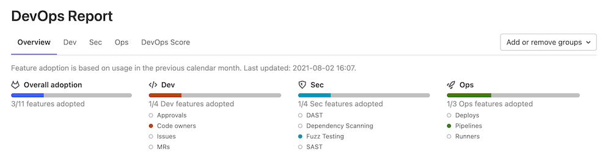

# DevOps Reports

DETAILS:
**Tier:** Free, Premium, Ultimate
**Offering:** Self-managed

DevOps Reports give you an overview of your entire instance's adoption of
[DevOps](https://about.gitlab.com/topics/devops/)
from planning to monitoring.

To see DevOps Reports:

1. On the left sidebar, at the bottom, select **Admin Area**.
1. Select **Analytics > DevOps Reports**.

## DevOps Score

> - [Renamed](https://gitlab.com/gitlab-org/gitlab/-/issues/20976) from Conversational Development Index in GitLab 12.6.

NOTE:
To see the DevOps score, you must activate your GitLab instance's [Service Ping](../settings/usage_statistics.md#service-ping). DevOps Score is a comparative tool, so your score data must be centrally processed by GitLab Inc. first.

You can use the DevOps score to compare your DevOps status to other organizations.

The DevOps Score tab displays usage of major GitLab features on your instance over
the last 30 days, averaged over the number of billable users in that time period.
You can also see the Leader usage score, calculated from top-performing instances based on
[Service Ping data](../settings/usage_statistics.md#service-ping) that GitLab has collected.
Your score is compared to the lead score of each feature and then expressed
as a percentage at the bottom of said feature. Your overall **DevOps Score** is an average of your
feature scores.

Service Ping data is aggregated on GitLab servers for analysis. Your usage
information is **not sent** to any other GitLab instances.
If you have just started using GitLab, it might take a few weeks for data to be collected before this
feature is available.

## DevOps Adoption

DETAILS:
**Tier:** Ultimate
**Offering:** Self-managed

> - [Introduced](https://gitlab.com/gitlab-org/gitlab/-/issues/247112) in GitLab 13.7 as a [Beta feature](../../policy/experiment-beta-support.md#beta).
> - The Overview tab [introduced](https://gitlab.com/gitlab-org/gitlab/-/issues/330401) in GitLab 14.1.
> - DAST and SAST metrics [added](https://gitlab.com/gitlab-org/gitlab/-/issues/328033) in GitLab 14.1.
> - Fuzz Testing metrics [added](https://gitlab.com/gitlab-org/gitlab/-/issues/330398) in GitLab 14.2.
> - Dependency Scanning metrics [added](https://gitlab.com/gitlab-org/gitlab/-/issues/328034) in GitLab 14.2.
> - Multi-select [added](https://gitlab.com/gitlab-org/gitlab/-/issues/333586) in GitLab 14.2.
> - Overview table [added](https://gitlab.com/gitlab-org/gitlab/-/issues/335638) in GitLab 14.3.

DevOps Adoption shows feature adoption for development, security, and operations.

| Category    | Feature |
|-------------|---------|
| Development | Approvals Code owners Issues Merge requests |
| Security    | DAST Dependency Scanning Fuzz Testing SAST |
| Operations  | Deployments Pipelines Runners |

You can use Group DevOps Adoption to:

- Identify specific subgroups that are lagging in their adoption of GitLab features, so you can guide them on
  their DevOps journey.
- Find subgroups that have adopted certain features, and provide guidance to other subgroups on
  how to use those features.
- Verify if you are getting the return on investment that you expected from GitLab.

## Add or remove a group

To add or remove a subgroup from the DevOps Adoption report:

1. Select **Add or remove groups**.
1. Select the subgroup you want to add or remove and select **Save changes**.

