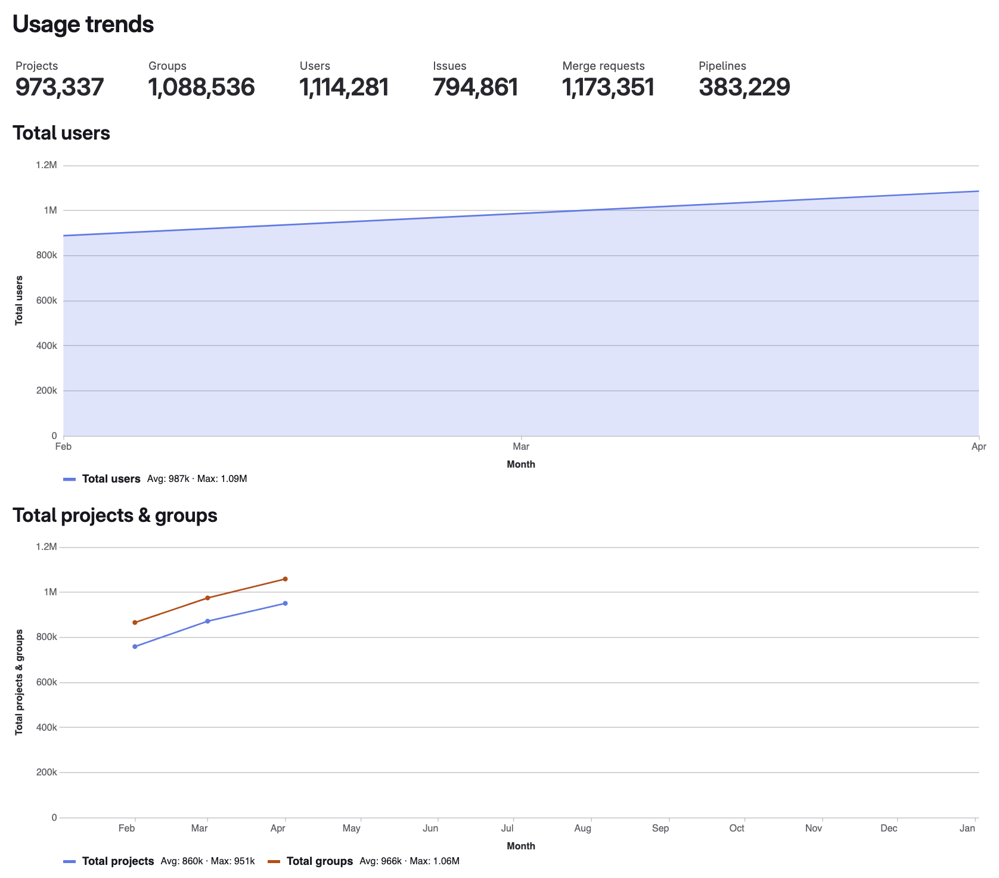

DETAILS:
**Tier:** Free, Premium, Ultimate
**Offering:** GitLab Self-Managed, GitLab Dedicated

Usage trends give you an overview of how much data your instance contains, and how quickly this volume is changing over time.

The usage trends page displays:

- An overview of the total numbers of:
  - Projects
  - Groups
  - Users
  - Issues
  - Merge requests
  - Pipelines
- Line charts with monthly values for one year for:
  - Projects and groups
  - Pipelines
  - Issues and merge requests

Usage trends data refreshes daily.

## View usage trends

To view usage trends:

1. On the left sidebar, at the bottom, select **Admin**.
1. Select **Analytics > Usage trends**.
