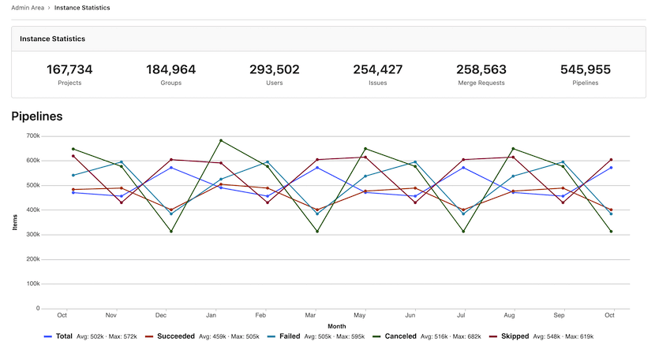

# Usage Trends

DETAILS:
**Tier:** Free, Premium, Ultimate
**Offering:** GitLab.com, Self-managed

Usage Trends gives you an overview of how much data your instance contains, and how quickly this volume is changing over time.
Usage Trends data refreshes daily.

## View Usage Trends

To view Usage Trends:

1. On the left sidebar, at the bottom, select **Admin Area**.
1. Select **Analytics > Usage Trends**.

## Total counts

At the top of the page, Usage Trends shows total counts for:

- Users
- Projects
- Groups
- Issues
- Merge requests
- Pipelines

These figures can be useful for understanding how much data your instance contains in total.

## Past year trend charts

Usage Trends also displays line charts that show total counts per month, over the past 12 months,
in the categories shown in [Total counts](#total-counts).

These charts help you visualize how rapidly these records are being created on your instance.

