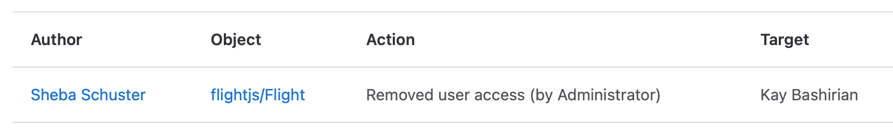

In addition to [audit events](../user/compliance/audit_events.md), as an administrator, you can access additional
features.

## Instance audit events

DETAILS:
**Tier:** Premium, Ultimate
**Offering:** GitLab Self-Managed

You can view audit events from user actions across an entire GitLab instance.
To view instance audit events:

1. On the left sidebar, at the bottom, select **Admin**.
1. Select **Monitoring > Audit events**.
1. Filter by the following:
   - Member of the project (user) who performed the action
   - Group
   - Project
   - Date Range

Instance audit events can also be accessed using the [instance audit events API](../api/audit_events.md#instance-audit-events). Instance audit event queries are limited to a maximum of 30 days.

## Exporting audit events

DETAILS:
**Tier:** Premium, Ultimate
**Offering:** GitLab Self-Managed

> - Entity type `Gitlab::Audit::InstanceScope` for instance audit events [introduced](https://gitlab.com/gitlab-org/gitlab/-/issues/418185) in GitLab 16.2.

You can export the current view (including filters) of your instance audit events as a
CSV(comma-separated values) file. To export the instance audit events to CSV:

1. On the left sidebar, at the bottom, select **Admin**.
1. Select **Monitoring > Audit events**.
1. Select the available search filters.
1. Select **Export as CSV**.

A download confirmation dialog then appears for you to download the CSV file. The exported CSV is limited
to a maximum of 100000 events. The remaining records are truncated when this limit is reached.

### Audit event CSV encoding

The exported CSV file is encoded as follows:

- `,` is used as the column delimiter
- `"` is used to quote fields if necessary.
- `\n` is used to separate rows.

The first row contains the headers, which are listed in the following table along
with a description of the values:

| Column                | Description                                                                        |
| --------------------- | ---------------------------------------------------------------------------------- |
| **ID**                | Audit event `id`.                                                                  |
| **Author ID**         | ID of the author.                                                                  |
| **Author Name**       | Full name of the author.                                                           |
| **Entity ID**         | ID of the scope.                                                                   |
| **Entity Type**       | Type of the scope (`Project`, `Group`, `User`, or `Gitlab::Audit::InstanceScope`). |
| **Entity Path**       | Path of the scope.                                                                 |
| **Target ID**         | ID of the target.                                                                  |
| **Target Type**       | Type of the target.                                                                |
| **Target Details**    | Details of the target.                                                             |
| **Action**            | Description of the action.                                                         |
| **IP Address**        | IP address of the author who performed the action.                                 |
| **Created At (UTC)**  | Formatted as `YYYY-MM-DD HH:MM:SS`.                                                |

All items are sorted by `created_at` in ascending order.

## User impersonation

DETAILS:
**Tier:** Premium, Ultimate
**Offering:** GitLab Self-Managed

When a user is [impersonated](admin_area.md#user-impersonation), their actions are logged as audit events with the following additional details:

- Audit events include information about the impersonating administrator.
- Extra audit events are recorded for the start and end of the administrator's impersonation session.

## Time zones

For information on timezones and audit events, see [Time zones](../user/compliance/audit_events.md#time-zones).

## Contribute to audit events

For information on contributing to audit events, see
[Contribute to audit events](../user/compliance/audit_events.md#contribute-to-audit-events).
