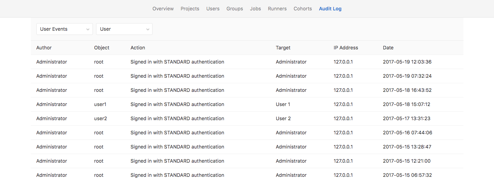

# Audit Events **[STARTER ONLY]**

GitLab Enterprise Edition offers a way to view the changes made within the
GitLab server as a help to system administrators.

GitLab system administrators can also take advantage of the logs located on the
filesystem, see [the logs system documentation](logs.md) for more details.

## Overview

**Audit Events** is a tool for GitLab Enterprise Edition administrators to be
able to track important events such as who performed certain actions and the
time they happened. These actions could be, for example, change a user
permission level, who added a new user, or who removed a user.

## Use-cases

- Check who was the person who changed the permission level of a particular
  user for a project in your GitLab EE instance.
- Use it to track which users have access to a certain group of projects
  in your GitLab instance, and who gave them that permission level.

## List of events

There are two kinds of events logged:

- Events scoped to the group or project, used by group / project managers
  to loop up who made what change
- Events scoped to the whole GitLab instance, used by your Compliance team to
  perform formal audits

### Group events

NOTE: **Note:**
You need Owner [permissions] to view the group Audit Events page.

To view a group's audit events, navigate to **Group > Settings > Audit Events**.
From there, you can see the following actions:

- Group created/deleted
- Group changed visibility
- User was added to group and with which [permissions]
- Permissions changes of a user assigned to a group
- Removed user from group
- Project added to group and with which visibility level
- Project removed from group
- [Project shared with group](../user/project/members/share_project_with_groups.md)
  and with which [permissions]
- Removal of a previously shared group with a project

### Project events

NOTE: **Note:**
You need Master [permissions] or higher to view the project Audit Events page.

To view a project's audit events, navigate to **Project > Settings > Audit Events**.
From there, you can see the following actions:

- Added/removed deploy keys
- Project created/deleted/renamed/moved(transferred)/changed path
- Project changed visibility level
- User was added to project and with which [permissions]
- Permission changes of a user assigned to a project
- User was removed from project

### Instance events **[PREMIUM ONLY]**

> [Introduced][ee-2336] in [GitLab Premium][ee] 9.3.

Server-wide audit logging introduces the ability to observe user actions across
the entire instance of your GitLab server, making it easy to understand who
changed what and when for audit purposes.

To view the server-wide admin log, visit **Admin Area > Monitoring > Audit Log**.

In addition to the group and project events, the following user actions are also
recorded:

- Failed Logins
- Sign-in events and the authentication type (standard, LDAP, OmniAuth, etc.)
- Added SSH key
- Added/removed email
- Changed password
- Ask for password reset
- Grant OAuth access

It is possible to filter particular actions by choosing an audit data type from
the filter drop-down. You can further filter by specific group, project or user
(for authentication events).

[ee-2336]: https://gitlab.com/gitlab-org/gitlab-ee/issues/2336
[ee]: https://about.gitlab.com/products/
[permissions]: ../user/permissions.md
