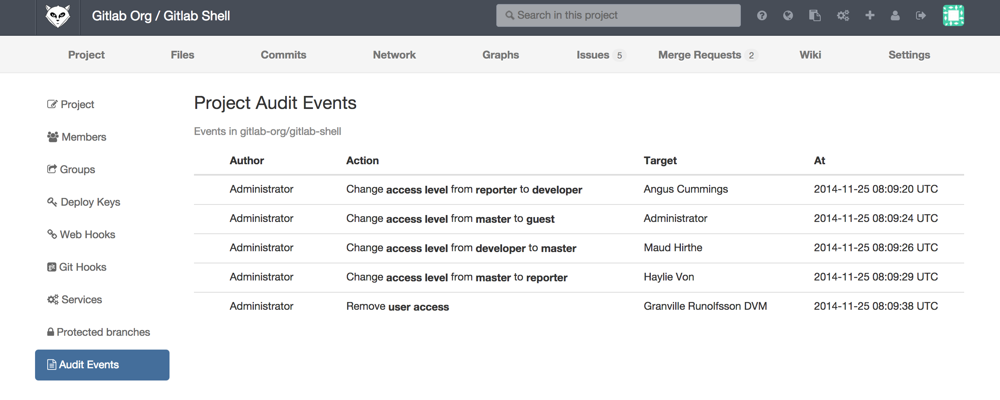
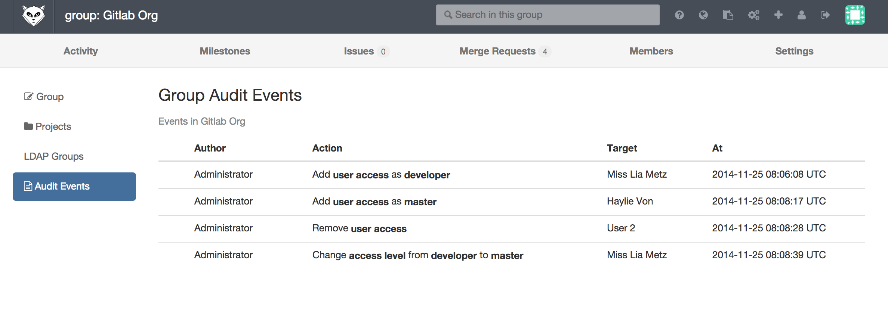

# Audit Events

GitLab Enterprise Edition offers a way to view the changes made within the GitLab server as a help to system administrators.

GitLab system administrators can also take advantage of the logs located on the filesystem, see [the logs system documentation](logs.md) for more details.

# Security Events

| Security Event                 | Description                                                                                      |
|--------------------------------|--------------------------------------------------------------------------------------------------|
| User added to group or project | Notes the author of the change, target user                                                      |
| User permission changed        | Notes the author of the change, original permission and new permission, target user              |

# Audit Events in Project

To view the Audit Events user needs to have enough permissions to view the project Settings page.

Navigate to Project->Settings->Audit Events to view the Audit Events:

# Audit Events in Group

To view the Audit Events user needs to have enough permissions to view the group Settings page.

Navigate to Group->Settings->Audit Events to view the Audit Events:

