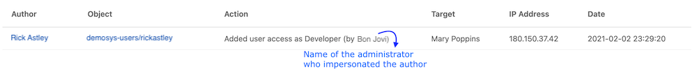
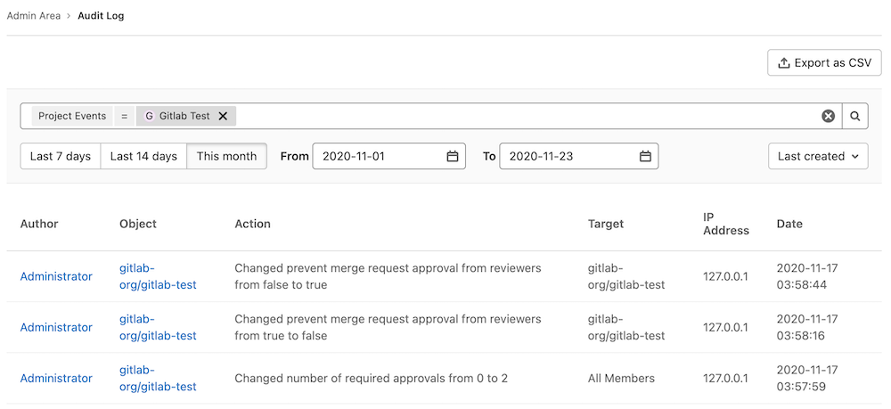

# Audit Events **(PREMIUM)**

GitLab offers a way to view the changes made within the GitLab server for owners and administrators
on a [paid plan](https://about.gitlab.com/pricing/).

GitLab system administrators can also take advantage of the logs located on the
file system. See [the logs system documentation](logs.md#audit_jsonlog) for more details.

You can generate an [Audit report](audit_reports.md) of audit events.

## Overview

**Audit Events** is a tool for GitLab owners and administrators
to track important events such as who performed certain actions and the
time they happened. For example, these actions could be a change to a user
permission level, who added a new user, or who removed a user.

## Use cases

- Check who changed the permission level of a particular
  user for a GitLab project.
- Track which users have access to a certain group of projects
  in GitLab, and who gave them that permission level.

## List of events

There are two kinds of events logged:

- Events scoped to the group or project, used by group and project managers
  to look up who made a change.
- Instance events scoped to the whole GitLab instance, used by your Compliance team to
  perform formal audits.

### Impersonation data

> [Introduced](https://gitlab.com/gitlab-org/gitlab/-/issues/536) in [GitLab Premium](https://about.gitlab.com/pricing/) 13.0.

When a user is being [impersonated](../user/admin_area/index.md#user-impersonation), their actions are logged as audit events as usual, with two additional details:

1. Usual audit events include information about the impersonating administrator. These are visible in their respective Audit Event pages depending on their type (Group/Project/User).
1. Extra audit events are recorded for the start and stop of the administrator's impersonation session. These are visible in the instance Audit Events.



### Group events **(PREMIUM)**

A user with:

- Owner role (or above) can retrieve group audit events of all users.
- Developer or Maintainer role is limited to group audit events based on their individual actions.

Group events do not include project audit events.

To view a group's audit events:

1. Go to the group.
1. On the left sidebar, select **Security & Compliance > Audit Events**.

From there, you can see the following actions:

- Group name or path changed.
- Group repository size limit changed.
- Group created or deleted.
- Group changed visibility.
- User was added to group and with which [permissions](../user/permissions.md).
- User sign-in via [Group SAML](../user/group/saml_sso/index.md).
- Permissions changes of a user assigned to a group.
- Removed user from group.
- Project repository imported into group.
- [Project shared with group](../user/project/members/share_project_with_groups.md)
  and with which [permissions](../user/permissions.md).
- Removal of a previously shared group with a project.
- LFS enabled or disabled.
- Shared runners minutes limit changed.
- Membership lock enabled or disabled.
- Request access enabled or disabled.
- 2FA enforcement or grace period changed.
- Roles allowed to create project changed.
- Group CI/CD variable added, removed, or protected status changed. [Introduced](https://gitlab.com/gitlab-org/gitlab/-/issues/30857) in GitLab 13.3.

Group events can also be accessed via the [Group Audit Events API](../api/audit_events.md#group-audit-events)

### Project events **(PREMIUM)**

A user with a Maintainer role (or above) can retrieve project audit events of all users.
A user with a Developer role is limited to project audit events based on their individual actions.

To view a project's audit events:

1. Go to the project.
1. On the left sidebar, select **Security & Compliance > Audit Events**.

From there, you can see the following actions:

- Added or removed deploy keys
- Project created, deleted, renamed, moved (transferred), changed path
- Project changed visibility level
- User was added to project and with which [permissions](../user/permissions.md)
- Permission changes of a user assigned to a project
- User was removed from project
- Project export was downloaded
- Project repository was downloaded
- Project was archived
- Project was unarchived
- Added, removed, or updated protected branches
- Release was added to a project
- Release was updated
- Release milestone associations changed
- Permission to approve merge requests by committers was updated ([introduced](https://gitlab.com/gitlab-org/gitlab/-/issues/7531) in GitLab 12.9)
- Permission to approve merge requests by authors was updated ([introduced](https://gitlab.com/gitlab-org/gitlab/-/issues/7531) in GitLab 12.9)
- Number of required approvals was updated ([introduced](https://gitlab.com/gitlab-org/gitlab/-/issues/7531) in GitLab 12.9)
- Added or removed users and groups from project approval groups ([introduced](https://gitlab.com/gitlab-org/gitlab/-/issues/213603) in GitLab 13.2)
- Project CI/CD variable added, removed, or protected status changed ([Introduced](https://gitlab.com/gitlab-org/gitlab/-/issues/30857) in GitLab 13.4)
- Project access token was successfully created or revoked ([Introduced](https://gitlab.com/gitlab-org/gitlab/-/issues/230007) in GitLab 13.9)
- Failed attempt to create or revoke a project access token ([Introduced](https://gitlab.com/gitlab-org/gitlab/-/issues/230007) in GitLab 13.9)
- When default branch changes for a project ([Introduced](https://gitlab.com/gitlab-org/gitlab/-/issues/52339) in GitLab 13.9)
- Created, updated, or deleted DAST profiles, DAST scanner profiles, and DAST site profiles
  ([Introduced](https://gitlab.com/gitlab-org/gitlab/-/issues/217872) in GitLab 14.1)
- Changed a project's compliance framework ([Introduced](https://gitlab.com/gitlab-org/gitlab/-/issues/329362) in GitLab 14.1)

Project events can also be accessed via the [Project Audit Events API](../api/audit_events.md#project-audit-events).

Project event queries are limited to a maximum of 30 days.

### Instance events **(PREMIUM SELF)**

> [Introduced](https://gitlab.com/gitlab-org/gitlab/-/issues/2336) in [GitLab Premium](https://about.gitlab.com/pricing/) 9.3.

Server-wide audit events introduce the ability to observe user actions across
the entire instance of your GitLab server, making it easy to understand who
changed what and when for audit purposes.

Instance events do not include group or project audit events.

To view the server-wide audit events:

1. On the top bar, select **Menu >** **{admin}** **Admin**.
1. On the left sidebar, select **Monitoring > Audit Events**.

The following user actions are recorded:

- Sign-in events and the authentication type (such as standard, LDAP, or OmniAuth)
- Failed sign-ins
- Added SSH key
- Added or removed email
- Changed password
- Ask for password reset
- Grant OAuth access
- Started or stopped user impersonation
- Changed username ([introduced](https://gitlab.com/gitlab-org/gitlab/-/issues/7797) in GitLab 12.8)
- User was deleted ([introduced](https://gitlab.com/gitlab-org/gitlab/-/issues/251) in GitLab 12.8)
- User was added ([introduced](https://gitlab.com/gitlab-org/gitlab/-/issues/251) in GitLab 12.8)
- User requests access to an instance ([introduced](https://gitlab.com/gitlab-org/gitlab/-/issues/298783) in GitLab 13.9)
- User was approved via Admin Area ([introduced](https://gitlab.com/gitlab-org/gitlab/-/issues/276250) in GitLab 13.6)
- User was rejected via Admin Area ([introduced](https://gitlab.com/gitlab-org/gitlab/-/issues/298783) in GitLab 13.9)
- User was blocked via Admin Area ([introduced](https://gitlab.com/gitlab-org/gitlab/-/issues/251) in GitLab 12.8)
- User was blocked via API ([introduced](https://gitlab.com/gitlab-org/gitlab/-/merge_requests/25872) in GitLab 12.9)
- Failed second-factor authentication attempt ([introduced](https://gitlab.com/gitlab-org/gitlab/-/issues/16826) in GitLab 13.5)
- A user's personal access token was successfully created or revoked ([introduced](https://gitlab.com/gitlab-org/gitlab/-/issues/276921) in GitLab 13.6)
- A failed attempt to create or revoke a user's personal access token ([introduced](https://gitlab.com/gitlab-org/gitlab/-/issues/276921) in GitLab 13.6)
- Administrator added or removed ([introduced](https://gitlab.com/gitlab-org/gitlab/-/issues/323905) in GitLab 14.1)
- Removed SSH key ([introduced](https://gitlab.com/gitlab-org/gitlab/-/issues/220127) in GitLab 14.1)

Instance events can also be accessed via the [Instance Audit Events API](../api/audit_events.md#instance-audit-events).

### Sign-in events **(FREE)**

Successful sign-in events are the only Audit Events available at all tiers. To see
successful sign-in events:

1. Select your avatar.
1. Select **Edit profile > Authentication log**.

After upgrading from GitLab Free to a paid tier, successful sign-in events are the only Audit
Events visible in Audit Events views until more events are logged.

### Missing events

Some events are not tracked in Audit Events. See the following
epics for more detail on which events are not being tracked, and our progress
on adding these events into GitLab:

- [Project settings and activity](https://gitlab.com/groups/gitlab-org/-/epics/474)
- [Group settings and activity](https://gitlab.com/groups/gitlab-org/-/epics/475)
- [Instance-level settings and activity](https://gitlab.com/groups/gitlab-org/-/epics/476)

Don't see the event you want in any of the epics linked above? You can use the **Audit Event
Proposal** issue template to
[create an issue](https://gitlab.com/gitlab-org/gitlab/-/issues/new?issuable_template=Audit%20Event%20Proposal)
to request it, or you can [add it yourself](../development/audit_event_guide/).

### Disabled events

#### Repository push

The current architecture of audit events is not prepared to receive a very high amount of records.
It may make the user interface for your project or audit events very busy, and the disk space consumed by the
`audit_events` PostgreSQL table may increase considerably. It's disabled by default
to prevent performance degradations on GitLab instances with very high Git write traffic.

In an upcoming release, Audit Events for Git push events are planned to be enabled
by default. Follow our [Partitioning strategy for Audit Events epic](https://gitlab.com/groups/gitlab-org/-/epics/3206) for updates.

If you still wish to enable **Repository push** events in your instance, follow
the steps below.

**In Omnibus installations:**

1. Enter the Rails console:

   ```shell
   sudo gitlab-rails console
   ```

1. Flip the switch and enable the feature flag:

   ```ruby
   Feature.enable(:repository_push_audit_event)
   ```

## Search

The search filters you can see depends on which audit level you are at.

| Filter | Available options |
| ------ | ----------------- |
| Scope (Project level) | A specific user who performed the action. |
| Scope (Group level) | A specific user (in a group) who performed the action. |
| Scope (Instance level) | A specific group, project, or user that the action was scoped to. |
| Date range | Either via the date range buttons or pickers (maximum range of 31 days). Default is from the first day of the month to today's date. |



## Export to CSV **(PREMIUM SELF)**

> - [Introduced](https://gitlab.com/gitlab-org/gitlab/-/issues/1449) in [GitLab Premium](https://about.gitlab.com/pricing/) 13.4.
> - [Feature flag removed](https://gitlab.com/gitlab-org/gitlab/-/issues/285441) in [GitLab Premium](https://about.gitlab.com/pricing/) 13.7.

Export to CSV allows customers to export the current filter view of your audit events as a
CSV file, which stores tabular data in plain text. The data provides a comprehensive view with respect to
audit events.

To export the Audit Events to CSV:

1. On the top bar, select **Menu >** **{admin}** **Admin**.
1. On the left sidebar, select **Monitoring > Audit Events**.
1. Select the available search [filters](#search).
1. Select **Export as CSV**.

### Sort

Exported events are always sorted by `created_at` in ascending order.

### Format

Data is encoded with a comma as the column delimiter, with `"` used to quote fields if needed, and newlines to separate rows.
The first row contains the headers, which are listed in the following table along with a description of the values:

| Column  | Description |
|---------|-------------|
| ID | Audit event `id` |
| Author ID | ID of the author |
| Author Name | Full name of the author |
| Entity ID | ID of the scope |
| Entity Type | Type of the scope (`Project`/`Group`/`User`) |
| Entity Path | Path of the scope |
| Target ID | ID of the target |
| Target Type | Type of the target |
| Target Details | Details of the target |
| Action | Description of the action |
| IP Address | IP address of the author who performed the action |
| Created At (UTC) | Formatted as `YYYY-MM-DD HH:MM:SS` |

### Limitation

The Audit Events CSV file is limited to a maximum of `100,000` events.
The remaining records are truncated when this limit is reached.
