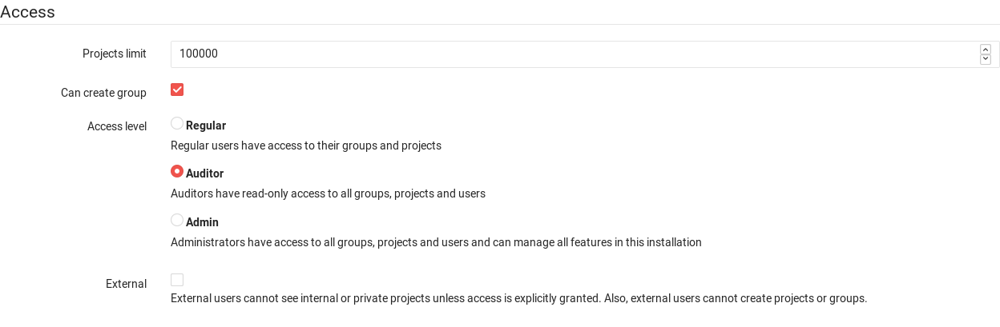

# Auditor users **(PREMIUM ONLY)**

>[Introduced][ee-998] in [GitLab Premium][eep] 8.17.

Auditor users are given read-only access to all projects, groups, and other
resources on the GitLab instance.

## Overview

Auditor users can have full access to their own resources (projects, groups,
snippets, etc.), and read-only access to **all** other resources, except the
Admin Area. To put another way, they are just regular users (who can be added
to projects, create personal snippets, create milestones on their groups, etc.)
who also happen to have read-only access to all projects on the system that
they haven't been explicitly [given access][permissions] to.

The Auditor role is _not_ a read-only version of the Admin role. Auditor users
will not be able to access the project/group settings pages, or the Admin Area.

To sum up, assuming you have logged-in as an Auditor user:

- For a project the Auditor is not member of, the Auditor should have
  read-only access. If the project is public or internal, they would have the
  same access as the users that are not members of that project/group.
- For a project the Auditor owns, the Auditor should have full access to
  everything.
- For a project the Auditor has been added to as a member, the Auditor should
  have the same access as the [permissions] they were given to. For example, if
  they were added as a Developer, they could then push commits or comment on
  issues.
- The Auditor cannot view the Admin Area, or perform any admin actions.

For more information about what an Auditor can or can't do, see the
[Permissions and restrictions of an Auditor user](#permissions-and-restrictions-of-an-auditor-user)
section.

## Use cases

1. Your compliance department wants to run tests against the entire GitLab base
   to ensure users are complying with password, credit card, and other sensitive
   data policies. With Auditor users, this can be achieved very easily without
   resulting to tactics like giving a user admin rights or having to use the API
   to add them to all projects.
1. If particular users need visibility or access to most of all projects in
   your GitLab instance, instead of manually adding the user to all projects,
   you can simply create an Auditor user and share the credentials with those
   that you want to grant access to.

## Adding an Auditor user

1. Create a new user or edit an existing one by navigating to
   **Admin Area > Users**. You will find the option of the access level under
   the 'Access' section.

   

1. Click **Save changes** or **Create user** for the changes to take effect.

To revoke the Auditor permissions from a user, simply make them a Regular user
following the same steps as above.

## Permissions and restrictions of an Auditor user

An Auditor user should be able to access all projects and groups of a GitLab
instance, with the following permissions/restrictions:

- Has read-only access to the API
- Can access projects that are:
  - Private
  - Public
  - Internal
- Can read all files in a repository
- Can read issues / MRs
- Can read project snippets
- Cannot be Admin and Auditor at the same time
- Cannot access the Admin Area
- In a group / project they're not a member of:
  - Cannot access project settings
  - Cannot access group settings
  - Cannot commit to repository
  - Cannot create / comment on issues / MRs
  - Cannot create/modify files from the Web UI
  - Cannot merge a merge request
  - Cannot create project snippets

[ee-998]: https://gitlab.com/gitlab-org/gitlab/merge_requests/998
[eep]: https://about.gitlab.com/pricing/
[permissions]: ../user/permissions.md
