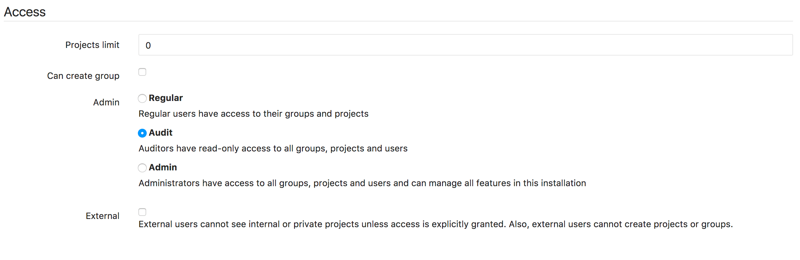

# Auditor Users

>**Note:** [Introduced][998] in GitLab 8.17.

With Gitlab Enterprise Edition Premium, you can create *auditor* users, who
are given read-only access to all projects, groups, and other resources on the
GitLab instance.

First and foremost, an auditor user can perform all the actions that a regular user can.
In projects that the auditor user owns, or has been added to, they can be added to
groups, mentioned in comments, or have issues assigned to them. The one exception is
that auditor users cannot _create_ projects or groups.

In addition, the auditor will be granted read-only access to all other projects/groups/etc.
on the GitLab instance.

The `auditor` role is _not_ a read-only version of the `admin` role. The auditor will not be
able to access the project settings pages, or the Admin Area.

A user's access level can be set to ‘Auditor’ in the Admin Area

[998]: https://gitlab.com/gitlab-org/gitlab-ee/merge_requests/998
