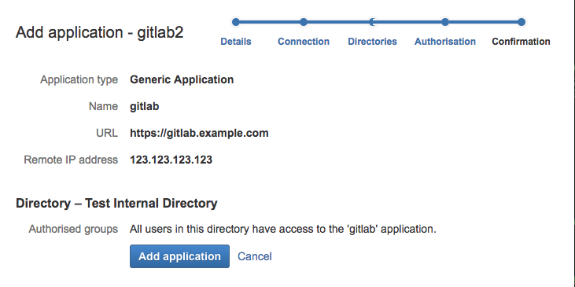
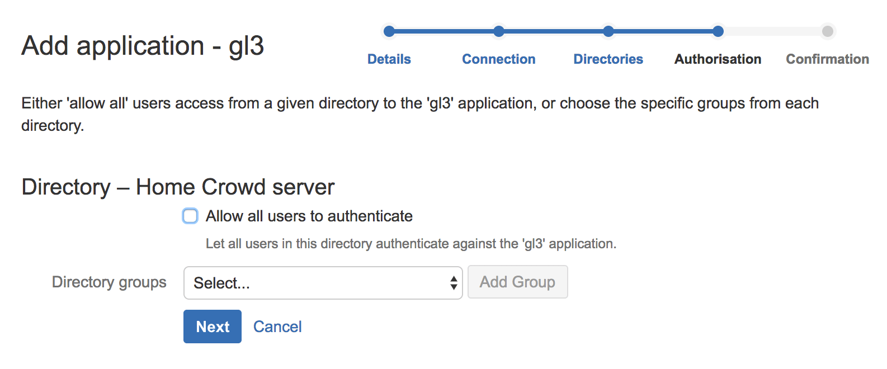

# Atlassian Crowd OmniAuth Provider

## Configure a new Crowd application

1. Choose 'Applications' in the top menu, then 'Add application'.
1. Go through the 'Add application' steps, entering the appropriate details.
   The screenshot below shows an example configuration.

    

## Configure GitLab

1. On your GitLab server, open the configuration file.

    **Omnibus:**

    ```sh
      sudo editor /etc/gitlab/gitlab.rb
    ```

    **Source:**

    ```sh
      cd /home/git/gitlab

      sudo -u git -H editor config/gitlab.yml
    ```

1. See [Initial OmniAuth Configuration](../../integration/omniauth.md#initial-omniauth-configuration)
   for initial settings.

1. Add the provider configuration:

    **Omnibus:**

    ```ruby
      gitlab_rails['omniauth_providers'] = [
        {
          "name" => "crowd",
          "args" => {
            "crowd_server_url" => "CROWD_SERVER_URL",
            "application_name" => "YOUR_APP_NAME",
            "application_password" => "YOUR_APP_PASSWORD"
          }
        }
      ]
    ```

    **Source:**

    ```
       - { name: 'crowd',
           args: {
             crowd_server_url: 'CROWD_SERVER_URL',
             application_name: 'YOUR_APP_NAME',
             application_password: 'YOUR_APP_PASSWORD' } }
    ```
1. Change `CROWD_SERVER_URL` to the URL of your Crowd server.
1. Change `YOUR_APP_NAME` to the application name from Crowd applications page.
1. Change `YOUR_APP_PASSWORD` to the application password you've set.
1. Save the configuration file.
1. [Reconfigure][] or [restart][] for the changes to take effect if you
   installed GitLab via Omnibus or from source respectively.

On the sign in page there should now be a Crowd tab in the sign in form.

[reconfigure]: ../restart_gitlab.md#omnibus-gitlab-reconfigure
[restart]: ../restart_gitlab.md#installations-from-source

## Troubleshooting

If you see an error message like the one below when you sign in after Crowd authentication is configured, you may want to consult the Crowd administrator for the Crowd log file to know the exact cause:

```
could not authorize you from Crowd because invalid credentials
```

Please make sure the Crowd users who need to login to GitLab are authorized to [the application](#configure-a-new-crowd-application) in the step of **Authorisation**. This could be verified by try "Authentication test" for Crowd as of 2.11.

