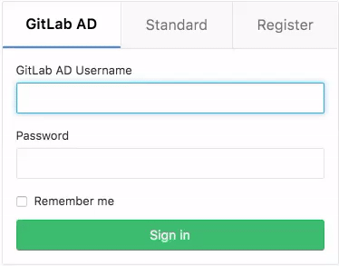

# How to configure LDAP with GitLab CE

## Introduction

Managing a large number of users in GitLab can become a burden for system administrators. As an organization grows so do user accounts. Keeping these user accounts in sync across multiple enterprise applications often becomes a time consuming task.

In this guide we will focus on configuring GitLab with Active Directory. [Active Directory](https://en.wikipedia.org/wiki/Active_Directory) is a popular LDAP compatible directory service provided by Microsoft, included in all modern Windows Server operating systems.

GitLab has supported LDAP integration since [version 2.2](https://about.gitlab.com/2012/02/22/gitlab-version-2-2/). With GitLab LDAP [group syncing](#group-syncing-ee) being added to GitLab Enterprise Edition in [version 6.0](https://about.gitlab.com/2013/08/20/gitlab-6-dot-0-released/). LDAP integration has become one of the most popular features in GitLab.

## Getting started

### Choosing an LDAP Server

The main reason organizations choose to utilize a LDAP server is to keep the entire organization's user base consolidated into a central repository. Users can access multiple applications and systems across the  IT environment using a single login. Because LDAP is an open, vendor-neutral, industry standard application protocol, the number of applications using LDAP authentication continues to increase.

There are many commercial and open source [directory servers](https://en.wikipedia.org/wiki/Directory_service#LDAP_implementations) that support the LDAP protocol. Deciding on the right directory server highly depends on the existing IT environment in which the server will be integrated with.

For example, [Active Directory](https://technet.microsoft.com/en-us/library/hh831484(v=ws.11).aspx) is generally favored in a primarily Windows environment, as this allows quick integration with existing services. Other popular directory services include:

- [Oracle Internet Directory](http://www.oracle.com/technetwork/middleware/id-mgmt/overview/index-082035.html)
- [OpenLDAP](http://www.openldap.org/)
- [389 Directory](http://directory.fedoraproject.org/)
- [OpenDJ](https://forgerock.org/opendj/)
- [ApacheDS](https://directory.apache.org/)

> GitLab uses the [Net::LDAP](https://rubygems.org/gems/net-ldap) library under the hood. This means it supports all [IETF](https://tools.ietf.org/html/rfc2251) compliant LDAPv3 servers.

### Active Directory (AD)

We won't cover the installation and configuration of Windows Server or Active Directory Domain Services in this tutorial. There are a number of resources online to guide you through this process:

- Install Windows Server 2012  - (_technet.microsoft.com_) - [Installing Windows Server 2012 ](https://technet.microsoft.com/en-us/library/jj134246(v=ws.11).aspx)

- Install Active Directory Domain Services (AD DS) (_technet.microsoft.com_)- [Install Active Directory Domain Services](https://technet.microsoft.com/windows-server-docs/identity/ad-ds/deploy/install-active-directory-domain-services--level-100-#BKMK_PS)

> **Shortcut:** You can quickly install AD DS via PowerShell using
`Install-WindowsFeature AD-Domain-Services -IncludeManagementTools`

### Creating an AD **OU** structure

Configuring organizational units (**OU**s) is an important part of setting up Active Directory. **OU**s form the base for an entire organizational structure. Using GitLab as an example we have designed the **OU** structure below using the geographic **OU** model. In the Geographic Model we separate **OU**s for different geographic regions.

| GitLab **OU** Design           |  GitLab AD Structure             |
| :----------------------------: | :------------------------------: |
| ![GitLab OU Design][gitlab_ou] |  ![GitLab AD Structure][ldap_ou] |

[gitlab_ou]: img/gitlab_ou.png
[ldap_ou]: img/ldap_ou.gif

Using PowerShell you can output the **OU** structure as a table (_all names are examples only_):

```ps
Get-ADObject -LDAPFilter "(objectClass=*)" -SearchBase 'OU=GitLab INT,DC=GitLab,DC=org' -Properties CanonicalName | Format-Table Name,CanonicalName -A
```

```
OU                CanonicalName
----              -------------
GitLab INT        GitLab.org/GitLab INT
United States     GitLab.org/GitLab INT/United States
Developers        GitLab.org/GitLab INT/United States/Developers
Gary Johnson      GitLab.org/GitLab INT/United States/Developers/Gary Johnson
Ellis Matthews    GitLab.org/GitLab INT/United States/Developers/Ellis Matthews
William Collins   GitLab.org/GitLab INT/United States/Developers/William Collins
People Ops        GitLab.org/GitLab INT/United States/People Ops
Margaret Baker    GitLab.org/GitLab INT/United States/People Ops/Margaret Baker
Libby Hartzler    GitLab.org/GitLab INT/United States/People Ops/Libby Hartzler
Victoria Ryles    GitLab.org/GitLab INT/United States/People Ops/Victoria Ryles
The Netherlands   GitLab.org/GitLab INT/The Netherlands
Developers        GitLab.org/GitLab INT/The Netherlands/Developers
John Doe          GitLab.org/GitLab INT/The Netherlands/Developers/John Doe
Jon Mealy         GitLab.org/GitLab INT/The Netherlands/Developers/Jon Mealy
Jane Weingarten   GitLab.org/GitLab INT/The Netherlands/Developers/Jane Weingarten
Production        GitLab.org/GitLab INT/The Netherlands/Production
Sarah Konopka     GitLab.org/GitLab INT/The Netherlands/Production/Sarah Konopka
Cynthia Bruno     GitLab.org/GitLab INT/The Netherlands/Production/Cynthia Bruno
David George      GitLab.org/GitLab INT/The Netherlands/Production/David George
United Kingdom    GitLab.org/GitLab INT/United Kingdom
Developers        GitLab.org/GitLab INT/United Kingdom/Developers
Leroy Fox         GitLab.org/GitLab INT/United Kingdom/Developers/Leroy Fox
Christopher Alley GitLab.org/GitLab INT/United Kingdom/Developers/Christopher Alley
Norris Morita     GitLab.org/GitLab INT/United Kingdom/Developers/Norris Morita
Support           GitLab.org/GitLab INT/United Kingdom/Support
Laura Stanley     GitLab.org/GitLab INT/United Kingdom/Support/Laura Stanley
Nikki Schuman     GitLab.org/GitLab INT/United Kingdom/Support/Nikki Schuman
Harriet Butcher   GitLab.org/GitLab INT/United Kingdom/Support/Harriet Butcher
Global Groups     GitLab.org/GitLab INT/Global Groups
DevelopersNL      GitLab.org/GitLab INT/Global Groups/DevelopersNL
DevelopersUK      GitLab.org/GitLab INT/Global Groups/DevelopersUK
DevelopersUS      GitLab.org/GitLab INT/Global Groups/DevelopersUS
ProductionNL      GitLab.org/GitLab INT/Global Groups/ProductionNL
SupportUK         GitLab.org/GitLab INT/Global Groups/SupportUK
People Ops US     GitLab.org/GitLab INT/Global Groups/People Ops US
Global Admins     GitLab.org/GitLab INT/Global Groups/Global Admins
```

> See [more information](https://technet.microsoft.com/en-us/library/ff730967.aspx) on searching Active Directory with Windows PowerShell from [The Scripting Guys](https://technet.microsoft.com/en-us/scriptcenter/dd901334.aspx)

## GitLab LDAP configuration

The initial configuration of LDAP in GitLab requires changes to the `gitlab.rb` configuration file. Below is an example of a complete configuration using an Active Directory.

The two Active Directory specific values are `active_directory: true` and `uid: 'sAMAccountName'`. `sAMAccountName` is an attribute returned by Active Directory used for GitLab usernames. See the example output from `ldapsearch` for a full list of attributes a "person" object (user) has in **AD** - [`ldapsearch` example](#using-ldapsearch-unix)

> Both group_base and admin_group configuration options are only available in GitLab Enterprise Edition. See [GitLab EE - LDAP Features](#gitlab-enterprise-edition---ldap-features)

### Example `gitlab.rb` LDAP

```
gitlab_rails['ldap_enabled'] = true
gitlab_rails['ldap_servers'] = {
'main' => {
  'label' => 'GitLab AD',
  'host' =>  'ad.example.org',
  'port' => 636,
  'uid' => 'sAMAccountName',
  'encryption' => 'simple_tls',
  'verify_certificates' => true,
  'bind_dn' => 'CN=GitLabSRV,CN=Users,DC=GitLab,DC=org',
  'password' => 'Password1',
  'active_directory' => true,
  'base' => 'OU=GitLab INT,DC=GitLab,DC=org',
  'group_base' => 'OU=Global Groups,OU=GitLab INT,DC=GitLab,DC=org',
  'admin_group' => 'Global Admins'
  }
}
```

> **Note:** Remember to run  `gitlab-ctl reconfigure` after modifying `gitlab.rb`

## Security improvements (LDAPS)

Security is an important aspect when deploying an LDAP server. By default, LDAP traffic is transmitted unsecured. LDAP can be secured using SSL/TLS called LDAPS, or commonly "LDAP over SSL".

Securing LDAP (enabling LDAPS) on Windows Server 2012 involves installing a valid SSL certificate. For full details see Microsoft's guide [How to enable LDAP over SSL with a third-party certification authority](https://support.microsoft.com/en-us/help/321051/how-to-enable-ldap-over-ssl-with-a-third-party-certification-authority)

> By default a LDAP service listens for connections on TCP and UDP port 389. LDAPS (LDAP over SSL) listens on port 636

### Testing you AD server

#### Using **AdFind** (Windows)

You can use the [`AdFind`](https://social.technet.microsoft.com/wiki/contents/articles/7535.adfind-command-examples.aspx) utility (on Windows based systems) to test that your LDAP server is accessible and authentication is working correctly. This is a freeware utility built by [Joe Richards](http://www.joeware.net/freetools/tools/adfind/index.htm).

**Return all objects**

You can use the filter `objectclass=*` to return all directory objects.

```sh
adfind -h ad.example.org:636 -ssl -u "CN=GitLabSRV,CN=Users,DC=GitLab,DC=org" -up Password1 -b "OU=GitLab INT,DC=GitLab,DC=org" -f (objectClass=*)
```

**Return single object using filter**

You can also retrieve a single object by **specifying** the object name or full **DN**. In this example we specify the object name only `CN=Leroy Fox`.

```sh
adfind -h ad.example.org:636 -ssl -u "CN=GitLabSRV,CN=Users,DC=GitLab,DC=org" -up Password1 -b "OU=GitLab INT,DC=GitLab,DC=org" -f (&(objectcategory=person)(CN=Leroy Fox))”
```

#### Using **ldapsearch** (Unix)

You can use the `ldapsearch` utility (on Unix based systems) to test that your LDAP server is accessible and authentication is working correctly. This utility is included in the [`ldap-utils`](https://wiki.debian.org/LDAP/LDAPUtils) package.

**Return all objects**

You can use the filter `objectclass=*` to return all directory objects.

```sh
ldapsearch -D "CN=GitLabSRV,CN=Users,DC=GitLab,DC=org" \
-w Password1 -p 636 -h ad.example.org \
-b "OU=GitLab INT,DC=GitLab,DC=org" -Z \
-s sub "(objectclass=*)"
```

**Return single object using filter**

You can also retrieve a single object by **specifying** the object name or full **DN**. In this example we specify the object name only `CN=Leroy Fox`.

```sh
ldapsearch -D "CN=GitLabSRV,CN=Users,DC=GitLab,DC=org" -w Password1 -p 389 -h ad.example.org -b "OU=GitLab INT,DC=GitLab,DC=org" -Z -s sub "CN=Leroy Fox"
```

**Full output of `ldapsearch` command:** - Filtering for _CN=Leroy Fox_

```
# LDAPv3
# base <OU=GitLab INT,DC=GitLab,DC=org> with scope subtree
# filter: CN=Leroy Fox
# requesting: ALL
#

# Leroy Fox, Developers, United Kingdom, GitLab INT, GitLab.org
dn: CN=Leroy Fox,OU=Developers,OU=United Kingdom,OU=GitLab INT,DC=GitLab,DC=or
 g
objectClass: top
objectClass: person
objectClass: organizationalPerson
objectClass: user
cn: Leroy Fox
sn: Fox
givenName: Leroy
distinguishedName: CN=Leroy Fox,OU=Developers,OU=United Kingdom,OU=GitLab INT,
 DC=GitLab,DC=org
instanceType: 4
whenCreated: 20170210030500.0Z
whenChanged: 20170213050128.0Z
displayName: Leroy Fox
uSNCreated: 16790
memberOf: CN=DevelopersUK,OU=Global Groups,OU=GitLab INT,DC=GitLab,DC=org
uSNChanged: 20812
name: Leroy Fox
objectGUID:: rBCAo6NR6E6vfSKgzcUILg==
userAccountControl: 512
badPwdCount: 0
codePage: 0
countryCode: 0
badPasswordTime: 0
lastLogoff: 0
lastLogon: 0
pwdLastSet: 131311695009850084
primaryGroupID: 513
objectSid:: AQUAAAAAAAUVAAAA9GMAb7tdJZvsATf7ZwQAAA==
accountExpires: 9223372036854775807
logonCount: 0
sAMAccountName: Leroyf
sAMAccountType: 805306368
userPrincipalName: Leroyf@GitLab.org
objectCategory: CN=Person,CN=Schema,CN=Configuration,DC=GitLab,DC=org
dSCorePropagationData: 16010101000000.0Z
lastLogonTimestamp: 131314356887754250

# search result
search: 2
result: 0 Success

# numResponses: 2
# numEntries: 1
```

## Basic user authentication

After configuring LDAP, basic authentication will be available. Users can then login using their directory credentials. An extra tab is added to the GitLab login screen for the configured LDAP server (e.g "**GitLab AD**").



Users that are removed from the LDAP base group (e.g `OU=GitLab INT,DC=GitLab,DC=org`) will be **blocked** in GitLab. [More information](../ldap.md#security) on LDAP security.

If `allow_username_or_email_login` is enabled in the LDAP configuration, GitLab will ignore everything after the first '@' in the LDAP username used on login. Example: The username `jon.doe@example.com` is converted to `jon.doe` when authenticating with the LDAP server. Disable this setting if you use `userPrincipalName` as the `uid`.

## LDAP extended features on GitLab EE

With [GitLab Enterprise Edition (EE)](https://about.gitlab.com/gitlab-ee/), besides everything we just described, you'll
have extended functionalities with LDAP, such as:

- Group sync
- Group permissions
- Updating user permissions
- Multiple LDAP servers

Read through the article on [LDAP for GitLab EE](https://docs.gitlab.com/ee/administration/auth/how_to_configure_ldap_gitlab_ee/) for an overview.
