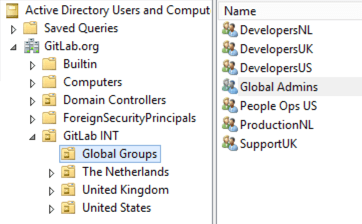
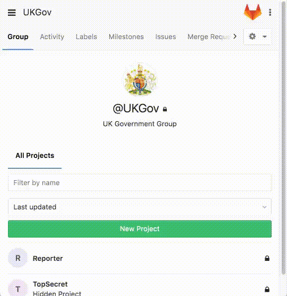
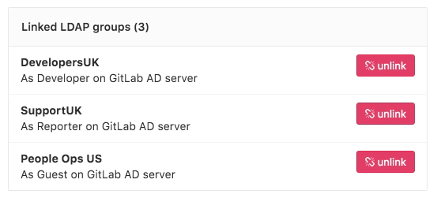
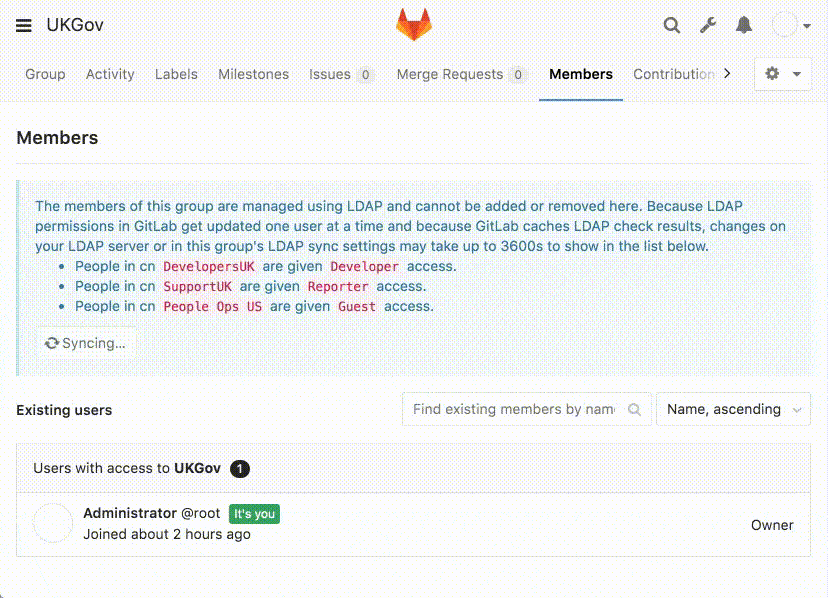

# How to configure LDAP with GitLab EE

## Introduction

The present article follows [How to Configure LDAP with GitLab CE](../how_to_configure_ldap_gitlab_ce/index.md). Make sure to read through it before moving forward.

## GitLab Enterprise Edition - LDAP features

[GitLab Enterprise Edition (EE)](https://about.gitlab.com/pricing/) has a number of advantages when it comes to integrating with Active Directory (LDAP):

- [Administrator Sync](#administrator-sync): As an extension of group sync, you can automatically manage your global GitLab administrators. Specify a group CN for `admin_group` and all members of the LDAP group will be given administrator privileges.
- [Group Sync](#group-sync): This allows GitLab group membership to be automatically updated based on LDAP group members.
- [Multiple LDAP servers](#multiple-ldap-servers): The ability to configure multiple LDAP servers. This is useful if an organization has different LDAP servers within departments. This is not designed for failover. We're working on [supporting LDAP failover](https://gitlab.com/gitlab-org/gitlab-ee/issues/139) in GitLab.

- Daily user synchronization: Once a day, GitLab will run a synchronization to check and update GitLab users against LDAP. This process updates all user details automatically.

On the following section, you'll find a description for each of these features. Read through [LDAP GitLab EE docs](../ldap-ee.md) for complementary information.



All members of the group `Global Admins` will be given **administrator** access to GitLab, allowing them to view the `/admin` dashboard.

### Group Sync

Group syncing allows AD (LDAP) groups to be mapped to GitLab groups. This provides more control over per-group user management. To configure group syncing edit the `group_base` **DN** (`'OU=Global Groups,OU=GitLab INT,DC=GitLab,DC=org'`). This **OU** contains all groups that will be associated with [GitLab groups](../../../user/group/index.md).

#### Creating group links - example

As an example, let's suppose we have a "UKGov" GitLab group, which deals with confidential government information. Therefore, it is important that users of this group are given the correct permissions to projects contained within the group. Granular group permissions can be applied based on the AD group.

**UK Developers** of our "UKGov" group are given **"developer"** permissions.

_The developer permission allows the development staff to effectively manage all project code, issues, and merge requests._

**UK Support** staff of our "UKGov" group are given **"reporter"** permissions.

_The reporter permission allows support staff to manage issues, labels, and review project code._

**US People Ops** of our "UKGov" group are given **"guest"** permissions.



> Guest permissions allows people ops staff to review and lodge new issues while allowing no read or write access to project code or [confidential issues](../../../user/project/issues/confidential_issues.md#permissions-and-access-to-confidential-issues) created by other users.

See the [permission list](../../user/permissions.md) for complementary info.

#### Group permissions - example

Considering the previous example, our staff will have
access to our GitLab instance with the following structure:



Using this permission structure in our example allows only UK staff access to sensitive information stored in the projects code, while still allowing other teams to work effectively. As all permissions are controlled via AD groups new users can be quickly added to existing groups. New group members will then automatically inherit the required permissions.

> [More information](../ldap-ee.md#group-sync) on group syncing.

### Updating user permissions - new feature

Since GitLab [v8.15](https://gitlab.com/gitlab-org/gitlab-ee/merge_requests/822) LDAP user permissions can now be manually overridden by an admin user. To override a user's permissions visit the groups **Members** page and select **Edit permissions**.



### Multiple LDAP servers

GitLab EE can support multiple LDAP servers. Simply configure another server in the `gitlab.rb` file within the `ldap_servers` block. In the example below we configure a new secondary server with the label **GitLab Secondary AD**. This is shown on the GitLab login screen. Large enterprises often utilize multiple LDAP servers for segregating organizational departments.


Considering the example illustrated on the image above,
our `gitlab.rb` configuration would look like:

```ruby
gitlab_rails['ldap_enabled'] = true
gitlab_rails['ldap_servers'] = {
'main' => {
  'label' => 'GitLab AD',
  'host' =>  'ad.example.org',
  'port' => 636,
  'uid' => 'sAMAccountName',
  'method' => 'ssl',
  'bind_dn' => 'CN=GitLabSRV,CN=Users,DC=GitLab,DC=org',
  'password' => 'Password1',
  'active_directory' => true,
  'base' => 'OU=GitLab INT,DC=GitLab,DC=org',
  'group_base' => 'OU=Global Groups,OU=GitLab INT,DC=GitLab,DC=org',
  'admin_group' => 'Global Admins'
  },

'secondary' => {
  'label' => 'GitLab Secondary AD',
  'host' =>  'ad-secondary.example.net',
  'port' => 636,
  'uid' => 'sAMAccountName',
  'method' => 'ssl',
  'bind_dn' => 'CN=GitLabSRV,CN=Users,DC=GitLab,DC=com',
  'password' => 'Password1',
  'active_directory' => true,
  'base' => 'OU=GitLab Secondary,DC=GitLab,DC=com',
  'group_base' => 'OU=Global Groups,OU=GitLab INT,DC=GitLab,DC=com',
  'admin_group' => 'Global Admins'
  }
}
```

## Conclusion

Integration of GitLab with Active Directory (LDAP) reduces the complexity of user management.
It has the advantage of improving user permission controls, whilst easing the deployment of GitLab into an existing [IT environment](https://www.techopedia.com/definition/29199/it-infrastructure). GitLab EE offers advanced group management and multiple LDAP servers.

With the assistance of the [GitLab Support](https://about.gitlab.com/support) team, setting up GitLab with an existing AD/LDAP solution will be a smooth and painless process.
