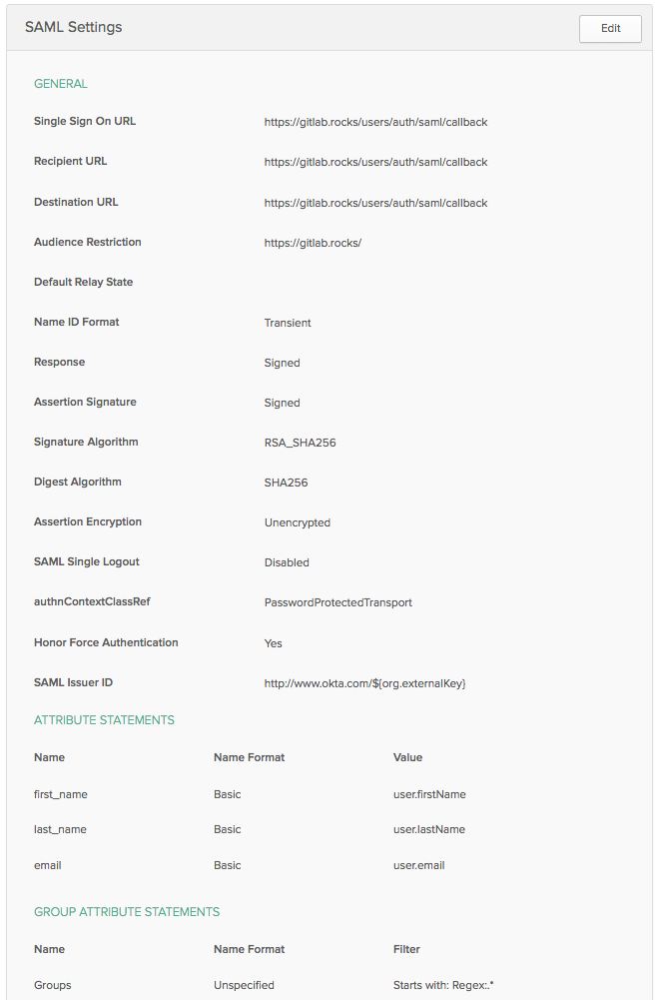
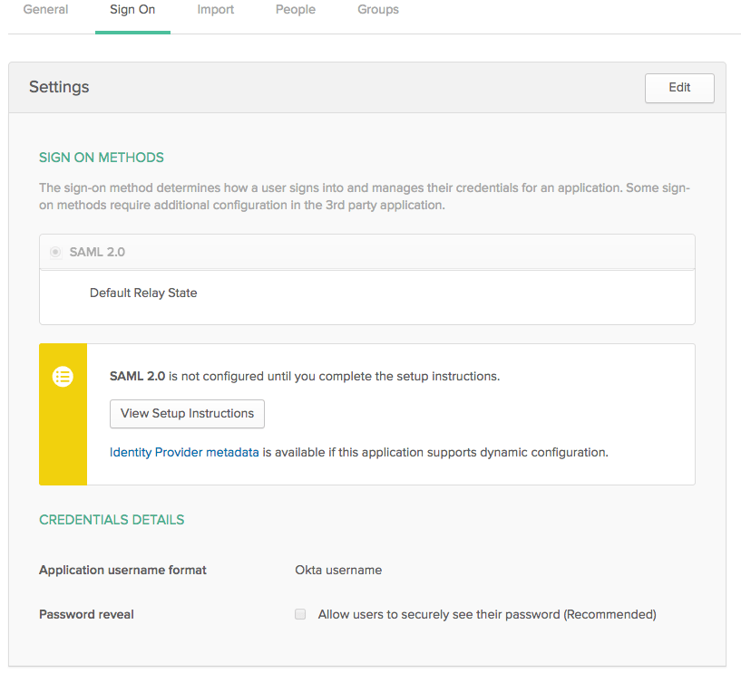

# Okta SSO provider

Okta is a [Single Sign-on provider][okta-sso] that can be used to authenticate
with GitLab.

The following documentation enables Okta as a SAML provider.

## Configure the Okta application

1. On Okta go to the admin section and choose to **Add an App**.
1. When the app screen comes up you see another button to **Create an App** and
   choose SAML 2.0 on the next screen.
1. Now, very important, add a logo
   (you can choose it from https://about.gitlab.com/press/). You'll have to
   crop and resize it.
1. Next, you'll need the to fill in the SAML general config. Here's an example
   image.

    

1. The last part of the configuration is the feedback section where you can
   just say you're a customer and creating an app for internal use.
1. When you have your app you'll have a few tabs on the top of the app's
   profile. Click on the SAML 2.0 config instructions button which should
   look like the following:

    

1. On the screen that comes up take note of the
   **Identity Provider Single Sign-On URL** which you'll use for the
   `idp_sso_target_url` on your GitLab config file.

1. **Before you leave Okta make sure you add your user and groups if any.**

---

Now that the Okta app is configured, it's time to enable it in GitLab.

## Configure GitLab

1.  On your GitLab server, open the configuration file:

    **For Omnibus GitLab installations**

    ```sh
    sudo editor /etc/gitlab/gitlab.rb
    ```

    **For installations from source**

    ```sh
    cd /home/git/gitlab
    sudo -u git -H editor config/gitlab.yml
    ```

1.  See [Initial OmniAuth Configuration](../../integration/omniauth.md#initial-omniauth-configuration)
    for initial settings.

1.  To allow your users to use Okta to sign up without having to manually create
    an account first, don't forget to add the following values to your
    configuration:

    **For Omnibus GitLab installations**

    ```ruby
    gitlab_rails['omniauth_allow_single_sign_on'] = ['saml']
    gitlab_rails['omniauth_block_auto_created_users'] = false
    ```

    **For installations from source**

    ```yaml
    allow_single_sign_on: ["saml"]
    block_auto_created_users: false
    ```

1.  You can also automatically link Okta users with existing GitLab users if
    their email addresses match by adding the following setting:

    **For Omnibus GitLab installations**

    ```ruby
    gitlab_rails['omniauth_auto_link_saml_user'] = true
    ```

    **For installations from source**

    ```yaml
    auto_link_saml_user: true
    ```

1.  Add the provider configuration.

      >**Notes:**
      >- Change the value for `assertion_consumer_service_url` to match the HTTPS endpoint
         of GitLab (append `users/auth/saml/callback` to the HTTPS URL of your GitLab
         installation to generate the correct value).
      >- To get the `idp_cert_fingerprint` fingerprint, first download the
         certificate from the Okta app you registered and then run:
         `openssl x509 -in okta.cert -noout -fingerprint`. Substitute `okta.cert`
         with the location of your certificate.
      >- Change the value of `idp_sso_target_url`, with the value of the
         **Identity Provider Single Sign-On URL** from the step when you
         configured the Okta app.
      >- Change the value of `issuer` to a unique name, which will identify the application
         to the IdP.
      >- Leave `name_identifier_format` as-is.

    **For Omnibus GitLab installations**

    ```ruby
    gitlab_rails['omniauth_providers'] = [
      {
        name: 'saml',
        args: {
                 assertion_consumer_service_url: 'https://gitlab.example.com/users/auth/saml/callback',
                 idp_cert_fingerprint: '43:51:43:a1:b5:fc:8b:b7:0a:3a:a9:b1:0f:66:73:a8',
                 idp_sso_target_url: 'https://gitlab.oktapreview.com/app/gitlabdev773716_gitlabsaml_1/exk8odl81tBrjpD4B0h7/sso/saml',
                 issuer: 'https://gitlab.example.com',
                 name_identifier_format: 'urn:oasis:names:tc:SAML:2.0:nameid-format:transient'
               },
        label: 'Okta' # optional label for SAML login button, defaults to "Saml"
      }
    ]
    ```

    **For installations from source**

    ```yaml
    - {
        name: 'saml',
        args: {
               assertion_consumer_service_url: 'https://gitlab.example.com/users/auth/saml/callback',
               idp_cert_fingerprint: '43:51:43:a1:b5:fc:8b:b7:0a:3a:a9:b1:0f:66:73:a8',
               idp_sso_target_url: 'https://gitlab.oktapreview.com/app/gitlabdev773716_gitlabsaml_1/exk8odl81tBrjpD4B0h7/sso/saml',
               issuer: 'https://gitlab.example.com',
               name_identifier_format: 'urn:oasis:names:tc:SAML:2.0:nameid-format:transient'
             },
        label: 'Okta' # optional label for SAML login button, defaults to "Saml"
      }
    ```


1. [Reconfigure][reconf] or [restart] GitLab for Omnibus and installations
   from source respectively for the changes to take effect.

You might want to try this out on an incognito browser window.

## Configuring groups

>**Note:**
Make sure the groups exist and are assigned to the Okta app.

You can take a look of the [SAML documentation][saml] on external groups since
it works the same.

[okta-sso]: https://www.okta.com/products/single-sign-on/
[saml]: ../../integration/saml.md#external-groups
[reconf]: ../restart_gitlab.md#omnibus-gitlab-reconfigure
[restart]: ../restart_gitlab.md#installations-from-source
