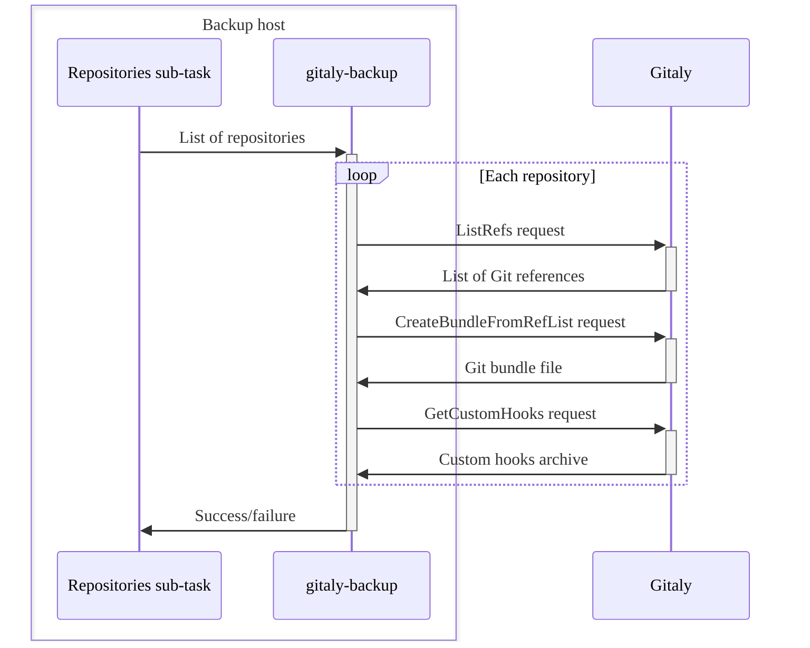
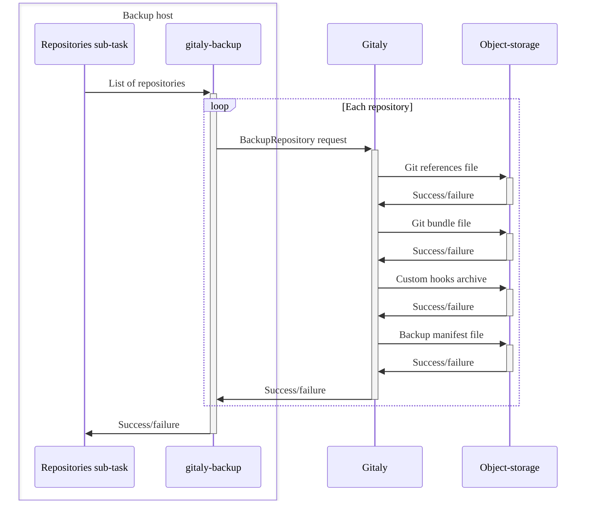

When you run the [backup command](backup_gitlab.md#backup-command), a backup script creates a backup archive file to store your GitLab data.

To create the archive file, the backup script:

1. Extracts the previous backup archive file, when you're doing an incremental backup.
1. Updates or generates the backup archive file.
1. Runs all backup sub-tasks to:
   - [Back up the database](#back-up-the-database).
   - [Back up Git repositories](#back-up-git-repositories).
   - [Back up files](#back-up-files).
1. Archives the backup staging area into a `tar` file.
1. Uploads the new backup archive to the object storage, if [configured](backup_gitlab.md#upload-backups-to-a-remote-cloud-storage).
1. Cleans up the archived [backup staging directory](#backup-staging-directory) files.

## Back up the database

To back up the database, the `db` sub-task:

1. Uses `pg_dump` to create an [SQL dump](https://www.postgresql.org/docs/14/backup-dump.html).
1. Pipes the output of `pg_dump` through `gzip` and creates a compressed SQL file.
1. Saves the file to the [backup staging directory](#backup-staging-directory).

## Back up Git repositories

To back up Git repositories, the `repositories` sub-task:

1. Informs `gitaly-backup` which repositories to back up.
1. Runs `gitaly-backup` to:

   - Call a series of Remote Procedure Calls (RPCs) on Gitaly.
   - Collect the backup data for each repository.

1. Streams the collected data into a directory structure in the [backup staging directory](#backup-staging-directory).

The following diagram illustrates the process:



Gitaly Cluster configured storages are backed up in the same way as standalone Gitaly instances.

- When Gitaly Cluster receives the RPC calls from `gitaly-backup`, it rebuilds its own database.
  - There is no need to backup the Gitaly Cluster database separately.
- Each repository is backed up only once, regardless of the replication factor, because backups operate through RPCs.

### Server-side backups

Server-side repository backups are an efficient way to back up Git repositories.
The advantages of this method are:

- Data is not transmitted through RPCs from Gitaly.
- Server-side backups require less network transfer.
- Disk storage on the machine running the backup Rake task is not required.

To back up Gitaly on the server-side, the `repositories` sub-task:

1. Runs `gitaly-backup` to make a single RPC call for each repository.
1. Triggers the Gitaly node storing the physical repository to upload backup data to object storage.
1. Links the backups stored on object storage to the created backup archive using a [backup ID](#backup-id).

The following diagram illustrates the process:



## Back up files

The following sub-tasks back up files:

- `uploads`: Attachments
- `builds`: CI/CD job output logs
- `artifacts`: CI/CD job artifacts
- `pages`: Page content
- `lfs`: LFS objects
- `terraform_state`: Terraform states
- `registry`: Container registry images
- `packages`: Packages
- `ci_secure_files`: Project-level secure files
- `external_diffs`: Merge request diffs (when stored externally)

Each sub-task identifies a set of files in a task-specific directory and:

1. Creates an archive of the identified files using the `tar` utility.
1. Compresses the archive through `gzip` without saving to disk.
1. Saves the `tar` file to the [backup staging directory](#backup-staging-directory).

Because backups are created from live instances, files might be modified during the backup process.
In this case, an [alternate strategy](backup_gitlab.md#backup-strategy-option) can be used to back up files. The `rsync` utility creates a copy of the
files to back up and passes them to `tar` for archiving.

NOTE:
If you are using this strategy, the machine running the backup Rake task must have
sufficient storage for both the copied files and the compressed archive.

## Backup ID

Backup IDs are unique identifiers for backup archives. These IDs are crucial when you need to restore
GitLab, and multiple backup archives are available.

Backup archives are saved in a directory specified by the `backup_path` setting in the `config/gitlab.yml` file.
The default location is `/var/opt/gitlab/backups`.

The backup ID is composed of:

- Timestamp of backup creation
- Date (`YYYY_MM_DD`)
- GitLab version
- GitLab edition

The following is an example backup ID: `1493107454_2018_04_25_10.6.4-ce`

## Backup filename

By default, the filename follows the `<backup-id>_gitlab_backup.tar` structure. For example, `1493107454_2018_04_25_10.6.4-ce_gitlab_backup.tar`.

## Backup information file

The backup information file, `backup_information.yml`, saves all the backup inputs that are not included
in the backup. The file is saved in the [backup staging directory](#backup-staging-directory).
Sub-tasks use this file to determine how to restore and link data in the backup with external
services like [server-side repository backups](#server-side-backups).

The backup information file includes the following:

- The time the backup was created.
- The GitLab version that generated the backup.
- Other specified options. For example, skipped sub-tasks.

## Backup staging directory

The backup staging directory is a temporary storage location used during the back up and restore processes.
This directory:

- Stores backup artifacts before creating the GitLab backup archive.
- Extracts backup archives before restoring a backup or creating an incremental backup.

The backup staging directory is the same directory where completed backup archives are created.
When creating an untarred backup, the backup artifacts remain in this directory, and no archive is created.

The following is an example of a backup staging directory that contains an untarred backup:

```plaintext
backups/
├── 1701728344_2023_12_04_16.7.0-pre_gitlab_backup.tar
├── 1701728447_2023_12_04_16.7.0-pre_gitlab_backup.tar
├── artifacts.tar.gz
├── backup_information.yml
├── builds.tar.gz
├── ci_secure_files.tar.gz
├── db
│   ├── ci_database.sql.gz
│   └── database.sql.gz
├── lfs.tar.gz
├── packages.tar.gz
├── pages.tar.gz
├── repositories
│   ├── manifests/
│   ├── @hashed/
│   └── @snippets/
├── terraform_state.tar.gz
└── uploads.tar.gz
```
