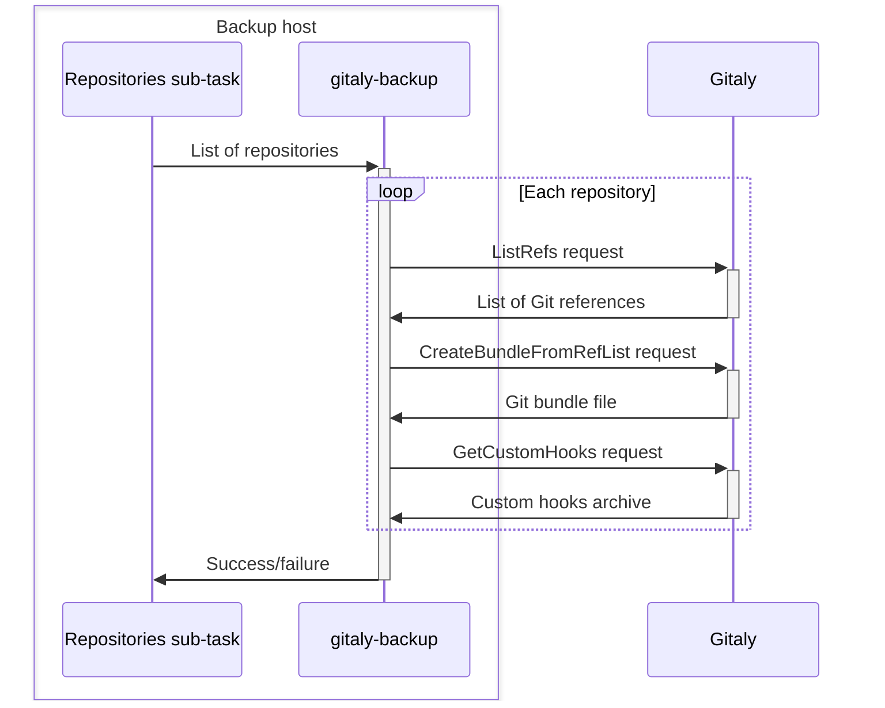
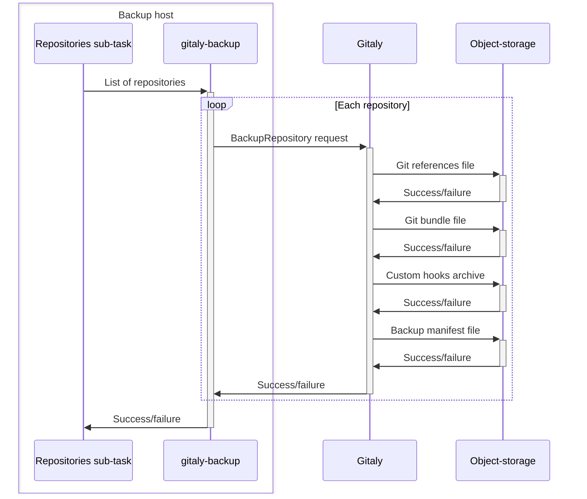

# Backup archive process

When GitLab creates a backup archive, it follows these steps:

1. For incremental backups, extracts the previous backup archive and reads the `backup_information.yml` file.
1. Updates or generates the [`backup_information.yml` file](#backup_informationyml-file).
1. Runs all backup sub-tasks:
   - [Database backups](#database-backups).
   - [Repository backups](#repository-backups).
   - [File backups](#file-backups).
   - External merge request diffs: `external_diffs`
1. Archives the backup staging area into a `tar` file.
1. **Optional**: Uploads the new backup archive to object storage.
1. Cleans up archived [backup staging directory](#backup-staging-directory) files.

## `backup_information.yml` file

The `backup_information.yml` file saves all backup inputs that are not included in the backup itself.
It is saved in the [backup staging directory](#backup-staging-directory) and is used by sub-tasks to
determine how to restore and link data in the backup with external services like
[server-side repository backups](#server-side-repository-backups).
It includes information such as:

- The time the backup was created.
- The GitLab version that generated the backup.
- Other specified options. For example, skipped sub-tasks.

## Database backups

Database backups are created and restored by a GitLab backup sub-task called `db`.
The database sub-task uses `pg_dump` to create a[SQL dump](https://www.postgresql.org/docs/14/backup-dump.html).
The output of `pg_dump` is piped through `gzip` to create a compressed SQL file.
This file is saved to the [backup staging directory](#backup-staging-directory).

## Repository backups

Repository backups are managed by a GitLab backup sub-task called `repositories`.
This sub-task uses a Gitaly command, [`gitaly-backup`](https://gitlab.com/gitlab-org/gitaly/-/blob/master/doc/gitaly-backup.md),
to create repository backups.

The backup process follows these steps:

1. GitLab uses its database to inform `gitaly-backup` which repositories to back up.
1. `gitaly-backup` calls a series of Remote Procedure Calls (RPCs) on Gitaly to collect
    the backup data for each repository.
1. The collected data is streamed into a directory structure in the GitLab backup staging directory.

The following diagram illustrates the backup process:



Storages configured to use Gitaly Cluster are backed up in the same way as standalone Gitaly instances.

- When Gitaly Cluster receives the RPC calls from `gitaly-backup`, it rebuilds its own database.
  - There is no need to backup the Gitaly Cluster database separately.
- Each repository is backed up only once, regardless of the replication factor, because backups operate through RPCs.

### Server-side repository backups

Server-side repository backups are an efficient way to back up your repositories.
This method reduces network transfer, and eliminates the need for disk storage on the backup task machine.

1. When specified, `gitaly-backup` makes a single RPC call for each repository to create the backup.
    - The RPC doesn't transmit any repository data.
1. The RPC triggers the Gitaly node storing the physical repository to upload backup data to object storage.
    - The data is not transmitted through RPCs from Gitaly.
    - The server-side backups require less network transfer.
    - Disk storage on the machine running the backup Rake task is not required.
1. The backups stored on object-storage are linked to the created backup archive using a [backup ID](#backup-id).

The following diagram illustrates the server-side backup process:



## File backups

Backups include several sub-tasks that focus on backing up files.
The following sub-tasks are responsible for file backups:

- `uploads`: Attachments
- `builds`: CI job output logs
- `artifacts`: CI job artifacts
- `pages`: Page content
- `lfs`: LFS objects
- `terraform_state`: Terraform states
- `registry`: Container registry images
- `packages`: Packages
- `ci_secure_files`: Project-level secure files

Each file sub-task identifies a set of files in a task-specific directory. These files are then processed as follows:

1. The `tar` utility creates an archive of the identified files.
1. The archive is piped through `gzip` for compression, without saving to disk.
1. The compressed tar file is saved to the backup staging directory.

As backups are created from live instances, files might be modified during the backup process.
In such cases, an alternate "copy" strategy can be used:

1. The `rsync` utility creates a copy of the files to back up.
1. These copies are passed to `tar` for archiving.

NOTE:
If you are using this strategy, the machine running the backup Rake task must have
sufficient storage for both the copied files and the compressed archive.

## Backup staging directory

The backup staging directory is a temporary storage location used during GitLab backup and restore processes.
This directory:

- Stores backup artifacts before creating the GitLab backup archive.
- Extracts backup archives before restoring a backup or creating an incremental backup.

The backup staging directory is the same directory where completed GitLab backup archives are created.
When creating an untarred backup, the backup artifacts remain in this directory, and no archive is created.

The following is an example of a backup staging directory containing an untarred backup:

```plaintext
backups/
├── 1701728344_2023_12_04_16.7.0-pre_gitlab_backup.tar
├── 1701728447_2023_12_04_16.7.0-pre_gitlab_backup.tar
├── artifacts.tar.gz
├── backup_information.yml
├── builds.tar.gz
├── ci_secure_files.tar.gz
├── db
│   ├── ci_database.sql.gz
│   └── database.sql.gz
├── lfs.tar.gz
├── packages.tar.gz
├── pages.tar.gz
├── repositories
│   ├── manifests/
│   ├── @hashed/
│   └── @snippets/
├── terraform_state.tar.gz
└── uploads.tar.gz
```

## Backup ID

Backup IDs are unique identifiers for backup archives. These IDs are crucial when you need to restore
GitLab, and multiple backup archives are available.

Backup archives are saved in a directory specified by the `backup_path` setting in the `config/gitlab.yml` file.
The default location is `/var/opt/gitlab/backups`.

By default, backup archive filenames follow the `<backup-id>_gitlab_backup.tar` structure, where `<backup-id>` identifies:

- Timestamp of backup creation
- Date (YYYY_MM_DD)
- GitLab version
- GitLab edition

For example:

- Backup archive filename: `1493107454_2018_04_25_10.6.4-ce_gitlab_backup.tar`,
- Backup ID: `1493107454_2018_04_25_10.6.4-ce`.
