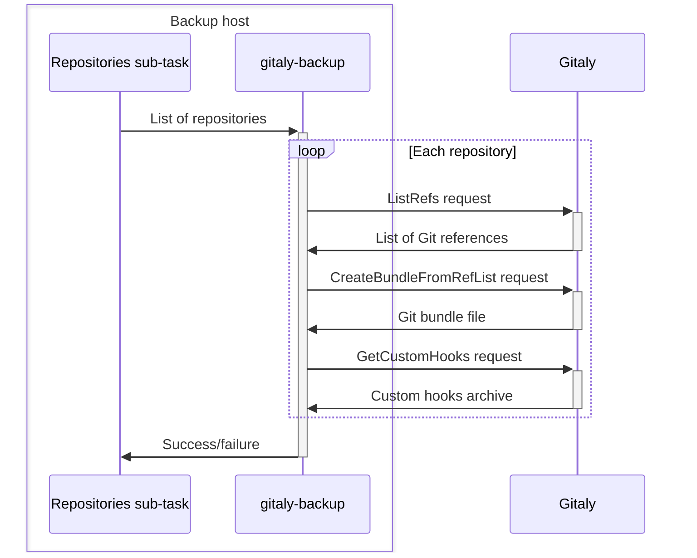
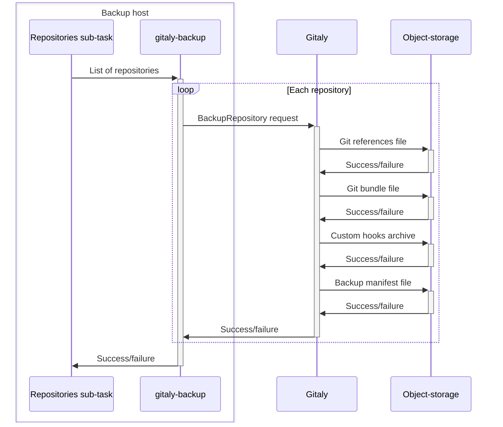

# Back up and restore GitLab

DETAILS:
**Tier:** Free, Premium, Ultimate
**Offering:** Self-managed

Your software or organization depends on the data in your GitLab instance. You need to ensure this data is protected from adverse events such as:

- Corrupted data
- Accidental deletion of data
- Ransomware attacks
- Unexpected cloud provider downtime

You can mitigate all of these risks with a disaster recovery plan that includes backups.

## Back up GitLab

For detailed information on backing up GitLab, see [Back up GitLab](backup_gitlab.md).

## Restore GitLab

For detailed information on restoring GitLab, see [Restore GitLab](restore_gitlab.md).

## Migrate to a new server

For detailed information on using back up and restore to migrate to a new server, see
[Migrate to a new server](migrate_to_new_server.md).

## Additional notes

This documentation is for GitLab Community and Enterprise Edition. We back up
GitLab.com and ensure your data is secure. You can't, however, use these
methods to export or back up your data yourself from GitLab.com.

Issues are stored in the database, and can't be stored in Git itself.

## GitLab backup archive creation process

When working with GitLab backups, you might need to know how GitLab creates backup archives. To create backup archives, GitLab:

1. If creating an incremental backup, extracts the previous backup archive and read its `backup_information.yml` file.
1. Updates or generates the `backup_information.yml` file.
1. Runs all backup sub-tasks:
   - `db` to backup the GitLab PostgreSQL database (not Gitaly Cluster).
   - `repositories` to back up Git repositories.
   - `uploads` to back up attachments.
   - `builds` to back up CI job output logs.
   - `artifacts` to back up CI job artifacts.
   - `pages` to back up page content.
   - `lfs` to back up LFS objects.
   - `terraform_state` to back up Terraform states.
   - `registry` to back up container registry images.
   - `packages` to back up packages.
   - `ci_secure_files` to back up project-level secure files.
1. Archives the backup staging area into a tar file.
1. Optional. Uploads the new backup archive to object-storage.
1. Cleans up backup staging directory files that are now archived.

## Backup ID

Backup IDs identify individual backup archives. You need the backup ID of a backup archive if you need to restore GitLab and multiple backup archives are available.

Backup archives are saved in a directory set in `backup_path`, which is specified in the `config/gitlab.yml` file.

- By default, backup archives are stored in `/var/opt/gitlab/backups`.
- By default, backup archive filenames are `<backup-id>_gitlab_backup.tar` where `<backup-id>` identifies the time when the
  backup archive was created, the GitLab version, and the GitLab edition.

For example, if the archive filename is `1493107454_2018_04_25_10.6.4-ce_gitlab_backup.tar`,
the backup ID is `1493107454_2018_04_25_10.6.4-ce`.

## Backup staging directory

The backup staging directory is a place to temporarily:

- Store backup artifacts on disk before the GitLab backup archive is created.
- Extract backup archives on disk before restoring a backup or creating an incremental backup.

This directory is the same directory where completed GitLab backup archives are created. When creating an untarred backup, the backup artifacts are left in this directory and no
archive is created.

Example backup staging directory with untarred backup:

```plaintext
backups/
├── 1701728344_2023_12_04_16.7.0-pre_gitlab_backup.tar
├── 1701728447_2023_12_04_16.7.0-pre_gitlab_backup.tar
├── artifacts.tar.gz
├── backup_information.yml
├── builds.tar.gz
├── ci_secure_files.tar.gz
├── db
│   ├── ci_database.sql.gz
│   └── database.sql.gz
├── lfs.tar.gz
├── packages.tar.gz
├── pages.tar.gz
├── repositories
│   ├── manifests/
│   ├── @hashed/
│   └── @snippets/
├── terraform_state.tar.gz
└── uploads.tar.gz
```

## `backup_information.yml` file

The `backup_information.yml` file saves all backup inputs that are not included in the backup itself. It includes information such as:

- The time the backup was created.
- The version of GitLab that generated the backup.
- Any options that were specified, such as skipped sub-tasks.

This information is used by some sub-tasks to determine how:

- To restore.
- To link data in the backup with external services (such as server-side repository backups).

This file is saved into the backup staging directory.

## Database backups

Database backups are created and restored by a GitLab backup sub-task called `db`. The database sub-task uses `pg_dump` to create [a SQL dump](https://www.postgresql.org/docs/14/backup-dump.html). The output of `pg_dump` is piped through `gzip` in order to create a compressed SQL file. This file is saved to the backup staging directory.

## Repository backups

Repository backups are created and restored by a GitLab backup sub-task called `repositories`. The repositories sub-task uses a Gitaly command
[`gitaly-backup`](https://gitlab.com/gitlab-org/gitaly/-/blob/master/doc/gitaly-backup.md) to create Git repository backups:

- GitLab uses its database to tell `gitaly-backup` which repositories to back up.
- `gitaly-backup` then calls a series of RPCs on Gitaly to collect the repository backup data for each repository. This data is streamed into a directory structure in the GitLab backup staging directory.



Storages configured to Gitaly Cluster are backed up the same as standalone Gitaly. When Gitaly Cluster receives the RPC calls from `gitaly-backup`, it is responsible for
rebuilding its own database. This means that there is no need to backup the Gitaly Cluster database separately. Because backups operate through RPCs, each repository is only backed
up once no matter the replication factor.

### Server-side repository backups

You can configure repository backups as server-side repository backups. When specified, `gitaly-backup` makes a single RPC call for each repository to create the backup. This RPC
does not transmit any repository data. Instead, the RPC triggers the Gitaly node that stores that physical repository to upload the backup data directly to object-storage. Because
the data is no longer transmitted through RPCs from Gitaly, server-side backups require much less network transfer and require no disk storage on the machine that is running the
backup Rake task. The backups stored on object-storage are linked to the created backup archive by [the backup ID](#backup-id).



## File backups

The following GitLab backup sub-tasks back up files:

- `uploads`
- `builds`
- `artifacts`
- `pages`
- `lfs`
- `terraform_state`
- `registry`
- `packages`
- `ci_secure_files`

These file sub-tasks determine a set of files within a directory specific to the task. This set of files is then passed to `tar`
to create an archive. This archive is piped (not saved to disk) through `gzip` to save a compressed tar file to the backup staging directory.

Because backups are created from live instances, the files that tar is trying to archive can sometimes be modified while creating the backup. In this case, an alternate "copy"
strategy can be used. When this strategy is used, `rsync` is first used to create a copy of the files to back up. Then, these copies are passed to `tar` as usual. In this case,
the machine running the backup Rake task must have enough storage for the copied files and the compressed archive.

## Related features

- [Geo](../geo/index.md)
- [Disaster Recovery (Geo)](../geo/disaster_recovery/index.md)
- [Migrating GitLab groups](../../user/group/import/index.md)
- [Import and migrate projects](../../user/project/import/index.md)
- [GitLab Linux package (Omnibus) - Backup and Restore](https://docs.gitlab.com/omnibus/settings/backups.html)
- [GitLab Helm chart - Backup and Restore](https://docs.gitlab.com/charts/backup-restore/)
- [GitLab Operator - Backup and Restore](https://docs.gitlab.com/operator/backup_and_restore.html)
