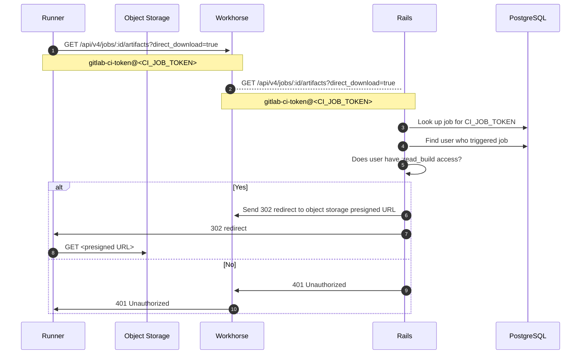
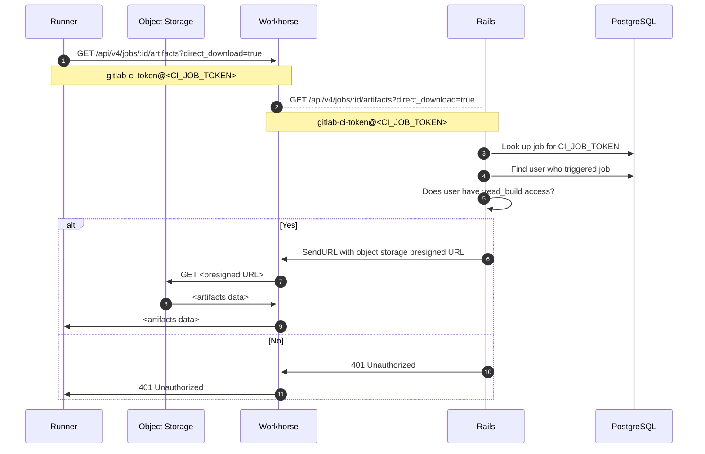

When administering job artifacts, you might encounter the following issues.

## Job artifacts using too much disk space

Job artifacts can fill up your disk space quicker than expected. Some possible
reasons are:

- Users have configured job artifacts expiration to be longer than necessary.
- The number of jobs run, and hence artifacts generated, is higher than expected.
- Job logs are larger than expected, and have accumulated over time.
- The file system might run out of inodes because
  [empty directories are left behind by artifact housekeeping](https://gitlab.com/gitlab-org/gitlab/-/issues/17465).
  [The Rake task for _orphaned_ artifact files](../../raketasks/cleanup.md#remove-orphan-artifact-files)
  removes these.
- Artifact files might be left on disk and not deleted by housekeeping. Run the
  [Rake task for _orphaned_ artifact files](../../raketasks/cleanup.md#remove-orphan-artifact-files)
  to remove these. This script should always find work to do, as it also removes empty directories (see above).
- [Artifact housekeeping was changed significantly](#housekeeping-disabled-in-gitlab-150-to-152), and you might need to enable a feature flag to use the updated system.
- The [keep latest artifacts from most recent success jobs](../../ci/jobs/job_artifacts.md#keep-artifacts-from-most-recent-successful-jobs)
  feature is enabled.

In these and other cases, identify the projects most responsible
for disk space usage, figure out what types of artifacts are using the most
space, and in some cases, manually delete job artifacts to reclaim disk space.

### Artifacts housekeeping

Artifacts housekeeping is the process that identifies which artifacts are expired
and can be deleted.

#### Housekeeping disabled in GitLab 15.0 to 15.2

Artifact housekeeping was significantly improved in GitLab 15.0, introduced behind [feature flags](../feature_flags.md) disabled by default. The flags were enabled by default [in GitLab 15.3](https://gitlab.com/gitlab-org/gitlab/-/merge_requests/92931).

If artifacts housekeeping does not seem to be working in GitLab 15.0 to GitLab 15.2, you should check if the feature flags are enabled.

To check if the feature flags are enabled:

1. Start a [Rails console](../operations/rails_console.md#starting-a-rails-console-session).

1. Check if the feature flags are enabled.

   ```ruby
   Feature.enabled?(:ci_detect_wrongly_expired_artifacts)
   Feature.enabled?(:ci_update_unlocked_job_artifacts)
   Feature.enabled?(:ci_job_artifacts_backlog_work)
   ```

1. If any of the feature flags are disabled, enable them:

   ```ruby
   Feature.enable(:ci_detect_wrongly_expired_artifacts)
   Feature.enable(:ci_update_unlocked_job_artifacts)
   Feature.enable(:ci_job_artifacts_backlog_work)
   ```

These changes include switching artifacts from `unlocked` to `locked` if
they [should be retained](../../ci/jobs/job_artifacts.md#keep-artifacts-from-most-recent-successful-jobs).

#### Artifacts with `unknown` status

Artifacts created before housekeeping was updated have a status of `unknown`. After they expire,
these artifacts are not processed by the new housekeeping.

You can check the database to confirm if your instance has artifacts with the `unknown` status:

1. Start a database console:

   ::Tabs

   :::TabTitle Linux package (Omnibus)

   ```shell
   sudo gitlab-psql
   ```

   :::TabTitle Helm chart (Kubernetes)

   ```shell
   # Find the toolbox pod
   kubectl --namespace <namespace> get pods -lapp=toolbox
   # Connect to the PostgreSQL console
   kubectl exec -it <toolbox-pod-name> -- /srv/gitlab/bin/rails dbconsole --include-password --database main
   ```

   :::TabTitle Docker

   ```shell
   sudo docker exec -it <container_name> /bin/bash
   gitlab-psql
   ```

   :::TabTitle Self-compiled (source)

   ```shell
   sudo -u git -H psql -d gitlabhq_production
   ```

   ::EndTabs

1. Run the following query:

   ```sql
   select expire_at, file_type, locked, count(*) from ci_job_artifacts
   where expire_at is not null and
   file_type != 3
   group by expire_at, file_type, locked having count(*) > 1;
   ```

If records are returned, then there are artifacts which the housekeeping job
is unable to process. For example:

```plaintext
           expire_at           | file_type | locked | count
-------------------------------+-----------+--------+--------
 2021-06-21 22:00:00+00        |         1 |      2 |  73614
 2021-06-21 22:00:00+00        |         2 |      2 |  73614
 2021-06-21 22:00:00+00        |         4 |      2 |   3522
 2021-06-21 22:00:00+00        |         9 |      2 |     32
 2021-06-21 22:00:00+00        |        12 |      2 |    163
```

Artifacts with locked status `2` are `unknown`. Check
[issue #346261](https://gitlab.com/gitlab-org/gitlab/-/issues/346261#note_1028871458)
for more details.

#### Clean up `unknown` artifacts

The Sidekiq worker that processes all `unknown` artifacts is enabled by default in
GitLab 15.3 and later. It analyzes the artifacts returned by the above database query and
determines which should be `locked` or `unlocked`. Artifacts are then deleted
by that worker if needed.

The worker can be enabled on GitLab Self-Managed:

1. Start a [Rails console](../operations/rails_console.md#starting-a-rails-console-session).

1. Check if the feature is enabled.

   ```ruby
   Feature.enabled?(:ci_job_artifacts_backlog_work)
   ```

1. Enable the feature, if needed:

   ```ruby
   Feature.enable(:ci_job_artifacts_backlog_work)
   ```

The worker processes 10,000 `unknown` artifacts every seven minutes, or roughly two million
in 24 hours.

There is a related `ci_job_artifacts_backlog_large_loop_limit` feature flag
which causes the worker to process `unknown` artifacts
[in batches that are five times larger](https://gitlab.com/gitlab-org/gitlab/-/issues/356319).
This flag is not recommended for use.

### List projects and builds with artifacts with a specific expiration (or no expiration)

Using a [Rails console](../operations/rails_console.md), you can find projects that have job artifacts with either:

- No expiration date.
- An expiration date more than 7 days in the future.

Similar to [deleting artifacts](#delete-old-builds-and-artifacts), use the following example time frames
and alter them as needed:

- `7.days.from_now`
- `10.days.from_now`
- `2.weeks.from_now`
- `3.months.from_now`
- `1.year.from_now`

Each of the following scripts also limits the search to 50 results with `.limit(50)`, but this number can also be changed as needed:

```ruby
# Find builds & projects with artifacts that never expire
builds_with_artifacts_that_never_expire = Ci::Build.with_downloadable_artifacts.where(artifacts_expire_at: nil).limit(50)
builds_with_artifacts_that_never_expire.find_each do |build|
  puts "Build with id #{build.id} has artifacts that don't expire and belongs to project #{build.project.full_path}"
end

# Find builds & projects with artifacts that expire after 7 days from today
builds_with_artifacts_that_expire_in_a_week = Ci::Build.with_downloadable_artifacts.where('artifacts_expire_at > ?', 7.days.from_now).limit(50)
builds_with_artifacts_that_expire_in_a_week.find_each do |build|
  puts "Build with id #{build.id} has artifacts that expire at #{build.artifacts_expire_at} and belongs to project #{build.project.full_path}"
end
```

### List projects by total size of job artifacts stored

List the top 20 projects, sorted by the total size of job artifacts stored, by
running the following code in the [Rails console](../operations/rails_console.md):

```ruby
include ActionView::Helpers::NumberHelper
ProjectStatistics.order(build_artifacts_size: :desc).limit(20).each do |s|
  puts "#{number_to_human_size(s.build_artifacts_size)} \t #{s.project.full_path}"
end
```

You can change the number of projects listed by modifying `.limit(20)` to the
number you want.

### List largest artifacts in a single project

List the 50 largest job artifacts in a single project by running the following
code in the [Rails console](../operations/rails_console.md):

```ruby
include ActionView::Helpers::NumberHelper
project = Project.find_by_full_path('path/to/project')
Ci::JobArtifact.where(project: project).order(size: :desc).limit(50).map { |a| puts "ID: #{a.id} - #{a.file_type}: #{number_to_human_size(a.size)}" }
```

You can change the number of job artifacts listed by modifying `.limit(50)` to
the number you want.

### List artifacts in a single project

List the artifacts for a single project, sorted by artifact size. The output includes the:

- ID of the job that created the artifact
- artifact size
- artifact file type
- artifact creation date
- on-disk location of the artifact

```ruby
p = Project.find_by_id(<project_id>)
arts = Ci::JobArtifact.where(project: p)

list = arts.order(size: :desc).limit(50).each do |art|
    puts "Job ID: #{art.job_id} - Size: #{art.size}b - Type: #{art.file_type} - Created: #{art.created_at} - File loc: #{art.file}"
end
```

To change the number of job artifacts listed, change the number in `limit(50)`.

### Delete old builds and artifacts

WARNING:
These commands remove data permanently. Before running them in a production environment,
you should try them in a test environment first and make a backup of the instance
that can be restored if needed.

#### Delete old artifacts for a project

This step also erases artifacts that users have [chosen to keep](../../ci/jobs/job_artifacts.md#with-an-expiry):

```ruby
project = Project.find_by_full_path('path/to/project')
builds_with_artifacts =  project.builds.with_downloadable_artifacts
builds_with_artifacts.where("finished_at < ?", 1.year.ago).each_batch do |batch|
  batch.each do |build|
    Ci::JobArtifacts::DeleteService.new(build).execute
  end

  batch.update_all(artifacts_expire_at: Time.current)
end
```

In [GitLab 15.3 and earlier](https://gitlab.com/gitlab-org/gitlab/-/issues/372537), use the following instead:

```ruby
project = Project.find_by_full_path('path/to/project')
builds_with_artifacts =  project.builds.with_downloadable_artifacts
builds_with_artifacts.where("finished_at < ?", 1.year.ago).each_batch do |batch|
  batch.each do |build|
    build.artifacts_expire_at = Time.current
    build.erase_erasable_artifacts!
  end
end
```

#### Delete old artifacts instance wide

This step also erases artifacts that users have [chosen to keep](../../ci/jobs/job_artifacts.md#with-an-expiry):

```ruby
builds_with_artifacts = Ci::Build.with_downloadable_artifacts
builds_with_artifacts.where("finished_at < ?", 1.year.ago).each_batch do |batch|
  batch.each do |build|
    Ci::JobArtifacts::DeleteService.new(build).execute
  end

  batch.update_all(artifacts_expire_at: Time.current)
end
```

In [GitLab 15.3 and earlier](https://gitlab.com/gitlab-org/gitlab/-/issues/372537), use the following instead:

```ruby
builds_with_artifacts =  Ci::Build.with_downloadable_artifacts
builds_with_artifacts.where("finished_at < ?", 1.year.ago).each_batch do |batch|
  batch.each do |build|
    build.artifacts_expire_at = Time.current
    build.erase_erasable_artifacts!
  end
end
```

#### Delete old job logs and artifacts for a project

```ruby
project = Project.find_by_full_path('path/to/project')
builds =  project.builds
admin_user = User.find_by(username: 'username')
builds.where("finished_at < ?", 1.year.ago).each_batch do |batch|
  batch.each do |build|
    print "Ci::Build ID #{build.id}... "

    if build.erasable?
      Ci::BuildEraseService.new(build, admin_user).execute
      puts "Erased"
    else
      puts "Skipped (Nothing to erase or not erasable)"
    end
  end
end
```

#### Delete old job logs and artifacts instance wide

```ruby
builds = Ci::Build.all
admin_user = User.find_by(username: 'username')
builds.where("finished_at < ?", 1.year.ago).each_batch do |batch|
  batch.each do |build|
    print "Ci::Build ID #{build.id}... "

    if build.erasable?
      Ci::BuildEraseService.new(build, admin_user).execute
      puts "Erased"
    else
      puts "Skipped (Nothing to erase or not erasable)"
    end
  end
end
```

In [GitLab 15.3 and earlier](https://gitlab.com/gitlab-org/gitlab/-/issues/369132), replace
`Ci::BuildEraseService.new(build, admin_user).execute` with `build.erase(erased_by: admin_user)`.

`1.year.ago` is a Rails [`ActiveSupport::Duration`](https://api.rubyonrails.org/classes/ActiveSupport/Duration.html) method.
Start with a long duration to reduce the risk of accidentally deleting artifacts that are still in use.
Rerun the deletion with shorter durations as needed, for example `3.months.ago`, `2.weeks.ago`, or `7.days.ago`.

The method `erase_erasable_artifacts!` is synchronous, and upon execution the artifacts are immediately removed;
they are not scheduled by a background queue.

### Delete old pipelines

WARNING:
These commands remove data permanently. Before running them in a production environment,
consider seeking guidance from a Support Engineer. You should also try them in a test environment first
and make a backup of the instance that can be restored if needed.

Deleting a pipeline also removes that pipeline's:

- Job artifacts
- Job logs
- Job metadata
- Pipeline metadata

Removing job and pipeline metadata can help reduce the size of the CI tables in the database.
The CI tables are usually the largest tables in an instance's database.

#### Delete old pipelines for a project

```ruby
project = Project.find_by_full_path('path/to/project')
user = User.find(1)
project.ci_pipelines.where("finished_at < ?", 1.year.ago).each_batch do |batch|
  batch.each do |pipeline|
    puts "Erasing pipeline #{pipeline.id}"
    ::Ci::DestroyPipelineService.new(pipeline.project, user).execute(pipeline)
  end
end
```

#### Delete old pipelines instance-wide

```ruby
user = User.find(1)
Ci::Pipeline.where("finished_at < ?", 1.year.ago).each_batch do |batch|
  batch.each do |pipeline|
    puts "Erasing pipeline #{pipeline.id} for project #{pipeline.project_id}"
    ::Ci::DestroyPipelineService.new(pipeline.project, user).execute(pipeline)
  end
end
```

## Job artifact upload fails with error 500

If you are using object storage for artifacts and a job artifact fails to upload,
review:

- The job log for an error message similar to:

  ```plaintext
  WARNING: Uploading artifacts as "archive" to coordinator... failed id=12345 responseStatus=500 Internal Server Error status=500 token=abcd1234
  ```

- The [workhorse log](../logs/_index.md#workhorse-logs) for an error message similar to:

  ```json
  {"error":"MissingRegion: could not find region configuration","level":"error","msg":"error uploading S3 session","time":"2021-03-16T22:10:55-04:00"}
  ```

In both cases, you might need to add `region` to the job artifact [object storage configuration](../object_storage.md).

## Job artifact upload fails with `500 Internal Server Error (Missing file)`

Bucket names that include folder paths are not supported with [consolidated object storage](../object_storage.md#configure-a-single-storage-connection-for-all-object-types-consolidated-form).
For example, `bucket/path`. If a bucket name has a path in it, you might receive an error similar to:

```plaintext
WARNING: Uploading artifacts as "archive" to coordinator... POST https://gitlab.example.com/api/v4/jobs/job_id/artifacts?artifact_format=zip&artifact_type=archive&expire_in=1+day: 500 Internal Server Error (Missing file)
FATAL: invalid argument
```

If a job artifact fails to upload with the above error when using consolidated object storage, make sure you are [using separate buckets](../object_storage.md#use-separate-buckets) for each data type.

## Job artifacts fail to upload with `FATAL: invalid argument` when using Windows mount

If you are using a Windows mount with CIFS for job artifacts, you may see an
`invalid argument` error when the runner attempts to upload artifacts:

```plaintext
WARNING: Uploading artifacts as "dotenv" to coordinator... POST https://<your-gitlab-instance>/api/v4/jobs/<JOB_ID>/artifacts: 500 Internal Server Error  id=1296 responseStatus=500 Internal Server Error status=500 token=*****
FATAL: invalid argument
```

To work around this issue, you can try:

- Switching to an ext4 mount instead of CIFS.
- Upgrading to at least Linux kernel 5.15 which contains a number of important bug fixes
  relating to CIFS file leases.
- For older kernels, using the `nolease` mount option to disable file leasing.

For more information, [see the investigation details](https://gitlab.com/gitlab-org/gitlab/-/issues/389995).

## Usage quota shows incorrect artifact storage usage

Sometimes the [artifacts storage usage](../../user/storage_usage_quotas.md) displays an incorrect
value for the total storage space used by artifacts. To recalculate the artifact
usage statistics for all projects in the instance, you can run this background script:

```shell
gitlab-rake gitlab:refresh_project_statistics_build_artifacts_size[https://example.com/path/file.csv]
```

The `https://example.com/path/file.csv` file must list the project IDs for
all projects for which you want to recalculate artifact storage usage. Use this format for the file:

```csv
PROJECT_ID
1
2
```

The artifact usage value can fluctuate to `0` while the script is running. After
recalculation, usage should display as expected again.

## Artifact download flow diagrams

The following flow diagrams illustrate how job artifacts work. These
diagrams assume object storage is configured for job artifacts.

### Proxy download disabled

With [`proxy_download` set to `false`](../object_storage.md), GitLab
redirects the runner to download artifacts from object storage with a
pre-signed URL. It is usually faster for runners to fetch from the
source directly so this configuration is generally recommended. It
should also reduce bandwidth usage because the data does not have to be
fetched by GitLab and sent to the runner. However, it does require
giving runners direct access to object storage.

The request flow looks like:



In this diagram:

1. First, the runner attempts to fetch a job artifact by using the
   `GET /api/v4/jobs/:id/artifacts` endpoint. The runner attaches the
   `direct_download=true` query parameter on the first attempt to indicate
   that it is capable of downloading from object storage directly. Direct
   downloads can be disabled in the runner configuration via the
   [`FF_USE_DIRECT_DOWNLOAD` feature flag](https://docs.gitlab.com/runner/configuration/feature-flags.html).
   This flag is set to `true` by default.

1. The runner sends the GET request using HTTP Basic Authentication
   with the `gitlab-ci-token` username and an auto-generated
   CI/CD job token as the password. This token is generated by GitLab and
   given to the runner at the start of a job.

1. The GET request gets passed to the GitLab API, which looks
   up the token in the database and finds the user who triggered the job.

1. In steps 5-8:

   - If the user has access to the build, then GitLab generates
     a presigned URL and sends a 302 Redirect with the `Location` set to that
     URL. The runner follows the 302 Redirect and downloads the artifacts.

   - If the job cannot be found or the user does not have access to the job,
     then the API returns 401 Unauthorized.

   The runner does not retry if it receives the following HTTP status codes:

   - 200 OK
   - 401 Unauthorized
   - 403 Forbidden
   - 404 Not Found

   However, if the runner receives any other status code, such as a 500 error,
   it re-attempts to download the artifacts two more times, sleeping 1 second
   between each attempt. The subsequent attempts omit `direct_download=true`.

### Proxy download enabled

If `proxy_download` is `true`, GitLab always fetches the
artifacts from object storage and send the data to the runner, even if
the runner sends the `direct_download=true` query parameter. Proxy
downloads might be desirable if runners have restricted network access.

The following diagram is similar to the disabled proxy download example,
except at steps 6-9, GitLab does not send a 302 Redirect to the
runner. Instead, GitLab instructs Workhorse to fetch the data and stream
it back to the runner. From the runner perspective, the original GET
request to `/api/v4/jobs/:id/artifacts` returns the binary data
directly.



## `413 Request Entity Too Large` error

If the artifacts are too large, the job might fail with the following error:

```plaintext
Uploading artifacts as "archive" to coordinator... too large archive <job-id> responseStatus=413 Request Entity Too Large status=413" at end of a build job on pipeline when trying to store artifacts to <object-storage>.
```

You might need to:

- Increase the [maximum artifacts size](../settings/continuous_integration.md#maximum-artifacts-size).
- If you are using NGINX as a proxy server, increase the file upload size limit which is limited to 1 MB by default.
  Set a higher value for `client-max-body-size` in the NGINX configuration file.
