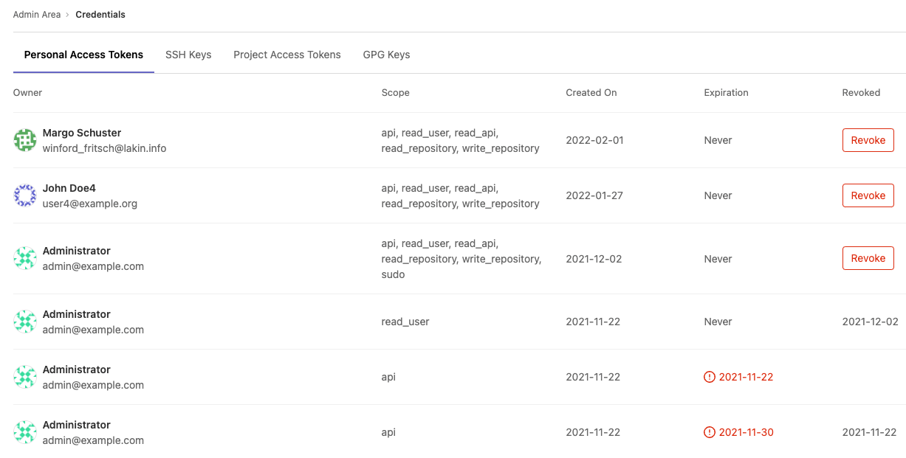
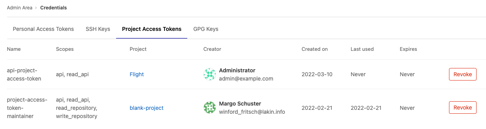
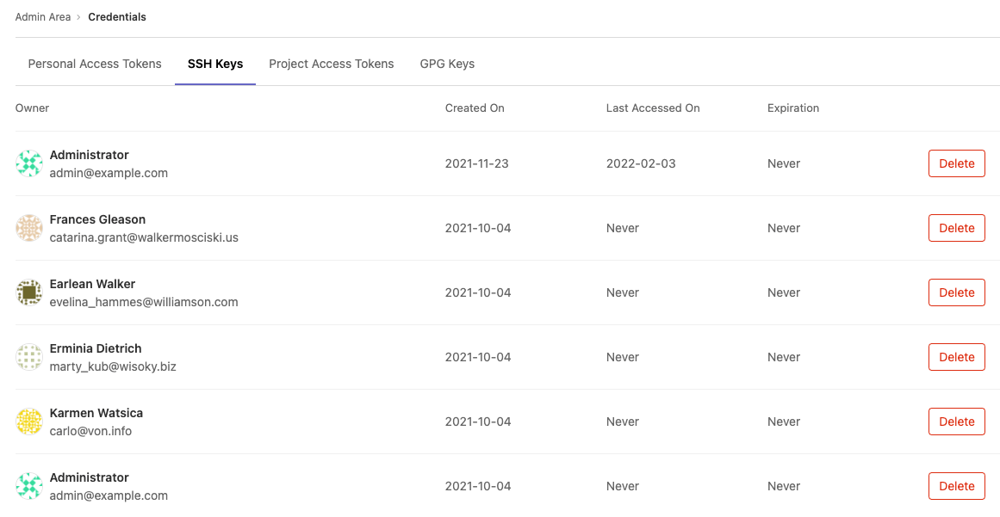

DETAILS:
**Tier:** Ultimate
**Offering:** GitLab Self-Managed

As a GitLab administrator, you are responsible for the overall security of your instance.
To assist, GitLab provides an inventory of all the credentials that can be used to access
your GitLab Self-Managed instance.

This page describes how to manage the credentials inventory for GitLab Self-Managed. To manage credentials on GitLab.com, see [Credentials inventory for GitLab.com](../user/group/credentials_inventory.md).

In the credentials inventory, you can view all:

- Personal access tokens (PATs).
- Project access tokens
- Group access tokens ([introduced](https://gitlab.com/gitlab-org/gitlab/-/merge_requests/102959) in GitLab 15.6).
- SSH keys.
- GPG keys.

You can also [revoke](#revoke-a-users-personal-access-token), [delete](#delete-a-users-ssh-key), and view:

- Who they belong to.
- Their access scope.
- Their usage pattern.
- When they:
  - Expire.
  - Were revoked.

## Revoke a user's personal access token

You can revoke a user's personal access token.

1. On the left sidebar, at the bottom, select **Admin**.
1. Select **Credentials**.
1. By the personal access token, select **Revoke**.

If a **Revoke** button is not available, the token may be expired or revoked, or an expiration date set.

| Token state | Revoke button displayed? | Comments                                                                   |
|-------------|--------------------------|----------------------------------------------------------------------------|
| Active      | Yes                      | Allows administrators to revoke the PAT, such as for a compromised account |
| Expired     | No                       | Not applicable; token is already expired                                   |
| Revoked     | No                       | Not applicable; token is already revoked                                   |

When a PAT is revoked from the credentials inventory, the instance notifies the user by email.

## Revoke a user's project access token

1. On the left sidebar, at the bottom, select **Admin**.
1. Select **Credentials**.
1. Select the **Project access tokens** tab.
1. By the project access token, select **Revoke**.

The project access token is revoked and a background worker is queued to delete the project bot user.

## Delete a user's SSH key

1. On the left sidebar, at the bottom, select **Admin**.
1. Select **Credentials**.
1. Select the **SSH Keys** tab.
1. By the SSH key, select **Delete**.

The instance notifies the user.

## Review existing GPG keys

You can view all existing GPG in your GitLab instance by going to the
credentials inventory GPG Keys tab, as well as the following properties:

- Who the GPG key belongs to.
- The ID of the GPG key.
- Whether the GPG key is [verified or unverified](../user/project/repository/signed_commits/gpg.md).

